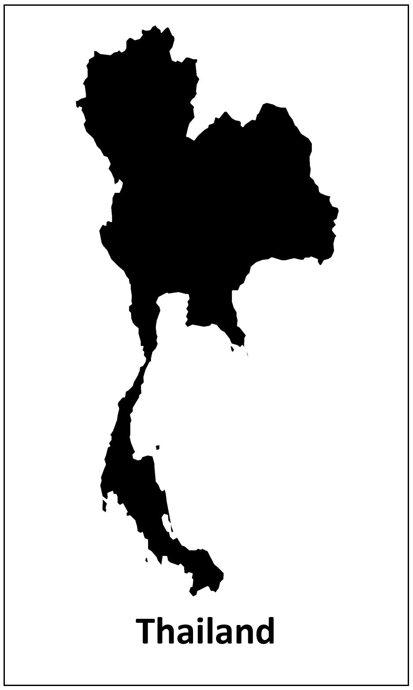
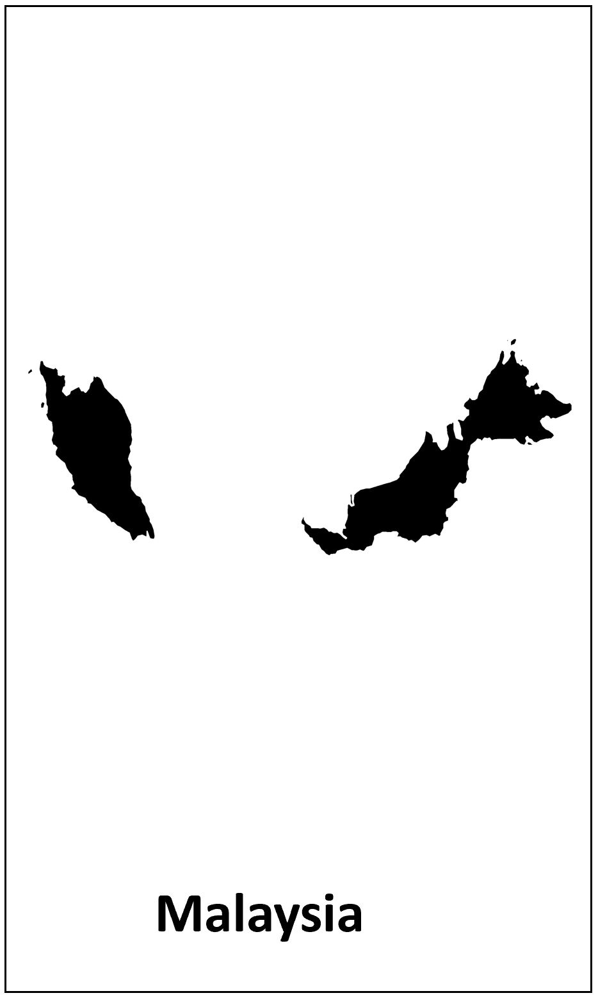
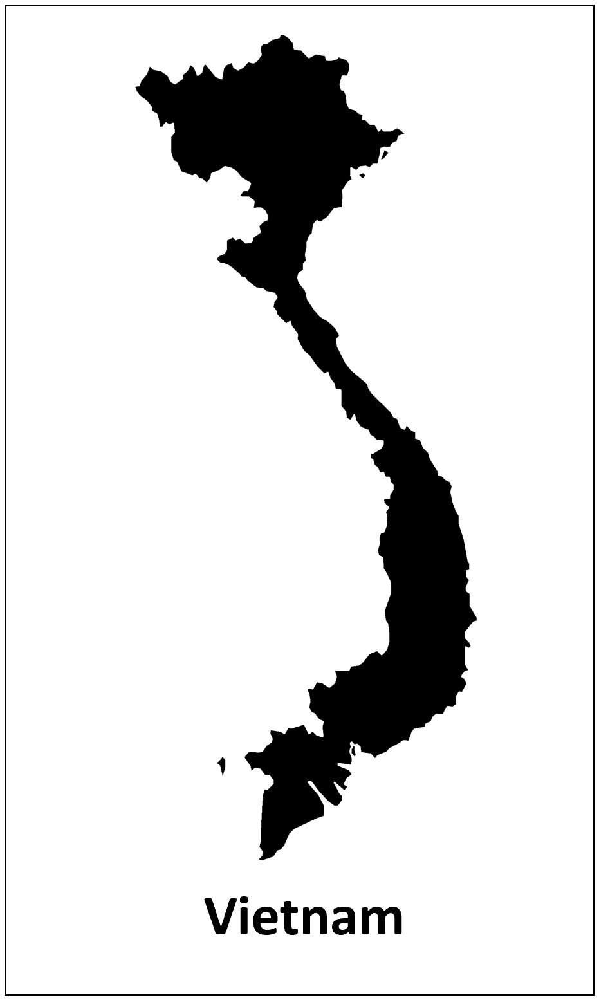

<div class="header_logo">


</div>

<!-------------------------->
<!-------------------------->
# Welcome
<!-------------------------->
<!-------------------------->
<p align="center"> </p>

The US-ASEAN Smart Cities Partnership (USASCP) uses innovative approaches across sectors to address the challenges and opportunities of energy development and urbanization in ASEAN Member States. The U.S. Department of Energy’s Pacific Northwest National Laboratory (PNNL) is partnering with local partners in selected ASEAN countries to supplement existing Digitalization and Smart City roadmap plans by providing integrated modeling and assessment capabilities. PNNL’s Global Change Analysis Model (GCAM) is a global model integrating socioeconomics, energy, land use, water, and climate systems. PNNL will use GCAM to assess the trajectories and outcomes of digitalization and Smart City pathways in the selected ASEAN countires.

<p align="center"> </p>

<div class="container_map_outer">
<div class="container_map">
  <a href = "thailand.html">
```{r, echo=FALSE, out.width="100%"}

```
</a>
</div>
<div class="container_map">
  <a href = "malaysia.html">
```{r, echo=FALSE, out.width="100%"}

```
</a>
</div>
<div class="container_map">
  <a href = "index.html">
```{r, echo=FALSE, out.width="100%"}

```
</a>
</div>
</div>
