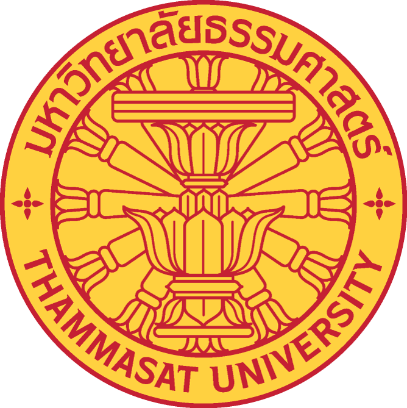

```{r setup, echo = F}
knitr::opts_chunk$set(echo=FALSE, out.width="100%", results = "show")
```

<br>

<!-------------------------->
<!-------------------------->
<h1 style="float:left;font-size:50px;vertical-align:middle"> Net-Zero SE Asia </h1>
 

 
<!-------------------------->
<!-------------------------->
<p align="center"> </p>

Welcome to our collaborative initiative led by the State Department's Bureau of Energy Resources (ENR), the U.S. Department of Energy's Pacific Northwest National Laboratory (PNNL), Thammasat University (TU), and the University of Technology Malaysia (UTM). Together, we forge partnerships with local decision-makers across national and city levels, encompassing ministries of environment, climate, energy, and electricity authorities. Leveraging PNNL's advanced Global Change Analysis Model (GCAM), we evaluate decarbonization pathways, considering socio-economic factors, energy systems, land use, water resources, and climate considerations. Our project bolsters effective multi-level governance strategies and supplements existing net-zero, carbon-neutral, digitalization, and Smart City roadmap plans.

<p align="center"> </p>

<div class="container_map_outer">
<div class="container_map">
  <a href = "thailand.html">
```{r thailand}
knitr::include_graphics('images/thailand.jpg')
```
</a>
</div>
<div class="container_map">
  <a href = "malaysia.html">
```{r malaysia}
knitr::include_graphics('images/malaysia.jpg')
```
</a>
</div>
</div>
