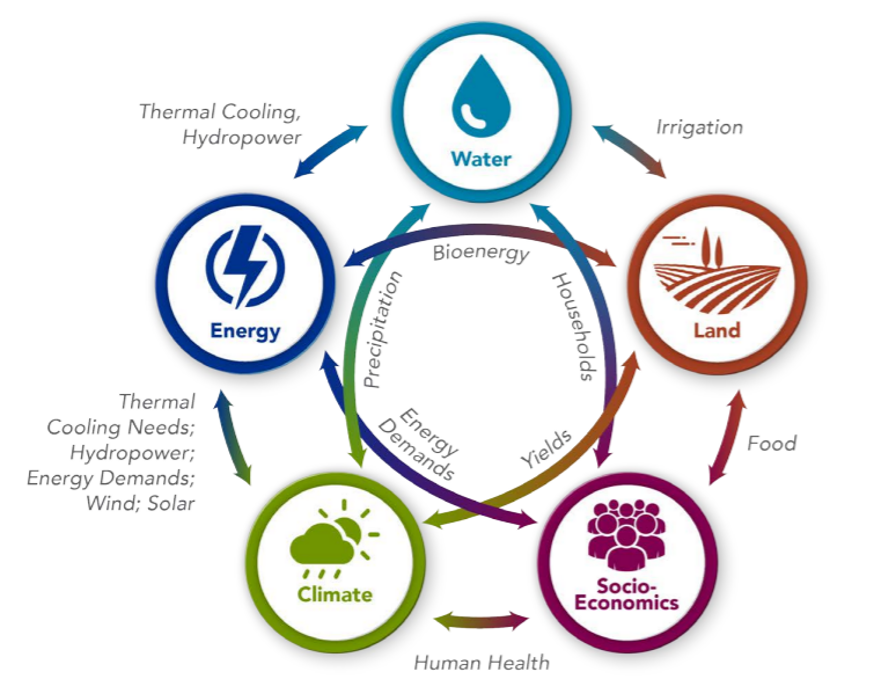
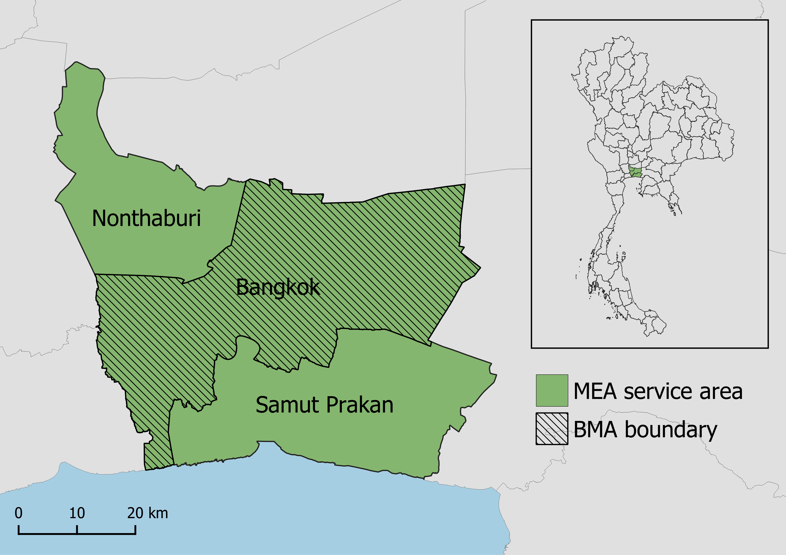
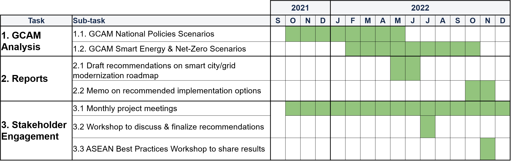

<div class="header_logo">


</div>

<!-------------------------->
<!-------------------------->
# Executive Summary
<!-------------------------->
<!-------------------------->
<p align="center"> </p>

* **Motivation:** Growth in power demand, renewables, and changes in policies and resource availability will require significant evolution in grid planning. Current planning tools usually focus on near-term horizon (i.e., 5- to 10-year), and are inadequate to support long-term decisions about grid capacity and distribution infrastructure upgrades. Tools for integrated energy planning with both near-term and long-term time horizons could help MEA plan future activities. 
* **Objectives:** Energy sector development and modernization is required to support continued urbanization and socioeconomic growth while reducing environmental impact. The Pacific Northwest National Laboratory (PNNL) will support Smart Grid planning for Bangkok by providing analysis and assessment of policy pathways using quantitative modeling approaches.
* **Approach:** Policy and technology trajectories will be modeled using the Global Change Analysis Model (GCAM), an integrated assessment model. GCAM will be used to conduct the detailed assessment of energy and electricity system transition over time in different policy and technology scenarios, and provide high-resolution information on power demand from buildings, transportation, and industry as well as power generation technologies. We will also examine how digitalization and smart technologies could change electricity load and implications for electricity generation. 
* **Expected Outcomes:** Outputs of GCAM will be used to 	inform MEA’s effort on grid moderation, especially for long-term holistic, integrated energy planning. Results will inform policy recommendations.

<br>

<!-------------------------->
<!-------------------------->
# Introduction & Motivation
<!-------------------------->
<!-------------------------->
<p align="center"> </p>

Urbanization is driving rapid socioeconomic growth in Thailand, posing challenges for power grids as energy demand increases. Maintaining stability, reliability, and affordability of electricity will be especially challenging as Thailand works toward increasing their renewable energy (RE) shares and decreasing their environmental impact in line with international agreements. These goals and challenges were highlighted in Thailand’s 2018 Power Development Plan, which emphasized three priorities: energy security, economy, and environment. Energy security encompasses the need for stability of power generation, transmission, and distribution to support socioeconomic development and resilience to energy crises. Economic priorities are to promote low cost, high efficiency electricity generation, keeping prices low for consumers to further facilitate socioeconomic growth. Lastly, the plan emphasizes reducing environmental impact by supporting RE development and increasing efficiency in production and consumption.

The US-ASEAN Smart Cities Partnership (USASCP) uses innovative approaches across sectors to address the challenges and opportunities of energy development and urbanization in ASEAN Member States. The U.S. Department of Energy’s Pacific Northwest National Laboratory (PNNL) is partnering with the Metropolitan Electricity Authority (MEA) of Thailand to supplement Bangkok’s existing Smart City roadmap plans by providing integrated modeling and assessment capabilities. PNNL’s Global Change Analysis Model (GCAM) is a global model integrating socioeconomics, energy, land use, water, and climate systems. PNNL will use GCAM to assess the trajectories and outcomes of Smart City pathways for Bangkok and focus on the implications for the energy system in this analysis.

<br>

<!-------------------------->
<!-------------------------->
# Objectives
<!-------------------------->
<!-------------------------->
<p align="center"> </p>

MEA supports energy sector plans for Bangkok by implementing Smart Grid development. The Smart Grid framework uses technological innovation to promote efficiency and reliability in power generation, transmission, and distribution systems while ensuring that the grid can both keep up with growing demand and accommodate RE expansion. Smart Grid approaches vary based on stakeholder needs but may include decentralizing generation, facilitating bidirectional data communication across the grid, integrating automation and monitoring, and providing opportunities for demand side management.

Thailand’s 2015 national Smart Grid master plan lays out plans to modernize its power sector through 2036 in line with the Smart Grid framework. In accordance with this national roadmap, MEA is developing Bangkok’s Smart Grid system by building capacity in the following areas:

* Monitoring and Control
* Data Analytics
* Supply Reliability
* Distributed Energy Resources Integration
* Green Energy
* Customer Engagement

Examples of planned technologies and policies include load forecasting, smart meter infrastructure, microgrids, energy storage systems, electric vehicle charging, and improved customer management systems, among others.

The collaboration between PNNL and MEA will support the long-term assessment of these plans and the analysis of their contribution to Thailand’s socioeconomic growth and environmental impact reduction goals. Based on results of the modeling approach detailed below, PNNL will provide an analysis of pathways for grid modernization in Bangkok and possible trajectories towards a Bangkok Smart City in 2050.

<br>

<!-------------------------->
<!-------------------------->
# Approach
<!-------------------------->
<!-------------------------->
<p align="center"> </p>

Integrated Assessment Models (IAMs) are computational models that use links and feedbacks between socioeconomic and environmental systems to assess the implications of technology and policy choices in the context of global climate change. IAMs can provide a holistic approach to energy sector planning by considering multi-sector dynamics and global processes. GCAM, an IAM developed at PNNL, incorporates socioeconomics, energy, land use, water, and climate system (Figure 1). The model is global but can also be used to assess specific regions and fine scale processes; PNNL has developed both Thailand and Bangkok regions within the model for national and city level analyses. GCAM utilizes the most up to date data on population, GDP, technology characteristics, policies, resource availabilities, and other inputs. It has the detailed representation of energy technologies in different sectors, including electricity, buildings, transportation, industry, hydrogen production, and other energy supply sectors. The model produces both historical and projected future outputs based on this information. These outputs include greenhouse gas emissions, electricity prices, energy supply and demand, and other indicators at five-year time steps from a historical baseline year to the desired end year. PNNL will use GCAM to assess the implications of MEA’s Smart Grid plans for Bangkok through the year 2100.

```{r, echo=FALSE, out.width="70%", fig.align='center', fig.cap="**Figure 1: Conceptual diagram of GCAM.**"}

```


<br>


<!-------------------------->
<!-------------------------->
# Scenarios {.tabset}
<!-------------------------->
<!-------------------------->
<p align="center"> </p>

//PNNL, in consultation with MEA, will develop a set of scenarios for GCAM modeling based on Thailand’s national energy policies and plans as well as MEA’s Smart Grid plans for Bangkok. The impacts of policies and technologies will be assessed in GCAM through associated changes to markets, efficiency assumptions, energy generation shares, and other multi-sector factors. GCAM will predict future outcomes under each scenario; these outcomes may include greenhouse gas emissions, energy supply and demand, market penetration of different technologies, electricity prices, and other relevant indicators of policy impacts. The scenarios will include the following:

* **Council-Led:** Scenario driven by strategies and actions that are ambitious and achievable within the authority of KLCH, including the implementation of all National policies.
* **Integrated Approach:** Scenario relying on an integrated approach with KLCH, the Federal government, and other agencies, highlighting the potential emissions reductions that could occur should all parties align.
* **Net Zero Kuala Lumpur:** Scenario using the most efficient pathway to net zero CO~2~ emissions by 2050 at the city levels.
* **Net Zero Malaysia:** Scenario using the most efficient pathway to net zero national CO~2~ emissions by 2050.

<!-------------------------->
## Council-Led
<!-------------------------->

**Council-Led Scenario:** In this scenario, KLCH has the authority to implement measures to achieve carbon emissions reductions. The scenario will largely be achieved through existing actions outlined in the KLLCSBP2030 and Federal policies and plans, including the National Renewable Energy Policy and Action Plan, the National Energy Efficiency Action Plan, the National Transport Policy, and publicly declared renewable energy targets. 

Note that this scenario _does not_ meet Kuala Lumpur's benchmark targets for 2030 or 2050; this is due to the lack of power and capacity for KLCH to implement more ambitious actions. Key remaining emissions will come from the following sectors: residential, commercial and institutional buildings, industrial energy, and on-road transportation.

The table below summarizes the policies encompassed by the Council-Led scenario. **UPDATE**

```{r, results = 'show', eval=TRUE, echo=FALSE, warning=FALSE, error = FALSE, message = FALSE}
library(pander)
myTable = data.frame(
    Sector     = c("Energy Supply",
                  "Transportation",
                  "Buildings",
                  "Industry"),
    Policies = c("* Power Development Plan 2018-2037 (bound capacity)\
                 \n * Renewable and Alternative Energy Development Plan 2018-2037 (bound capacity)",
                 "* Vehicle emissions standards\
                 \n * Emissions-based excise tax structure",
                 "* Building Energy Codes enforcement",
                 "* Energy Efficiency Resource Standards")
    ) 
pander::pander(myTable, keep.line.breaks = TRUE, style = "grid", justify = 'left', split.tables=Inf, caption = "Table 1. Policies included in the Mandatory National Policies scenario.")
```


<!-------------------------->
<!-------------------------->
## Integrated Approach
<!-------------------------->
<!-------------------------->

**Integrated Approach Scenario:** This scenario explores the potential carbon emissions reductions that could occur with strong collaboration across different stakeholders. Kuala Lumpur could be an advocate for such solutions, but the measures outlined in this scenario involve policy shifts at the Federal level.

Even if all scenario targets are met, Kuala Lumpur would still have residual emissions in situations where no mitigation technology exists or where a low-emissions alternative is technically or economically non-viable in the near-term. Top sources include: solid waste, commercial and institutional buildings, and on-road transportation.

The table below summarizes the policies encompassed by the Integrated Approach scenario. **UPDATE**

```{r, results = 'show', eval=TRUE, echo=FALSE, warning=FALSE, error = FALSE, message = FALSE}
library(pander)
myTable = data.frame(
    Sector     = c("Energy Supply",
                  "Transportation",
                  "Buildings & Industry"),
    Policies = c("* Power Development Plan 2018-2037 (bound capacity + target capacity)\
                 \n * Renewable and Alternative Energy Development Plan 2018-2037 (bound capacity + target capacity)",
                 "* Measures to promote EV use\
                 \n * Eco-driving promotion\
                 \n * Public transit expansion\
                 \n Electric Vehicle Roadmap to increase electric proportion of vehicles in manufacturing",
                 "* Voluntary energy efficiency labeling\
                 \n * Subsidies for equipment upgrades")
    ) 
pander::pander(myTable, keep.line.breaks = TRUE, style = "grid", justify = 'left', split.tables=Inf, caption = "Table 2. Policies included in the Extended National Policies scenario.")

```


<!-------------------------->
<!-------------------------->
## Net Zero Kuala Lumpur and Malaysia
<!-------------------------->
<!-------------------------->

**Net Zero Kuala Lumpur and Malaysia Scenario:** 

<br>

<!-------------------------->
<!-------------------------->
# Scope {.tabset}
<!-------------------------->
<!-------------------------->
<p align="center"> </p>

<!-------------------------->
<!-------------------------->
## Spatial
<!-------------------------->
<!-------------------------->

```{r, echo=FALSE, out.width="70%", out.extra='style="float:right; padding:10px"'}

```

PNNL will assess outcomes at the city level. The Council-Led scenario encompasses only policies that can be implemented by KLCH, although the Integrated Approach scenario requires additional action at the national level. Therefore, PNNL will perform some country level analysis, with the primary focus remaining on Kuala Lumpur. 

The map to the right shows Kuala Lumpur's location within Malaysia.


<!-------------------------->
<!-------------------------->
## Temporal
<!-------------------------->
<!-------------------------->

Scenarios will be assessed up from the year 2015 to the year 2050, with the GCAM analysis conducted at five-year intervals within this range.


<br>

<!-------------------------->
<!-------------------------->
# Expected Outcomes {.tabset}
<!-------------------------->
<!-------------------------->
<p align="center"> </p>

As illustrated above, GCAM will offer capacity for planning and decision-making in addition to MEA’s current capabilities. Benefits of GCAM and the integrated modeling approach include the following:

* **Climate change context:** Since GCAM integrates water and climate systems, it will provide a more nuanced analysis of Smart Grid pathways in the context of ongoing climate change. GCAM considers the bi-directional relationship between climate and energy: climate change impacts electricity demand and power system stability and reliability, while power generation contributes to climate change.
* **Long-term assessment:** GCAM will offer long-term projections of the impacts of Smart Grid technologies and policies, beyond the time frame already proposed in Thailand’s Smart Grid plan.
* **Technology analysis:** Using GCAM’s technology scenario capabilities, PNNL will be able to assess the impacts of specific technology implementations on electricity demand, generation, emissions, and prices far into the future.
* **Holistic approach:** GCAM analyzes the multi-sector impacts of policies and technologies, supporting the integration of MEA's Smart Grid development into the Smart City initiative. GCAM's holistic approach will provide insight into how MEA's Smart Grid plans fit within Thailand's broader goals for socioeconomic development and reduction of environmental impact.

These capabilities will enrich MEA's current capacity for grid planning and analyzing Smart City pathways.

<!-------------------------->
<!-------------------------->
## Key Indicators
<!-------------------------->
<!-------------------------->

The GCAM output for each scenario will include the following indicators calculated at 5-year timesteps through the year 2100 in the study region, as specified in the Spatial and Temporal Scope section.

```{r, results = 'show', eval=TRUE, echo=FALSE, warning=FALSE, error = FALSE, message = FALSE}
library(pander)
myTable = data.frame(
    Indicator = c("Electricity generation", 
                  "Installed power capacity",
                  "Energy demand",
                  "Final energy consumption",
                  "CO2 emissions",
                  "Electricity price",
                  "Transport service output"),
    Description = c("Amount of electricity generated (total & by generation technology",
                    "Power capacity of power plants (total & by generation technology",
                    "Amount of energy demanded (total & by sector",
                    "Amount of energy consumed (total & by sector",
                    "Amount of CO2 emitted (total & by sector",
                    "Price of electricity for consumer by sector",
                    "Output of each type of transportation"),
    Units = c("terawatt-hours (TWh)",
              "TWh",
              "Exajoules (EJ)",
              "EJ",
              "metric tons CO2 equivalent (MT CO2)",
              "US dollars ($USD)",
              "passenger-kilometers (pass-km)")
    ) 
pander::pander(myTable, keep.line.breaks = TRUE, style = "grid", justify = 'left', split.tables=Inf, caption = "Table 4. Key indicators reported for each scenario.")

```

<!-------------------------->
<!-------------------------->
## Model Results
<!-------------------------->
<!-------------------------->

PNNL will present GCAM results showing relevant outcomes of the modeled scenarios up to the year 2100. These results could include greenhouse gas emissions, energy supply and demand, electricity price, and technology penetration, among other indicators. PNNL will work with MEA to determine which indicators are the most important to consider when assessing the impact of Smart Grid policies and technologies. 

<!-------------------------->
<!-------------------------->
## Analysis and Recommendations
<!-------------------------->
<!-------------------------->

PNNL, in collaboration with MEA, will summarize and interpret the GCAM results for each policy pathway and impact indicator. This will include a discussion of how these results relate to MEA’s smart grid efforts and Bangkok’s current Smart City roadmaps and potential additional roadmaps. Based on the GCAM results, PNNL will provide recommendations for policy pathways that best meet the goals of MEA’s Smart Grid development while making the desired contributions to Thailand’s holistic Smart City and power development objectives. The process of analysis and recommendations will involve engagement and feedback from MEA as PNNL works to provide information that best addresses MEA’s planning needs.


<br>

<!-------------------------->
<!-------------------------->
# Timeline
<!-------------------------->
<!-------------------------->
<p align="center"> </p>

Below is the proposed timeline for GCAM analysis, reports, and stakeholder engagement. 

```{r, echo=FALSE, out.width="100%", fig.align='center', fig.cap="**Figure 3: Proposed timeline.**"}

```


<!-- example alternative table style -->
```{r, eval=FALSE, echo=FALSE, warning=FALSE, error = FALSE, message = FALSE}
library(kableExtra)
data.frame(
    Model     = c("WRF",
                  "GCAM",
                  "Xanthos",
                  "Helios",
                  "GGCMI",
                  "rpackageutils",
                  "im3components",
                  "gcamextractor"),
    Version = c("-",
                "gcam v5.3 (branch gcam-usa-im3)",
                "xanthos v2.4.1",
                "helios v1.0.0",
                "ggcmi v1.0.0",
                "rpackageutils v1.0.0",
                "im3components v1.0.0",
                "gcamextractor"),
    Description = c("Climate simulation model",
                    "Global Change Analysis Model. Human-earth systems dynamic model.",
                    "Water runoff emulator at 0.5 degree grids and monthly timesteps.",
                    "Gridded Heating and cooling degree day calculator at multiple spatial and temporal resolution.",
                    "Emulators to model agricultural yield impacts in response to climate",
                    "Utility functions to process, aggregate and reformat data.",
                    "Functions to process data between different IM3 models.",
                    "Model to extract and process data from GCAM output databases."),
    Language = c("-",
                  "C++/R",
                  "Python",
                  "R",
                  "?",
                  "R",
                  "R/Python",
                  "R"),
    Link = c("https://www.mmm.ucar.edu/weather-research-and-forecasting-model",
             "https://stash.pnnl.gov/projects/JGCRI/repos/gcam-core/browse?at=refs%2Fheads%2Fzk%2Ffeature%2Fgcam-usa-im3",
            "https://github.com/JGCRI/xanthos",
            "Helios",
            "GGCMI",
            "https://github.com/JGCRI/rpackageutils",
            "https://github.com/IMMM-SFA/im3components",
            "https://github.com/JGCRI/gcamextractor")
    ) %>% 
  kbl() %>%
  kable_styling(bootstrap_options = c("striped", "hover", "condensed", "responsive"))

```


<br>

<!-------------------------->
<!-------------------------->
# Inputs {.tabset}
<!-------------------------->
<!-------------------------->
<p align="center"> </p>

## Socioeconomics  {.tabset .tabset-pills}

### Population

### GDP


<!-------------------------->
<!-------------------------->
# Results {.tabset}
<!-------------------------->
<!-------------------------->
<p align="center"> </p>

## Socioeconomics  {.tabset .tabset-pills}

### Population

### GDP

## Energy  {.tabset .tabset-pills}

### By Fuel

### By Sector

## Electricity  {.tabset .tabset-pills}

### By Fuel

### By Sector

## Emissions  {.tabset .tabset-pills}

### CO2 by Sector

### GHG by Fuel

### GHG by Sector

## Others (Buildings/Transport?)

