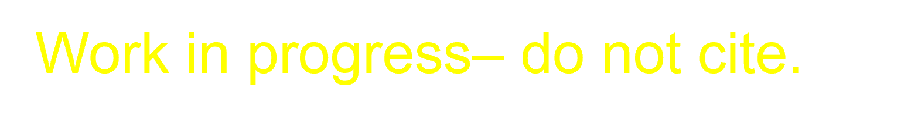
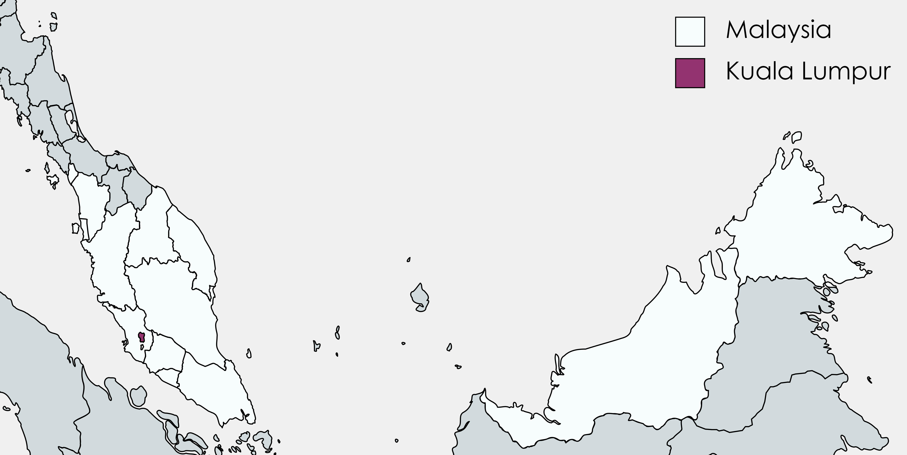
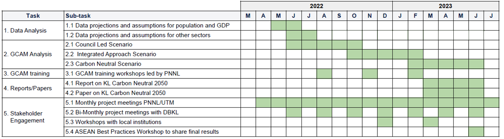

``` {r setup, echo = FALSE, message = FALSE, warning = FALSE}
library(pander)
library(dplyr)
library(ggplot2)
library(data.table)
```

<!-- Allow href to tabsets --> 

```{js, echo = FALSE}
window.onload = function() {
  document.querySelector('a[href="' + window.location.href.match("#.*$") + '"]').click();
}

function goToTab() {
  var hash = String(window.location.href.match("#.*$"));
  var target = document.querySelector("a[role = 'tab'][href='" + hash + "']");
  if (target !== null) {
    var greatgrandparent = target.parentElement.parentElement.parentElement;
    if (greatgrandparent.getAttribute("role") == "tabpanel") {
      document.querySelector("a[role = 'tab'][href='#" + greatgrandparent.getAttribute("id") + "']").click();
    }
    target.click();
    target.scrollIntoView();
  }
}
window.onload = function() {
  setTimeout(goToTab, 100);
}
window.onhashchange = goToTab;
```

<!-- Set table styles -->

<style>
table {
  font-family: arial, sans-serif;
  border-collapse: collapse;
  width: 100%;
}

td, th {
  border: 1px solid #dddddd;
  text-align: left;
  padding: 8px;
}
</style>

<div class="header_logo">



</div>

<!-------------------------->
<!-------------------------->
# Executive Summary
<!-------------------------->
<!-------------------------->
<p align="center"> </p>

* **Motivation:** Growth across the Association of Southeast Asian Nations (ASEAN) in the past few decades has been driven by urban centers. Rapid urbanization can bring about negative societal impacts, although technological and digital solutions can be used to resolve these issues and enhance quality and accessibility of services. Smart city development projects, including carbon neutrality plans, are one such example. Furthermore, the region is at a high risk for climate hazards, and moving towards carbon neutrality allows for increased mitigation and adaptation efforts to combat these risks.  

* **Objectives:** The Pacific Northwest National Laboratory (PNNL) will collaborate with stakeholders in Kuala Lumpur on implementing low-carbon strategies to achieve carbon neutrality by 2050 and will support smart city development through capacity building. Using the Global Change Analysis Model (GCAM), PNNL will analyze possible policy pathways and trajectories for Kuala Lumpur by applying quantitative modeling techniques.  

* **Approach:** The integrated assessment model GCAM is a modeling tool that represents the behavior of and interactions between five systems: energy, water, agriculture and land use, the climate, and the economy. GCAM will be used to analyze Kuala Lumpur’s existing carbon neutrality plans in a comprehensive manner by modeling inter-sectoral dynamics across several driving sectors, namely energy, buildings, transportation, and industry. PNNL will model different policy scenarios encompassing various socioeconomic, technical, and political factors to better understand the pathways to carbon neutrality in Kuala Lumpur.  

* **Expected Outcomes:** GCAM outputs will be used to guide a report detailing pathways and trajectories for Kuala Lumpur Carbon Neutrality by 2050 that will supplement existing city policies and plans. The report will include potential economic, environmental, and societal impacts of Kuala Lumpur’s carbon neutrality pathway, including abatement/investments costs and possible financing prospects, energy transitions, and air quality and health outcomes. Additionally, PNNL will lead workshops to train local experts on using GCAM and independently conducting analyses, who will then be able to continue further analysis of Kuala Lumpur’s pathways beyond 2050.  

<br>

<!-------------------------->
<!-------------------------->
# Introduction & Motivation
<!-------------------------->
<!-------------------------->
<p align="center"> </p>

Southeast Asia as a whole is experiencing a period of rapid growth and urbanization, which can present challenges for decarbonization efforts. The region also faces a heightened risk for climate impacts; in particular, Kuala Lumpur is vulnerable to the effects of high heat as well as increased flooding and droughts. Kuala Lumpur’s vision for approaching these issues is to transform the city into one that is sustainable and livable through its primary climate policies and plans: the Kuala Lumpur Low Carbon Society Blueprint 2030 (KLLCSBP2030), the draft Kuala Lumpur Structure Plan 2040 (KLSP2040), and the Kuala Lumpur Climate Action Plan 2050 (KLCAP2050). The most recent plan was developed to address and fulfill a carbon neutral target by 2050, increase resilience to climate hazards by 2050, incorporate a more inclusive approach to climate planning, and establish a governance structure that will collaborate with all stakeholders to reach climate action goals. Kuala Lumpur developed two scenarios under this plan, a Council-Led scenario aligned with targets from the KLLCSBP2030 and an Integrated Approach scenario highlighting the importance of collaboration across Kuala Lumpur, the Federal government, and other agencies in reaching emissions targets.  

The US-ASEAN Smart Cities Partnership (USASCP) uses innovative approaches across sectors to address the challenges and opportunities of energy development and urbanization in ASEAN Member States. In support of the USASCP, the U.S. Department of State, Bureau of Energy Resources’ (ENR’s) Power Sector Program (PSP) is partnering with Kuala Lumpur to support existing plans to achieve carbon neutrality. The U.S. Department of Energy’s (DOE’s) Pacific Northwest National Laboratory (PNNL) will implement the program by collaborating with local partners, including the Kuala Lumpur City Hall (DBKL) and the Universiti Teknologi Malaysia (UTM). PNNL will use its Global Change Analysis Model (GCAM) to model various policy trajectories towards net zero by 2050 and corresponding economic, environmental, and social impacts.


<br>

<!-------------------------->
<!-------------------------->
# Objectives
<!-------------------------->
<!-------------------------->
<p align="center"> </p>

Prior to COP26, Malaysia announced that it had set a goal to become carbon neutral _as early as_ 2050. Soon after, Kuala Lumpur committed to becoming a carbon neutral city _by_ 2050. Carbon neutrality refers to a state of "net zero" emissions, where carbon emissions are reduced as far as is feasibly possible, with the remaining emissions offset in some manner.  

As a large city and Malaysia's capital, Kuala Lumpur has an important role in the decarbonization of Malaysia. Kuala Lumpur has outlined several climate-focused plans in the past:

* KLCH Carbon Management Plan 2017-2022: Created to reduce absolute carbon emissions by 20% from Kuala Lumpur City Hall owned, managed, and operated assets.
* KL Low Carbon Society Blueprint 2030: Developed with UTM, this plan aims at reducing 70% of carbon emissions per unit GDP by 2030. 
* KL Draft Structure Plan 2040: Focused on the direction of urban development, with targets for mitigation and adaptation measures.
* KL Climate Action Plan 2050: Targeted on achieving carbon neutrality, addressing climate change, and inclusive planning through strong governance and collaboration.

PNNL and UTM will continue to support Kuala Lumpur on its journey to carbon neutrality. Using the modeling approach outlined below, PNNL will provide an analysis of scenarios developed in the KLCAP2050, encompassing targets outlined in previous plans and policies. PNNL will also provide a national level analysis, looking at Malaysia-level policies. These include:

* National Transport Policy
* National Renewable Energy Policy and Plan
* Malaysia Renewable Energy Roadmap
* National Energy Efficiency Action Plan
* National Policy on Climate Change
* Green Technology Master Plan Malaysia

<br>

<!-------------------------->
<!-------------------------->
# Approach
<!-------------------------->
<!-------------------------->
<p align="center"> </p>

Integrated Assessment Models (IAMs) are computational models that use links and feedbacks between socioeconomic and environmental systems to assess the implications of technology and policy choices in the context of global climate change. IAMs can provide a holistic approach to energy sector planning by considering multi-sector dynamics and global processes. GCAM, an IAM developed at PNNL, incorporates socioeconomics, energy, land use, water, and climate system (Figure 1). The model is global but can also be used to assess specific regions and fine scale processes; PNNL has developed both Malaysia and Kuala Lumpur regions within the model for national and city level analyses. GCAM utilizes the most up to date data on population, GDP, technology characteristics, policies, resource availability, and other inputs. It has the detailed representation of energy technologies in different sectors, including electricity, buildings, transportation, industry, hydrogen production, and other energy supply sectors. The model produces both historical and projected future outputs based on this information. These outputs include greenhouse gas emissions, electricity prices, energy supply and demand, and other indicators at five-year time steps from a historical baseline year to the desired end year. PNNL will use GCAM to assess the implications of Kuala Lumpur's various climate-focused plans.

```{r gcam-diagram, echo = FALSE, out.width = "70%", fig.align = 'center', fig.cap = "**Figure 1: Conceptual diagram of GCAM.**"}
knitr::include_graphics("images/GCAM_diagram.png")
```


<br>


<!-------------------------->
<!-------------------------->
# Scenarios {.tabset}
<!-------------------------->
<!-------------------------->
<p align="center"> </p>

PNNL, with input from DBKL, will develop a set of GCAM scenarios based on the KLCAP2050 and other relevant policies and plans. These scenarios will outline possible outcomes of various policies. Key indicators may include greenhouse gas emissions, _________________. *TODO* 

* **BAU:** Baseline scenario based on existing policies only, with no additional actions. This will serve as a comparison for the remaining scenarios to assess the magnitude of outcomes.
* **Council-Led:** Scenario driven by strategies and actions that are ambitious and achievable within the authority of KLCH, including the implementation of all National policies.
* **Integrated Approach:** Scenario relying on an integrated approach with KLCH, the Federal government, and other agencies, highlighting the potential emissions reductions that could occur should all parties align.
* **Carbon Neutral Malaysia and Kuala Lumpur:** Scenario using the most efficient pathway to net zero CO~2~ emissions by 2050 at the national and city levels.


<!-------------------------->
## Council-Led
<!-------------------------->

**Council-Led Scenario:** In this scenario, KLCH has the authority to implement measures to achieve carbon emissions reductions. The scenario will largely be achieved through existing actions outlined in the KLLCSBP2030 and Federal policies and plans, including the National Renewable Energy Policy and Action Plan, the National Energy Efficiency Action Plan, the National Transport Policy, and publicly declared renewable energy targets. 

Note that this scenario _does not_ meet Kuala Lumpur's benchmark targets for 2030 or 2050; this is due to the lack of power and capacity for KLCH to implement more ambitious actions. Key remaining emissions will come from the following sectors: residential, commercial and institutional buildings, industrial energy, and on-road transportation.

The table below summarizes the policies encompassed by the Council-Led scenario. **UPDATE**

```{r council-led, results = 'show', echo = FALSE, warning = FALSE, error = FALSE, message = FALSE}
myTable = data.frame(
    Sector     = c(),
    Policies = c()
    ) 
#pander::pander(myTable, keep.line.breaks = TRUE, style = "grid", justify = 'left', split.tables=Inf, caption = "")
```


<!-------------------------->
<!-------------------------->
## Integrated Approach
<!-------------------------->
<!-------------------------->

**Integrated Approach Scenario:** This scenario explores the potential carbon emissions reductions that could occur with strong collaboration across different stakeholders. Kuala Lumpur could be an advocate for such solutions, but the measures outlined in this scenario involve policy shifts at the Federal level.

Even if all scenario targets are met, Kuala Lumpur would still have residual emissions in situations where no mitigation technology exists or where a low-emissions alternative is technically or economically non-viable in the near-term. Top sources include: solid waste, commercial and institutional buildings, and on-road transportation.

The table below summarizes the policies encompassed by the Integrated Approach scenario. **UPDATE**

```{r integrated-approach, results = 'show', echo = FALSE, warning = FALSE, error = FALSE, message = FALSE}
myTable = data.frame(
    Sector     = c(),
    Policies = c()
    ) 
#pander::pander(myTable, keep.line.breaks = TRUE, style = "grid", justify = 'left', split.tables=Inf, caption = "")

```


<!-------------------------->
<!-------------------------->
## Carbon Neutral Malaysia and Kuala Lumpur
<!-------------------------->
<!-------------------------->

**Carbon Neutral Malaysia and Kuala Lumpur:** Prior to COP26, Malaysia pledged to achieve carbon neutrality as early as 2050. Later in 2021, Kuala Lumpur committed to becoming a carbon-neutral city by 2050. The Carbon Neutral Malaysia and Kuala Lumpur scenario represents the most economically efficient pathway to reach carbon neutrality by 2050 given the policies outlined in the scenarios described above. This pathway will be found using GCAM’s solving capabilities. The outcomes of this scenario will provide insight into the role that that KLCH can play in achieving carbon neutrality and additional measures that may need to be taken.
<br>

<!-------------------------->
<!-------------------------->
# Scope {.tabset}
<!-------------------------->
<!-------------------------->
<p align="center"> </p>

<!-------------------------->
<!-------------------------->
## Spatial
<!-------------------------->
<!-------------------------->

```{r KL-map, echo = FALSE, out.width = "70%", out.extra='style="float:right; padding:10px"'}

```

PNNL will assess outcomes at the city level. The Council-Led scenario encompasses only policies that can be implemented by KLCH, although the Integrated Approach scenario requires additional action at the national level. Therefore, PNNL will perform some country level analysis, with the primary focus remaining on Kuala Lumpur. 

The map to the right shows Kuala Lumpur's location within Malaysia.


<!-------------------------->
<!-------------------------->
## Temporal
<!-------------------------->
<!-------------------------->

Scenarios will be assessed up from the year 2015 to the year 2050, with the GCAM analysis conducted at five-year intervals within this range.


<br>

<!-------------------------->
<!-------------------------->
# Expected Outcomes {.tabset}
<!-------------------------->
<!-------------------------->
<p align="center"> </p>


<!-------------------------->
<!-------------------------->
## Key Indicators
<!-------------------------->
<!-------------------------->

The GCAM output for each scenario will include the following indicators calculated at 5-year timesteps through the year 2050 in the study region, as specified in the Spatial and Temporal Scope section.

```{r key-indicators, results = 'show', echo = FALSE, warning = FALSE, error = FALSE, message = FALSE}
myTable = data.frame(
    Indicator = c(),
    Description = c(),
    Units = c()
    ) 
#pander::pander(myTable, keep.line.breaks = TRUE, style = "grid", justify = 'left', split.tables=Inf, caption = "")

```

<!-------------------------->
<!-------------------------->
## Model Results
<!-------------------------->
<!-------------------------->


<!-------------------------->
<!-------------------------->
## Analysis and Recommendations
<!-------------------------->
<!-------------------------->


<br>

<!-------------------------->
<!-------------------------->
# Timeline
<!-------------------------->
<!-------------------------->
<p align="center"> </p>

Below is the proposed timeline for GCAM analysis, reports, and stakeholder engagement. 

```{r timeline, echo = FALSE, out.width = "100%", fig.align = 'center', fig.cap = "**Figure 3: Proposed timeline.**"}

```


<!-- example alternative table style -->
```{r, eval = FALSE, echo = FALSE, warning = FALSE, error = FALSE, message = FALSE}
library(kableExtra)
data.frame(
    Model     = c("WRF",
                  "GCAM",
                  "Xanthos",
                  "Helios",
                  "GGCMI",
                  "rpackageutils",
                  "im3components",
                  "gcamextractor"),
    Version = c("-",
                "gcam v5.3 (branch gcam-usa-im3)",
                "xanthos v2.4.1",
                "helios v1.0.0",
                "ggcmi v1.0.0",
                "rpackageutils v1.0.0",
                "im3components v1.0.0",
                "gcamextractor"),
    Description = c("Climate simulation model",
                    "Global Change Analysis Model. Human-earth systems dynamic model.",
                    "Water runoff emulator at 0.5 degree grids and monthly timesteps.",
                    "Gridded Heating and cooling degree day calculator at multiple spatial and temporal resolution.",
                    "Emulators to model agricultural yield impacts in response to climate",
                    "Utility functions to process, aggregate and reformat data.",
                    "Functions to process data between different IM3 models.",
                    "Model to extract and process data from GCAM output databases."),
    Language = c("-",
                  "C++/R",
                  "Python",
                  "R",
                  "?",
                  "R",
                  "R/Python",
                  "R"),
    Link = c("https://www.mmm.ucar.edu/weather-research-and-forecasting-model",
             "https://stash.pnnl.gov/projects/JGCRI/repos/gcam-core/browse?at=refs%2Fheads%2Fzk%2Ffeature%2Fgcam-usa-im3",
            "https://github.com/JGCRI/xanthos",
            "Helios",
            "GGCMI",
            "https://github.com/JGCRI/rpackageutils",
            "https://github.com/IMMM-SFA/im3components",
            "https://github.com/JGCRI/gcamextractor")
    ) %>% 
  kbl() %>%
  kable_styling(bootstrap_options = c("striped", "hover", "condensed", "responsive"))

```


<br>

<!-------------------------->
<!-------------------------->
# Inputs {.tabset}
<!-------------------------->
<!-------------------------->
<p align="center"> </p>

<!-------------------------->
## Socioeconomics  {.tabset .tabset-pills}
<!-------------------------->
This section details the socioeconomic inputs used to define Malaysia and Kuala Lumpur in GCAM. These metrics include population, GDP, and GDP per capita. Historical and projection data was used when available, otherwise data was calculated using the assumptions described below.

<table>

<tr>
<th>Variable</th>
<th style="width:50%">Assumptions</th>
<th style="width:40%">Data Sources</th>
</tr>

<tr>
<td>Population</td>
<td>
<span>- Malaysia population used the medium variant projection and historical data from the UN</span><br/>
<span>- KL census data gives a value for 2010. All other values were extrapolated and calculated using the growth rates for Malaysia in total</span>
</td>
<td>
<span>- Malaysia: [United Nations](https://population.un.org/wpp/)</span><br/>
<span>- Kuala Lumpur 2010: [United Nations](http://data.un.org/Data.aspx?q=kuala+lumpur&d=POP&f=tableCode%3a240%3bareaCode%3a0%3bsexCode%3a0%3bvarCode3%3a028690%3bvarCode4%3a000002)</span><br/>
</td>
</tr>


<tr>
<td rowspan="3">GDP</td>
<td>Pre-2011 and post-2020 GDP growth rates are consistent between all regions</td>
<td rowspan="2"> 
<span>- Malaysia: [Department of Statistics Malaysia](https://www.dosm.gov.my/v1/index.php?r=column/ctimeseries&menu_id=NHJlaGc2Rlg4ZXlGTjh1SU1kaWY5UT09)</span><br/>
<span>- Kuala Lumpur: [need link]()</span>
</td>
</tr>

</table>

<br>
<br>


### Population

#### Historical Trends and Future Projections {-}

The plot below shows historical and future projected populations in Malaysia and Kuala Lumpur comparing the data sources above to the GCAM reference scenario. As mentioned above, population growth rates in Kuala Lumpur were assumed to be on par with those of the entire country. 

``` {r pop-plot, echo = FALSE, fig.dim = c(8,4), fig.cap="Figure 9.1.1.1. **Historical and future projected population in Malaysia and Kuala Lumpur**"}
# Population
socio_data <- fread("../data/Malaysia/socioeconomic_inputs/kl_my_socioeconomics.csv") %>% as_tibble()
pop <- fread("../data/Malaysia/socioeconomic_inputs/gcam_pop_mykl.csv") %>% as_tibble()

kl_pop <- socio_data %>%
  filter(metric == "population",
         region != "Rest of Malaysia") %>%
  mutate(source = "KL") %>%
  select(-metric)

gcam_pop <- pop %>%
  mutate(value = value / 1000,
         units = "million",
         source = "GCAM") %>%
  select(-scenario)

pop_plot <- bind_rows(kl_pop, gcam_pop)

## PLOT
population_plot <- pop_plot %>%
  ggplot(aes(year, value, color = source, group = source)) +
  geom_line() +
  facet_wrap(~region, scales = "free") +
  scale_color_viridis_d(end = 0.8) +
  labs(x = "Year",
       y = "Population (millions)",
       title = "Population in Malaysia and Kuala Lumpur") +
  theme_light() ; population_plot


```

### GDP

The following graphs show GDP in 2005 USD for Malaysia and Kuala Lumpur. **TODO update units**

``` {r gdp, echo = FALSE, fig.dim = c(8,4)}
# GDP
gdp <- fread("../data/Malaysia/socioeconomic_inputs/gcam_gdp_mykl.csv") %>% as_tibble()

kl_gdp <- socio_data %>%
  filter(metric == "gdp",
         region != "Rest of Malaysia") %>%
  mutate(source = "KL") %>%
  select(-metric)

gcam_gdp <- gdp %>%
  mutate(value = (value * 1.49) / 1000, # convert 1990 USD to 2005 USD, million to billion
         units = "billion (2005 USD)",
         source = "GCAM") %>%
  select(-c(scenario, Units))

gdp_plot_data <- bind_rows(kl_gdp, gcam_gdp)

## PLOT
gdp_plot <- gdp_plot_data %>%
  ggplot(aes(year, value, color = source, group = source)) +
  geom_line() +
  facet_wrap(~region, scales = "free") +
  scale_color_viridis_d(end = 0.8) +
  labs(x = "Year",
       y = "Billion (2005 USD)",
       title = "GDP in Malaysia and Kuala Lumpur") +
  theme_light() ; gdp_plot

```

### Per capita GDP

GDP per capita, in units of 2005 USD, is shown below for Malaysia and Kuala Lumpur. **TODO update units**

``` {r gdp_pc, echo = FALSE, fig.dim = c(8,4)}
gdp_pc <- fread("../data/Malaysia/socioeconomic_inputs/gcam_gdp_pc_mykl.csv") %>% as_tibble()

kl_gdp_pc <- socio_data %>%
  filter(metric == "gdp per capita",
         region != "Rest of Malaysia") %>%
  mutate(source = "KL") %>%
  select(-metric)

gcam_gdp_pc <- gdp_pc %>%
  mutate(value = (value * 1.49), # convert 1990 USD to 2005 USD
         units = "thousand (2005 USD)",
         source = "GCAM") %>%
  select(-scenario)

gdp_pc_plot_data <- bind_rows(kl_gdp_pc, gcam_gdp_pc)

## PLOT
gdp_pc_plot <- gdp_pc_plot_data %>%
  ggplot(aes(year, value, color = source, group = source)) +
  geom_line() +
  facet_wrap(~region, scales = "free") +
  scale_color_viridis_d(end = 0.8) +
  labs(x = "Year",
       y = "Thousand (2005 USD) per person",
       title = "GDP per capita in Malaysia and Kuala Lumpur") +
  theme_light() ; gdp_pc_plot


```


<!-------------------------->
<!-------------------------->
# Results {.tabset}
<!-------------------------->
<!-------------------------->
<p align="center"> </p>

## Socioeconomics  {.tabset .tabset-pills}

### Population

### GDP

## Energy  {.tabset .tabset-pills}

### By Fuel

### By Sector

## Electricity  {.tabset .tabset-pills}

### By Fuel

### By Sector

## Emissions  {.tabset .tabset-pills}

### CO2 by Sector

### GHG by Fuel

### GHG by Sector

## Others (Buildings/Transport?)

<!-------------------------->
<!-------------------------->
# Data needs and/or questions
<!-------------------------->
<!-------------------------->
<p align="center"> </p>

* Sectoral emissions for each scenario: After review of the KLCAP2050, the team noted some discrepancies in the data presented. A primary data need is emissions for at least the key years (2030, 2050) broken down by sector for each scenario (BAU, Council Led, and Integrated Approach). A detailed breakdown of the discrepancies can be provided upon request. 


<br>
