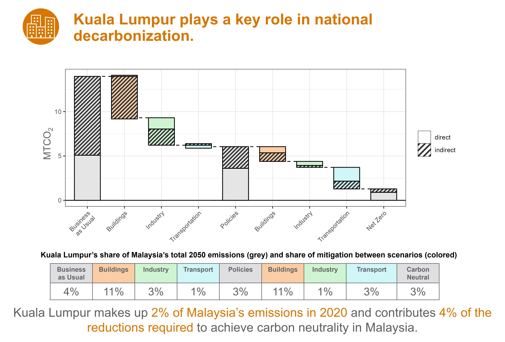

```{r setup, echo = FALSE, message=FALSE, warning = FALSE, error = FALSE}
knitr::opts_chunk$set(results = "hide", echo=FALSE, out.width = "75%", fig.align='center', message = F, warning = F, error = F, eval = T)
library(dplyr)
library(ggplot2)
library(data.table)
library(tidyr)
theme_set(theme_light())
```

```{r child = 'header.rmd'}
```

<br>

<!-------------------------->
<!-------------------------->
# Executive Summary - Malaysia
<!-------------------------->
<!-------------------------->
<p align="center"> </p>


```{r, results = "show", out.width = "90%", fig.align = 'left', }
knitr::include_graphics("images/exec_summary_malaysia_01_insights.JPG")
```

<br>

```{r, results = "show", out.width = "100%", fig.align = 'center', fig.topcaption=TRUE, fig.cap = "Pathways to Carbon-Neutrality in 2050"}

```

<br>

<!-------------------------->
<!-------------------------->
# Background
<!-------------------------->
<!-------------------------->
<p align="center"> </p>

Southeast Asia is undergoing a period of rapid growth and urbanization, largely driven by cities. Cities are a critical component of a country’s socioeconomic growth but are also large contributors to climate change; many ASEAN member states recognize this and have implemented Smart Cities programs. Prior to COP26, Malaysia announced that it had set a goal to become carbon neutral _as early as_ 2050. Soon after, Kuala Lumpur committed to becoming a carbon neutral city _by_ 2050. As Malaysia's capital, Kuala Lumpur has an important role in the decarbonization of Malaysia. 

The US-ASEAN Smart Cities Partnership (USASCP) uses innovative approaches across sectors to address the challenges and opportunities of energy development and urbanization in ASEAN Member States. In support of the USASCP, the U.S. Department of State Bureau of Energy Resources’ Power Sector Program is partnering with Kuala Lumpur to support existing plans to achieve carbon neutrality. The U.S. Department of Energy’s Pacific Northwest National Laboratory will implement the program by collaborating with local partners, including the Universiti Teknologi Malaysia (UTM), the Kuala Lumpur City Hall (DBKL), the Sustainable Energy Development Authority (SEDA), and the Ministry of National Resources, Environment, and Climate Change (NRECC). PNNL will use its Global Change Analysis Model (GCAM) to model various policy trajectories towards net zero by 2050 and corresponding economic, environmental, and social impacts.

<br>

```{r logos_diagram, results = "show", fig.topcaption=TRUE, fig.cap="Project Partners"}
knitr::include_graphics("images/partner_logos_mys.jpg")
```

<br>


<!-------------------------->
<!-------------------------->
# Methodology
<!-------------------------->
<!-------------------------->
<p align="center"> </p>

Integrated Assessment Models (IAMs) are computational models that use links and feedbacks between socioeconomic and environmental systems to assess the implications of technology and policy choices in the context of global climate change. IAMs can provide a holistic approach to energy sector planning by considering multi-sector dynamics and global processes. GCAM, an IAM developed at PNNL, incorporates socioeconomics, energy, land use, water, and climate system (Figure 1). The model is global but can also be used to assess specific regions and fine scale processes; PNNL has developed both Malaysia and Kuala Lumpur regions within the model for national and city level analyses. GCAM utilizes the most up to date data on population, GDP, technology characteristics, policies, resource availability, and other inputs. It has the detailed representation of energy technologies in different sectors, including electricity, buildings, transportation, industry, hydrogen production, and other energy supply sectors. The model produces both historical and projected future outputs based on this information. These outputs include greenhouse gas emissions, electricity prices, energy supply and demand, and other indicators at five-year time steps from a historical baseline year to the desired end year. PNNL will use GCAM to assess the implications of Malaysia and Kuala Lumpur's decarbonization-focused plans through 2050.

<br>

```{r GCAM_diagram, results = "show", fig.topcaption=TRUE, fig.cap="Conceptual diagram of GCAM"}
knitr::include_graphics("images/GCAM_diagram.png")
```

<br>

Analysis will be performed at both the national and city-level in Malaysia and Kuala Lumpur, shown in the map below. Scenarios will be assessed up from the year 2015 to the year 2050, with the GCAM analysis conducted at five-year intervals within this range.

```{r KL-map, echo = FALSE, results="show", fig.topcaption=TRUE, fig.cap="Map of analysis regions in Malaysia"}
knitr::include_graphics("./images/MY_KL_map.png")
```

<br>

See the table below for a brief overview of policies modeled. For greater details on implementation, please reference the [Modeling - Malaysia page](modeling_malaysia.html).

<br>

```{r policy_table, results = "show", fig.topcaption=TRUE, fig.cap="Set of policies modeled"}
knitr::include_graphics("./images/policy_table_report.jpg")
```

<br>

<!-------------------------->
<!-------------------------->
# Scenarios
<!-------------------------->
<!-------------------------->
<p align="center"> </p>

Three unique scenarios are developed to provide a comprehensive set of future pathways. The Business as Usual scenario uses historical energy and emissions, combined with expected future socioeconomic trajectories and baseline technology assumptions, to project future conditions in the absence of additional policies or constraints. The Policies scenario assumes that Malaysia implements a set of policies in the power, buildings, industry, and transportation sectors consistent with current plans, priorities, and targets. The Carbon Neutral scenario combines these policies with an emissions constraint to determine the additional measures needed to reach carbon neutrality by 2050. The policies considered include Malaysia's national power development plans, as well as standards, regulations, and measures to promote energy efficiency, renewable energy expansion, and reduction of greenhouse gas emissions.

* **Business as Usual:** This scenario uses a reference projection without imposing any policies or constraints.
* **Policies:** Policies representing existing city and national targets 
* **Carbon Neutral:** Scenario using most efficient pathway to national carbon neutrality by 2050.

<br>

<!-------------------------->
<!-------------------------->
# Results
<!-------------------------->
<!-------------------------->
<p align="center"> </p>

<br>

The following figures show results from the analysis to support each of the key insights. Further details and additional results can be found on the [Modeling - Malaysia page](modeling_malaysia.html).

<br>

```{r, results = "show", out.width = "100%", fig.align = 'center'}
knitr::include_graphics("images/exec_summary_malaysia_03_result1.JPG")
```

<br>

```{r, results = "show", out.width = "100%", fig.align = 'center'}
knitr::include_graphics("images/exec_summary_malaysia_03_result2.JPG")
```

<br>

```{r, results = "show", out.width = "100%", fig.align = 'center'}
knitr::include_graphics("images/exec_summary_malaysia_03_result3.JPG")
```

<br>

```{r, results = "show", out.width = "100%", fig.align = 'center'}

```


# {.unlisted .unnumbered}
```{r child = 'footer.rmd'}
```

