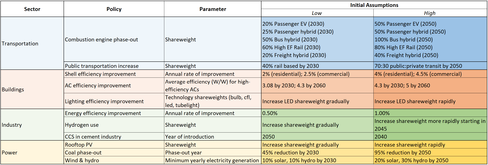

```{r setup, echo = FALSE, message = FALSE, warning = FALSE}
knitr::opts_chunk$set(results = "hide", echo = FALSE, out.width = "85%", fig.align = 'center', message = F, warning = F, error = F, eval = T)

library(kableExtra)
library(dplyr)
library(gcamextractor)
library(rchart)
```


```{r child = 'header.rmd'}
```

<!-------------------------->
<!-------------------------->
# Download GCAM SE Asia
<!-------------------------->
<!-------------------------->
<p align="center"> </p>

<br>

Please use the link below to download GCAM.

```{r key-links-table, results = 'show', eval = TRUE, echo = FALSE, warning = FALSE, error = FALSE, message = FALSE}

dt_url <- c("https://drive.google.com/file/d/1AFhbaTf6K6UsLsIXpne4_ska3stYIHRa/view?usp=sharing")

data.frame(
  File = c("gcamv5p3_seasia")) %>% 
  dplyr::mutate(Location = cell_spec(rep("Link",length(dt_url)),"html",link=dt_url)) %>%
  kable("html", escape = FALSE) %>%
  kable_styling(bootstrap_options = c("bordered","striped", "hover", "condensed", "responsive")) %>%
  row_spec(0, background = "#2A2A2A", color = "white")
```

<br> 

You will need the following prerequisites in order to run GCAM. You will also need at least 8 GB of RAM.

```{r prereq-table, results = 'show', eval = TRUE, echo = FALSE, warning = FALSE, error = FALSE, message = FALSE}

dt_url <- c("https://www.java.com/en/download/",
            "https://cran.r-project.org/",
            "https://www.rstudio.com/",
            "http://symbolclick.com/xmlmarker_1_1_setup.exe")

links <- c("Install Java 64",
           "Install R",
           "Install RStudio",
           "Install Windows XML Maker")

data.frame(
  Prerequisite = c("Java 64",
           "R",
           "RStudio",
           "Windows XML Maker")) %>%
  dplyr::mutate(Link = cell_spec(links,"html",link=dt_url)) %>%
  kable("html", escape = FALSE) %>%
  kable_styling(bootstrap_options = c("bordered", "striped", "hover", "condensed", "responsive")) %>%
  row_spec(0, background = "#2A2A2A", color = "white")

```

<br>

<!-------------------------->
<!-------------------------->
# Guides
<!-------------------------->
<!-------------------------->
<p align="center"> </p>

<br>

Below are links to an overview and walkthrough of GCAM.

```{r presentation-links-table, results = 'show', eval = TRUE, echo = FALSE, warning = FALSE, error = FALSE, message = FALSE}

dt_url <- c("https://github.com/JGCRI/seasia/blob/main/modeling/gcam_overview.pdf",
            "https://github.com/JGCRI/seasia/blob/main/modeling/gcam_walkthrough.pdf")

xml = c("gcam_overview.pdf",
        "gcam_walkthrough.pdf")

data.frame(
  Description = c("GCAM overview presentation",
                  "GCAM walkthrough presentation")) %>%
  dplyr::mutate(File = cell_spec(xml,"html",link=dt_url)) %>%
  kable("html", escape = FALSE) %>%
  kable_styling(bootstrap_options = c("bordered", "striped", "hover", "condensed", "responsive")) %>%
  row_spec(0, background = "#2A2A2A", color = "white")
```


<br>

<!-------------------------->
<!-------------------------->
# Scenarios
<!-------------------------->
<!-------------------------->
<p align="center"> </p>

Below are links to the reference and policy scenarios that we will be using. 

```{r scenarios-links-table, results = 'show', eval = TRUE, echo = FALSE, warning = FALSE, error = FALSE, message = FALSE}

dt_url <- c("https://github.com/JGCRI/seasia/blob/main/modeling/configuration_seasia_cities_bau.xml",
            "https://github.com/JGCRI/seasia/blob/main/modeling/malaysia/configuration_seasia_cities_malaysia_policy.xml")

xml = c("configuration_seasia_cities_bau.xml",
           "configuration_seasia_cities_policy.xml")

data.frame(
  Description = c("Business as Usual Scenario",
                  "Example Policy Scenario")) %>%
  dplyr::mutate(File = cell_spec(xml,"html",link=dt_url)) %>%
  kable("html", escape = FALSE) %>%
  kable_styling(bootstrap_options = c("bordered","striped", "hover", "condensed", "responsive")) %>%
  row_spec(0, background = "#2A2A2A", color = "white")
```


<!-------------------------->
<!-------------------------->
# Policies
<!-------------------------->
<!-------------------------->
<p align="center"> </p>

Future policies that will be modeled are described in the table below. In general, two policy scenarios will be presented: a "low ambition" and "high ambition" option. 

<p align="center"> </p>

<br>

The following subsections give additional details and explanations for the policies listed above.
(In progress. Will be expanded with examples for each.)

## Electricity Generation Mix - Subsidy
***

```{r electricity-generation-files-table, results = 'show', eval = TRUE, echo = FALSE, warning = FALSE, error = FALSE, message = FALSE}

dt_url <- c("https://github.com/JGCRI/seasia/blob/main/data/malaysia/inputs/malaysia_elec_fuel_mix_2030_pathway.xlsx",
            "https://github.com/JGCRI/seasia/blob/main/modeling/malaysia/malaysia_elec_fuel_mix_2030_KL.xml",
            "https://github.com/JGCRI/seasia/blob/main/modeling/malaysia/malaysia_hydro_constraint_2030_KL.xml")

files <- c("malaysia_elec_fuel_mix_2030_pathway.xlsx",
           "malaysia_elec_fuel_mix_2030_KL.xml",
           "malaysia_hydro_constraint_2030_KL.xml")

data.frame(
  "Relevant Files" = c("Excel spreadsheet showing initial calculations to build this policy",
                   "XML file for GCAM with electricity generation percentages by fuel in 2030",
                   "XML file for GCAM to set exogenous hydropower generation")) %>%
  dplyr::mutate(Link = cell_spec(files,"html",link=dt_url)) %>%
  kable("html", escape = FALSE, col.names = c("Relevant Files", "Link")) %>%
  kable_styling(bootstrap_options = c("striped", "hover", "condensed", "responsive")) %>%
  row_spec(0, background = "#2A2A2A", color = "white")
```


<!-------------------------->
<!----------Goal------------>
<!-------------------------->

<div class="warning" style='background-color:#E1F4F5; border-left: solid #1f1f1f 4px; border-radius: 4px; padding:0.7em;'>
<span>
<p style='text-align:center; font-size:24px'>
<b>Goal</b>
</p>

<p style='margin-left:1em;'>
The goal of this example is to set a minimum value (floor) in GCAM for the amount of electricity generation from each fuel type (coal, natural gas, solar, etc.) corresponding with the planned percentages in the KLLCSBP2030 (below).

<p align="center"> </p>

</p>
</span>
</div>

<br>


<!-------------------------->
<!--------Approach---------->
<!-------------------------->

<div class="warning" style='background-color:#fffae0; border-left: solid #1f1f1f 4px; border-radius: 4px; padding:0.7em;'>
<span>

<p style='text-align:center; font-size:24px'>
<b>Approach</b></p>

<p style='margin-left:1em;'>
One way to set a generation floor for each fuel type in GCAM is to use a subsidy policy. This will lower the cost of the electricity generation technology until the floor is reached. If there is more demand for electricity than is supplied by the sum of the generation floors, then the remaining demand will be met by a mix of fuels determined by the market.

Hydropower is exogenous in GCAM and has a fixed pathway. The power generation values for this technology are set explicitly using a fixed output add-on XML. 

</p>
</span>
</div>

<br>


<!-------------------------->
<!--------Background-------->
<!-------------------------->

<div class="warning" style='background-color:#EFFFC9; border-left: solid #1f1f1f 4px; border-radius: 4px; padding:0.7em;'>
<span>

<p style='text-align:center; font-size:24px'>
<b>Background - Policy portfolio standards</b></p>

<p style='margin-left:1em;'>
A `policy-portfolio-standard` in GCAM is a policy that can be used to implement taxes, subsidies, floors, ceilings, and constraints. Taxes and subsidies can be specified when the exact amount to be added or subtracted to the price is known. However, a `policy-portfolio-standard` can also contain a `constraint`, which acts as either a floor or ceiling for the technology or technologies included. Exact constraints can also be implemented. See the [GCAM Policy Examples](https://jgcri.github.io/gcam-doc/policies_examples.html) documentation for more information on how to implement these options.
</p>
</span>
</div>

<br>


<!-------------------------->
<!---GCAM Implementation---->
<!-------------------------->

<div class="warning" style='background-color:#F5E5E1; border-left: solid #1f1f1f 4px; border-radius: 4px; padding:0.7em;'>
<span>
<p style='text-align:center; font-size:24px'>
<b>GCAM Implementation</b>
</p>

<p style='margin-left:1em;'>
1. Create a folder in the input directory eg. `./gcam-core/input/addons/malaysia`.
2. Download the example XML file [malaysia_elec_fuel_mix_2030_KL.xml](https://github.com/JGCRI/seasia/blob/main/modeling/malaysia/malaysia_elec_fuel_mix_2030_KL.xml) to the folder. (Click on `Raw` and then `right-click` and select `save-as`.)
3. To make adjustments: within each `policy-portfolio-standard` tag in the XML, adjust the following:
</p>
<ul style='margin-left:4em; text-align:left;'>
  <li>`constraint` for each year in which a floor is desired</li>
  <li>Set `min-price` to a large negative value for years in which an exact constraint, rather than a floor, is desired</li>
</ul>
<p style='margin-left:1em;'>
4. Within each `supplysector` tag in the XML, make sure that the corresponding `input-subsidy` is added within each relevant `period` for each `stub-technology` you wish to constrain.
5. Save the XML and then point to it in your configuration file by adding the line: 
<p style='font-size:0.9em'>
`<Value name = "scen">../input/addons/malaysia/malaysia_elec_fuel_mix_2030_KL.xml</Value>`
6. To adjust the hydropower pathway, download the example XML file [malaysia_hydro_constraint_2030_KL.xml](https://github.com/JGCRI/seasia/blob/main/modeling/malaysia/malaysia_hydro_constraint_2030_KL.xml) to the folder. 
7. Within each `fixedOutput` tag in the XML, adjust the value to reflect desired hydropower output in each period. The user can also add additional periods. 
8. Save the XML and point to it in your configuration file by adding the line: 
<p style='font-size:0.9em'>
`<Value name = "scen">../input/addons/malaysia/malaysia_hydro_constraint_2030_KL.xml</Value>`

</p>
</p>

</span>
</div>

<br>

<!-------------------------->
<!-------------------------->
<!-------------------------->
# Diagnostics
<!-------------------------->
<!-------------------------->
<!-------------------------->
<p align="center"> </p>

This section describes how to explore and compare the final output data using GCAM-specific post-processing tools.

<!-------------------------->
<!-------------------------->
## Extract GCAM Data
<!-------------------------->
<!-------------------------->
***

`gcamextractor` is an R package used to extract and process GCAM data and manipulate into standardized tables. `gcamextractor` converts GCAM outputs into commonly used units as well as aggregates across different classes and sectors for easy use in plots, maps and tables. For more information, please reference the documentation page found [here](https://jgcri.github.io/gcamextractor/index.html).

The first step is to create a path to the GCAM database, found in the output folder of your GCAM folder, and a list of desired parameters. The `readgcam()` function also requires region names and a specific output folder. Because reading in many parameters can take several minutes, we will be using existing outputs, found in your working directory's "gcamextractor" folder, generated by the code below.

```{r gcamextractor-setup, echo = TRUE, eval = FALSE}
sample_path <- "./output/database"

sample_params <- "summary"

regions <- c("Malaysia", "KualaLumpur", "Rest of Malaysia")

data <- gcamextractor::readgcam(gcamdatabase = sample_path,
                                paramsSelect = sample_params,
                                regionsSelect = regions,
                                regionsAggregate = list(regions),
                                regionsAggregateNames = "All of Malaysia",
                                folder = "..data/malaysia/gcamextractor")

```

```{r gcamextractor, echo = TRUE}
df1 <- read.csv("../data/malaysia/gcamextractor/gcamDataTable_aggClass1.csv")

malaysia <- df1 %>%
  filter(region != ("Rest of Malaysia"),
         x > 2000)

```

<br>

<!-------------------------->
<!-------------------------->
## Plot Figures 
<!-------------------------->
<!-------------------------->
***

`rchart` is a comprehensive charting package to plot and compare data across scenarios, regions, sectors and time periods in GCAM. The diagnostic figures below were created using `gcamextractor` and `rchart` and include the following parameters:

* Socioeconomics: population, GDP, GDP per capita
* CO~2~ emissions by sector
* GHG emissions by sector and gas
* Primary energy by fuel
* Final energy by fuel
* Final energy by sector
* Electricity generation by fuel
* Electricity generation by sector
* Building energy by subsector
* Transportation by mode

<br>

<!-------------------------->
### Socioeconomic Summary {.tabset}
<!-------------------------->
***

#### Malaysia vs Kuala Lumpur

```{r rchart-socio, results = 'hide', eval = TRUE, echo = TRUE, warning = FALSE, error = FALSE, message = FALSE, fig.width = 16, fig.height = 8, out.width = "100%"}
socioeconomic_parameters <- c("pop", "gdp", "gdpPerCapita")
  
socioeconomic <- malaysia %>%
  filter(param %in% socioeconomic_parameters,
         region != "All of Malaysia") %>%
  mutate(param = units) %>% 
  rchart::chart(folder = "rchart/socioeconomic",
                chart_type = "region_absolute",
                save = F, 
                show = F,
                size_text = 19)

socioeconomic$chart_region_absolute
```

<br> 

#### Malaysia

```{r rchart-socio-my, results = 'hide', eval = TRUE, echo = TRUE, warning = FALSE, error = FALSE, message = FALSE, fig.width = 16, fig.height = 8, out.width = "100%"}

socioeconomic_my <- malaysia %>%
  filter(param %in% socioeconomic_parameters,
         region == "Malaysia") %>%
  mutate(param = units,
         scenario = "Ref") %>% 
  rchart::chart(folder = "rchart/socioeconomic",
                save = F, 
                show = F,
                size_text = 19)

socioeconomic_my$chart_param

```


<br>


#### Kuala Lumpur


```{r rchart-socio-kl, results = 'hide', eval = TRUE, echo = TRUE, warning = FALSE, error = FALSE, message = FALSE, fig.width = 16, fig.height = 8, out.width = "100%"}

socioeconomic_kl <- malaysia %>%
  filter(param %in% socioeconomic_parameters,
         region == "KualaLumpur") %>%
  mutate(param = units,
         scenario = "Ref") %>% 
  rchart::chart(folder = "rchart/socioeconomic",
                save = F, 
                show = F,
                size_text = 19)

socioeconomic_kl$chart_param

```

<br>

<!-------------------------->
### Emissions by Sector and Gas {.tabset}
<!-------------------------->
***

#### Malaysia vs Kuala Lumpur

``` {r rchart-emiss, results = 'hide', eval = TRUE, echo = TRUE, warning = FALSE, error = FALSE, message = FALSE}
co2 <- malaysia %>% filter(param == "emissCO2BySector",
                           region != "Malaysia") %>%
  mutate(value = value * 3.67,
         units = "CO2 Emissions (MTCO2eq)")

ghg <- malaysia %>% filter(param == "emissGHGBySectorGWPAR5",
                           region != "Malaysia")

malaysia_emissions <- bind_rows(co2, ghg)

```

``` {r rchart-emiss-plot, results = 'hide', eval = TRUE, echo = TRUE, warning = FALSE, error = FALSE, message = FALSE, fig.width = 12, fig.height = 9}
emissions <- malaysia_emissions %>%
  mutate(param = units) %>%
  rchart::chart(folder = "rchart/emissions_by_sector",
                chart_type = "class_absolute",
                save = F, 
                show = F,
                size_text = 18)

emissions$chart_class_byRegion
```

``` {r rchart-emiss-gas, results = 'hide', eval = TRUE, echo = TRUE, warning = FALSE, error = FALSE, message = FALSE}
co2_gas <- co2 %>%
  mutate(class = "CO2",
         param = "emissGHGByGasGWPAR5")

ghg_gas <- malaysia %>% 
  filter(param == "emissGHGByGasGWPAR5",
         class != "CO2",
         region != "Malaysia")

malaysia_emissions_gas <- bind_rows(co2_gas, ghg_gas)
```

``` {r rchart-emiss-gas-plot, results = 'hide', eval = TRUE, echo = TRUE, warning = FALSE, error = FALSE, message = FALSE}
gas <- malaysia_emissions_gas %>%
  mutate(param = units) %>%
  rchart::chart(folder = "rchart/emissions_by_gas",
                chart_type = "class_absolute",
                save = F, 
                show = F,
                size_text = 10)

gas$chart_class_byRegion

```

<br>

#### Malaysia

``` {r rchart-emiss-my, results = 'hide', eval = TRUE, echo = TRUE, warning = FALSE, error = FALSE, message = FALSE}
co2_my <- malaysia %>% filter(param == "emissCO2BySector",
                           region == "All of Malaysia") %>%
  mutate(value = value * 3.67,
         units = "CO2 Emissions (MTCO2eq)")

ghg_my <- malaysia %>% filter(param == "emissGHGBySectorGWPAR5",
                           region == "All of Malaysia")

my_emissions <- bind_rows(co2_my, ghg_my) 

```

``` {r rchart-emiss-plot-my, results = 'hide', eval = TRUE, echo = TRUE, warning = FALSE, error = FALSE, message = FALSE, fig.width = 12, fig.height = 9}
emissions_my_plot <- my_emissions %>%
  mutate(param = units) %>%
  rchart::chart(folder = "rchart/emissions_by_sector",
                save = F, 
                show = F,
                size_text = 18)

emissions_my_plot$chart_param
```

``` {r rchart-emiss-gas-my, results = 'hide', eval = TRUE, echo = TRUE, warning = FALSE, error = FALSE, message = FALSE}
ghg_gas_my <- malaysia %>% 
  filter(param == "emissGHGByGasGWPAR5",
         class != "CO2",
         region == "All of Malaysia")

my_emissions_gas <- bind_rows(ghg_gas_my, my_emissions)
```

``` {r rchart-emiss-gas-plot-my, results = 'hide', eval = TRUE, echo = TRUE, warning = FALSE, error = FALSE, message = FALSE}
gas_my <- my_emissions_gas %>%
  rchart::chart(folder = "rchart/emissions_by_gas",
                save = F, 
                show = F,
                size_text = 10)

gas_my$chart_class

gas_my$`chart_class_diff_absolute_All of Malaysia`

```


<br>

#### Kuala Lumpur

``` {r rchart-emiss-kl, results = 'hide', eval = TRUE, echo = TRUE, warning = FALSE, error = FALSE, message = FALSE}
co2_kl <- malaysia %>% filter(param == "emissCO2BySector",
                           region == "KualaLumpur") %>%
  mutate(value = value * 3.67,
         units = "CO2 Emissions (MTCO2eq)")

ghg_kl <- malaysia %>% filter(param == "emissGHGBySectorGWPAR5",
                           region == "KualaLumpur")

kl_emissions <- bind_rows(co2_kl, ghg_kl) 

```

``` {r rchart-emiss-plot-kl, results = 'hide', eval = TRUE, echo = TRUE, warning = FALSE, error = FALSE, message = FALSE, fig.width = 12, fig.height = 9}
emissions_kl_plot <- kl_emissions %>%
  mutate(param = units) %>%
  rchart::chart(folder = "rchart/emissions_by_sector",
                save = F, 
                show = F,
                size_text = 18)

emissions_kl_plot$chart_param
```

``` {r rchart-emiss-gas-kl, results = 'hide', eval = TRUE, echo = TRUE, warning = FALSE, error = FALSE, message = FALSE}
ghg_gas_kl <- malaysia %>% 
  filter(param == "emissGHGByGasGWPAR5",
         class != "CO2",
         region == "KualaLumpur")

kl_emissions_gas <- bind_rows(ghg_gas_kl, kl_emissions)
```

``` {r rchart-emiss-gas-plot-kl, results = 'hide', eval = TRUE, echo = TRUE, warning = FALSE, error = FALSE, message = FALSE}
gas_kl <- kl_emissions_gas %>%
  rchart::chart(folder = "rchart/emissions_by_gas",
                save = F, 
                show = F,
                size_text = 10)

gas_kl$chart_class

gas_kl$chart_class_diff_absolute_KualaLumpur

```

<br>

<!-------------------------->
### Primary Energy by Fuel {.tabset}
<!-------------------------->
***

#### Malaysia vs Kuala Lumpur

```{r rchart-primary-energy, results = 'hide', eval = TRUE, echo = TRUE, warning = FALSE, error = FALSE, message = FALSE, fig.width = 15, fig.height = 12}

p_energy <- malaysia %>% 
  filter(param == "energyPrimaryByFuelEJ",
         region != "Malaysia") %>%
  mutate(param = units) %>%
  rchart::chart(folder = "rchart/energy",
                chart_type = "class_absolute",
                save = F, 
                show = F,
                size_text = 20)

p_energy$chart_class_byRegion
```


<br>

#### Malaysia 

```{r rchart-primary-energy-my, results = 'hide', eval = TRUE, echo = TRUE, warning = FALSE, error = FALSE, message = FALSE, fig.width = 15, fig.height = 12}

p_energy_my <- malaysia %>% 
  filter(param == "energyPrimaryByFuelEJ",
         region == "All of Malaysia") %>%
  mutate(param = units) %>%
  rchart::chart(folder = "rchart/energy",
                chart_type = "class_absolute",
                save = F, 
                show = F,
                size_text = 20)

p_energy_my$chart_class

p_energy_my$`chart_class_diff_absolute_All of Malaysia`
```


<br>

#### Kuala Lumpur

```{r rchart-primary-energy-kl, results = 'hide', eval = TRUE, echo = TRUE, warning = FALSE, error = FALSE, message = FALSE, fig.width = 15, fig.height = 12}

p_energy_kl <- malaysia %>% 
  filter(param == "energyPrimaryByFuelEJ",
         region == "KualaLumpur") %>%
  mutate(param = units) %>%
  rchart::chart(folder = "rchart/energy",
                chart_type = "class_absolute",
                save = F, 
                show = F,
                size_text = 20)

p_energy_kl$chart_class

p_energy_kl$chart_class_diff_absolute_KualaLumpur
```


<br>


<!-------------------------->
### Final Energy by Fuel and Sector {.tabset}
<!-------------------------->
***

#### Malaysia vs Kuala Lumpur

```{r rchart-energy, results = 'hide', eval = TRUE, echo = TRUE, warning = FALSE, error = FALSE, message = FALSE, fig.width = 15, fig.height = 12}
energy_parameters <- c("energyFinalConsumBySecEJ", "energyFinalByFuelEJ")

energy <- malaysia %>% 
  filter(param %in% energy_parameters,
         region != "Malaysia") %>%
  mutate(param = units) %>%
  rchart::chart(folder = "rchart/energy",
                chart_type = "class_absolute",
                save = F, 
                show = F,
                size_text = 20)

energy$chart_class_byRegion
```

<br>

#### Malaysia

```{r rchart-energy-my, results = 'hide', eval = TRUE, echo = TRUE, warning = FALSE, error = FALSE, message = FALSE, fig.width = 15, fig.height = 12}
energy_my <- malaysia %>% 
  filter(param %in% energy_parameters,
         region == "All of Malaysia") %>%
  mutate(param = units) %>%
  rchart::chart(folder = "rchart/energy",
                save = F, 
                show = F,
                size_text = 20)

energy_my$chart_class

energy_my$`chart_class_diff_absolute_All of Malaysia`
```


<br>

#### Kuala Lumpur

```{r rchart-energy-kl, results = 'hide', eval = TRUE, echo = TRUE, warning = FALSE, error = FALSE, message = FALSE, fig.width = 15, fig.height = 12}
energy_kl <- malaysia %>% 
  filter(param %in% energy_parameters,
         region == "KualaLumpur") %>%
  mutate(param = units) %>%
  rchart::chart(folder = "rchart/energy",
                save = F, 
                show = F,
                size_text = 20)

energy_kl$chart_class

energy_kl$chart_class_diff_absolute_KualaLumpur
```


<br>

<!-------------------------->
### Electricity Generation by Fuel and Sector {.tabset}
<!-------------------------->
***

#### Malaysia vs Kuala Lumpur

```{r rchart-elec-gen, results = 'hide', eval = TRUE, echo = TRUE, warning = FALSE, error = FALSE, message = FALSE, fig.width = 15, fig.height = 12}
electricity_parameters <- c("elecConsumByDemandSectorTWh", "elecByTechTWh")

electricity <- malaysia %>% 
  filter(param %in% electricity_parameters,
         region != "Malaysia") %>%
  mutate(param = units) %>%
  rchart::chart(folder = "rchart/electricity",
                chart_type = "class_absolute",
                save = F, 
                show = F,
                size_text = 20)

electricity$chart_class_byRegion
```


<br>

#### Malaysia 

```{r rchart-elec-gen-my, results = 'hide', eval = TRUE, echo = TRUE, warning = FALSE, error = FALSE, message = FALSE, fig.width = 15, fig.height = 12}

electricity_my <- malaysia %>% 
  filter(param %in% electricity_parameters,
         region == "All of Malaysia") %>%
  mutate(param = units) %>%
  rchart::chart(folder = "rchart/electricity",
                save = F, 
                show = F,
                size_text = 20)

electricity_my$chart_class

electricity_my$`chart_class_diff_absolute_All of Malaysia`
```


<br>

#### Kuala Lumpur

```{r rchart-elec-gen-kl, results = 'hide', eval = TRUE, echo = TRUE, warning = FALSE, error = FALSE, message = FALSE, fig.width = 15, fig.height = 12}

electricity_kl <- malaysia %>% 
  filter(param %in% electricity_parameters,
         region == "KualaLumpur") %>%
  mutate(param = units) %>%
  rchart::chart(folder = "rchart/electricity",
                save = F, 
                show = F,
                size_text = 20)

electricity_kl$chart_class

electricity_kl$chart_class_diff_absolute_KualaLumpur
```


<br>

<!-------------------------->
### Building Energy by Subsector {.tabset}
<!-------------------------->
***

#### Malaysia vs Kuala Lumpur

```{r rchart-building, results = 'hide', eval = TRUE, echo = TRUE, warning = FALSE, error = FALSE, message = FALSE, fig.width = 15, fig.height = 12}
building_energy <- malaysia %>% 
  filter(param == "energyFinalSubsecBySectorBuildEJ",
         region != "Malaysia") %>%
  mutate(param = units) %>%
  rchart::chart(folder = "rchart/building_energy",
                save = F, 
                show = F,
                size_text = 20)

building_energy$chart_class_byRegion
```


<br>

#### Malaysia 

```{r rchart-building-my, results = 'hide', eval = TRUE, echo = TRUE, warning = FALSE, error = FALSE, message = FALSE, fig.width = 15, fig.height = 12}
building_energy_my <- malaysia %>% 
  filter(param == "energyFinalSubsecBySectorBuildEJ",
         region == "All of Malaysia") %>%
  mutate(param = units) %>%
  rchart::chart(folder = "rchart/building_energy",
                save = F, 
                show = F,
                size_text = 20)

building_energy_my$chart_class

building_energy_my$`chart_class_diff_absolute_All of Malaysia`
```


<br>

#### Kuala Lumpur

```{r rchart-building-kl, results = 'hide', eval = TRUE, echo = TRUE, warning = FALSE, error = FALSE, message = FALSE, fig.width = 15, fig.height = 12}
building_energy_kl <- malaysia %>% 
  filter(param == "energyFinalSubsecBySectorBuildEJ",
         region == "KualaLumpur") %>%
  mutate(param = units) %>%
  rchart::chart(folder = "rchart/building_energy",
                save = F, 
                show = F,
                size_text = 20)

building_energy_kl$chart_class

building_energy_kl$chart_class_diff_absolute_KualaLumpur
```

<br>

<!-------------------------->
### Transportation by Mode {.tabset}
<!-------------------------->
***

#### Malaysia vs Kuala Lumpur

```{r rchart-transport, results = 'hide', eval = TRUE, echo = TRUE, warning = FALSE, error = FALSE, message = FALSE, fig.width = 15, fig.height = 12}
transport_params <- c("transportFreightVMTByMode", "transportPassengerVMTByMode")

transport <- malaysia %>% 
  filter(param %in% transport_params,
         region != "Malaysia") %>%
  mutate(param = units) %>%
  rchart::chart(folder = "rchart/transport",
                chart_type = "class_absolute",
                save = F, 
                show = F,
                size_text = 20)

transport$chart_class_byRegion
```


<br>

#### Malaysia 

```{r rchart-transport-my, results = 'hide', eval = TRUE, echo = TRUE, warning = FALSE, error = FALSE, message = FALSE, fig.width = 15, fig.height = 12}
transport_my <- malaysia %>% 
  filter(param %in% transport_params,
         region == "All of Malaysia") %>%
  mutate(param = units) %>%
  rchart::chart(folder = "rchart/transport",
                save = F, 
                show = F,
                size_text = 20)

transport_my$chart_class

transport_my$`chart_class_diff_absolute_All of Malaysia`
```


<br>

#### Kuala Lumpur

```{r rchart-transport-kl, results = 'hide', eval = TRUE, echo = TRUE, warning = FALSE, error = FALSE, message = FALSE, fig.width = 15, fig.height = 12}
transport_kl <- malaysia %>% 
  filter(param %in% transport_params,
         region == "KualaLumpur") %>%
  mutate(param = units) %>%
  rchart::chart(folder = "rchart/transport",
                save = F, 
                show = F,
                size_text = 20)

transport_kl$chart_class

transport_kl$`chart_class_diff_absolute_All of Malaysia`
```


<br>

# {.unlisted .unnumbered}
```{r child = 'footer.rmd'}
```
