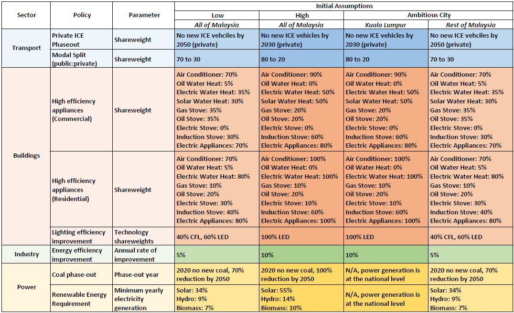

```{r setup, echo = FALSE, message = FALSE, warning = FALSE}
knitr::opts_chunk$set(results = "hide", echo = FALSE, out.width = "100%", fig.align = 'center', message = F, warning = F, error = F, eval = T)

library(kableExtra)
library(dplyr)
library(gcamextractor)
library(rchart)
```


```{r child = 'header.rmd'}
```

<!-------------------------->
<!-------------------------->
# Download GCAM SE Asia
<!-------------------------->
<!-------------------------->
<p align="center"> </p>

<br>

Please use the link below to download GCAM.

```{r key-links-table, results = 'show', eval = TRUE, echo = FALSE, warning = FALSE, error = FALSE, message = FALSE}

dt_url <- c("https://zenodo.org/record/7259736/files/gcamv5p3_seasia.zip?download=1")

data.frame(
  File = c("gcamv5p3_seasia")) %>% 
  dplyr::mutate(Location = cell_spec(rep("Link",length(dt_url)),"html",link=dt_url)) %>%
  kable("html", escape = FALSE) %>%
  kable_styling(bootstrap_options = c("bordered","striped", "hover", "condensed", "responsive")) %>%
  row_spec(0, background = "#2A2A2A", color = "white")
```

<br> 

You will need the following prerequisites in order to run GCAM. You will also need at least 8 GB of RAM.

```{r prereq-table, results = 'show', eval = TRUE, echo = FALSE, warning = FALSE, error = FALSE, message = FALSE}

dt_url <- c("https://www.java.com/en/download/",
            "https://cran.r-project.org/",
            "https://www.rstudio.com/",
            "http://symbolclick.com/xmlmarker_1_1_setup.exe")

links <- c("Install Java 64",
           "Install R",
           "Install RStudio",
           "Install Windows XML Maker")

data.frame(
  Prerequisite = c("Java 64",
           "R",
           "RStudio",
           "Windows XML Maker")) %>%
  dplyr::mutate(Link = cell_spec(links,"html",link=dt_url)) %>%
  kable("html", escape = FALSE) %>%
  kable_styling(bootstrap_options = c("bordered", "striped", "hover", "condensed", "responsive")) %>%
  row_spec(0, background = "#2A2A2A", color = "white")

```

<br>

<!-------------------------->
<!-------------------------->
# Guides
<!-------------------------->
<!-------------------------->
<p align="center"> </p>

<br>

Below are links to an overview and walkthrough of GCAM.

```{r presentation-links-table, results = 'show', eval = TRUE, echo = FALSE, warning = FALSE, error = FALSE, message = FALSE}

dt_url <- c("https://github.com/JGCRI/seasia/blob/main/modeling/gcam_overview.pdf",
            "https://github.com/JGCRI/seasia/blob/main/modeling/gcam_walkthrough.pdf")

xml = c("gcam_overview.pdf",
        "gcam_walkthrough.pdf")

data.frame(
  Description = c("GCAM overview presentation",
                  "GCAM walkthrough presentation")) %>%
  dplyr::mutate(File = cell_spec(xml,"html",link=dt_url)) %>%
  kable("html", escape = FALSE) %>%
  kable_styling(bootstrap_options = c("bordered", "striped", "hover", "condensed", "responsive")) %>%
  row_spec(0, background = "#2A2A2A", color = "white")
```


<br>

<!-------------------------->
<!-------------------------->
# Scenarios
<!-------------------------->
<!-------------------------->
<p align="center"> </p>

Below are links to the reference and policy scenarios that we will be using. 

```{r scenarios-links-table, results = 'show', eval = TRUE, echo = FALSE, warning = FALSE, error = FALSE, message = FALSE}

dt_url <- c("https://github.com/JGCRI/seasia/blob/main/modeling/configuration_seasia_cities_bau.xml",
            "https://github.com/JGCRI/seasia/blob/main/modeling/malaysia/configuration_seasia_cities_malaysia_policy.xml")

xml = c("configuration_seasia_cities_bau.xml",
           "configuration_seasia_cities_policy.xml")

data.frame(
  Description = c("Business as Usual Scenario",
                  "Example Policy Scenario")) %>%
  dplyr::mutate(File = cell_spec(xml,"html",link=dt_url)) %>%
  kable("html", escape = FALSE) %>%
  kable_styling(bootstrap_options = c("bordered","striped", "hover", "condensed", "responsive")) %>%
  row_spec(0, background = "#2A2A2A", color = "white")
```


<!-------------------------->
<!-------------------------->
# Policies
<!-------------------------->
<!-------------------------->
<p align="center"> </p>

In general, three policy scenarios will be presented: a "low ambition" and "high ambition" option as well as "ambitious city." The high ambition scenario uses key targets from policies and plans from Kuala Lumpur and Malaysia. The low ambition scenario explores if these targets are not met until a later target year, usually 2060 or 2070 instead of 2050. The ambitious city scenario represents Kuala Lumpur hitting these high ambition targets, while the rest of Malaysia takes longer to achieve the same goals. For a 2050 snapshot of policies that will be modeled within each scenario, please reference the table below.  

<p style='margin-left:1em;'>
<p align="center"> </p>
</p>

<br>

The following subsections give additional details and explanations for the policies listed above.
(In progress. Will be expanded with examples for each.)

## Private ICE Phase-out
***

## Public/Private Vehicle Modal Shift
***

## High Efficiency Appliances
***

```{r high-eff-appliances-files-table, results = 'show', eval=TRUE, echo=FALSE, warning=FALSE, error = FALSE, message = FALSE}

dt_url <- c("https://github.com/JGCRI/seasia/blob/main/modeling/malaysia/efficient_appliances_high.xml",
            "https://github.com/JGCRI/seasia/blob/main/modeling/malaysia/efficient_appliances_low.xml")

data.frame(
  Scenario = c("High", "Low")) %>% 
  dplyr:: mutate("Files Used" = cell_spec(c("efficient_appliances_high.xml",
                                            "efficient_appliances_low.xml"),
                                          "html", link=dt_url),
         Description = c("Increase prevelance of high-efficiency technologies (commercial and residential) through 2050",
                         "Increase prevelance of high-efficiency technologies (commercial and residential) through 2070")) %>% 
  kable("html", escape = FALSE, col.names = c("Scenario", "Files Used", "Description")) %>%
  kable_styling(bootstrap_options = c("striped", "hover", "condensed", "responsive")) %>%
  row_spec(0, background = "#2A2A2A", color = "white")

```


<!-------------------------->
<!----------Goal------------>
<!-------------------------->

<div class="warning" style='background-color:#E1F4F5; border-left: solid #1f1f1f 4px; border-radius: 4px; padding:0.7em;'>
<span>
<p style='text-align:center; font-size:24px'>
<b>Goal</b>
</p>

<p style='margin-left:1em;'>
The goal of this policy is to represent an increase in energy efficient technologies in the commercial and residential sectors. The difference between the low and high scenario versions of this policy is the year in which the desired mix of technologies is achieved.

</p>
</span>
</div>

<br>


<!-------------------------->
<!--------Approach---------->
<!-------------------------->

<div class="warning" style='background-color:#fffae0; border-left: solid #1f1f1f 4px; border-radius: 4px; padding:0.7em;'>
<span>

<p style='text-align:center; font-size:24px'>
<b>Approach</b>
</p>

<p style='margin-left:1em;'>
We can adjust the shareweights for technologies like air conditioners, water heaters, and other appliances to encourage the use of high efficiency technologies and discourage the use of low efficiency appliances. 
</p>


</span>
</div>

<br>


<!-------------------------->
<!--------Background-------->
<!-------------------------->

```{r background-shareweights-high-eff-appliances, child = 'background_shareweights.rmd'}
```


<!-------------------------->
<!---GCAM Implementation---->
<!-------------------------->

<div class="warning" style='background-color:#F5E5E1; border-left: solid #1f1f1f 4px; border-radius: 4px; padding:0.7em;'>
<span>
<p style='text-align:center; font-size:24px'>
<b>GCAM Implementation</b>
</p>

<p style='margin-left:1em;'>
1. Create a folder in the input directory: `./gcam-core/input/addons`.
2. Download the desired xml file (either [efficient_appliances_high.xml](https://github.com/JGCRI/seasia/blob/main/modeling/malaysia/efficient_appliances_high.xml) or [efficient_appliances_low.xml](https://github.com/JGCRI/seasia/blob/main/modeling/malaysia/efficient_appliances_low.xml)) to the folder.
4. To adjust the year in which the target mix of technologies is achieved: within each `stub-technology` tag in the XML, change the `to-year` in the first `interpolation-rule` and the `from-year` in the second. Also change the `year` of the `period` tag in which the `share-weight` is 0.
5. Save the xml and then point to it in your configuration file by adding the line (replace `high` with `low` as needed): 
<p style='font-size:0.8em'>
`<Value name = "scen">../input/addons/malaysia/efficient_appliances__high.xml</Value>`
</p>

</span>
</div>

<br>   

## Lighting Efficiency
***

```{r lighting-files-table, results = 'show', eval=TRUE, echo=FALSE, warning=FALSE, error = FALSE, message = FALSE}

dt_url <- c("https://github.com/JGCRI/seasia/blob/main/modeling/malaysia/buildings_led_high.xml",
            "https://github.com/JGCRI/seasia/blob/main/modeling/malaysia/buildings_led_low.xml")

data.frame(
  Scenario = c("High", "Low")) %>% 
  dplyr:: mutate("Files Used" = cell_spec(c("buildings_led_high.xml",
                                            "buildings_led_low.xml"),
                                          "html", link=dt_url),
         Description = c("Gradually phases non-LED residential lighting technology out of the market by 2050",
                         "Gradually phases non-LED residential lighting technology out of the market by 2070")) %>% 
  kable("html", escape = FALSE, col.names = c("Scenario", "Files Used", "Description")) %>%
  kable_styling(bootstrap_options = c("striped", "hover", "condensed", "responsive")) %>%
  row_spec(0, background = "#2A2A2A", color = "white")

```


<!-------------------------->
<!----------Goal------------>
<!-------------------------->

<div class="warning" style='background-color:#E1F4F5; border-left: solid #1f1f1f 4px; border-radius: 4px; padding:0.7em;'>
<span>
<p style='text-align:center; font-size:24px'>
<b>Goal</b>
</p>

<p style='margin-left:1em;'>
The goal of this policy is to represent increasing use of LED lighting in residential buildings and the decreasing use of other, less energy efficient lighting technologies. The difference between the low and high scenario versions of this policy is the year in which 100% LED residential lighting is achieved.

</p>
</span>
</div>

<br>


<!-------------------------->
<!--------Approach---------->
<!-------------------------->

<div class="warning" style='background-color:#fffae0; border-left: solid #1f1f1f 4px; border-radius: 4px; padding:0.7em;'>
<span>

<p style='text-align:center; font-size:24px'>
<b>Approach</b>
</p>

<p style='margin-left:1em;'>
We can gradually decrease the shareweights of all non-LED residential lighting technologies in order to phase them out of the market. The year in which the non-LED shareweights reach 0 corresponds with the year in which 100% LED residential lighting is achieved.
</p>


</span>
</div>

<br>


<!-------------------------->
<!--------Background-------->
<!-------------------------->

```{r background shareweights lighting, child = 'background_shareweights.rmd'}
```


<!-------------------------->
<!---GCAM Implementation---->
<!-------------------------->

<div class="warning" style='background-color:#F5E5E1; border-left: solid #1f1f1f 4px; border-radius: 4px; padding:0.7em;'>
<span>
<p style='text-align:center; font-size:24px'>
<b>GCAM Implementation</b>
</p>

<p style='margin-left:1em;'>
1. Create a folder in the input directory: `./gcam-core/input/addons`.
2. Download the desired xml file (either [buildings_led_high.xml](https://github.com/JGCRI/seasia/blob/main/modeling/malaysia/buildings_led_high.xml) or [buildings_led_low.xml](https://github.com/JGCRI/seasia/blob/main/modeling/malaysia/buildings_led_low.xml)) to the folder.
4. To adjust the year in which 100% LED lighting is achieved: within each non-LED `stub-technology` tag in the XML, change the `to-year` in the first `interpolation-rule` and the `from-year` in the second. Also change the `year` of the `period` tag in which the `share-weight` is 0.
5. Save the xml and then point to it in your configuration file by adding the line (replace `high` with `low` as needed): 
<p style='font-size:0.8em'>
`<Value name = "scen">../input/addons/malaysia/buildings_led_high.xml</Value>`
</p>

</span>
</div>

<br>   


## Industry Energy Efficiency
***

```{r industry-aeei-files-table, results = 'show', eval=TRUE, echo=FALSE, warning=FALSE, error = FALSE, message = FALSE}

dt_url <- c("https://github.com/JGCRI/seasia/blob/main/modeling/malaysia/industry_aeei_high.xml",
            "https://github.com/JGCRI/seasia/blob/main/modeling/malaysia/industry_aeei_low.xml")

data.frame(
  Scenario = c(rep("High",1), rep("Low",1))) %>% 
  mutate("Files Used" = cell_spec( c("industry_aeei_high.xml",
                                     "industry_aeei_low.xml"),
                                   "html", link = dt_url)) %>% 
  mutate(Description = c("Increases overall efficiency of industrial processes by 1% annually through 2070",
                         "Increases overall efficiency of industrial processes by 0.5% annually through 2070")) %>%
  kable("html", escape = FALSE, col.names = c("Scenario", "Files Used", "Description")) %>%
  kable_styling(bootstrap_options = c("striped", "hover", "condensed", "responsive")) %>%
  row_spec(0, background = "#2A2A2A", color = "white")
```


<!-------------------------->
<!----------Goal------------>
<!-------------------------->

<div class="warning" style='background-color:#E1F4F5; border-left: solid #1f1f1f 4px; border-radius: 4px; padding:0.7em;'>
<span>
<p style='text-align:center; font-size:24px'>
<b>Goal</b>
</p>

<p style='margin-left:1em;'>
The goal of this policy is to represent measures to increase average efficiency of industrial processes. The difference between the low and high scenarios is the rate at which average industrial energy intensity decreases annually.
</p>

</span>
</div>

<br>


<!-------------------------->
<!--------Approach---------->
<!-------------------------->

<div class="warning" style='background-color:#fffae0; border-left: solid #1f1f1f 4px; border-radius: 4px; padding:0.7em;'>
<span>

<p style='text-align:center; font-size:24px'>
<b>Approach</b>
</p>

<p style='margin-left:1em;'>
To represent a gradual increase in industrial efficiency, we can use GCAM's `aeei` parameter, which controls the autonomous energy efficiency improvement (AEEI) of industrial processes.
</p>


</span>
</div>

<br>


<!--------------------------->
<!--------Background--------->
<!--------------------------->

<!-- TO DO: make background page for aeei -->

```{r background aeei industry}
```

<!-------------------------->
<!---GCAM Implementation---->
<!-------------------------->

<div class="warning" style='background-color:#F5E5E1; border-left: solid #1f1f1f 4px; border-radius: 4px; padding:0.7em;'>
<span>
<p style='text-align:center; font-size:24px'>
<b>GCAM Implementation</b>
</p>

<p style='margin-left:1em;'>
1. Create a folder in the input directory: `./gcam-core/input/addons`.
2. Download the desired industrial aeei xml file (either [industry_aeei_high.xml](https://github.com/JGCRI/seasia/blob/main/modeling/malaysia/industry_aeei_high.xml) or [industry_aeei_low.xml](https://github.com/JGCRI/seasia/blob/main/modeling/malaysia/industry_aeei_low.xml)) to the folder.
4. To adjust the rate of industrial energy efficiency increase, change the value of the `aeei` tag for each desired year.
5. Save the xml and then point to it in your configuration file by adding the line (replace `high` with `low` as needed): 
</p>
<p style='font-size:0.8em'>
`<Value name = "scen">../input/addons/malaysia/industry_aeei_high.xml</Value>`
</p>
</p>

</span>
</div>

<br>

## Coal Phase-Out
***

```{r coal-phaseout-files-table, results = 'show', eval=TRUE, echo=FALSE, warning=FALSE, error = FALSE, message = FALSE}

dt_url <- c("https://github.com/JGCRI/seasia/blob/main/modeling/malaysia/no_new_coal.xml",
            "https://github.com/JGCRI/seasia/blob/main/modeling/malaysia/coal_shutdown_high.xml",
            "https://github.com/JGCRI/seasia/blob/main/modeling/malaysia/coal_shutdown_low.xml")

data.frame(
  Scenario = c("Both", "High", "Low")) %>% 
  dplyr:: mutate("Files Used" = cell_spec(c("no_new_coal.xml",
                                            "coal_shutdown_high.xml",
                                            "coal_shutdown_low.xml"),
                                          "html", link=dt_url),
         Description = c("Prevents additional coal capacity from being built starting in 2020",
                         "Retires existing coal capacity quickly; all coal is retired by 2050",
                         "Retires existing coal capacity more slowly; 95% of coal is retired by 2075")) %>% 
  kable("html", escape = FALSE, col.names = c("Scenario", "Files Used", "Description")) %>%
  kable_styling(bootstrap_options = c("striped", "hover", "condensed", "responsive")) %>%
  row_spec(0, background = "#2A2A2A", color = "white")
```


<!-------------------------->
<!----------Goal------------>
<!-------------------------->

<div class="warning" style='background-color:#E1F4F5; border-left: solid #1f1f1f 4px; border-radius: 4px; padding:0.7em;'>
<span>
<p style='text-align:center; font-size:24px'>
<b>Goal</b>
</p>

<p style='margin-left:1em;'>
The goal of this example is to phase out coal from Malaysia's electricity generation capacity. The difference between the high and low scenarios is how quickly coal is phased out and the year in which the phase-out is completed. 

</p>
</span>
</div>

<br>


<!-------------------------->
<!--------Approach---------->
<!-------------------------->

<div class="warning" style='background-color:#fffae0; border-left: solid #1f1f1f 4px; border-radius: 4px; padding:0.7em;'>
<span>

<p style='text-align:center; font-size:24px'>
<b>Approach</b>
</p>

<p style='margin-left:1em;'>
There are two steps to phase out coal generation. The first is to prevent any new coal capacity from being built; we do this by setting coal shareweights to 0 in all future years. The second step is to gradually retire all existing coal capacity; we do this by shortening coal technologies' lifetimes and by assigning a shutdown curve to each technology.

</p>
</span>
</div>

<br>


<!-------------------------->
<!--------Background-------->
<!-------------------------->

<!--- TO DO: make background page for lifetime and s-curve-shutdown-decider --->

```{r background shareweights coal, child = 'background_shareweights.rmd'}
```

```{r background retirement coal, child = 'background_retirement.rmd'}
```


<!-------------------------->
<!---GCAM Implementation---->
<!-------------------------->

<div class="warning" style='background-color:#F5E5E1; border-left: solid #1f1f1f 4px; border-radius: 4px; padding:0.7em;'>
<span>
<p style='text-align:center; font-size:24px'>
<b>GCAM Implementation</b>
</p>

<p style='margin-left:1em;'>
1. Create a folder in the input directory eg. `./gcam-core/input/addons`.
2. Download the coal shareweight file [no_new_coal.xml](https://github.com/JGCRI/seasia/blob/main/modeling/malaysia/no_new_coal.xml) as well as the desired coal retirement file (either [coal_shutdown_high.xml](https://github.com/JGCRI/seasia/blob/main/modeling/malaysia/coal_shutdown_high.xml) or [coal_shutdown_low.xml](https://github.com/JGCRI/seasia/blob/main/modeling/malaysia/coal_shutdown_low.xml)) to the folder.
4. To make custom adjustments to the coal retirement trajectory, optionally change the following within each `stub-technology` tag in the retirement XML:
</p>

<ul style='margin-left:4em; text-align:left;'>
  <li>Use `lifetime` to adjust the year in which the coal phase-out is complete; the phase-out will be complete `x` years after 2015, where `x` is the `lifetime`. </li>
  <li>Use the `steepness` and `half-life` within the `s-curve-shutdown-decider` to adjust the phaseout trajectory; a smaller `half-life` and larger `steepness` will result in a faster phase-out.</li>
</ul>
<p style='margin-left:1em;'>
5. Save the xmls and then point to them in your configuration file by adding the lines (replace `high` with `low` as needed): 
<p style='font-size:0.8em'>
`<Value name = "scen">../input/addons/no_new_coal.xml</Value>`
`<Value name = "scen">../input/addons/coal_shutdown_high.xml</Value>`

</p>
</p>

</span>
</div>

<br>

## Electricity Generation Mix
***

```{r electricity-generation-files-table, results = 'show', eval = TRUE, echo = FALSE, warning = FALSE, error = FALSE, message = FALSE}

dt_url <- c("https://github.com/JGCRI/seasia/blob/main/data/malaysia/malaysia_elec_fuel_mix_2030_pathway.xlsx",
            "https://github.com/JGCRI/seasia/blob/main/modeling/malaysia/malaysia_elec_fuel_mix_2030_KL.xml",
            "https://github.com/JGCRI/seasia/blob/main/modeling/malaysia/malaysia_hydro_constraint_2030_KL.xml")

files <- c("malaysia_elec_fuel_mix_2030_pathway.xlsx",
           "malaysia_elec_fuel_mix_2030_KL.xml",
           "malaysia_hydro_constraint_2030_KL.xml")

data.frame(
  "Relevant Files" = c("Excel spreadsheet showing initial calculations to build this policy",
                   "XML file for GCAM with electricity generation percentages by fuel in 2030",
                   "XML file for GCAM to set exogenous hydropower generation")) %>%
  dplyr::mutate(Link = cell_spec(files,"html",link=dt_url)) %>%
  kable("html", escape = FALSE, col.names = c("Relevant Files", "Link")) %>%
  kable_styling(bootstrap_options = c("striped", "hover", "condensed", "responsive")) %>%
  row_spec(0, background = "#2A2A2A", color = "white")
```


<!-------------------------->
<!----------Goal------------>
<!-------------------------->

<div class="warning" style='background-color:#E1F4F5; border-left: solid #1f1f1f 4px; border-radius: 4px; padding:0.7em;'>
<span>
<p style='text-align:center; font-size:24px'>
<b>Goal</b>
</p>

<p style='margin-left:1em;'>
The goal of this example is to set a minimum value (floor) in GCAM for the amount of electricity generation from each fuel type (coal, natural gas, solar, etc.) corresponding with the planned percentages in the KLLCSBP2030 (below).

<p align="center"> </p>

</p>
</span>
</div>

<br>


<!-------------------------->
<!--------Approach---------->
<!-------------------------->

<div class="warning" style='background-color:#fffae0; border-left: solid #1f1f1f 4px; border-radius: 4px; padding:0.7em;'>
<span>

<p style='text-align:center; font-size:24px'>
<b>Approach</b>
</p>

<p style='margin-left:1em;'>
One way to set a generation floor for each fuel type in GCAM is to use a subsidy policy. This will lower the cost of the electricity generation technology until the floor is reached. If there is more demand for electricity than is supplied by the sum of the generation floors, then the remaining demand will be met by a mix of fuels determined by the market.

Hydropower is exogenous in GCAM and has a fixed pathway. The power generation values for this technology are set explicitly using a fixed output add-on XML. 

</p>
</span>
</div>

<br>


<!-------------------------->
<!--------Background-------->
<!-------------------------->

```{r background policy-portfolio-standards RE, child = 'background_policy-portfolio-standards.rmd'}
```

<!-------------------------->
<!---GCAM Implementation---->
<!-------------------------->

<div class="warning" style='background-color:#F5E5E1; border-left: solid #1f1f1f 4px; border-radius: 4px; padding:0.7em;'>
<span>
<p style='text-align:center; font-size:24px'>
<b>GCAM Implementation</b>
</p>

<p style='margin-left:1em;'>
1. Create a folder in the input directory eg. `./gcam-core/input/addons/malaysia`.
2. Download the example XML file [malaysia_elec_fuel_mix_2030_KL.xml](https://github.com/JGCRI/seasia/blob/main/modeling/malaysia/malaysia_elec_fuel_mix_2030_KL.xml) to the folder. (Click on `Raw` and then `right-click` and select `save-as`.)
3. To make adjustments: within each `policy-portfolio-standard` tag in the XML, adjust the following:
</p>
<ul style='margin-left:4em; text-align:left;'>
  <li>`constraint` for each year in which a floor is desired</li>
  <li>Set `min-price` to a large negative value for years in which an exact constraint, rather than a floor, is desired</li>
</ul>
<p style='margin-left:1em;'>
4. Within each `supplysector` tag in the XML, make sure that the corresponding `input-subsidy` is added within each relevant `period` for each `stub-technology` you wish to constrain.
5. Save the XML and then point to it in your configuration file by adding the line: 
<p style='font-size:0.9em'>
`<Value name = "scen">../input/addons/malaysia/malaysia_elec_fuel_mix_2030_KL.xml</Value>`
6. To adjust the hydropower pathway, download the example XML file [malaysia_hydro_constraint_2030_KL.xml](https://github.com/JGCRI/seasia/blob/main/modeling/malaysia/malaysia_hydro_constraint_2030_KL.xml) to the folder. 
7. Within each `fixedOutput` tag in the XML, adjust the value to reflect desired hydropower output in each period. The user can also add additional periods. 
8. Save the XML and point to it in your configuration file by adding the line: 
<p style='font-size:0.9em'>
`<Value name = "scen">../input/addons/malaysia/malaysia_hydro_constraint_2030_KL.xml</Value>`

</p>
</p>

</span>
</div>

<br>


<!-------------------------->
<!-------------------------->
<!-------------------------->
# Diagnostics
<!-------------------------->
<!-------------------------->
<!-------------------------->
<p align="center"> </p>

This section describes how to explore and compare the final output data using GCAM-specific post-processing tools.

<!-------------------------->
<!-------------------------->
## Extract GCAM Data
<!-------------------------->
<!-------------------------->
***

`gcamextractor` is an R package used to extract and process GCAM data and manipulate into standardized tables. `gcamextractor` converts GCAM outputs into commonly used units as well as aggregates across different classes and sectors for easy use in plots, maps and tables. For more information, please reference the documentation page found [here](https://jgcri.github.io/gcamextractor/index.html).

The first step is to create a path to the GCAM database, found in the output folder of your GCAM folder, and a list of desired parameters. The `readgcam()` function also requires region names and a specific output folder. Because reading in many parameters can take several minutes, we will be using existing outputs, found in your working directory's "gcamextractor" folder, generated by the code below.

```{r gcamextractor-setup, echo = TRUE, eval = FALSE}
sample_path <- "./output/database"

sample_params <- "summary"

regions <- c("Malaysia", "KualaLumpur", "Rest of Malaysia")

data <- gcamextractor::readgcam(gcamdatabase = sample_path,
                                paramsSelect = sample_params,
                                regionsSelect = regions,
                                regionsAggregate = list(regions),
                                regionsAggregateNames = "All of Malaysia",
                                folder = "../data/malaysia/gcamextractor")

```

Until the scenario modeling process is complete, use the processed csv files found in the data/malaysia/gcamextractor/ folder.  
 
```{r gcamextractor, echo = TRUE}
ref <- read.csv("../data/malaysia/gcamextractor/reference/gcamDataTable_aggClass1.csv") 
high <- read.csv("../data/malaysia/gcamextractor/high/gcamDataTable_aggClass1.csv")
low <- read.csv("../data/malaysia/gcamextractor/low/gcamDataTable_aggClass1.csv")
city <- read.csv("../data/malaysia/gcamextractor/city/gcamDataTable_aggClass1.csv")

malaysia <- bind_rows(ref, high, low, city) %>%
  filter(region != ("Rest of Malaysia"),
         x > 2000)

```

<br>

<!-------------------------->
<!-------------------------->
## Plot Figures 
<!-------------------------->
<!-------------------------->
***

`rchart` is a comprehensive charting package to plot and compare data across scenarios, regions, sectors and time periods in GCAM. The diagnostic figures below were created using `gcamextractor` and `rchart` and include the following parameters:

* Socioeconomics: population, GDP, GDP per capita
* CO~2~ emissions by sector
* GHG emissions by sector and gas
* Primary energy by fuel
* Final energy by fuel
* Final energy by sector
* Electricity generation by fuel
* Electricity generation by sector
* Building energy by subsector
* Transportation by mode
* Transportation by fuel
* Industry energy by fuel

To enlarge a figure, please click directly on the image. Click on the image again to close out.

<br>

<!-------------------------->
### Summary Figures {.tabset}
<!-------------------------->
***

<!-------------------------->
#### Socioeconomic Summary {.tabset}
<!-------------------------->
***

##### Malaysia vs Kuala Lumpur

```{r rchart-socio, results = 'hide', eval = TRUE, echo = TRUE, warning = FALSE, error = FALSE, message = FALSE, fig.width = 16, fig.height = 8, out.width = "100%"}
socioeconomic_parameters <- c("pop", "gdp", "gdpPerCapita")
  
socioeconomic <- malaysia %>%
  filter(param %in% socioeconomic_parameters,
         region != "All of Malaysia",
         scenario == "Ref") %>%
  mutate(param = units) %>% 
  rchart::chart(save = F, 
                show = F,
                size_text = 19)

socioeconomic$chart_region_absolute
```

<br> 

##### Malaysia

```{r rchart-socio-my, results = 'hide', eval = TRUE, echo = TRUE, warning = FALSE, error = FALSE, message = FALSE, fig.width = 16, fig.height = 8, out.width = "100%"}

socioeconomic_my <- malaysia %>%
  filter(param %in% socioeconomic_parameters,
         region == "Malaysia") %>%
  mutate(param = units,
         scenario = "Ref") %>% 
  rchart::chart(save = F, 
                show = F,
                size_text = 19)

socioeconomic_my$chart_param

```


<br>


##### Kuala Lumpur


```{r rchart-socio-kl, results = 'hide', eval = TRUE, echo = TRUE, warning = FALSE, error = FALSE, message = FALSE, fig.width = 16, fig.height = 8, out.width = "100%"}

socioeconomic_kl <- malaysia %>%
  filter(param %in% socioeconomic_parameters,
         region == "KualaLumpur") %>%
  mutate(param = units,
         scenario = "Ref") %>% 
  rchart::chart(save = F, 
                show = F,
                size_text = 19)

socioeconomic_kl$chart_param

```

<br>

<!-------------------------->
#### Emissions by Sector and Gas {.tabset}
<!-------------------------->
***

##### Malaysia vs Kuala Lumpur

``` {r rchart-emiss, results = 'hide', eval = TRUE, echo = TRUE, warning = FALSE, error = FALSE, message = FALSE}
co2 <- malaysia %>% filter(param == "emissCO2BySectorNoBio",
                           region != "Malaysia") %>%
  mutate(value = value * 3.67,
         units = "CO2 Emissions (MTCO2eq)")

ghg <- malaysia %>% filter(param == "emissGHGBySectorNoBioGWPAR5",
                           region != "Malaysia")

malaysia_emissions <- bind_rows(co2, ghg)

```

``` {r rchart-emiss-plot, results = 'hide', eval = TRUE, echo = TRUE, warning = FALSE, error = FALSE, message = FALSE}
emissions <- malaysia_emissions %>%
  mutate(param = units) %>%
  rchart::chart(save = F, 
                show = F,
                size_text = 10)

emissions$chart_class_Ref
```

``` {r rchart-emiss-gas, results = 'hide', eval = TRUE, echo = TRUE, warning = FALSE, error = FALSE, message = FALSE, fig.height = 9, fig.width = 9, out.width = "100%"}
co2_gas <- co2 %>%
  mutate(class = "CO2",
         param = "emissGHGByGasNoBioGWPAR5")

ghg_gas <- malaysia %>% 
  filter(param == "emissGHGByGasNoBioGWPAR5",
         class != "CO2",
         region != "Malaysia")

malaysia_emissions_gas <- bind_rows(co2_gas, ghg_gas)
```

``` {r rchart-emiss-gas-plot, results = 'hide', eval = TRUE, echo = TRUE, warning = FALSE, error = FALSE, message = FALSE, fig.width = 12, fig.height = 6, out.width = "100%"}
gas <- malaysia_emissions_gas %>%
  mutate(param = units) %>%
  rchart::chart(save = F, 
                show = F,
                size_text = 10)

gas$chart_class_Ref

```

<br>

##### Malaysia

``` {r rchart-emiss-my, results = 'hide', eval = TRUE, echo = TRUE, warning = FALSE, error = FALSE, message = FALSE}
co2_my <- malaysia %>% 
  filter(param == "emissCO2BySectorNoBio", 
         region == "All of Malaysia") %>%
  mutate(value = value * 3.67,
         units = "CO2 Emissions (MTCO2eq)",
         param = "CO2 Emissions")

ghg_my <- malaysia %>% 
  filter(param == "emissGHGBySectorNoBioGWPAR5", 
         region == "All of Malaysia") %>%
  mutate(param = "GHG Emissions by Sector")

my_emissions <- bind_rows(co2_my, ghg_my) 

```

``` {r rchart-emiss-plot-my, results = 'hide', eval = TRUE, echo = TRUE, warning = FALSE, error = FALSE, message = FALSE, fig.width = 12, fig.height = 6, out.width = "100%"}
emissions_my_plot <- my_emissions %>%
  mutate(param = units) %>%
  rchart::chart(save = F, 
                show = F,
                scenRef = "Ref")

emissions_my_plot$chart_param
```

``` {r rchart-emiss-gas-my, results = 'hide', eval = TRUE, echo = TRUE, warning = FALSE, error = FALSE, message = FALSE}
ghg_gas_my <- malaysia %>% 
  filter(param == "emissGHGByGasNoBioGWPAR5",
         class != "CO2",
         region == "All of Malaysia") %>%
  mutate(param = "GHG Emissions by Gas")

my_emissions_gas <- bind_rows(ghg_gas_my, my_emissions)
```

``` {r rchart-emiss-gas-scenario-plot-my, results = 'hide', eval = TRUE, echo = TRUE, warning = FALSE, error = FALSE, message = FALSE, fig.width = 12, fig.height = 14, out.width = "100%"}

gas_my <- my_emissions_gas %>%
  rchart::chart(save = F, 
                show = F,
                scenRef = "Ref",
                summary_line = T,
                size_text = 10)

gas_my$chart_class

```

``` {r rchart-emiss-gas-plot-my, results = 'hide', eval = TRUE, echo = TRUE, warning = FALSE, error = FALSE, message = FALSE, fig.width = 24, fig.height = 12, out.width = "100%"}

gas_my$chart_class_diff_absolute

```


<br>

##### Kuala Lumpur

``` {r rchart-emiss-kl, results = 'hide', eval = TRUE, echo = TRUE, warning = FALSE, error = FALSE, message = FALSE}
co2_kl <- malaysia %>% filter(param == "emissCO2BySectorNoBio",
                           region == "KualaLumpur") %>%
  mutate(value = value * 3.67,
         units = "CO2 Emissions (MTCO2eq)",
         param = "CO2 Emissions")

ghg_kl <- malaysia %>% filter(param == "emissGHGBySectorNoBioGWPAR5",
                           region == "KualaLumpur") %>%
  mutate(param = "GHG Emissions by Sector")

kl_emissions <- bind_rows(co2_kl, ghg_kl) 

```

``` {r rchart-emiss-plot-kl, results = 'hide', eval = TRUE, echo = TRUE, warning = FALSE, error = FALSE, message = FALSE, fig.width = 12, fig.height = 6, out.width = "100%"}
emissions_kl_plot <- kl_emissions %>%
  mutate(param = units) %>%
  rchart::chart(save = F, 
                show = F,
                size_text = 12)

emissions_kl_plot$chart_param
```

``` {r rchart-emiss-gas-kl, results = 'hide', eval = TRUE, echo = TRUE, warning = FALSE, error = FALSE, message = FALSE}
ghg_gas_kl <- malaysia %>% 
  filter(param == "emissGHGByGasNoBioGWPAR5",
         class != "CO2",
         region == "KualaLumpur") %>%
  mutate(param = "GHG Emissions by Gas")

kl_emissions_gas <- bind_rows(ghg_gas_kl, kl_emissions)
```

``` {r rchart-emiss-gas-scenario-plot-kl, results = 'hide', eval = TRUE, echo = TRUE, warning = FALSE, error = FALSE, message = FALSE, fig.width = 12, fig.height = 16}

gas_kl <- kl_emissions_gas %>%
  rchart::chart(save = F, 
                show = F,
                scenRef = "Ref",
                summary_line = T,
                size_text = 14)

gas_kl$chart_class

```

``` {r rchart-gas-plot-kl, results = 'hide', eval = TRUE, echo = TRUE, warning = FALSE, error = FALSE, message = FALSE, fig.width = 10, fig.height = 8, out.width = "100%"}

gas_kl$chart_class_diff_absolute

```

<br>

<!-------------------------->
#### Primary Energy by Fuel {.tabset}
<!-------------------------->
***

##### Malaysia vs Kuala Lumpur

```{r rchart-primary-energy, results = 'hide', eval = TRUE, echo = TRUE, warning = FALSE, error = FALSE, message = FALSE}

p_energy <- malaysia %>% 
  filter(param == "energyPrimaryByFuelEJ",
         region != "Malaysia") %>%
  mutate(param = units) %>%
  rchart::chart(save = F, 
                show = F,
                scenRef = "Ref",
                size_text = 12)

p_energy$chart_class_Ref

```


<br>

##### Malaysia 

```{r rchart-primary-energy-sce-my, results = 'hide', eval = TRUE, echo = TRUE, warning = FALSE, error = FALSE, message = FALSE, }

p_energy_my <- malaysia %>% 
  filter(param == "energyPrimaryByFuelEJ",
         region == "All of Malaysia") %>%
  mutate(param = units) %>%
  rchart::chart(save = F, 
                show = F,
                scenRef = "Ref")

p_energy_my$chart_class

```

``` {r rchart-primary-energy-my, results = 'hide', eval = TRUE, echo = TRUE, warning = FALSE, error = FALSE, message = FALSE, fig.width = 30, fig.height = 6, out.width = "100%",}

p_energy_my$chart_class_diff_absolute

```

<br>

##### Kuala Lumpur

```{r rchart-primary-energy-kl, results = 'hide', eval = TRUE, echo = TRUE, warning = FALSE, error = FALSE, message = FALSE, fig.width = 32, fig.height = 12, out.width = "100%"}

p_energy_kl <- malaysia %>% 
  filter(param == "energyPrimaryByFuelEJ",
         region == "KualaLumpur") %>%
  mutate(param = units) %>%
  rchart::chart(save = F, 
                show = F,
                scenRef = "Ref",
                size_text = 28)

p_energy_kl$chart_param_diff_absolute

```


<br>


<!-------------------------->
#### Final Energy by Fuel and Sector {.tabset}
<!-------------------------->
***

##### Malaysia vs Kuala Lumpur

```{r rchart-energy, results = 'hide', eval = TRUE, echo = TRUE, warning = FALSE, error = FALSE, message = FALSE}
energy_parameters <- c("energyFinalConsumBySecEJ", "energyFinalByFuelEJ")

energy <- malaysia %>% 
  filter(param %in% energy_parameters,
         region != "Malaysia") %>%
  mutate(param = units) %>%
  rchart::chart(save = F, 
                show = F,
                size_text = 10)

energy$chart_class_Ref

```

<br>

##### Malaysia

```{r rchart-energy-my, results = 'hide', eval = TRUE, echo = TRUE, warning = FALSE, error = FALSE, message = FALSE}
energy_my <- malaysia %>% 
  filter(param %in% energy_parameters,
         region == "All of Malaysia") %>%
  mutate(param = units) %>%
  rchart::chart(save = F, 
                show = F,
                scenRef = "Ref",
                size_text = 12)

energy_my$chart_class
```

```{r rchart-energy-sce-my, results = 'hide', eval = TRUE, echo = TRUE, warning = FALSE, error = FALSE, message = FALSE, fig.width = 28, fig.height = 10, out.width = "100%"}

energy_my$chart_class_diff_absolute

```

<br>

##### Kuala Lumpur

```{r rchart-energy-sce-kl, results = 'hide', eval = TRUE, echo = TRUE, warning = FALSE, error = FALSE, message = FALSE}
energy_kl <- malaysia %>% 
  filter(param %in% energy_parameters,
         region == "KualaLumpur") %>%
  mutate(param = units) %>%
  rchart::chart(save = F, 
                show = F,
                scenRef = "Ref",
                size_text = 12)

energy_kl$chart_class
```

```{r rchart-energy-kl, results = 'hide', eval = TRUE, echo = TRUE, warning = FALSE, error = FALSE, message = FALSE, fig.width = 28, fig.height = 10, out.width = "100%"}

energy_kl$chart_class_diff_absolute

```

<br>

<!-------------------------->
#### Electricity Generation by Fuel and Sector {.tabset}
<!-------------------------->
***

##### Malaysia vs Kuala Lumpur

```{r rchart-elec-gen, results = 'hide', eval = TRUE, echo = TRUE, warning = FALSE, error = FALSE, message = FALSE, fig.height = 8}
electricity_parameters <- c("elecConsumByDemandSectorTWh", "elecByTechTWh")

electricity <- malaysia %>% 
  filter(param %in% electricity_parameters,
         region != "Malaysia") %>%
  mutate(param = units) %>%
  rchart::chart(save = F, 
                show = F,
                size_text = 10)

electricity$chart_class_Ref
```


<br>

##### Malaysia 

```{r rchart-elec-gen-sce-my, results = 'hide', eval = TRUE, echo = TRUE, warning = FALSE, error = FALSE, message = FALSE, fig.height = 12, fig.width = 10}

electricity_my <- malaysia %>% 
  filter(param %in% electricity_parameters,
         region == "All of Malaysia") %>%
  mutate(param = units) %>%
  rchart::chart(save = F, 
                show = F,
                scenRef = "Ref",
                size_text = 12)

electricity_my$chart_class

```

```{r rchart-elec-gen-my, results = 'hide', eval = TRUE, echo = TRUE, warning = FALSE, error = FALSE, message = FALSE, fig.width = 18, fig.height = 6, out.width = "100%"}

electricity_my$chart_class_diff_absolute

```


<br>

##### Kuala Lumpur

```{r rchart-elec-gen-sce-kl, results = 'hide', eval = TRUE, echo = TRUE, warning = FALSE, error = FALSE, message = FALSE}

electricity_kl <- malaysia %>% 
  filter(param %in% electricity_parameters,
         region == "KualaLumpur") %>%
  mutate(param = units) %>%
  rchart::chart(save = F, 
                show = F,
                scenRef = "Ref",
                size_text = 12)

electricity_kl$chart_class
```

```{r rchart-elec-gen-kl, results = 'hide', eval = TRUE, echo = TRUE, warning = FALSE, error = FALSE, message = FALSE, fig.width = 30, fig.height = 6, out.width = "100%"}

electricity_kl$chart_class_diff_absolute

```

<br>

<!-------------------------->
### Sectoral Details {.tabset}
<!-------------------------->
***

#### Building Energy by Subsector {.tabset}
***

##### Malaysia vs Kuala Lumpur

```{r rchart-building, results = 'hide', eval = TRUE, echo = TRUE, warning = FALSE, error = FALSE, message = FALSE, fig.height = 8, fig.width = 6}
building_energy <- malaysia %>% 
  filter(param == "energyFinalSubsecBySectorBuildEJ",
         region != "Malaysia") %>%
  mutate(param = units) %>%
  rchart::chart(save = F, 
                show = F,
                size_text = 12)

building_energy$chart_class_Ref
```


<br>

##### Malaysia 

```{r rchart-building-sce-my, results = 'hide', eval = TRUE, echo = TRUE, warning = FALSE, error = FALSE, message = FALSE, fig.height = 10, fig.width = 8}

building_energy_my <- malaysia %>% 
  filter(param == "energyFinalSubsecBySectorBuildEJ",
         region == "All of Malaysia") %>%
  mutate(param = units) %>%
  rchart::chart(save = F, 
                show = F,
                scenRef = "Ref")

building_energy_my$chart_class
```

```{r rchart-building-my, results = 'hide', eval = TRUE, echo = TRUE, warning = FALSE, error = FALSE, message = FALSE, fig.width = 36, fig.height = 6, out.width = "100%"}

building_energy_my$chart_class_diff_absolute

```


<br>

##### Kuala Lumpur

```{r rchart-building-sce-kl, results = 'hide', eval = TRUE, echo = TRUE, warning = FALSE, error = FALSE, message = FALSE}
building_energy_kl <- malaysia %>% 
  filter(param == "energyFinalSubsecBySectorBuildEJ",
         region == "KualaLumpur") %>%
  mutate(param = units) %>%
  rchart::chart(save = F, 
                show = F,
                scenRef = "Ref")

building_energy_kl$chart_class
```

```{r rchart-building-kl, results = 'hide', eval = TRUE, echo = TRUE, warning = FALSE, error = FALSE, message = FALSE, fig.width = 36, fig.height = 6, out.width = "100%"}

building_energy_kl$chart_class_diff_absolute

```

<br>


<!-------------------------->
#### Transportation by Mode {.tabset}
<!-------------------------->
***

##### Malaysia vs Kuala Lumpur

```{r rchart-transport-mode, results = 'hide', eval = TRUE, echo = TRUE, warning = FALSE, error = FALSE, message = FALSE, fig.height = 6, fig.width = 8, out.width = "100%"}
transport_mode_params <- c("transportFreightVMTByMode", "transportPassengerVMTByMode")
                
transport_m <- malaysia %>% 
  filter(param %in% transport_mode_params,
         region != "Malaysia") %>%
  mutate(param = units) %>%
  rchart::chart(save = F, 
                show = F,
                size_text = 9)

transport_m$chart_class_Ref
```


<br>

##### Malaysia 

```{r rchart-transport-my-sce-mode, results = 'hide', eval = TRUE, echo = TRUE, warning = FALSE, error = FALSE, message = FALSE}

transport_my_m <- malaysia %>% 
  filter(param %in% transport_mode_params,
         region == "All of Malaysia") %>%
  mutate(param = units) %>%
  rchart::chart(save = F, 
                show = F,
                scenRef = "Ref",
                size_text = 10)

transport_my_m$chart_class

```

```{r rchart-transport-my-mode, results = 'hide', eval = TRUE, echo = TRUE, warning = FALSE, error = FALSE, message = FALSE, fig.width = 28, fig.height = 8, out.width = "100%"}

transport_my_m$chart_class_diff_absolute

```

<br>

##### Kuala Lumpur

```{r rchart-transport-kl-sce-mode, results = 'hide', eval = TRUE, echo = TRUE, warning = FALSE, error = FALSE, message = FALSE}

transport_kl_m <- malaysia %>% 
  filter(param %in% transport_mode_params,
         region == "KualaLumpur") %>%
  mutate(param = units) %>%
  rchart::chart(save = F, 
                show = F,
                scenRef = "Ref",
                size_text = 10)

transport_kl_m$chart_class

```

```{r rchart-transport-kl-mode, results = 'hide', eval = TRUE, echo = TRUE, warning = FALSE, error = FALSE, message = FALSE, fig.width = 28, fig.height = 8, out.width = "100%"}

transport_kl_m$chart_class_diff_absolute

```

<br>

<!-------------------------->
#### Transportation by Fuel {.tabset}
<!-------------------------->
***

##### Malaysia vs Kuala Lumpur

```{r rchart-transport-fuel, results = 'hide', eval = TRUE, echo = TRUE, warning = FALSE, error = FALSE, message = FALSE}
transport_fuel_params <- c("transportFreightVMTByFuel", "transportPassengerVMTByFuel")
                
transport_f <- malaysia %>% 
  filter(param %in% transport_fuel_params,
         region != "Malaysia") %>%
  mutate(param = units) %>%
  rchart::chart(save = F, 
                show = F,
                size_text = 10)

transport_f$chart_class_Ref

```


<br>

##### Malaysia 

```{r rchart-transport-my-sce-fuel, results = 'hide', eval = TRUE, echo = TRUE, warning = FALSE, error = FALSE, message = FALSE}

transport_my_f <- malaysia %>% 
  filter(param %in% transport_fuel_params,
         region == "All of Malaysia") %>%
  mutate(param = units) %>%
  rchart::chart(save = F, 
                show = F,
                scenRef = "Ref",
                size_text = 10)

transport_my_f$chart_class

```

```{r rchart-transport-my-fuel, results = 'hide', eval = TRUE, echo = TRUE, warning = FALSE, error = FALSE, message = FALSE, fig.width = 28, fig.height = 8, out.width = "100%"}

transport_my_f$chart_class_diff_absolute

```

<br>

##### Kuala Lumpur

```{r rchart-transport-kl-sce-fuel, results = 'hide', eval = TRUE, echo = TRUE, warning = FALSE, error = FALSE, message = FALSE}

transport_kl_f <- malaysia %>% 
  filter(param %in% transport_fuel_params,
         region == "KualaLumpur") %>%
  mutate(param = units) %>%
  rchart::chart(save = F, 
                show = F,
                scenRef = "Ref",
                size_text = 10)

transport_kl_f$chart_class

```

```{r rchart-transport-kl-fuel, results = 'hide', eval = TRUE, echo = TRUE, warning = FALSE, error = FALSE, message = FALSE, fig.width = 28, fig.height = 8, out.width = "100%"}

transport_kl_f <- malaysia %>% 
  filter(param %in% transport_fuel_params,
         region == "KualaLumpur") %>%
  mutate(param = units) %>%
  rchart::chart(save = F, 
                show = F,
                scenRef = "Ref",
                size_text = 18)

transport_kl_f$chart_class_diff_absolute

```

<br>

<!-------------------------->
#### Industry Energy by Subsector {.tabset}
<!-------------------------->
***

##### Malaysia vs Kuala Lumpur

```{r rchart-industry, results = 'hide', eval = TRUE, echo = TRUE, warning = FALSE, error = FALSE, message = FALSE}

industry_energy <- malaysia %>% 
  filter(param == "energyFinalSubsecByFuelIndusEJ",
         region != "Malaysia") %>%
  mutate(param = units) %>%
  rchart::chart(save = F, 
                show = F,
                size_text = 12)


industry_energy$chart_class_Ref

```


<br>

##### Malaysia 

```{r rchart-industry-sce-my, results = 'hide', eval = TRUE, echo = TRUE, warning = FALSE, error = FALSE, message = FALSE}

industry_energy_my <- malaysia %>% 
  filter(param == "energyFinalSubsecByFuelIndusEJ",
         region == "All of Malaysia") %>%
  mutate(param = units) %>%
  rchart::chart(save = F, 
                show = F,
                scenRef = "Ref")

industry_energy_my$chart_class

```

```{r rchart-industry-my, results = 'hide', eval = TRUE, echo = TRUE, warning = FALSE, error = FALSE, message = FALSE, fig.width = 32, fig.height = 6, out.width = "100%"}

industry_energy_my$chart_class_diff_absolute

```

<br>

##### Kuala Lumpur

```{r rchart-industry-sce-kl, results = 'hide', eval = TRUE, echo = TRUE, warning = FALSE, error = FALSE, message = FALSE}

industry_energy_kl <- malaysia %>% 
  filter(param == "energyFinalSubsecByFuelIndusEJ",
         region == "KualaLumpur") %>%
  mutate(param = units) %>%
  rchart::chart(save = F, 
                show = F,
                scenRef = "Ref")

industry_energy_kl$chart_class

```


```{r rchart-industry-kl, results = 'hide', eval = TRUE, echo = TRUE, warning = FALSE, error = FALSE, message = FALSE, fig.width = 32, fig.height = 6, out.width = "100%"}

industry_energy_kl$chart_class_diff_absolute

```

<br>


<!-------------------------->
<!-------------------------->
# Assumptions and Validation
<!-------------------------->
<!-------------------------->
<p align="center"> </p>

<!-------------------------->
## Socioeconomic assumptions {.tabset}
<!-------------------------->
***

This section details the socioeconomic inputs used to define Malaysia and its subregions, Kuala Lumpur and "Rest of Malaysia," in GCAM. These metrics include population, GDP, and GDP per capita. Historical and projection data were used when available, otherwise data was calculated using the assumptions described below.

<table>

<tr>
<th>Variable</th>
<th style="width:50%">Assumptions</th>
<th style="width:40%">Data Sources</th>
</tr>

<tr>
<td>Population</td>
<td>
<span>- Malaysia population used the medium variant projection and historical data from the UN</span><br/>
<span>- KL census data gives a value for 2010. All other values were extrapolated and calculated using the growth rates for Malaysia in total</span><br/>
<span>- "Rest of Malaysia" values found by subtracting KL numbers from Malaysia</span><br/>
</td>
<td>
<span>- Malaysia: [United Nations](https://population.un.org/wpp/)</span><br/>
<span>- Kuala Lumpur 2010: [United Nations](http://data.un.org/Data.aspx?q=kuala+lumpur&d=POP&f=tableCode%3a240%3bareaCode%3a0%3bsexCode%3a0%3bvarCode3%3a028690%3bvarCode4%3a000002)</span><br/>
</td>
</tr>


<tr>
<td rowspan="3">GDP</td>
<td>
<span>- Malaysia annual growth rates are applied to KL's 2020 GDP value to extrapolate historical and future values</span><br/>
<span>- "Rest of Malaysia" values found by subtracting KL numbers from Malaysia</span>
</td>
<td rowspan="2"> 
<span>- Malaysia, historical: [USDA ERS](https://www.ers.usda.gov/data-products/international-macroeconomic-data-set/)</span><br/>
<span>- Malaysia, future: [SSP database](https://tntcat.iiasa.ac.at/SspDb/dsd?Action=htmlpage&page=welcome)</span><br/>
<span>- Kuala Lumpur 2020: [Department of Statistics Malaysia](https://www.dosm.gov.my/v1/index.php?r=column/cthemeByCat&cat=102&bul_id=anVobldYUFZLNE5WVlRVRExkSWEyZz09&menu_id=TE5CRUZCblh4ZTZMODZIbmk2aWRRQT09)</span><br/>
</td>
</tr>

</table>

<br>
<br>


<!-------------------------->
## Validation of GCAM outputs 
<!-------------------------->
***

This section will compare local data in sources from Malaysia and Kuala Lumpur to GCAM outputs.

<br>

### Population and GDP

``` {r local-socioeconomics, results = 'hide', eval = TRUE, echo = TRUE, warning = FALSE, error = FALSE, message = FALSE}
local_pop <- read.csv("../data/malaysia/local_data_population.csv")
local_gdp <- read.csv("../data/malaysia/local_data_gdp.csv")

local_bau <- bind_rows(local_gdp, local_pop)

gcam_bau <- malaysia %>%
  filter(param == c("pop", "gdp"),
         region != "Rest of Malaysia",
         scenario == "Ref") %>%
  mutate(param = units,
         scenario = "GCAM Reference",
         year = x)

bau <- bind_rows(local_bau, gcam_bau)

# Plot for Malaysia
bau %>% 
  filter(region == "Malaysia") %>%
  ggplot(aes(x = year, y = value, color = scenario)) + 
  geom_line() +
  facet_wrap(~param, scales = "free") +
  ggtitle("Malaysia") +
  theme_light()

# Plot for KL
bau %>% 
  filter(region == "KualaLumpur") %>%
  ggplot(aes(x = year, y = value, color = scenario)) + 
  geom_line() +
  facet_wrap(~param, scales = "free") +
  ggtitle("Kuala Lumpur") +
  theme_light()

```

<br>

### Energy by fuel and sector

```{r local-energy-my, results = 'hide', eval = TRUE, echo = TRUE, warning = FALSE, error = FALSE, message = FALSE, fig.cap = "Final energy by fuel and sector in Malaysia."}
final_energy_ref_my <- malaysia %>% 
  filter(param %in% energy_parameters,
         region == "All of Malaysia",
         scenario == "Ref") %>%
  mutate(param = units) %>%
  rchart::chart(save = F,
                show = F)

final_energy_ref_my$chart_class
```
<br>

```{r local-energy-kl, results = 'hide', eval = TRUE, echo = TRUE, warning = FALSE, error = FALSE, message = FALSE, fig.cap = "Final energy by fuel and sector in Kuala Lumpur."}
final_energy_ref_kl <- malaysia %>% 
  filter(param %in% energy_parameters,
         region == "KualaLumpur",
         scenario == "Ref") %>%
  mutate(param = units) %>%
  rchart::chart(save = F,
                show = F)

final_energy_ref_kl$chart_class
```

<br>

### Electricity by fuel and sector

```{r local-elec-my, results = 'hide', eval = TRUE, echo = TRUE, warning = FALSE, error = FALSE, message = FALSE, fig.cap = "Electricity by fuel and sector in Malaysia."}
elec_ref_my <- malaysia %>% 
  filter(param %in% electricity_parameters,
         region == "All of Malaysia",
         scenario == "Ref") %>%
  mutate(param = units) %>%
  rchart::chart(save = F,
                show = F,
                size_text = 10)

elec_ref_my$chart_class
```

<br>

```{r local-elec-kl, results = 'hide', eval = TRUE, echo = TRUE, warning = FALSE, error = FALSE, message = FALSE, fig.cap = "Electricity by sector in Kuala Lumpur.", out.width = "85%"}
elec_ref_kl <- malaysia %>% 
  filter(param %in% electricity_parameters,
         region == "KualaLumpur",
         scenario == "Ref") %>%
  mutate(param = units) %>%
  rchart::chart(save = F,
                show = F)

elec_ref_kl$chart_class
```

<br>

## {.unlisted .unnumbered}


```{r child = 'footer.rmd'}
```
