```{r setup, echo = FALSE, message = FALSE, warning = FALSE}
knitr::opts_chunk$set(results = "hide", echo = FALSE, out.width = "100%", fig.align = 'center', message = F, warning = F, error = F, eval = T)

library(kableExtra)
library(dplyr)
library(gcamextractor)
library(rchart)
library(ggplot2)
```


```{r child = 'header.rmd'}
```

<!-------------------------->
<!-------------------------->
# Download GCAM SE Asia
<!-------------------------->
<!-------------------------->
<p align="center"> </p>

<br>

Please use the link below to download GCAM.

```{r key-links-table, results = 'show', eval = TRUE, echo = FALSE, warning = FALSE, error = FALSE, message = FALSE}

dt_url <- c("https://zenodo.org/record/7259736/files/gcamv5p3_seasia.zip?download=1")

data.frame(
  File = c("gcamv5p3_seasia")) %>% 
  dplyr::mutate(Location = cell_spec(rep("Link",length(dt_url)),"html",link=dt_url)) %>%
  kable("html", escape = FALSE) %>%
  kable_styling(bootstrap_options = c("bordered","striped", "hover", "condensed", "responsive")) %>%
  row_spec(0, background = "#2A2A2A", color = "white")
```

<br> 

You will need the following prerequisites in order to run GCAM. You will also need at least 8 GB of RAM on your computer.

```{r prereq-table, results = 'show', eval = TRUE, echo = FALSE, warning = FALSE, error = FALSE, message = FALSE}

dt_url <- c("https://www.java.com/en/download/",
            "https://cran.r-project.org/",
            "https://www.rstudio.com/",
            "http://symbolclick.com/xmlmarker_1_1_setup.exe")

links <- c("Install Java 64",
           "Install R",
           "Install RStudio",
           "Install Windows XML Maker")

data.frame(
  Prerequisite = c("Java 64",
                   "R",
                   "RStudio",
                   "Windows XML Maker")) %>%
  dplyr::mutate(Link = cell_spec(links,"html",link=dt_url)) %>%
  kable("html", escape = FALSE) %>%
  kable_styling(bootstrap_options = c("bordered", "striped", "hover", "condensed", "responsive")) %>%
  row_spec(0, background = "#2A2A2A", color = "white")

```

<br>

<!-------------------------->
<!-------------------------->
# Guides
<!-------------------------->
<!-------------------------->
<p align="center"> </p>

<br>

Below are links to an overview and walkthrough of GCAM.

```{r presentation-links-table, results = 'show', eval = TRUE, echo = FALSE, warning = FALSE, error = FALSE, message = FALSE}

dt_url <- c("https://github.com/JGCRI/seasia/blob/main/modeling/gcam_overview.pdf",
            "https://github.com/JGCRI/seasia/blob/main/modeling/gcam_walkthrough.pdf")

xml = c("gcam_overview.pdf",
        "gcam_walkthrough.pdf")

data.frame(
  Description = c("GCAM overview presentation",
                  "GCAM walkthrough presentation")) %>%
  dplyr::mutate(File = cell_spec(xml,"html",link=dt_url)) %>%
  kable("html", escape = FALSE) %>%
  kable_styling(bootstrap_options = c("bordered", "striped", "hover", "condensed", "responsive")) %>%
  row_spec(0, background = "#2A2A2A", color = "white")
```


<br>

<!-------------------------->
<!-------------------------->
# Scenarios
<!-------------------------->
<!-------------------------->
<p align="center"> </p>

Below are links to configuration files for the three scenarios that we will be using. The Business as Usual scenario models a reference case with no policies imposed, or the result of no additional action now. The Policies scenario includes targets for power generation, buildings, industry, and transportation sourced from Malaysia and Kuala Lumpur policies and plans. The Carbon Neutral scenario uses the same policies, but with an additional emissions constraint specifying that Malaysia must reach carbon neutrality by 2050.

```{r scenarios-links-table, results = 'show', eval = TRUE, echo = FALSE, warning = FALSE, error = FALSE, message = FALSE}

dt_url <- c("https://github.com/JGCRI/seasia/blob/main/modeling/malaysia/configuration_files/configuration_malaysia_bau.xml",
            "https://github.com/JGCRI/seasia/blob/main/modeling/malaysia/configuration_files/configuration_malaysia_policies.xml",
            "https://github.com/JGCRI/seasia/blob/main/modeling/malaysia/configuration_files/configuration_malaysia_carbon_neutral.xml")

xml = c("configuration_seasia_cities_bau.xml",
        "configuration_seasia_cities_policies.xml",
        "configuration_seasia_cities_carbon_neutral")

data.frame(
  Description = c("Business as Usual Scenario",
                  "Policies Scenario",
                  "Carbon Neutral Scenario")) %>%
  dplyr::mutate(File = cell_spec(xml,"html",link=dt_url)) %>%
  kable("html", escape = FALSE) %>%
  kable_styling(bootstrap_options = c("bordered","striped", "hover", "condensed", "responsive")) %>%
  row_spec(0, background = "#2A2A2A", color = "white")
```


<!-------------------------->
<!-------------------------->
# Policies
<!-------------------------->
<!-------------------------->
<p align="center"> </p>


The policies modeled in the Policies and Carbon Neutral scenarios were sourced from Malaysia and Kuala Lumpur policies and plans. The table below details policies by sector with key values and targets as well as the source document/s (click to enlarge, click again to return to the main page).

<br>

```{r policy_table, results = "show", fig.topcaption=TRUE, fig.cap="Sets of policies modeled", fig.height = 3, fig.width = 2, out.width = "85%"}
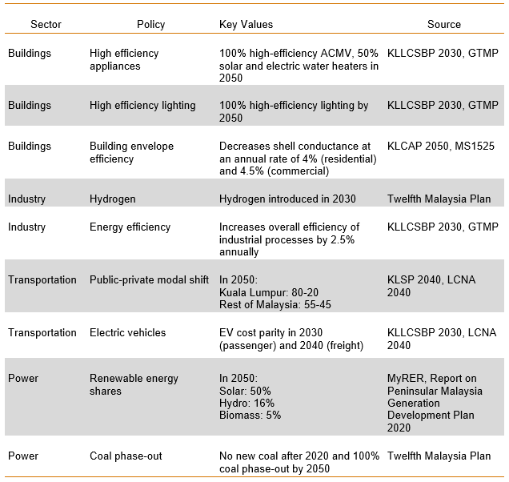
```

<br>

The following subsections give additional technical details and explanations for the policies listed above. 

## High Efficiency Appliances
***

```{r high-eff-appliances-files-table, results = 'show', eval=TRUE, echo=FALSE, warning=FALSE, error = FALSE, message = FALSE}

dt_url <- c("https://github.com/JGCRI/seasia/blob/main/modeling/malaysia/sectoral_policies/buildings_efficient_appliances.xml")

data.frame(
  Scenario = c("Policies, Carbon Neutral")) %>% 
  dplyr:: mutate("Files Used" = cell_spec(c("buildings_efficient_appliances.xml"),
                                          "html", link=dt_url),
                 Description = c("Increase prevelance of high-efficiency technologies through 2050")) %>% 
  kable("html", escape = FALSE, col.names = c("Scenario", "Files Used", "Description")) %>%
  kable_styling(bootstrap_options = c("striped", "hover", "condensed", "responsive")) %>%
  row_spec(0, background = "#2A2A2A", color = "white")

```


<!-------------------------->
<!----------Goal------------>
<!-------------------------->

<div class="warning" style='background-color:#E1F4F5; border-left: solid #1f1f1f 4px; border-radius: 4px; padding:0.7em;'>
<span>
<p style='text-align:center; font-size:24px'>
<b>Goal</b>
</p>

<p style='margin-left:1em;'>
The goal of this policy is to represent an increase in energy efficient technologies in the building sector. 

</p>
</span>
</div>

<br>


<!-------------------------->
<!--------Approach---------->
<!-------------------------->

<div class="warning" style='background-color:#fffae0; border-left: solid #1f1f1f 4px; border-radius: 4px; padding:0.7em;'>
<span>

<p style='text-align:center; font-size:24px'>
<b>Approach</b>
</p>

<p style='margin-left:1em;'>
We can adjust the shareweights for technologies like air conditioners, water heaters, and other appliances to encourage the use of high efficiency technologies and discourage the use of low efficiency appliances. 
</p>


</span>
</div>

<br>

<!-------------------------->
<!--------Background-------->
<!-------------------------->

<!--- TO DO: make background page for lifetime and s-curve-shutdown-decider --->

```{r background shareweights coal, child = 'background_shareweights.rmd'}
```


<!-------------------------->
<!---GCAM Implementation---->
<!-------------------------->

<div class="warning" style='background-color:#F5E5E1; border-left: solid #1f1f1f 4px; border-radius: 4px; padding:0.7em;'>
<span>
<p style='text-align:center; font-size:24px'>
<b>GCAM Implementation</b>
</p>

<p style='margin-left:1em;'>
1. Create a folder in the input directory: `./gcam-core/input/addons`.
2. Download the "[buildings_efficient_appliances.xml](https://github.com/JGCRI/seasia/blob/main/modeling/malaysia/sectoral_policies/buildings_efficient_appliances.xml)" file to the folder.
4. To adjust the year in which the target mix of technologies is achieved: within each `stub-technology` tag in the XML, change the `to-year` in the first `interpolation-rule` and the `from-year` in the second. Also change the `year` of the `period` tag in which the `share-weight` is 0.
5. Save the xml and then point to it in your configuration file by adding the line: 
`<Value name = "scen">../input/addons/malaysia/buildings_efficient_appliances.xml</Value>`

</span>
</div>

<br>   

## Lighting Efficiency
***

```{r lighting-files-table, results = 'show', eval=TRUE, echo=FALSE, warning=FALSE, error = FALSE, message = FALSE}

dt_url <- c("https://github.com/JGCRI/seasia/blob/main/modeling/malaysia/sectoral_policies/buildings_led.xml")

data.frame(
  Scenario = c("Policies, Carbon Neutral")) %>% 
  dplyr:: mutate("Files Used" = cell_spec(c("buildings_led.xml"),
                                          "html", link=dt_url),
                 Description = c("Gradually phases non-LED residential lighting technology out of the market by 2050")) %>% 
  kable("html", escape = FALSE, col.names = c("Scenario", "Files Used", "Description")) %>%
  kable_styling(bootstrap_options = c("striped", "hover", "condensed", "responsive")) %>%
  row_spec(0, background = "#2A2A2A", color = "white")

```


<!-------------------------->
<!----------Goal------------>
<!-------------------------->

<div class="warning" style='background-color:#E1F4F5; border-left: solid #1f1f1f 4px; border-radius: 4px; padding:0.7em;'>
<span>
<p style='text-align:center; font-size:24px'>
<b>Goal</b>
</p>

<p style='margin-left:1em;'>
The goal of this policy is to represent increasing use of LED lighting in residential buildings and the decreasing use of other less energy efficient lighting technologies. 

</p>
</span>
</div>

<br>


<!-------------------------->
<!--------Approach---------->
<!-------------------------->

<div class="warning" style='background-color:#fffae0; border-left: solid #1f1f1f 4px; border-radius: 4px; padding:0.7em;'>
<span>

<p style='text-align:center; font-size:24px'>
<b>Approach</b>
</p>

<p style='margin-left:1em;'>
We can gradually decrease the shareweights of all non-LED residential lighting technologies in order to phase them out of the market. The year in which the non-LED shareweights reach 0 corresponds with the year in which 100% LED residential lighting is achieved.
</p>

</span>
</div>

<br>


<!-------------------------->
<!--------Background-------->
<!-------------------------->

```{r background shareweights lighting, child = 'background_shareweights.rmd'}
```


<!-------------------------->
<!---GCAM Implementation---->
<!-------------------------->

<div class="warning" style='background-color:#F5E5E1; border-left: solid #1f1f1f 4px; border-radius: 4px; padding:0.7em;'>
<span>
<p style='text-align:center; font-size:24px'>
<b>GCAM Implementation</b>
</p>

<p style='margin-left:1em;'>
1. Create a folder in the input directory: `./gcam-core/input/addons`.
2. Download the "[buildings_led.xml](https://github.com/JGCRI/seasia/blob/main/modeling/malaysia/sectoral_policies/buildings_led.xml)" file to the folder.
4. To adjust the year in which 100% LED lighting is achieved: within each non-LED `stub-technology` tag in the XML, change the `to-year` in the first `interpolation-rule` and the `from-year` in the second. Also change the `year` of the `period` tag in which the `share-weight` is 0.
5. Save the xml and then point to it in your configuration file by adding the line: 
`<Value name = "scen">../input/addons/malaysia/buildings_led.xml</Value>`

</span>
</div>

<br>   

## Building Envelope Efficiency
***

```{r shell files table, results = 'show', eval=TRUE, echo=FALSE, warning=FALSE, error = FALSE, message = FALSE}

dt_url <- c("https://github.com/JGCRI/seasia/blob/main/modeling/malaysia/sectoral_policies/buildings_shell_eff.xml")

data.frame(
  Scenario = c("Policies, Carbon Neutral")) %>% 
  mutate("Files Used" = cell_spec( c("buildings_shell_eff.xml"),
                                   "html", link = dt_url)) %>% 
  mutate(Description = c("Decreases shell conductance from 3.75 in 2020 to 0.487 (residential) / 0.375 (commercial) in 2070 at an annual rate of 4% (residential) / 4.5% (commercial)")) %>%
  kable("html", escape = FALSE, col.names = c("Scenario", "Files Used", "Description")) %>%
  kable_styling(bootstrap_options = c("striped", "hover", "condensed", "responsive")) %>%
  row_spec(0, background = "#2A2A2A", color = "white")

```


<!-------------------------->
<!----------Goal------------>
<!-------------------------->

<div class="warning" style='background-color:#E1F4F5; border-left: solid #1f1f1f 4px; border-radius: 4px; padding:0.7em;'>
<span>
<p style='text-align:center; font-size:24px'>
<b>Goal</b>
</p>

<p style='margin-left:1em;'>
The goal of this example is to represent increasing compliance with the envelope efficiency component of building energy codes.

</p>
</span>
</div>

<br>


<!-------------------------->
<!--------Approach---------->
<!-------------------------->

<div class="warning" style='background-color:#fffae0; border-left: solid #1f1f1f 4px; border-radius: 4px; padding:0.7em;'>
<span>

<p style='text-align:center; font-size:24px'>
<b>Approach</b>
</p>
We can use GCAM's `shell-conductance` parameter to represent an increase in the average building envelope efficiency according to building energy codes.
<p style='margin-left:1em;'>

</p>


</span>
</div>

<br>


<!-------------------------->
<!--------Background-------->
<!-------------------------->

```{r background cooling demand, child = 'background_coolingDemand.rmd'}
```


<!-------------------------->
<!---GCAM Implementation---->
<!-------------------------->

<div class="warning" style='background-color:#F5E5E1; border-left: solid #1f1f1f 4px; border-radius: 4px; padding:0.7em;'>
<span>
<p style='text-align:center; font-size:24px'>
<b>GCAM Implementation</b>
</p>

<p style='margin-left:1em;'>
1. Create a folder in the input directory: `./gcam-core/input/addons`.
2. Download the "[buildings_shell_eff.xml](https://github.com/JGCRI/seasia/blob/main/modeling/malaysia/sectoral_policies/buildings_shell_eff.xml)" file to the folder.
4. To make custom adjustments: within each `gcam-consumer` tag in the XML, specify the desired `shell-conductance` values for each year.
5. Save the xml and then point to it in your configuration file by adding the line: 
`<Value name = "scen">../input/addons/malaysia/buildings_shell_eff.xml</Value>`

</span>
</div>

<br>

## Hydrogen in Industry
***
```{r industry h2 files table, results = 'show', eval=TRUE, echo=FALSE, warning=FALSE, error = FALSE, message = FALSE}
library(kableExtra); library(dplyr)

dt_url <- c("https://github.com/JGCRI/seasia/blob/main/modeling/malaysia/sectoral_policies/industry_h2.xml")

data.frame(
  Scenario = c("Policies, Carbon Neutral")) %>% 
  mutate("Files Used" = cell_spec( c("industry_h2.xml"),
                                   "html", link = dt_url)) %>% 
  mutate(Description = c("Phases hydrogen industrial technologies into the market in 2030")) %>%
  kable("html", escape = FALSE, col.names = c("Scenario", "Files Used", "Description")) %>%
  kable_styling(bootstrap_options = c("striped", "hover", "condensed", "responsive")) %>%
  row_spec(0, background = "#2A2A2A", color = "white")
```


<!-------------------------->
<!----------Goal------------>
<!-------------------------->

<div class="warning" style='background-color:#E1F4F5; border-left: solid #1f1f1f 4px; border-radius: 4px; padding:0.7em;'>
<span>
<p style='text-align:center; font-size:24px'>
<b>Goal</b>
</p>

<p style='margin-left:1em;'>
The goal of this policy is to represent a phase-in of industrial technologies that use hydrogen as a fuel source. 

</p>
</span>
</div>

<br>


<!-------------------------->
<!--------Approach---------->
<!-------------------------->

<div class="warning" style='background-color:#fffae0; border-left: solid #1f1f1f 4px; border-radius: 4px; padding:0.7em;'>
<span>

<p style='text-align:center; font-size:24px'>
<b>Approach</b></p>

<p style='margin-left:1em;'>
To represent a phase-in of hydrogen technologies, we can gradually increase their shareweights.
</p>


</span>
</div>

<br>


<!--------------------------->
<!--------Background--------->
<!--------------------------->

```{r backgroud shareweights industry h2, child = 'background_shareweights.rmd'}
```

<!-------------------------->
<!---GCAM Implementation---->
<!-------------------------->

<div class="warning" style='background-color:#F5E5E1; border-left: solid #1f1f1f 4px; border-radius: 4px; padding:0.7em;'>
<span>
<p style='text-align:center; font-size:24px'>
<b>GCAM Implementation</b>
</p>

<p style='margin-left:1em;'>
1. Create a folder in the input directory: `./gcam-core/input/addons`.
2. Download the "[industry_h2.xml](https://github.com/JGCRI/seasia/blob/main/modeling/malaysia/sectoral_policies/industry_h2.xml)" file to the folder.
4. To adjust how quickly hydrogen technologies are phased into the market: within each `subsector` tag in the XML, change the `to-year` in the  `interpolation-rule`. Also change the `year` of the `period` tag in which the `share-weight` is 1. Be sure that these years match. An earlier year corresponds to a faster phase-in.
5. Save the xml and then point to it in your configuration file by adding the line: 
`<Value name = "scen">../input/addons/malaysia/industry_h2.xml</Value>`
</p>

</span>
</div>

<br>

## Industry Energy Efficiency
***

```{r industry-aeei-files-table, results = 'show', eval=TRUE, echo=FALSE, warning=FALSE, error = FALSE, message = FALSE}

dt_url <- c("https://github.com/JGCRI/seasia/blob/main/modeling/malaysia/sectoral_policies/industry_aeei.xml")

data.frame(
  Scenario = c("Policies, Carbon Neutral")) %>% 
  mutate("Files Used" = cell_spec( c("industry_aeei.xml"),
                                   "html", link = dt_url)) %>% 
  mutate(Description = c("Increases overall efficiency of industrial processes by 2.5% annually through 2070")) %>%
  kable("html", escape = FALSE, col.names = c("Scenario", "Files Used", "Description")) %>%
  kable_styling(bootstrap_options = c("striped", "hover", "condensed", "responsive")) %>%
  row_spec(0, background = "#2A2A2A", color = "white")
```


<!-------------------------->
<!----------Goal------------>
<!-------------------------->

<div class="warning" style='background-color:#E1F4F5; border-left: solid #1f1f1f 4px; border-radius: 4px; padding:0.7em;'>
<span>
<p style='text-align:center; font-size:24px'>
<b>Goal</b>
</p>

<p style='margin-left:1em;'>
The goal of this policy is to represent measures to increase average efficiency of industrial processes.
</p>

</span>
</div>

<br>


<!-------------------------->
<!--------Approach---------->
<!-------------------------->

<div class="warning" style='background-color:#fffae0; border-left: solid #1f1f1f 4px; border-radius: 4px; padding:0.7em;'>
<span>

<p style='text-align:center; font-size:24px'>
<b>Approach</b>
</p>

<p style='margin-left:1em;'>
To represent a gradual increase in industrial efficiency, we can use GCAM's `aeei` parameter, which controls the autonomous energy efficiency improvement (AEEI) of industrial processes.
</p>


</span>
</div>

<br>


<!--------------------------->
<!--------Background--------->
<!--------------------------->

<!-- TO DO: make background page for aeei -->

```{r background aeei industry}
```

<!-------------------------->
<!---GCAM Implementation---->
<!-------------------------->

<div class="warning" style='background-color:#F5E5E1; border-left: solid #1f1f1f 4px; border-radius: 4px; padding:0.7em;'>
<span>
<p style='text-align:center; font-size:24px'>
<b>GCAM Implementation</b>
</p>

<p style='margin-left:1em;'>
1. Create a folder in the input directory: `./gcam-core/input/addons`.
2. Download the "[industry_aeei.xml](https://github.com/JGCRI/seasia/blob/main/modeling/malaysia/sectoral_policies/industry_aeei.xml)" file to the folder.
4. To adjust the rate of industrial energy efficiency increase, change the value of the `aeei` tag for each desired year.
5. Save the xml and then point to it in your configuration file by adding the line: 
`<Value name = "scen">../input/addons/malaysia/industry_aeei.xml</Value>`
</p>

</span>
</div>

<br>

## Public/Private Vehicle Modal Shift
***

```{r modal-shift-files-table, results = 'show', eval=TRUE, echo=FALSE, warning=FALSE, error = FALSE, message = FALSE}
dt_url <- c("https://github.com/JGCRI/seasia/blob/main/modeling/malaysia/sectoral_policies/trn_modal_shift.xml")

data.frame(
  Scenario = c("Policies, Carbon Neutral")) %>% 
  mutate("Files Used" = cell_spec(c("trn_modal_shift.xml"),
                                   "html", link = dt_url)) %>% 
  mutate(Description = c("Increases ratio of public to private transportation to 50-50 in Kuala Lumpur and 42-58 in the rest of the country in 2050")) %>%
  kable("html", escape = FALSE, col.names = c("Scenario", "Files Used", "Description")) %>%
  kable_styling(bootstrap_options = c("striped", "hover", "condensed", "responsive")) %>%
  row_spec(0, background = "#2A2A2A", color = "white")

```


<!-------------------------->
<!----------Goal------------>
<!-------------------------->

<div class="warning" style='background-color:#E1F4F5; border-left: solid #1f1f1f 4px; border-radius: 4px; padding:0.7em;'>
<span>
<p style='text-align:center; font-size:24px'>
<b>Goal</b>
</p>

<p style='margin-left:1em;'>
The goal of this policy is to increase the shares of public transportation methods relative to private transportation. 

</p>
</span>
</div>

<br>


<!-------------------------->
<!--------Approach---------->
<!-------------------------->

<div class="warning" style='background-color:#fffae0; border-left: solid #1f1f1f 4px; border-radius: 4px; padding:0.7em;'>
<span>

<p style='text-align:center; font-size:24px'>
<b>Approach</b></p>

<p style='margin-left:1em;'>
FILL IN HERE
</p>


</span>
</div>

<br>


<!--------------------------->
<!--------Background--------->
<!--------------------------->

<!-------------------------->
<!---GCAM Implementation---->
<!-------------------------->

<div class="warning" style='background-color:#F5E5E1; border-left: solid #1f1f1f 4px; border-radius: 4px; padding:0.7em;'>
<span>
<p style='text-align:center; font-size:24px'>
<b>GCAM Implementation</b>
</p>

<p style='margin-left:1em;'>
1. Create a folder in the input directory: `./gcam-core/input/addons`.
2. Download the "[trn_modal_shift.xml](https://github.com/JGCRI/seasia/blob/main/modeling/malaysia/sectoral_policies/trn_modal_shift.xml)" file to the folder.
4. To make custom adjustments _______________.
5. Save the xml and then point to it in your configuration file by adding the line: 
`<Value name = "scen">../input/addons/malaysia/trn_modal_shift.xml</Value>`
</p>

</span>
</div>

<br>


## EV Cost Parity
***

```{r EV cost parity files table, results = 'show', eval=TRUE, echo=FALSE, warning=FALSE, error = FALSE, message = FALSE}
dt_url <- c("https://github.com/JGCRI/seasia/blob/main/modeling/malaysia/sectoral_policies/trn_ev_cost_parity.xml")

data.frame(
  Scenario = c("Policies, Carbon Neutral")) %>% 
  mutate("Files Used" = cell_spec(c("trn_ev_cost_parity.xml"),
                                   "html", link = dt_url)) %>% 
  mutate(Description = c("Reduces EV costs to reach cost parity with liquids vehicles by 2030 (passenger) and 2040 (freight)")) %>%
  kable("html", escape = FALSE, col.names = c("Scenario", "Files Used", "Description")) %>%
  kable_styling(bootstrap_options = c("striped", "hover", "condensed", "responsive")) %>%
  row_spec(0, background = "#2A2A2A", color = "white")
```


<!-------------------------->
<!----------Goal------------>
<!-------------------------->

<div class="warning" style='background-color:#E1F4F5; border-left: solid #1f1f1f 4px; border-radius: 4px; padding:0.7em;'>
<span>
<p style='text-align:center; font-size:24px'>
<b>Goal</b>
</p>

<p style='margin-left:1em;'>
The goal of this policy is represent measures to make EVs more competitive with combustion engine vehicles (CEV). 

</p>
</span>
</div>

<br>


<!-------------------------->
<!--------Approach---------->
<!-------------------------->

<div class="warning" style='background-color:#fffae0; border-left: solid #1f1f1f 4px; border-radius: 4px; padding:0.7em;'>
<span>

<p style='text-align:center; font-size:24px'>
<b>Approach</b></p>

<p style='margin-left:1em;'>
To represent EV promotion, we use an approach that decreases the cost of EVs relative to CEVs, until the two technologies reach cost parity in some future year. We can do this using GCAM's `input-cost` parameter, which represents the non-energy costs of a given technology.
</p>


</span>
</div>

<br>


<!--------------------------->
<!--------Background--------->
<!--------------------------->

```{r background transport input cost, child = 'background_transportCost.rmd'}
```


<!-------------------------->
<!---GCAM Implementation---->
<!-------------------------->

<div class="warning" style='background-color:#F5E5E1; border-left: solid #1f1f1f 4px; border-radius: 4px; padding:0.7em;'>
<span>
<p style='text-align:center; font-size:24px'>
<b>GCAM Implementation</b>
</p>

<p style='margin-left:1em;'>
1. Create a folder in the input directory: `./gcam-core/input/addons`.
2. Download the "[trn_ev_cost_parity.xml](https://github.com/JGCRI/seasia/blob/main/modeling/malaysia/sectoral_policies/trn_ev_cost_parity.xml" file to the folder.
4. To make custom adjustments to the EV cost trajectory, set the desired `input-cost` for each year within each`stub-technology` tag in the cost parity xml file.
5. Save the xml and then point to it in your configuration file by adding the line: 
`<Value name = "scen">../input/addons/malaysia/trn_ev_cost_parity.xml</Value>`
</p>

</span>
</div>

<br>


## Electricity Generation Mix
***

```{r electricity-generation-files-table, results = 'show', eval = TRUE, echo = FALSE, warning = FALSE, error = FALSE, message = FALSE}

dt_url <- c("https://github.com/JGCRI/seasia/blob/main/modeling/malaysia/sectoral_policies/elec_gen_shares.xml",
            "https://github.com/JGCRI/seasia/blob/main/modeling/malaysia/sectoral_policies/elec_hydro.xml")

data.frame(
  Scenario = c("Policies, Carbon Neutral", "Policies, Carbon Neutral")) %>% 
  dplyr::mutate("Files Used" = cell_spec(c("elec_gen_shares.xml", "elec_hydro.xml"),
                                          "html", link=dt_url),
                 Description = c("Sets floors for renewable electricity generation technologies",
                                 "Sets exogenous hydropower generation")) %>% 
  kable("html", escape = FALSE, col.names = c("Scenario", "Files Used", "Description")) %>%
  kable_styling(bootstrap_options = c("striped", "hover", "condensed", "responsive")) %>%
  row_spec(0, background = "#2A2A2A", color = "white")
```


<!-------------------------->
<!----------Goal------------>
<!-------------------------->

<div class="warning" style='background-color:#E1F4F5; border-left: solid #1f1f1f 4px; border-radius: 4px; padding:0.7em;'>
<span>
<p style='text-align:center; font-size:24px'>
<b>Goal</b>
</p>

<p style='margin-left:1em;'>
The goal of this example is to set a minimum value (floor) in GCAM for the amount of electricity generation from three renewable energy technologies (solar, hydro, and biomass) corresponding with the planned percentages in the KLLCSBP2030 (below).

<p align="center"> </p>

</p>
</span>
</div>

<br>


<!-------------------------->
<!--------Approach---------->
<!-------------------------->

<div class="warning" style='background-color:#fffae0; border-left: solid #1f1f1f 4px; border-radius: 4px; padding:0.7em;'>
<span>

<p style='text-align:center; font-size:24px'>
<b>Approach</b>
</p>

<p style='margin-left:1em;'>
One way to set a generation floor for each fuel type in GCAM is to use a subsidy policy. This will lower the cost of the electricity generation technology until the floor is reached. If there is more demand for electricity than is supplied by the sum of the generation floors, then the remaining demand will be met by a mix of fuels determined by the market.

Hydropower is exogenous in GCAM and has a fixed pathway. The power generation values for this technology are set explicitly using a fixed output add-on XML. 

</p>
</span>
</div>

<br>


<!-------------------------->
<!--------Background-------->
<!-------------------------->

```{r background policy-portfolio-standards RE, child = 'background_policy-portfolio-standards.rmd'}
```

<!-------------------------->
<!---GCAM Implementation---->
<!-------------------------->

<div class="warning" style='background-color:#F5E5E1; border-left: solid #1f1f1f 4px; border-radius: 4px; padding:0.7em;'>
<span>
<p style='text-align:center; font-size:24px'>
<b>GCAM Implementation</b>
</p>

<p style='margin-left:1em;'>
1. Create a folder in the input directory eg. `./gcam-core/input/addons/malaysia`.
2. Download the "[elec_gen_shares.xml](https://github.com/JGCRI/seasia/blob/main/modeling/malaysia/sectoral_policies/elec_gen_shares.xml)" file to the folder.
3. To make adjustments: within each `policy-portfolio-standard` tag in the XML, adjust the following:
</p>
<ul style='margin-left:4em; text-align:left;'>
<li>`constraint` for each year in which a floor is desired</li>
<li>Set `min-price` to a large negative value for years in which an exact constraint, rather than a floor, is desired</li>
</ul>
<p style='margin-left:1em;'>
4. Within each `supplysector` tag in the XML, make sure that the corresponding `input-subsidy` is added within each relevant `period` for each `stub-technology` you wish to constrain.
5. To adjust the hydropower pathway, download the 
"[elec_hydro.xml](https://github.com/JGCRI/seasia/blob/main/modeling/malaysia/sectoral_policies/elec_hydro)" file to the folder. 
6. Within each `fixedOutput` tag in the XML, adjust the value to reflect desired hydropower output in each period. The user can also add additional periods. 
7. Save the XMLs and then point to them in your configuration file by adding the lines: 
`<Value name = "scen">../input/addons/malaysia/elec_gen_shares.xml</Value>`
`<Value name = "scen">../input/addons/malaysia/elec_hydro.xml</Value>`
</p>

</span>
</div>

<br>

## Coal Phase-Out
***

```{r coal-phaseout-files-table, results = 'show', eval=TRUE, echo=FALSE, warning=FALSE, error = FALSE, message = FALSE}

dt_url <- c("https://github.com/JGCRI/seasia/blob/main/modeling/malaysia/sectoral_policies/elec_no_new_coal.xml",
            "https://github.com/JGCRI/seasia/blob/main/modeling/malaysia/sectoral_policies/elec_coal_shutdown.xml")

data.frame(
  Scenario = c("Policies, Carbon Neutral", "Policies, Carbon Neutral")) %>% 
  dplyr:: mutate("Files Used" = cell_spec(c("elec_no_new_coal.xml",
                                            "elec_coal_shutdown.xml"),
                                          "html", link=dt_url),
                 Description = c("Prevents additional coal capacity from being built starting in 2020",
                                 "Retires existing coal capacity; all coal is retired by 2050")) %>% 
  kable("html", escape = FALSE, col.names = c("Scenario", "Files Used", "Description")) %>%
  kable_styling(bootstrap_options = c("striped", "hover", "condensed", "responsive")) %>%
  row_spec(0, background = "#2A2A2A", color = "white")
```


<!-------------------------->
<!----------Goal------------>
<!-------------------------->

<div class="warning" style='background-color:#E1F4F5; border-left: solid #1f1f1f 4px; border-radius: 4px; padding:0.7em;'>
<span>
<p style='text-align:center; font-size:24px'>
<b>Goal</b>
</p>

<p style='margin-left:1em;'>
The goal of this example is to phase out coal from Malaysia's electricity generation capacity. Note that this policy only applies at the national level.

</p>
</span>
</div>

<br>


<!-------------------------->
<!--------Approach---------->
<!-------------------------->

<div class="warning" style='background-color:#fffae0; border-left: solid #1f1f1f 4px; border-radius: 4px; padding:0.7em;'>
<span>

<p style='text-align:center; font-size:24px'>
<b>Approach</b>
</p>

<p style='margin-left:1em;'>
There are two steps to phase out coal generation. The first is to prevent any new coal capacity from being built; we do this by setting coal shareweights to 0 in all future years. The second step is to gradually retire all existing coal capacity; we do this by shortening coal technologies' lifetimes and by assigning a shutdown curve to each technology.

</p>
</span>
</div>

<br>


<!-------------------------->
<!--------Background-------->
<!-------------------------->

<!--- TO DO: make background page for lifetime and s-curve-shutdown-decider --->

```{r background shareweights coal, child = 'background_shareweights.rmd'}
```

```{r background retirement coal, child = 'background_retirement.rmd'}
```


<!-------------------------->
<!---GCAM Implementation---->
<!-------------------------->

<div class="warning" style='background-color:#F5E5E1; border-left: solid #1f1f1f 4px; border-radius: 4px; padding:0.7em;'>
<span>
<p style='text-align:center; font-size:24px'>
<b>GCAM Implementation</b>
</p>

<p style='margin-left:1em;'>
1. Create a folder in the input directory eg. `./gcam-core/input/addons`.
2. Download the "[elec_no_new_coal.xml](https://github.com/JGCRI/seasia/blob/main/modeling/malaysia/sectoral_policies/elec_no_new_coal.xml)" and  "[elec_coal_shutdown.xml](https://github.com/JGCRI/seasia/blob/main/modeling/malaysia/sectoral_policies/elec_coal_shutdown.xml)" files to the folder.
4. To make custom adjustments to the coal retirement trajectory, optionally change the following within each `stub-technology` tag in the retirement XML:
</p>

<ul style='margin-left:4em; text-align:left;'>
<li>Use `lifetime` to adjust the year in which the coal phase-out is complete; the phase-out will be complete `x` years after 2015, where `x` is the `lifetime`. </li>
<li>Use the `steepness` and `half-life` within the `s-curve-shutdown-decider` to adjust the phaseout trajectory; a smaller `half-life` and larger `steepness` will result in a faster phase-out.</li>
</ul>
<p style='margin-left:1em;'>
5. Save the xmls and then point to them in your configuration file by adding the lines: 
`<Value name = "scen">../input/addons/malaysia/elec_no_new_coal.xml</Value>`
`<Value name = "scen">../input/addons/malaysia/elec_coal_shutdown.xml</Value>`

</p>

</span>
</div>

<br>

# Net-Zero & Carbon Netural
<!-------------------------->
<!-------------------------->

```{r emissions constraints files table, results = 'show', eval=TRUE, echo=FALSE, warning=FALSE, error = FALSE, message = FALSE}

# in the dt_url vector, add link(s) to the relevant XML file(s) used to run the policy. 
# also add the files to their corresponding directories in the repo.
dt_url <- c("https://github.com/JGCRI/seasia/blob/main/modeling/malaysia/sectoral_policies/NetZeroC_Malaysia_2035_2050",
            "https://github.com/JGCRI/seasia/blob/main/modeling/malaysia/sectoral_policies/Malaysia_LUC", "https://github.com/JGCRI/seasia/blob/main/modeling/malaysia/sectoral_policies/NetZeroC_global_noMalaysia", "https://github.com/JGCRI/seasia/blob/main/modeling/malaysia/sectoral_policies/ROW_LUC_noMalaysia")

# add scenario names, filenames, and descriptions of files to this table.
# make sure info in this table matches the links provided above (in the same order).
data.frame(
  Scenario = c(rep("Carbon Neutral", 4))) %>% 
  mutate("Files Used" = cell_spec( c("NetZeroC_Malaysia_2035_2050", "Malaysia_LUC", 
                                     "NetZeroC_global_noMalaysia_2050", "ROW_LUC_noMalaysia"),
                                   "html", link = dt_url)) %>% 
  mutate(Description = c("CO2 emissions constraint for Malaysia (2035 - 2050)",
                         "GHG link file for Malaysia for land use change emissions", 
                         "CO2 emissions constraint for the rest of the World (2050)",
                         "GHG link file for land use change emissions for the rest of the world")) %>%
  kable("html", escape = FALSE, col.names = c("Scenario", "Files Used", "Description")) %>%
  kable_styling(bootstrap_options = c("striped", "hover", "condensed", "responsive")) %>%
  row_spec(0, background = "#2A2A2A", color = "white")
```

<!-------------------------->
<!----------Goal------------>
<!-------------------------->

<div class="warning" style='background-color:#E1F4F5; border-left: solid #1f1f1f 4px; border-radius: 4px; padding:0.7em;'>
<span>
<p style='text-align:center; font-size:24px'>
<b>Goal</b>
</p>
<p style='margin-left:1em;'>
The aim of this example is to demonstrate how to apply an economy-wide emissions constraint for Malaysia in accord with its national goals: net-zero CO~2~ as early as 2050.
</p>
</span>
</div>

<br>


<!-------------------------->
<!--------Approach---------->
<!-------------------------->

<div class="warning" style='background-color:#fffae0; border-left: solid #1f1f1f 4px; border-radius: 4px; padding:0.7em;'>
<span>

<p style='text-align:center; font-size:24px'>
<b>Approach</b></p>

<p style='margin-left:1em;'>
In GCAM, an emissions constraint can be accomplished by using a `ghgpolicy`, which is a special case of policy-portfolio-standard that applies to emissions.


</p>

</span>
</div>

<br>


<!--------------------------->
<!--------Background--------->
<!--------------------------->

<div class="warning" style='background-color:#EFFFC9; border-left: solid #1f1f1f 4px; border-radius: 4px; padding:0.7em;'>
<span>

<p style='text-align:center; font-size:24px'>
<b>Background</b></p>

<p style='margin-left:1em;'>
To implement a `ghgpolicy` in GCAM, users specify the total amount of emissions (CO~2~ or GHG) in a time period. GCAM will then calculate the price on carbon needed to reach the constraint in each period.  GCAM finds the least-cost pathway in terms of technology deployment to satisfy the emissions constraint. An economy-wide constraint can be used by itself, or in combination with additional sectoral policies described above.  


There are some important considerations: (1) What GHGs are included in the constraint (e.g., only CO~2~)?, (2) What is the time period for the constraint (e.g., 2050, 2065)?, (3) What are the emissions in each period?, (4) Will emissions decline linearly to zero or will another rate be specified?, (5) Will land use change emissions be included in the constraint?, and (6) What assumptions are made for emissions in the rest of the world?  This latter point is important when considering "carbon leakage," that is, how restrictions in emissions in one geography may lead to a shift in carbon-intensive activities to other locations. Below, we will describe how to implement a CO~2~ emissions constraint. See the [GCAM Policies](http://jgcri.github.io/gcam-doc/policies.html#emissions-policies) documentation for more information.
</p>
</span>
</div>

<br>

<!-------------------------->
<!---GCAM Implementation---->
<!-------------------------->

<div class="warning" style='background-color:#F5E5E1; border-left: solid #1f1f1f 4px; border-radius: 4px; padding:0.7em;'>
<span>
<p style='text-align:center; font-size:24px'>
<b>GCAM Implementation</b>
</p>

<p style='margin-left:1em;'>
1. Create a folder in the input directory: `./gcam-core/input/addons`.
<!---include links to example XMLs here--->
2. Download the emissions constraint xml file(s) for Malaysia:
"[NetZeroC_Malaysia_2035_2050](https://github.com/JGCRI/seasia/blob/main/modeling/malaysia/sectoral_policies/NetZeroC_Malaysia_2035_2050)" and "[Malaysia_LUC](https://github.com/JGCRI/seasia/blob/main/modeling/malaysia/sectoral_policies/malaysia_LUC)", as well as those for the rest of the world (ROW), "[NetZeroC_global_noMalaysia_2050](https://github.com/JGCRI/seasia/blob/main/modeling/malaysia/sectoral_policies/NetZeroC_global_noMalaysia_2050)" and "[ROW_LUC_noMalaysia](https://github.com/JGCRI/seasia/blob/main/modeling/malaysia/sectoral_policies/ROW_LUC_noMalaysia)."

3. The first file, `NetZeroC_Malaysia_2035_2050`, specifies emissions in units of tonnes of carbon (_not CO~2~_) in each period. One way to determine the emissions constraint for each period is to examine the CO~2~ emissions in the reference case (See ModelInterface: "CO~2~ emissions by region"). Based on the reference emissions, one can create an emissions constraint accordingly, depending on the start date of the emissions constraint, end goal, and steepness of the decrease in emissions. 

4. You will notice that the constraint starts in 2035. We want to first incorporate the pathway for Malaysia's Nationally Determined Contribution (NDC) from 2020 to 2030. Malaysia's NDC includes a target to reduce its greenhouse gas (GHG) emissions intensity of GDP by 45% by 2030 relative to the emissions intensity of GDP in 2005. When we examine GHG emissions (See ModelInterface: "nonCO~2~ emissions by region") and GDP (See ModelInterface: "GDP MER by region"), we see that this target is met without any additional policy in the reference scenario. Thus, we only need to start our constraint in 2035.  We specify a linear decrease to 0 tonnes of C in 2050. 

5. We adopt a similar approach for the ROW, using the total emissions (tC) in 2020 for all countries as a starting point. (We did not subtract out Malaysia's emissions, as they are quite small globally). It is not absolutely necessary to adopt the very same emissions constraint for the ROW, but the constraint should be strong enough to avoid carbon leakage from Malaysia' net-zero policy.

6. One needs to decide whether and how land use change emissions are incorporated into the constraint. GCAM accounts for fossil fuel and industry CO~2~ emissions separately from land use change CO~2~ emissions. The `Malaysia_LUC.xml` specifies how land use change CO~2~ emissions (LUC-CO~2~) in Malaysia are linked to the ghgpolicy ("CO~2~"). There are two parameters: `price-adjust` and `demand-adjust`. Price-adjust is used to convert prices for different GHG's. A price-adjust of 1.0 for LUC-CO~2~ means the market price on LUC-CO~2~ emissions is the same as the price applied to fossil fuel and industry CO~2~ emissions. A demand-adjust of 1 means that LUC-CO~2~ emissions are counted in the emissions constraint. These two parameters can be adjusted. In the sample files we have a price-adjust of 0, and a demand-adjust of 1. This can be modified depending on the goal and importance of LUC emissions. Note that Malaysia is removed from the `ROW_LUC_noMalaysia.xml`.

7. Save the xml files and then point to them in your configuration file by adding the lines: 
<!---insert exmaple XML filenames--->
`<Value name = "scen">../input/addons/malaysia/NetZeroC_Malaysia_2035_2050.xml</Value>`
`<Value name = "scen">../input/addons/malaysia/Malaysia_LUC.xml</Value>`
`<Value name = "scen">../input/addons/malaysia/NetZeroC_global_noMalaysia_2050.xml</Value>`
`<Value name = "scen">../input/addons/malaysia/ROW_LUC_noMalaysia.xml</Value>`
</p>
</p>

</span>
</div>

<br>


<!-------------------------->
<!-------------------------->
<!-------------------------->
# Diagnostics
<!-------------------------->
<!-------------------------->
<!-------------------------->
<p align="center"> </p>

This section describes how to explore and compare the final output data using GCAM-specific post-processing tools.

<!-------------------------->
<!-------------------------->
## Extract GCAM Data
<!-------------------------->
<!-------------------------->
***

`gcamextractor` is an R package used to extract and process GCAM data and manipulate into standardized tables. `gcamextractor` converts GCAM outputs into commonly used units and aggregates across different classes and sectors for easy use in plots, maps, and tables. For more information, please reference the documentation page found [here](https://jgcri.github.io/gcamextractor/index.html).

The first step is to create a path to the GCAM database, found in the output folder of your GCAM folder, and a list of desired parameters. The `readgcam()` function also requires region names and a specific output folder. 
Note that due to size limiations on GitHub, the data used here has already been processed, but we include the steps to run it on your own in the following chunk if desired.

```{r gcamextractor-setup, echo = TRUE, eval = FALSE, class.source = 'fold-show'}
# Get desired database paths
bau_db <- "../data/malaysia/output/malaysia_bau"
policies_db <- "../data/malaysia/output/malaysia_policies"
carbon_neutral_db <- "../data/malaysia/output/malaysia_carbon_neutral"

paths <- c(bau_db, policies_db, carbon_neutral_db)

# Choose parameters of interest
params <- c("elecByTechTWh", "elecConsumByDemandSectorTWh",
            "emissCO2BySectorNoBio", "emissGHGBySectorGWPAR5", "emissGHGByGasGWPAR5",
            "energyFinalByFuelEJ", "energyFinalConsumBySecEJ", "energyPrimaryByFuelEJ",
            "energyFinalSubsecBySectorBuildEJ", "energyFinalSubsecByFuelBuildEJ",
            "energyFinalSubsecByFuelIndusEJ",
            "transportFreightVMTByMode", "transportPassengerVMTByMode",
            "transportFreightVMTByFuel", "transportPassengerVMTByFuel",
            "transportPassengerVMTByTech", "transportFreightVMTByTech",
            "buildingFloorspace", "gdp", "gdpPerCapita", "pop")

# Identify regions
regions <- c("Malaysia", "KualaLumpur", "Rest of Malaysia")

# Loop through each database to get gcamextractor output
for(p in paths){
  gcamextractor::readgcam(gcamdatabase = p,
                          regionsSelect = regions,
                          regionsAggregate = list(regions),
                          regionsAggregateNames = "All of Malaysia",
                          paramsSelect = params,
                          folder = paste0("../data/malaysia/gcamextractor/", tail(strsplit(p, "/")[[1]],1)))
}

```


```{r gcamextractor, echo = TRUE, class.source = 'fold-show'}
bau <- read.csv("../data/malaysia/gcamextractor/malaysia_bau/gcamDataTable_aggClass1.csv") 
policies <- read.csv("../data/malaysia/gcamextractor/malaysia_policies/gcamDataTable_aggClass1.csv")
carbon_neutral <- read.csv("../data/malaysia/gcamextractor/malaysia_carbon_neutral/gcamDataTable_aggClass1.csv")

malaysia <- bind_rows(bau, policies, carbon_neutral) %>%
  filter(region != ("Rest of Malaysia"),
         x > 2000, x <= 2050)

malaysia$scenario <- factor(malaysia$scenario, 
                            levels = c("Ref", "High", "High_CarbonNeutral"),
                            labels = c("Business as Usual", "Policies", "Net Zero"))

# Define reference scenario
REF_SCENARIO <- "Business as Usual"

# Use this to access reference scenario plot
c <- paste0("chart_class_", REF_SCENARIO)

```


```{r extra-figures-processing, echo = FALSE}
# Create/aggregate new buildings parameter
all_data_buildings_aggregate <- malaysia %>%
  dplyr::filter(param == "energyFinalSubsecBySectorBuildEJ") %>%
  dplyr::mutate(class = dplyr::case_when(
    # Urban
    param == "energyFinalSubsecBySectorBuildEJ" & grepl("resid urban air conditioners", class) ~ "residential ACMV",
    param == "energyFinalSubsecBySectorBuildEJ" & grepl("resid urban ventilation", class) ~ "residential ACMV",
    param == "energyFinalSubsecBySectorBuildEJ" & grepl("resid urban refrigerators", class) ~ "residential other appliances",
    param == "energyFinalSubsecBySectorBuildEJ" & grepl("resid urban televisions", class) ~ "residential other appliances",
    param == "energyFinalSubsecBySectorBuildEJ" & grepl("resid urban water heaters", class) ~ "residential water heaters",
    param == "energyFinalSubsecBySectorBuildEJ" & grepl("resid urban other appliances", class) ~ "residential other appliances",
    param == "energyFinalSubsecBySectorBuildEJ" & grepl("resid urban cooking", class) ~ "residential cooking",
    param == "energyFinalSubsecBySectorBuildEJ" & grepl("resid urban lighting", class) ~ "residential lighting",
    # Rural
    param == "energyFinalSubsecBySectorBuildEJ" & grepl("resid rural air conditioners", class) ~ "residential ACMV",
    param == "energyFinalSubsecBySectorBuildEJ" & grepl("resid rural ventilation", class) ~ "residential ACMV",
    param == "energyFinalSubsecBySectorBuildEJ" & grepl("resid rural refrigerators", class) ~ "residential other appliances",
    param == "energyFinalSubsecBySectorBuildEJ" & grepl("resid rural televisions", class) ~ "residential other appliances",
    param == "energyFinalSubsecBySectorBuildEJ" & grepl("resid rural water heaters", class) ~ "residential water heaters",
    param == "energyFinalSubsecBySectorBuildEJ" & grepl("resid rural other appliances", class) ~ "residential other appliances",
    param == "energyFinalSubsecBySectorBuildEJ" & grepl("resid rural cooking", class) ~ "residential cooking",
    param == "energyFinalSubsecBySectorBuildEJ" & grepl("resid rural lighting", class) ~ "residential lighting",
    # Rename commerical sectors for consistency
    param == "energyFinalSubsecBySectorBuildEJ" & grepl("comm cooking", class) ~ "commercial cooking",
    param == "energyFinalSubsecBySectorBuildEJ" & grepl("comm hvac", class) ~ "commercial ACMV",
    param == "energyFinalSubsecBySectorBuildEJ" & grepl("comm lighting", class) ~ "commercial lighting",
    param == "energyFinalSubsecBySectorBuildEJ" & grepl("Commercial Others", class) ~ "commercial other appliances",
    T ~ class)) %>%
  dplyr::group_by(scenario, region, param, class, x) %>%
  dplyr::summarise(value = sum(value)) %>% dplyr::ungroup() %>%
  dplyr::mutate(param = "energyFinalSubsecByAggSectorBuildEJ")

malaysia <- malaysia %>%
  dplyr::bind_rows(all_data_buildings_aggregate)

# Separate commercial and residential buildings
all_data_buildings_commercial <- all_data_buildings_aggregate %>%
  dplyr::filter(grepl("commercial", class)) %>%
  dplyr::mutate(param = "energyFinalSubsecByCommSectorBuildEJ")

all_data_buildings_residential <- all_data_buildings_aggregate %>%
  dplyr::filter(grepl("residential", class)) %>%
  dplyr::mutate(param = "energyFinalSubsecByResidSectorBuildEJ")

malaysia <- malaysia %>%
  dplyr::bind_rows(all_data_buildings_commercial, all_data_buildings_residential)

```

<br>

<!-------------------------->
<!-------------------------->
## Plot Figures 
<!-------------------------->
<!-------------------------->
***

`rchart` is a comprehensive charting package to plot and compare data across scenarios, regions, sectors and time periods in GCAM. The diagnostic figures below were created using `gcamextractor` and `rchart` and include the following parameters:

* Socioeconomics: population, GDP, GDP per capita
* CO~2~ emissions by sector
* Final energy by fuel
* Final energy by sector
* Electricity generation by fuel
* Electricity generation by sector
* Building energy by subsector
* Transportation by mode
* Transportation by fuel
* Industry energy by fuel

To enlarge a figure, please click directly on the image. Click on the image again to close out.

<br>

<!-------------------------->
### Summary Figures {.tabset}
<!-------------------------->
***

<!-------------------------->
#### Socioeconomic Summary {.tabset}
<!-------------------------->
***

```{r rchart-socio, results = 'hide', eval = TRUE, echo = TRUE, warning = FALSE, error = FALSE, message = FALSE}
figure_path <- "./markdown_figs"

socioeconomic_parameters <- c("pop", "gdp", "gdpPerCapita")

socioeconomic <- malaysia %>%
  filter(param %in% socioeconomic_parameters,
         region != "All of Malaysia",
         scenario == REF_SCENARIO) %>%
  mutate(param = units,
         param = case_when(classLabel == "GDP Per Capita" ~ "GDP per Capita (Thous. 1990 USD/per)", T~param)) %>% 
  rchart::chart(save = F, 
                show = F,
                chart_type = "region_absolute",
                folder = figure_path,
                append = "_socioeconomics",
                size_text = 10)

socioeconomic$chart_region_absolute

```


<br> 

<!-------------------------->
#### Emissions by Sector and Gas {.tabset}
<!-------------------------->
***

##### Malaysia and Kuala Lumpur

``` {r rchart-emiss, results = 'hide', eval = TRUE, echo = TRUE, warning = FALSE, error = FALSE, message = FALSE}
co2 <- malaysia %>% filter(param == "emissCO2BySectorNoBio",
                           region != "Malaysia") %>%
  mutate(#value = value * 3.67,
         units = "CO2 Emissions (MTCO2eq)")

malaysia_emissions <- co2 %>%
  mutate(class = case_when(grepl("International",class)~"Transportation",
                           grepl("alumin|desalinated|refining|urban|coal|gas|oil|hydrogen|agricultural|crops",class)~"Industry",
                           TRUE~class)) %>%
  filter(class != "LUC")

```

``` {r rchart-emiss-plot, results = 'hide', eval = TRUE, echo = TRUE, warning = FALSE, error = FALSE, message = FALSE}
emissions <- malaysia_emissions %>%
  mutate(param = units) %>%
  rchart::chart(save = F, 
                show = F,
                size_text = 10)

emissions[[c]]
```


##### Malaysia

``` {r rchart-emiss-my, results = 'hide', eval = TRUE, echo = TRUE, warning = FALSE, error = FALSE, message = FALSE}
co2_my <- malaysia %>% 
  filter(param == "emissCO2BySectorNoBio", 
         region == "All of Malaysia",
         class != "LUC") %>%
  mutate(# value = value * 3.67,
         units = "CO2 Emissions (MTCO2e)",
         param = "CO2 Emissions",
         class = case_when(grepl("International",class)~"transport",
                           grepl("refin|hydrogen",class)~"Industry",
                           TRUE~class)) %>% 
  group_by(scenario, region, class, units, param, x, xLabel, classLabel, subRegion, vintage) %>% 
  summarize(value = sum(value)) %>% 
  ungroup()

```

``` {r rchart-emiss-plot-my, results = 'hide', eval = TRUE, echo = TRUE, warning = FALSE, error = FALSE, message = FALSE}
emissions_my_plot <- co2_my %>%
  mutate(param = units) %>%
  rchart::chart(save = T, 
                show = F,
                scenRef = REF_SCENARIO,
                chart_type = "param_absolute",
                folder = figure_path,
                append = "_co2_lines")

```

``` {r rchart-emiss-gas-scenario-plot-my, results = 'hide', eval = TRUE, echo = TRUE, warning = FALSE, error = FALSE, message = FALSE}

gas_my <- co2_my %>%
  rchart::chart(save = T, 
                show = F,
                chart_type = c("class_absolute", "class_diff_absolute"),
                scenRef = REF_SCENARIO,
                ncol = 4,
                folder = figure_path,
                append = "_co2_emiss",
                size_text = 28)

```


```{r co2-figs, eval = 'TRUE', echo = 'TRUE', results = "show"}
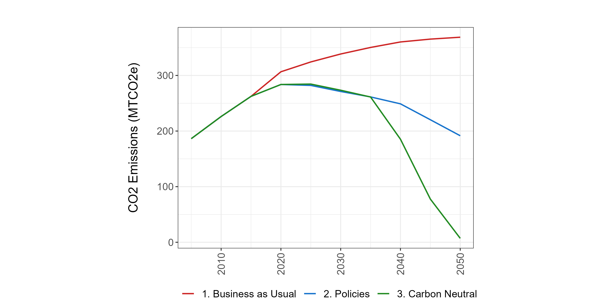
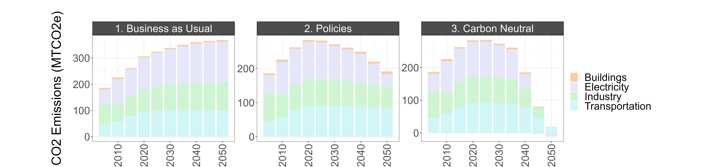

```


<br>

##### Kuala Lumpur

``` {r rchart-emiss-kl, results = 'hide', eval = TRUE, echo = TRUE, warning = FALSE, error = FALSE, message = FALSE}
co2_kl <- malaysia %>% 
  filter(param == "emissCO2BySectorNoBio",
         region == "KualaLumpur") %>%
  mutate(#value = value * 3.67,
         units = "CO2 Emissions (MTCO2eq)",
         param = "CO2 Emissions",
         class = case_when(grepl("International",class)~"transport", TRUE~class))  %>% 
  group_by(scenario, region, class, units, param, x, xLabel, classLabel, subRegion, vintage) %>% 
  summarize(value = sum(value)) %>% 
  ungroup()

```

``` {r rchart-emiss-plot-kl, results = 'hide', eval = TRUE, echo = TRUE, warning = FALSE, error = FALSE, message = FALSE, fig.width = 12, fig.height = 6, out.width = "100%"}
emissions_kl_plot <- co2_kl %>%
  mutate(param = units) %>%
  rchart::chart(save = T, 
                show = F,
                scenRef = REF_SCENARIO,
                chart_type = "param_absolute",
                folder = figure_path,
                append = "_co2_lines_kl") 

```

``` {r rchart-emiss-gas-scenario-plot-kl, results = 'hide', eval = TRUE, echo = TRUE, warning = FALSE, error = FALSE, message = FALSE, fig.width = 12, fig.height = 12}

gas_kl <- co2_kl %>%
  rchart::chart(save = T, 
                show = F,
                chart_type = c("class_absolute", "class_diff_absolute"),
                scenRef = REF_SCENARIO,
                ncol = 4,
                folder = figure_path,
                append = "_co2_emiss_kl",
                size_text = 28)

```


```{r co2-figs-kl, eval = 'TRUE', echo = 'TRUE', results = "show"}

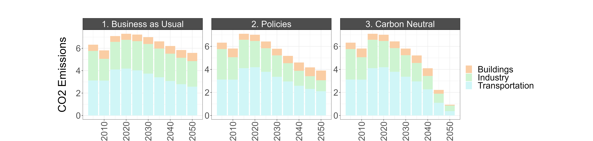

```

<br>

<!-------------------------->
#### Final Energy by Fuel and Sector {.tabset}
<!-------------------------->
***

##### Malaysia

```{r rchart-energy-my, results = 'hide', eval = TRUE, echo = TRUE, warning = FALSE, error = FALSE, message = FALSE}
energy_parameters <- c("energyFinalConsumBySecEJ", "energyFinalByFuelEJ")

energy_consum_my <- malaysia %>% 
  filter(param == "energyFinalConsumBySecEJ",
         region == "All of Malaysia") %>%
  mutate(param = units) %>%
  rchart::chart(save = T, 
                show = F,
                chart_type = c("class_absolute", "class_diff_absolute"),
                scenRef = REF_SCENARIO,
                ncol = 4,
                folder = figure_path,
                append = "_energy_consum",
                size_text = 28)

energy_fuel_my <- malaysia %>% 
  filter(param == "energyFinalByFuelEJ",
         region == "All of Malaysia") %>%
  mutate(param = units) %>%
  rchart::chart(save = T, 
                show = F,
                chart_type = c("class_absolute", "class_diff_absolute"),
                scenRef = REF_SCENARIO,
                ncol = 4,
                folder = figure_path,
                append = "_energy_fuel",
                size_text = 30)

```

```{r energy-figs, eval = 'TRUE', echo = 'TRUE', results = "show"}


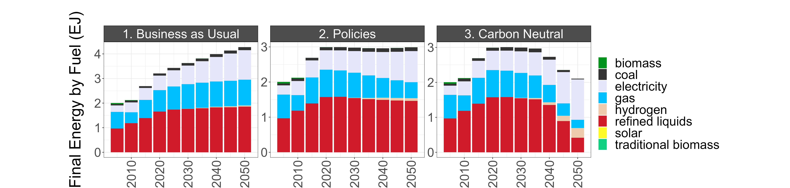
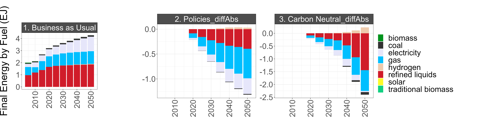
```

<br>

##### Kuala Lumpur

```{r rchart-energy-sce-kl, results = 'hide', eval = TRUE, echo = TRUE, warning = FALSE, error = FALSE, message = FALSE}
energy_kl <- malaysia %>% 
  filter(param == "energyFinalConsumBySecEJ",
         region == "KualaLumpur") %>%
  mutate(param = units) %>%
  rchart::chart(save = T, 
                show = F,
                chart_type = c("class_absolute", "class_diff_absolute"),
                scenRef = REF_SCENARIO,
                ncol = 4,
                folder = figure_path,
                append = "_energy_consum_kl",
                size_text = 28)

energy_kl <- malaysia %>% 
  filter(param == "energyFinalByFuelEJ",
         region == "KualaLumpur") %>%
  mutate(param = units) %>%
  rchart::chart(save = T, 
                show = F,
                chart_type = c("class_absolute", "class_diff_absolute"),
                scenRef = REF_SCENARIO,
                ncol = 4,
                folder = figure_path,
                append = "_energy_fuel_kl",
                size_text = 28)

```

```{r energy-figs-kl, eval = 'TRUE', echo = 'TRUE', results = "show"}


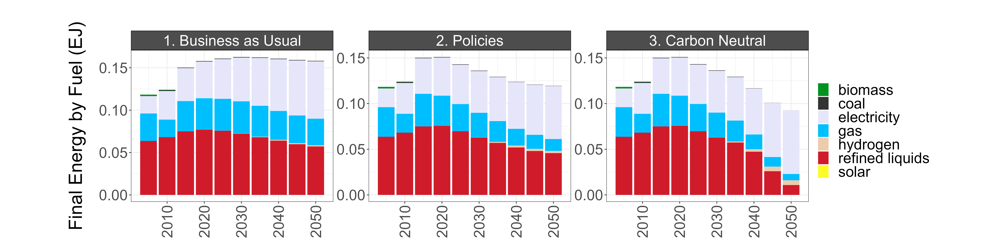

```
<br>

<!-------------------------->
#### Electricity Generation by Fuel {.tabset}
<!-------------------------->
***

```{r rchart-elec-gen-sce-my, results = 'hide', eval = TRUE, echo = TRUE, warning = FALSE, error = FALSE, message = FALSE, fig.height = 12, fig.width = 10}

electricity_my <- malaysia %>% 
  filter(param == "elecByTechTWh",
         region == "All of Malaysia") %>%
  mutate(param = "Electricity Generation\nby Fuel (TWh)") %>%
  rchart::chart(save = T, 
                show = F,
                chart_type = c("class_absolute", "class_diff_absolute"),
                scenRef = REF_SCENARIO,
                ncol = 4,
                folder = figure_path,
                append = "_elec_gen",
                size_text = 24)


```

```{r elec-figs, eval = 'TRUE', echo = 'TRUE', results = "show"}


```


<!-------------------------->
### Sectoral Details {.tabset}
<!-------------------------->
***

#### Building Energy by Subsector {.tabset}
***

##### Malaysia 

```{r rchart-building-sce-my, results = 'hide', eval = TRUE, echo = TRUE, warning = FALSE, error = FALSE, message = FALSE, fig.height = 6, fig.width = 8, out.width ="100%"}

building_energy_resid_my <- malaysia %>% 
  filter(param == "energyFinalSubsecByResidSectorBuildEJ",
         region == "All of Malaysia") %>%
  mutate(param = "Final Energy (EJ)") %>%
  rchart::chart(save = T, 
                show = F,
                chart_type = c("class_absolute", "class_diff_absolute"),
                scenRef = REF_SCENARIO,
                ncol = 4,
                folder = figure_path,
                append = "_resid_bld",
                size_text = 24)

building_energy_comm_my <- malaysia %>% 
  filter(param == "energyFinalSubsecByCommSectorBuildEJ",
         region == "All of Malaysia") %>%
  mutate(param = "Final Energy (EJ)") %>%
  rchart::chart(save = T, 
                show = F,
                chart_type = c("class_absolute", "class_diff_absolute"),
                scenRef = REF_SCENARIO,
                ncol = 4,
                folder = figure_path,
                append = "_comm_bld",
                size_text = 24)

```

```{r bld-figs, eval = 'TRUE', echo = 'TRUE', results = "show"}
knitr::include_graphics("./markdown_figs/chart_class_resid_bld.png")
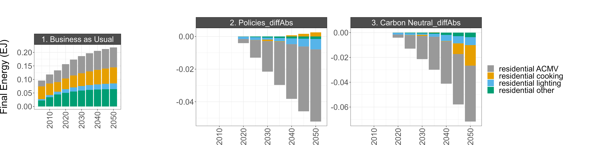


```


<br>

##### Kuala Lumpur

```{r rchart-building-sce-kl, results = 'hide', eval = TRUE, echo = TRUE, warning = FALSE, error = FALSE, message = FALSE, fig.height = 6, fig.width = 8, out.width = "100%"}
building_energy_resid_kl <- malaysia %>% 
  filter(param == "energyFinalSubsecByResidSectorBuildEJ",
         region == "KualaLumpur") %>%
  mutate(param = "Final Energy (EJ)") %>%
  rchart::chart(save = T, 
                show = F,
                chart_type = c("class_absolute", "class_diff_absolute"),
                scenRef = REF_SCENARIO,
                ncol = 4,
                folder = figure_path,
                append = "_resid_bld_kl",
                size_text = 24)

building_energy_comm_kl <- malaysia %>% 
  filter(param == "energyFinalSubsecByCommSectorBuildEJ",
         region == "KualaLumpur") %>%
  mutate(param = "Final Energy (EJ)") %>%
  rchart::chart(save = T, 
                show = F,
                chart_type = c("class_absolute", "class_diff_absolute"),
                scenRef = REF_SCENARIO,
                ncol = 4,
                folder = figure_path,
                append = "_comm_bld_kl",
                size_text = 24)

```

```{r bld-figs-kl, eval = 'TRUE', echo = 'TRUE', results = "show"}
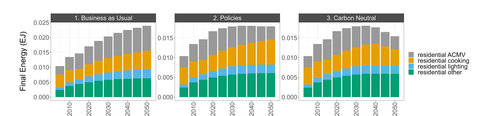
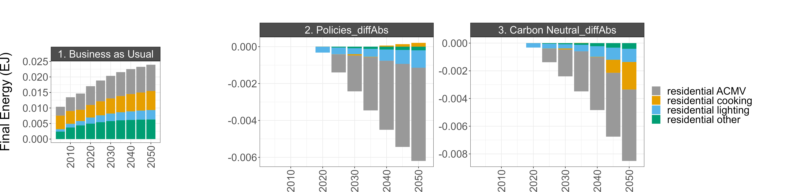
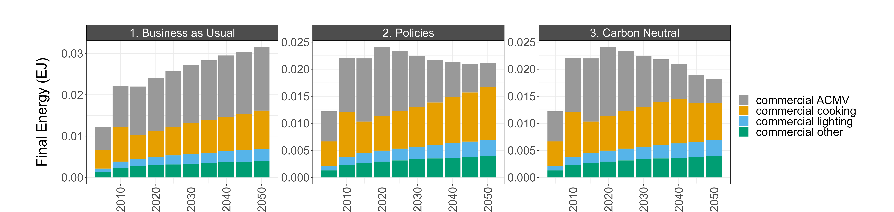
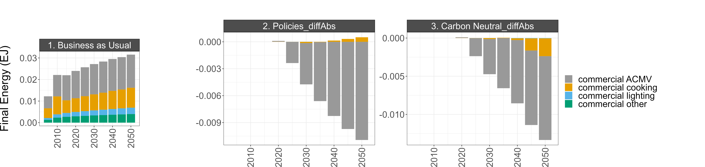
```

<br>


<!-------------------------->
#### Transportation by Mode {.tabset}
<!-------------------------->
***

##### Malaysia 

```{r rchart-transport-my-sce-mode, results = 'hide', eval = TRUE, echo = TRUE, warning = FALSE, error = FALSE, message = FALSE, fig.width = 12, fig.height = 12, out.width = "100%"}
transport_my_m <- malaysia %>% 
  filter(param == "transportFreightVMTByMode",
         region == "All of Malaysia") %>%
  mutate(param = units) %>%
  rchart::chart(save = T, 
                show = F,
                chart_type = c("class_absolute", "class_diff_absolute"),
                scenRef = REF_SCENARIO,
                ncol = 4,
                folder = figure_path,
                append = "_freight_mode",
                size_text = 24)

transport_my_m <- malaysia %>% 
  filter(param == "transportPassengerVMTByMode",
         region == "All of Malaysia") %>%
  mutate(param = units) %>%
  rchart::chart(save = T, 
                show = F,
                chart_type = c("class_absolute", "class_diff_absolute"),
                scenRef = REF_SCENARIO,
                ncol = 4,
                folder = figure_path,
                append = "_pass_mode",
                size_text = 24)

```

```{r mode-figs, eval = 'TRUE', echo = 'TRUE', results = "show"}
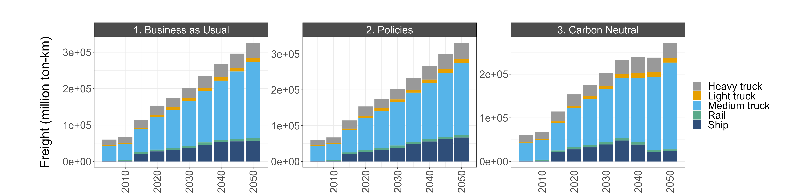
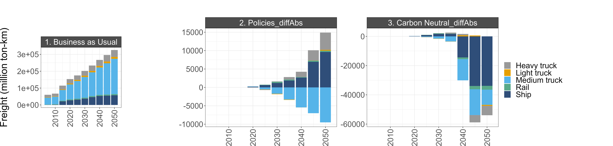


```

<br>

##### Kuala Lumpur

```{r rchart-transport-kl-sce-mode, results = 'hide', eval = TRUE, echo = TRUE, warning = FALSE, error = FALSE, message = FALSE, fig.width = 12, fig.height = 12, out.width = "100%"}
transport_kl_m <- malaysia %>% 
  filter(param == "transportFreightVMTByMode",
         region == "KualaLumpur") %>%
  mutate(param = units) %>%
  rchart::chart(save = T, 
                show = F,
                chart_type = c("class_absolute", "class_diff_absolute"),
                scenRef = REF_SCENARIO,
                ncol = 4,
                folder = figure_path,
                append = "_freight_mode_kl",
                size_text = 24)

transport_kl_m <- malaysia %>% 
  filter(param == "transportPassengerVMTByMode",
         region == "KualaLumpur") %>%
  mutate(param = units) %>%
  rchart::chart(save = T, 
                show = F,
                chart_type = c("class_absolute", "class_diff_absolute"),
                scenRef = REF_SCENARIO,
                ncol = 4,
                folder = figure_path,
                append = "_pass_mode_kl",
                size_text = 24)

```

```{r mode-figs-kl, eval = 'TRUE', echo = 'TRUE', results = "show"}


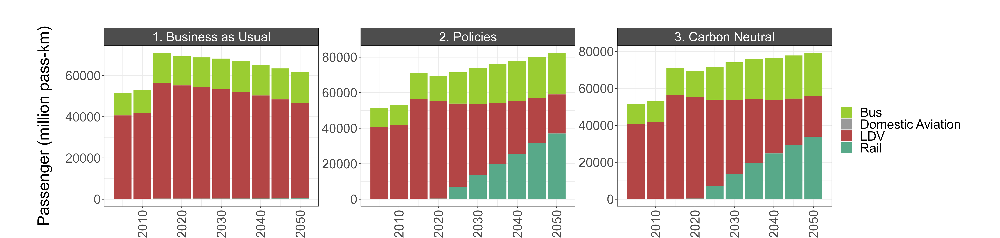
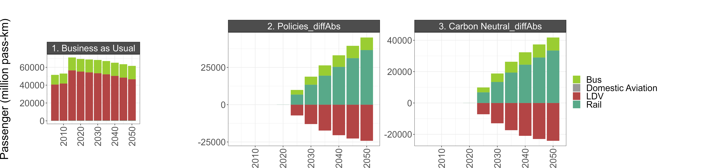
```

<br>

<!-------------------------->
#### Transportation by Fuel {.tabset}
<!-------------------------->
***

##### Malaysia 

```{r rchart-transport-my-sce-fuel, results = 'hide', eval = TRUE, echo = TRUE, warning = FALSE, error = FALSE, message = FALSE, fig.width = 12, fig.height = 12, out.width = "100%"}
transport_my_f <- malaysia %>% 
  filter(param == "transportFreightVMTByFuel",
         region == "All of Malaysia") %>%
  mutate(param = units) %>%
  rchart::chart(save = T, 
                show = F,
                chart_type = c("class_absolute", "class_diff_absolute"),
                scenRef = REF_SCENARIO,
                ncol = 4,
                folder = figure_path,
                append = "_freight_fuel",
                size_text = 24)

transport_my_f <- malaysia %>% 
  filter(param == "transportPassengerVMTByFuel",
         region == "All of Malaysia") %>%
  mutate(param = units) %>%
  rchart::chart(save = T, 
                show = F,
                chart_type = c("class_absolute", "class_diff_absolute"),
                scenRef = REF_SCENARIO,
                ncol = 4,
                folder = figure_path,
                append = "_pass_fuel",
                size_text = 24)

```

```{r trn-figs, eval = 'TRUE', echo = 'TRUE', results = "show"}
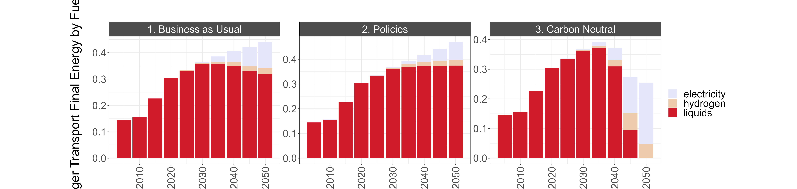


```

<br>

##### Kuala Lumpur

```{r rchart-transport-kl-sce-fuel, results = 'hide', eval = TRUE, echo = TRUE, warning = FALSE, error = FALSE, message = FALSE, fig.width = 12, fig.height = 12, out.width = "100%"}
transport_kl_f <- malaysia %>% 
  filter(param == "transportFreightVMTByFuel",
         region == "KualaLumpur") %>%
  mutate(param = units) %>%
  rchart::chart(save = T, 
                show = F,
                chart_type = c("class_absolute", "class_diff_absolute"),
                scenRef = REF_SCENARIO,
                ncol = 4,
                folder = figure_path,
                append = "_freight_fuel_kl",
                size_text = 24)

transport_kl_f <- malaysia %>% 
  filter(param == "transportPassengerVMTByFuel",
         region == "KualaLumpur") %>%
  mutate(param = units) %>%
  rchart::chart(save = T, 
                show = F,
                chart_type = c("class_absolute", "class_diff_absolute"),
                scenRef = REF_SCENARIO,
                ncol = 4,
                folder = figure_path,
                append = "_pass_fuel_kl",
                size_text = 24)

```

```{r trn-figs-kl, eval = 'TRUE', echo = 'TRUE', results = "show"}
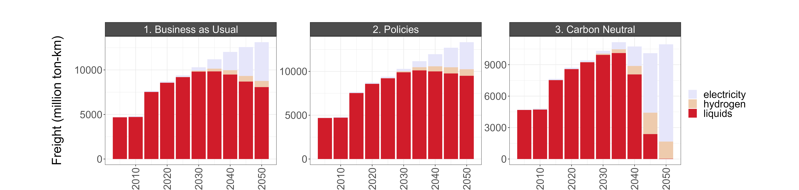
knitr::include_graphics("./markdown_figs/chart_class_diff_absolute_freight_fuel_kl.png")
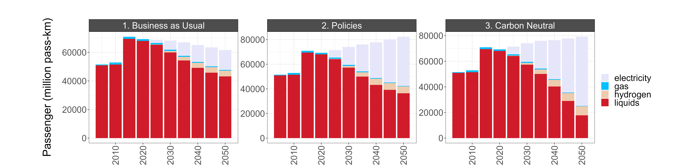

```

<br>

<!-------------------------->
#### Industry Energy by Subsector {.tabset}
<!-------------------------->
***

##### Malaysia 

```{r rchart-industry-sce-my, results = 'hide', eval = TRUE, echo = TRUE, warning = FALSE, error = FALSE, message = FALSE, fig.width = 12, fig.height = 12, out.width = "100%"}

industry_energy_my <- malaysia %>% 
  filter(param == "energyFinalSubsecByFuelIndusEJ",
         region == "All of Malaysia") %>%
  mutate(param = units) %>%
  rchart::chart(save = T, 
                show = F,
                chart_type = c("class_absolute", "class_diff_absolute"),
                scenRef = REF_SCENARIO,
                ncol = 4,
                folder = figure_path,
                append = "_indus_fuel",
                size_text = 24)

```

```{r indus-figs, eval = 'TRUE', echo = 'TRUE', results = "show"}
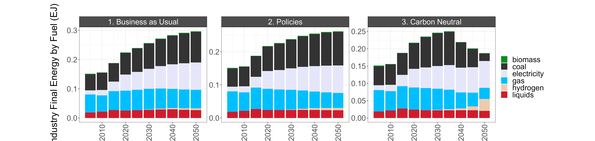
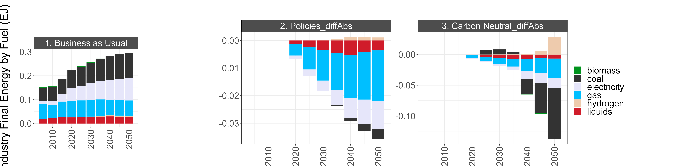
```

<br>

##### Kuala Lumpur

```{r rchart-industry-sce-kl, results = 'hide', eval = TRUE, echo = TRUE, warning = FALSE, error = FALSE, message = FALSE, fig.width = 12, fig.height = 12, out.width = "100%"}

industry_energy_kl <- malaysia %>% 
  filter(param == "energyFinalSubsecByFuelIndusEJ",
         region == "KualaLumpur") %>%
  mutate(param = units) %>%
  rchart::chart(save = T, 
                show = F,
                chart_type = c("class_absolute", "class_diff_absolute"),
                scenRef = REF_SCENARIO,
                ncol = 4,
                folder = figure_path,
                append = "_indus_fuel_kl",
                size_text = 24)

```


```{r indus-figs-kl, eval = 'TRUE', echo = 'TRUE', results = "show"}


```

<br>


<!-------------------------->
<!-------------------------->
# Assumptions and Validation
<!-------------------------->
<!-------------------------->
<p align="center"> </p>

<!-------------------------->
## Socioeconomic assumptions {.tabset}
<!-------------------------->
***

This section details the socioeconomic inputs used to define Malaysia and its subregions, Kuala Lumpur and "Rest of Malaysia," in GCAM. These metrics include population, GDP, and GDP per capita. Historical and projection data were used when available, otherwise data was calculated using the assumptions described below.

<table>

<tr>
<th>Variable</th>
<th style="width:50%">Assumptions</th>
<th style="width:40%">Data Sources</th>
</tr>

<tr>
<td>Population</td>
<td>
<span>- Malaysia population used the medium variant projection and historical data from the UN</span><br/>
<span>- KL census data gives a value for 2010. All other values were extrapolated and calculated using the growth rates for Malaysia in total</span><br/>
<span>- "Rest of Malaysia" values found by subtracting KL numbers from Malaysia</span><br/>
</td>
<td>
<span>- Malaysia: [United Nations](https://population.un.org/wpp/)</span><br/>
<span>- Kuala Lumpur 2010: [United Nations](http://data.un.org/Data.aspx?q=kuala+lumpur&d=POP&f=tableCode%3a240%3bareaCode%3a0%3bsexCode%3a0%3bvarCode3%3a028690%3bvarCode4%3a000002)</span><br/>
</td>
</tr>


<tr>
<td rowspan="3">GDP</td>
<td>
<span>- Malaysia annual growth rates are applied to KL's 2020 GDP value to extrapolate historical and future values</span><br/>
<span>- "Rest of Malaysia" values found by subtracting KL numbers from Malaysia</span>
</td>
<td rowspan="2"> 
<span>- Malaysia, historical: [USDA ERS](https://www.ers.usda.gov/data-products/international-macroeconomic-data-set/)</span><br/>
<span>- Malaysia, future: [SSP database](https://tntcat.iiasa.ac.at/SspDb/dsd?Action=htmlpage&page=welcome)</span><br/>
<span>- Kuala Lumpur 2020: [Department of Statistics Malaysia](https://www.dosm.gov.my/v1/index.php?r=column/cthemeByCat&cat=102&bul_id=anVobldYUFZLNE5WVlRVRExkSWEyZz09&menu_id=TE5CRUZCblh4ZTZMODZIbmk2aWRRQT09)</span><br/>
</td>
</tr>

</table>

<br>
<br>


<!-------------------------->
## Validation of GCAM outputs 
<!-------------------------->
***

This section will compare local Malaysia and KL data (where available) to selected GCAM outputs.

<br>

### Population and GDP

``` {r local-socioeconomics, results = 'hide', eval = TRUE, echo = TRUE, warning = FALSE, error = FALSE, message = FALSE}
local_pop <- read.csv("../data/malaysia/local_data_population.csv")
local_gdp <- read.csv("../data/malaysia/local_data_gdp.csv")

local_bau <- bind_rows(local_gdp, local_pop)

gcam_bau <- bind_rows(bau, policies, carbon_neutral) %>%
  filter(param == c("pop", "gdp"),
         region %in% c("Malaysia", "KualaLumpur"),
         scenario == "Ref") %>%
  mutate(param = units,
         scenario = "GCAM Reference",
         year = x)

bau_valid <- bind_rows(local_bau, gcam_bau)

# Plot for Malaysia
bau_valid %>% 
  filter(region == "Malaysia") %>%
  ggplot(aes(x = year, y = value, color = scenario)) + 
  geom_line(size = 1) +
  facet_wrap(~param, scales = "free") +
  ggtitle("Malaysia") +
  scale_color_manual(values = c("darkred", "darkblue")) +
  theme_light()

# Plot for KL
bau_valid %>% 
  filter(region == "KualaLumpur") %>%
  ggplot(aes(x = year, y = value, color = scenario)) + 
  geom_line(size = 1) +
  facet_wrap(~param, scales = "free") +
  ggtitle("Kuala Lumpur") +
  scale_color_manual(values = c("darkred", "darkblue")) +
  theme_light()

```

<br>

### CO2 emissions by sector

```{r local-emissions-kl, results = 'hide', eval = TRUE, echo = TRUE, warning = FALSE, error = FALSE, message = FALSE}
local_co2 <- read.csv("../data/malaysia/local_data_emissions_by_sector.csv") %>%
  mutate(class = case_when(class == "building" ~ "Buildings",
                           class == "industry" ~ "Industry",
                           class == "transport" ~ "Transportation"))

gcam_co2 <- co2_kl %>%
  filter(scenario == REF_SCENARIO) %>%
  mutate(param = units,
         scenario = "GCAM Reference",
         year = x)


bau_co2 <- bind_rows(local_co2, gcam_co2)

bau_co2 %>% 
  ggplot(aes(x = year, y = value, fill = class)) + 
  geom_col() +
  facet_wrap(~scenario) +
  labs(title = "Kuala Lumpur",
       y = "MTCO2eq") +
  scale_fill_manual(breaks = c("Buildings", "Industry", "Transportation"),
                    values = c("#facda4", "#cef4d1", "#d0f6f7")) +
  theme_light()

```

<br>


## {.unlisted .unnumbered}


```{r child = 'footer.rmd'}
```
