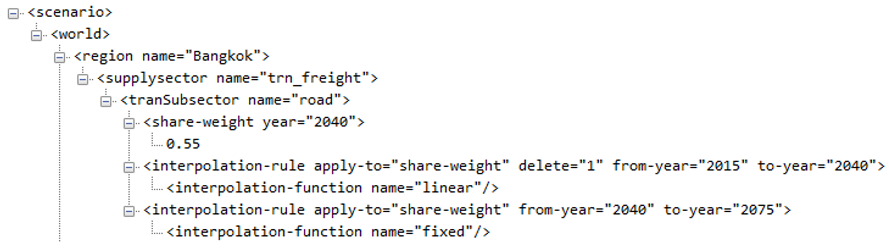

```{r setup, echo = FALSE, message=FALSE, warning=FALSE}
knitr::opts_chunk$set(results = "hide", echo=FALSE, out.width = "75%", fig.align='center', message = F, warning = F, error = F, eval = T)
library(dplyr)
```


```{r child = 'header.rmd'}
```

<!-------------------------->
<!-------------------------->
# Download GCAM SE Asia
<!-------------------------->
<!-------------------------->
<p align="center"> </p>

<br>

Please use the link below to download GCAM.

```{r key links table, results = 'show', eval=TRUE, echo=FALSE, warning=FALSE, error = FALSE, message = FALSE}
library(kableExtra); library(dplyr)

dt_url <- c("https://drive.google.com/file/d/1AFhbaTf6K6UsLsIXpne4_ska3stYIHRa/view?usp=sharing")

data.frame(
  File = c("gcamv5p3_seasia")) %>% 
  dplyr::mutate(Location = cell_spec(rep("Link",length(dt_url)),"html",link=dt_url)) %>%
  kable("html", escape = FALSE) %>%
  kable_styling(bootstrap_options = c("bordered","striped", "hover", "condensed", "responsive")) %>%
  row_spec(0, background = "#2A2A2A", color = "white")
```

<br>

You will need the following prerequisites in order to run GCAM. You will also need at least 8 GB of RAM.

```{r prereq-table, results = 'show', eval = TRUE, echo = FALSE, warning = FALSE, error = FALSE, message = FALSE}

dt_url <- c("https://www.java.com/en/download/",
            "https://cran.r-project.org/",
            "https://www.rstudio.com/",
            "http://symbolclick.com/xmlmarker_1_1_setup.exe")

links <- c("Install Java 64",
           "Install R",
           "Install RStudio",
           "Install Windows XML Maker")

data.frame(
  Prerequisite = c("Java 64",
           "R",
           "RStudio",
           "Windows XML Maker")) %>%
  dplyr::mutate(Link = cell_spec(links,"html",link=dt_url)) %>%
  kable("html", escape = FALSE) %>%
  kable_styling(bootstrap_options = c("bordered", "striped", "hover", "condensed", "responsive")) %>%
  row_spec(0, background = "#2A2A2A", color = "white")

```

<br>

<!-------------------------->
<!-------------------------->
# Guides
<!-------------------------->
<!-------------------------->
<p align="center"> </p>

<br>

```{r presentation links table, results = 'show', eval=TRUE, echo=FALSE, warning=FALSE, error = FALSE, message = FALSE}
library(kableExtra); library(dplyr)

dt_url <- c("https://github.com/JGCRI/seasia/blob/main/modeling/gcam_overview.pdf",
            "https://github.com/JGCRI/seasia/blob/main/modeling/gcam_walkthrough.pdf")

data.frame(
  File = c("gcam_overview.pdf",
           "gcam_walkthrough.pdf"),
  Description = c("GCAM overview presentation",
                  "GCAM walkthrough presentation")) %>%
  dplyr::mutate(Location = cell_spec(rep("Link",length(dt_url)),"html",link=dt_url)) %>%
  kable("html", escape = FALSE) %>%
  kable_styling(bootstrap_options = c("bordered","striped", "hover", "condensed", "responsive")) %>%
  row_spec(0, background = "#2A2A2A", color = "white")
```


<br>

<!-------------------------->
<!-------------------------->
# Scenarios
<!-------------------------->
<!-------------------------->
<p align="center"> </p>


```{r scenarios links table, results = 'show', eval=TRUE, echo=FALSE, warning=FALSE, error = FALSE, message = FALSE}
library(kableExtra); library(dplyr)

dt_url <- c("https://github.com/JGCRI/seasia/blob/main/modeling/configuration_seasia_cities_bau.xml",
            "https://github.com/JGCRI/seasia/blob/main/modeling/thailand/configuration_seasia_cities_thailand_low.xml",
            "https://github.com/JGCRI/seasia/blob/main/modeling/thailand/configuration_seasia_cities_thailand_high.xml")

data.frame(
  File = c("configuration_seasia_cities_bau.xml",
           "configuration_seasia_cities_thailand_low.xml",
           "configuration_seasia_cities_thailand_high.xml"),
  Description = c("Business as Usual Scenario",
                  "National Policies Scenario (low ambition)",
                  "National Policies Scenario (high ambition)")) %>%
  dplyr::mutate(Location = cell_spec(rep("Link",length(dt_url)),"html",link=dt_url)) %>%
  kable("html", escape = FALSE) %>%
  kable_styling(bootstrap_options = c("bordered","striped", "hover", "condensed", "responsive")) %>%
  row_spec(0, background = "#2A2A2A", color = "white")
```


<!-------------------------->
<!-------------------------->
# National Policies
<!-------------------------->
<!-------------------------->
<p align="center"> </p>

The following table lists the policies included in the high and low ambition national policies scenarios. The subsequent sections explain what each of these policies represent and how to adjust them. Each of these policies is implemented using XML add-on file(s) which can be included in the `configuration_seasia_cities_thailand_policy.xml` file in order to include the policy in the GCAM scenario.

```{r policy links table, results = 'show', eval=TRUE, echo=FALSE, warning=FALSE, error = FALSE, message = FALSE}
library(kableExtra); library(dplyr)

# dt_url <- c("https://github.com/JGCRI/seasia/blob/main/modeling/thailand/thailand_policy_national_electricity_generation_floor_pdp2018.xml",
#             "https://github.com/JGCRI/seasia/blob/main/modeling/thailand/thailand_policy_subnational_buildings_shell_eff_015_018.xml",
#             "https://github.com/JGCRI/seasia/blob/main/modeling/thailand/thailand_policy_subnational_transport_cost_ev_2050p_2060f.xml",
#             "https://github.com/JGCRI/seasia/blob/main/modeling/thailand/thailand_policy_subnational_transport_freight_rail_0034_2040_lin.xml",
#             "https://github.com/JGCRI/seasia/blob/main/modeling/thailand/thailand_policy_subnational_transport_freight_road_55_2040_lin.xml")

data.frame(
  Sector = c(rep("Power", 2), rep("Buildings", 3), rep("Transportation", 2),
             rep("Industry", 2)),
  Policy = c("RE subsidies", "Coal retirement", "Building envelope efficiency", 
             "AC efficiency", "Lighting efficiency", "EV cost parity",
             "Liquids phaseout", "Industrial energy efficiency",
             "Industrial hydrogen use"),
  Description = c("Modify the electricity generation mix by setting generation floors for wind and solar using a subsidy policy",
                  "Prevent new coal development starting in 2020 and phase out existing coal",
                  "Modify the average envelope efficiency of residential and commercial buildings by setting the shell-conductance parameter for each year",
                  "Modify the average energy efficiency of air conditioners in buildings",
                  "Phase out non-LED lighting technologies in buildings",
                  "Reduce costs of EVs and hybrid vehicles to reach cost parity with traditional liquids vehicles",
                  "Phase out combustion engine vehicles",
                  "Increase average energy efficiency across industrial processes",
                  "Increase the use of hydrogen in industrial processes")) %>% 
  kable("html", escape = FALSE) %>% 
  kable_styling(bootstrap_options = c("bordered","striped", "hover", "condensed", "responsive")) %>%
  row_spec(0, background = "#2A2A2A", color = "white")
  
```

## RE Subsidies
***

```{r re subsidy files table, results = 'show', eval=TRUE, echo=FALSE, warning=FALSE, error = FALSE, message = FALSE}
library(kableExtra); library(dplyr)

dt_url <- c("https://github.com/JGCRI/seasia/blob/main/modeling/thailand/wind_solar_floors_high.xml",
            "https://github.com/JGCRI/seasia/blob/main/modeling/thailand/wind_solar_floors_low.xml",
            "https://github.com/JGCRI/seasia/blob/main/modeling/thailand/wind_solar_input_subsidies.xml")

data.frame(
  Scenario = c("High", "Low", "Both")) %>% 
  dplyr:: mutate("Files Used" = cell_spec(c("wind_solar_floors_high.xml",
                                            "wind_solar_floors_low.xml",
                                            "wind_solar_input_subsidies.xml"),
                                          "html", link=dt_url),
         Description = c("Sets floors for wind and solar generation corresponding with Thailand's updated LTS generation goals",
                         "Sets floors for wind and solar generation corresponding with 75% Thailand's updated LTS generation goals",
                         "Applies subsidies to relevant wind and solar technologies in order to meet the specified floors")) %>% 
  kable("html", escape = FALSE, col.names = c("Scenario", "Files Used", "Description")) %>%
  kable_styling(bootstrap_options = c("striped", "hover", "condensed", "responsive")) %>%
  row_spec(0, background = "#2A2A2A", color = "white")
```


<!-------------------------->
<!----------Goal------------>
<!-------------------------->

<div class="warning" style='background-color:#E1F4F5; border-left: solid #1f1f1f 4px; border-radius: 4px; padding:0.7em;'>
<span>
<h3 style='text-align:center; font-size:24px'>
<b>Goal</b>
</h3>

<p style='margin-left:1em;'>
The goal of this example is to set a minimum value (floor) in GCAM for the amount of electricity generation from wind and solar technologies corresponding with the goals through 2065 presented in the LTS update meeting. 

</p>
</span>
</div>

<br>


<!-------------------------->
<!--------Approach---------->
<!-------------------------->

<div class="warning" style='background-color:#fffae0; border-left: solid #1f1f1f 4px; border-radius: 4px; padding:0.7em;'>
<span>

<h3 style='text-align:center; font-size:24px'>
<b>Approach</b></h3>

<p style='margin-left:1em;'>
One way to set a generation floor for each fuel type in GCAM is to use a subsidy policy. This effectively lowers the cost of the relevant electricity generation technologies until the floor is reached.

</p>
</span>
</div>

<br>


<!-------------------------->
<!--------Background-------->
<!-------------------------->

```{r background policy-portfolio-standards RE, child = 'background_policy-portfolio-standards.rmd'}
```


<!-------------------------->
<!---GCAM Implementation---->
<!-------------------------->

<div class="warning" style='background-color:#F5E5E1; border-left: solid #1f1f1f 4px; border-radius: 4px; padding:0.7em;'>
<span>
<h3 style='text-align:center; font-size:24px'>
<b>GCAM Implementation</b>
</h3>

<p style='margin-left:1em;'>
1. Create a folder in the input directory eg. `./gcam-core/input/addons`.
2. Download the desired constraint file (either [wind_solar_floors_high.xml](https://github.com/JGCRI/seasia/blob/main/modeling/thailand/wind_solar_floors_high.xml) or [wind_solar_floors_low.xml](https://github.com/JGCRI/seasia/blob/main/modeling/thailand/wind_solar_floors_low.xml)) as well as the subsidy link file [wind_solar_input_subsidies](https://github.com/JGCRI/seasia/blob/main/modeling/thailand/wind_solar_input_subsidies.xml) to the folder.
4. To make custom adjustments, optionally change the following within each `policy-portfolio-standard` tag in the XML:
</p>

<ul style='margin-left:4em; text-align:left;'>
  <li>`constraint` for each year in which a floor is desired</li>
  <li>Set `min-price` to a large negative value for years in which an exact constraint, rather than a floor, is desired</li>
</ul>
<p style='margin-left:1em;'>
5. Within each `supplysector` tag in the XML, make sure that the corresponding `input-subsidy` is added within each relevant `period` for each `stub-technology` you wish to constrain. Remove each `stub-technology` that you do not wish to include in the constraint.
6. Save the xml and then point to it in your configuration file by adding the lines (replace `high` with `low` as needed): 
<p style='font-size:0.8em'>
`<Value name = "scen">../input/addons/wind_solar_floors_high.xml</Value>`
`<Value name = "scen">../input/addons/wind_solar_input_subsidies.xml</Value>`

</p>
</p>

</span>
</div>

<br>

## Coal Phaseout
***

```{r coal phaseout files table, results = 'show', eval=TRUE, echo=FALSE, warning=FALSE, error = FALSE, message = FALSE}
library(kableExtra); library(dplyr)

dt_url <- c("https://github.com/JGCRI/seasia/blob/main/modeling/thailand/no_new_coal.xml",
            "https://github.com/JGCRI/seasia/blob/main/modeling/thailand/coal_shutdown_high.xml",
            "https://github.com/JGCRI/seasia/blob/main/modeling/thailand/coal_shutdown_low.xml")

data.frame(
  Scenario = c("Both", "High", "Low")) %>% 
  dplyr:: mutate("Files Used" = cell_spec(c("no_new_coal.xml",
                                            "coal_shutdown_high.xml",
                                            "coal_shutdown_low.xml"),
                                          "html", link=dt_url),
         Description = c("Prevents additional coal capacity from being built starting in 2020",
                         "Retires existing coal capacity quickly; all coal is retired by 2050",
                         "Retires existing coal capacity more slowly; all coal is retired by 2065")) %>% 
  kable("html", escape = FALSE, col.names = c("Scenario", "Files Used", "Description")) %>%
  kable_styling(bootstrap_options = c("striped", "hover", "condensed", "responsive")) %>%
  row_spec(0, background = "#2A2A2A", color = "white")
```


<!-------------------------->
<!----------Goal------------>
<!-------------------------->

<div class="warning" style='background-color:#E1F4F5; border-left: solid #1f1f1f 4px; border-radius: 4px; padding:0.7em;'>
<span>
<h3 style='text-align:center; font-size:24px'>
<b>Goal</b>
</h3>

<p style='margin-left:1em;'>
The goal of this example is to phase out coal from Thailand's electricity generation capacity. The difference between the high and low scenarios is how quickly coal is phased out and the year in which the phase-out is completed. 

</p>
</span>
</div>

<br>


<!-------------------------->
<!--------Approach---------->
<!-------------------------->

<div class="warning" style='background-color:#fffae0; border-left: solid #1f1f1f 4px; border-radius: 4px; padding:0.7em;'>
<span>

<h3 style='text-align:center; font-size:24px'>
<b>Approach</b></h3>

<p style='margin-left:1em;'>
There are two steps to phase out coal generation. The first is to prevent any new coal capacity from being built; we do this by setting coal shareweights to 0 in all future years. The second step is to gradually retire all existing coal capacity; we do this by shortening coal technologies' lifetimes and by assigning a shutdown curve to each technology.

</p>
</span>
</div>

<br>


<!-------------------------->
<!--------Background-------->
<!-------------------------->

<!--- TO DO: make background page for lifetime and s-curve-shutdown-decider --->

```{r background shareweights coal, child = 'background_shareweights.rmd'}
```

```{r background retirement coal, child = 'background_retirement.rmd'}
```


<!-------------------------->
<!---GCAM Implementation---->
<!-------------------------->

<div class="warning" style='background-color:#F5E5E1; border-left: solid #1f1f1f 4px; border-radius: 4px; padding:0.7em;'>
<span>
<h3 style='text-align:center; font-size:24px'>
<b>GCAM Implementation</b>
</h3>

<p style='margin-left:1em;'>
1. Create a folder in the input directory eg. `./gcam-core/input/addons`.
2. Download the coal shareweight file [no_new_coal.xml](https://github.com/JGCRI/seasia/blob/main/modeling/thailand/no_new_coal.xml) as well as the desired coal retirement file (either [coal_shutdown_high.xml](https://github.com/JGCRI/seasia/blob/main/modeling/thailand/coal_shutdown_high.xml) or [coal_shutdown_low.xml](https://github.com/JGCRI/seasia/blob/main/modeling/thailand/coal_shutdown_low.xml)) to the folder.
4. To make custom adjustments to the coal retirement trajectory, optionally change the following within each `stub-technology` tag in the retirement XML:
</p>

<ul style='margin-left:4em; text-align:left;'>
  <li>Use `lifetime` to adjust the year in which the coal phase-out is complete; the phase-out will be complete `x` years after 2015, where `x` is the `lifetime`. </li>
  <li>Use the `steepness` and `half-life` within the `s-curve-shutdown-decider` to adjust the phaseout trajectory; a smaller `half-life` and larger `steepness` will result in a faster phase-out.</li>
</ul>
<p style='margin-left:1em;'>
5. Save the xmls and then point to them in your configuration file by adding the lines (replace `high` with `low` as needed): 
<p style='font-size:0.8em'>
`<Value name = "scen">../input/addons/no_new_coal.xml</Value>`
`<Value name = "scen">../input/addons/coal_shutdown_high.xml</Value>`

</p>
</p>

</span>
</div>

<br>


## Building Envelope Efficiency
***

```{r shell files table, results = 'show', eval=TRUE, echo=FALSE, warning=FALSE, error = FALSE, message = FALSE}
library(kableExtra); library(dplyr)

dt_url <- c("https://github.com/JGCRI/seasia/blob/main/modeling/thailand/shell_eff_high.xml",
            "https://github.com/JGCRI/seasia/blob/main/modeling/thailand/shell_eff_low.xml")

data.frame(
  Scenario = c("High", "Low")) %>% 
  dplyr:: mutate("Files Used" = cell_spec(c("shell_eff_high.xml",
                                            "shell_eff_low.xml"),
                                          "html", link=dt_url),
         Description = c("Decreases shell conductance from 3.75 in 2020 to 0.487 (residential)/ 0.375 (commercial) in 2070 at an annual rate of 4% (residential)/ 4.5% (commercial)",
                         "Decreases shell conductance from 3.75 in 2020 to 1.366 (residential)/ 1.057 (commercial) in 2070 at an annual rate of 2% (residential)/ 2.5% (commercial)")) %>% 
  kable("html", escape = FALSE, col.names = c("Scenario", "Files Used", "Description")) %>%
  kable_styling(bootstrap_options = c("striped", "hover", "condensed", "responsive")) %>%
  row_spec(0, background = "#2A2A2A", color = "white")

```


<!-------------------------->
<!----------Goal------------>
<!-------------------------->

<div class="warning" style='background-color:#E1F4F5; border-left: solid #1f1f1f 4px; border-radius: 4px; padding:0.7em;'>
<span>
<h3 style='text-align:center; font-size:24px'>
<b>Goal</b>
</h3>

<p style='margin-left:1em;'>
The goal of this example is to represent increasing compliance with the envelope efficiency component of building energy codes. The difference between the low and high scenario versions of this policy is the rate of increase.

</p>
</span>
</div>

<br>


<!-------------------------->
<!--------Approach---------->
<!-------------------------->

<div class="warning" style='background-color:#fffae0; border-left: solid #1f1f1f 4px; border-radius: 4px; padding:0.7em;'>
<span>

<h3 style='text-align:center; font-size:24px'>
<b>Approach</b></h3>
We can use GCAM's `shell-conductance` parameter to represent an increase in the average building envelope efficiency according to building energy codes.
<p style='margin-left:1em;'>

</p>


</span>
</div>

<br>


<!-------------------------->
<!--------Background-------->
<!-------------------------->

```{r background cooling demand, child = 'background_coolingDemand.rmd'}
```


<!-------------------------->
<!---GCAM Implementation---->
<!-------------------------->

<div class="warning" style='background-color:#F5E5E1; border-left: solid #1f1f1f 4px; border-radius: 4px; padding:0.7em;'>
<span>
<h3 style='text-align:center; font-size:24px'>
<b>GCAM Implementation</b>
</h3>

<p style='margin-left:1em;'>
1. Create a folder in the input directory: `./gcam-core/input/addons`.
2. Download the desired xml file (either [shell_eff_high.xml](https://github.com/JGCRI/seasia/blob/main/modeling/thailand/shell_eff_high.xml) or [shell_eff_low.xml](https://github.com/JGCRI/seasia/blob/main/modeling/thailand/shell_eff_low.xml)) to the folder.
4. To make custom adjustments: within each `gcam-consumer` tag in the XML, specify the desired `shell-conductance` values for each year.
5. Save the xml and then point to it in your configuration file by adding the line (replace `high` with `low` as needed): 
<p style='font-size:0.8em'>
`<Value name = "scen">../input/addons/thailand/shell_eff_high.xml</Value>`
</p>

</span>
</div>

<br>

## AC Efficiency
***

```{r ac eff files table, results = 'show', eval=TRUE, echo=FALSE, warning=FALSE, error = FALSE, message = FALSE}
library(kableExtra); library(dplyr)

dt_url <- c("https://github.com/JGCRI/seasia/blob/main/modeling/thailand/ac_eff_high.xml",
            "https://github.com/JGCRI/seasia/blob/main/modeling/thailand/ac_eff_low.xml")

data.frame(
  Scenario = c("High", "Low")) %>% 
  dplyr:: mutate("Files Used" = cell_spec(c("ac_eff_high.xml",
                                            "ac_eff_low.xml"),
                                          "html", link=dt_url),
         Description = c("Increases acerage efficiency of high-efficiency ACs from 3.1 W/W in 2020 to 6 W/W in 2030 and 8 W/W in 2050",
                         "Increases acerage efficiency of high-efficiency ACs from 3.1 W/W in 2020 to 4.3 W/W in 2030 and 6 W/W in 2050")) %>% 
  kable("html", escape = FALSE, col.names = c("Scenario", "Files Used", "Description")) %>%
  kable_styling(bootstrap_options = c("striped", "hover", "condensed", "responsive")) %>%
  row_spec(0, background = "#2A2A2A", color = "white")

```


<!-------------------------->
<!----------Goal------------>
<!-------------------------->

<div class="warning" style='background-color:#E1F4F5; border-left: solid #1f1f1f 4px; border-radius: 4px; padding:0.7em;'>
<span>
<h3 style='text-align:center; font-size:24px'>
<b>Goal</b>
</h3>

<p style='margin-left:1em;'>
The goal of this example is to represent increasing use of the higher and highest efficiency ACs in buildings. The difference between the low and high scenario versions of this policy is the rate of increase of the average AC efficiency.

</p>
</span>
</div>

<br>


<!-------------------------->
<!--------Approach---------->
<!-------------------------->

<div class="warning" style='background-color:#fffae0; border-left: solid #1f1f1f 4px; border-radius: 4px; padding:0.7em;'>
<span>

<h3 style='text-align:center; font-size:24px'>
<b>Approach</b></h3>
We can use GCAM's `efficiency` parameter corresponding with the relevant AC technologies to represent an increase in the average AC effiency.
<p style='margin-left:1em;'>

</p>


</span>
</div>

<br>


<!-------------------------->
<!--------Background-------->
<!-------------------------->

<!--TODO: make a background page for technology efficiency-->

```{r background efficiency ac}
```


<!-------------------------->
<!---GCAM Implementation---->
<!-------------------------->

<div class="warning" style='background-color:#F5E5E1; border-left: solid #1f1f1f 4px; border-radius: 4px; padding:0.7em;'>
<span>
<h3 style='text-align:center; font-size:24px'>
<b>GCAM Implementation</b>
</h3>

<p style='margin-left:1em;'>
1. Create a folder in the input directory: `./gcam-core/input/addons`.
2. Download the desired xml file (either [ac_eff_high.xml](https://github.com/JGCRI/seasia/blob/main/modeling/thailand/ac_eff_high.xml) or [ac_eff_low.xml](https://github.com/JGCRI/seasia/blob/main/modeling/thailand/ac_eff_low.xml)) to the folder.
4. To make custom adjustments: within each period, adjust the efficiency value.
5. Save the xml and then point to it in your configuration file by adding the line (replace `high` with `low` as needed): 
<p style='font-size:0.8em'>
`<Value name = "scen">../input/addons/thailand/ac_eff_high.xml</Value>`
</p>

</span>
</div>

<br>

## Lighting Efficiency
***

```{r lighting files table, results = 'show', eval=TRUE, echo=FALSE, warning=FALSE, error = FALSE, message = FALSE}
library(kableExtra); library(dplyr)

dt_url <- c("https://github.com/JGCRI/seasia/blob/main/modeling/thailand/buildings_led_high.xml",
            "https://github.com/JGCRI/seasia/blob/main/modeling/thailand/buildings_led_low.xml")

data.frame(
  Scenario = c("High", "Low")) %>% 
  dplyr:: mutate("Files Used" = cell_spec(c("buildings_led_high.xml",
                                            "buildings_led_low.xml"),
                                          "html", link=dt_url),
         Description = c("Gradually phases non-LED residential lighting technology out of the market by 2030",
                         "Gradually phases non-LED residential lighting technology out of the market by 2050")) %>% 
  kable("html", escape = FALSE, col.names = c("Scenario", "Files Used", "Description")) %>%
  kable_styling(bootstrap_options = c("striped", "hover", "condensed", "responsive")) %>%
  row_spec(0, background = "#2A2A2A", color = "white")

```


<!-------------------------->
<!----------Goal------------>
<!-------------------------->

<div class="warning" style='background-color:#E1F4F5; border-left: solid #1f1f1f 4px; border-radius: 4px; padding:0.7em;'>
<span>
<h3 style='text-align:center; font-size:24px'>
<b>Goal</b>
</h3>

<p style='margin-left:1em;'>
The goal of this policy is to represent increasing use of LED lighting in residential buildings and the decreasing use of other, less energy efficient lighting technologies. The difference between the low and high scenario versions of this policy is the year in which 100% LED residential lighting is achieved.

</p>
</span>
</div>

<br>


<!-------------------------->
<!--------Approach---------->
<!-------------------------->

<div class="warning" style='background-color:#fffae0; border-left: solid #1f1f1f 4px; border-radius: 4px; padding:0.7em;'>
<span>

<h3 style='text-align:center; font-size:24px'>
<b>Approach</b></h3>
We can gradually decrease the shareweights of all non-LED residential lighting technologies in order to phase them out of the market. The year in which the non-LED shareweights reach 0 corresponds with the year in which 100% LED residential lighting is achieved.
<p style='margin-left:1em;'>

</p>


</span>
</div>

<br>


<!-------------------------->
<!--------Background-------->
<!-------------------------->

```{r background shareweights lighting, child = 'background_shareweights.rmd'}
```


<!-------------------------->
<!---GCAM Implementation---->
<!-------------------------->

<div class="warning" style='background-color:#F5E5E1; border-left: solid #1f1f1f 4px; border-radius: 4px; padding:0.7em;'>
<span>
<h3 style='text-align:center; font-size:24px'>
<b>GCAM Implementation</b>
</h3>

<p style='margin-left:1em;'>
1. Create a folder in the input directory: `./gcam-core/input/addons`.
2. Download the desired xml file (either [buildings_led_high.xml](https://github.com/JGCRI/seasia/blob/main/modeling/thailand/buildings_led_high.xml) or [buildings_led_low.xml](https://github.com/JGCRI/seasia/blob/main/modeling/thailand/buildings_led_low.xml)) to the folder.
4. To adjust the year in which 100% LED lighting is achieved: within each non-LED `stub-technology` tag in the XML, change the `to-year` in the first `interpolation-rule` and the `from-year` in the second. Also change the `year` of the `period` tag in which the `share-weight` is 0.
5. Save the xml and then point to it in your configuration file by adding the line (replace `high` with `low` as needed): 
<p style='font-size:0.8em'>
`<Value name = "scen">../input/addons/thailand/buildings_led_high.xml</Value>`
</p>

</span>
</div>

<br>

## EV Cost Parity
***

```{r EV cost parity files table, results = 'show', eval=TRUE, echo=FALSE, warning=FALSE, error = FALSE, message = FALSE}
library(kableExtra); library(dplyr)

dt_url <- c("https://github.com/JGCRI/seasia/blob/main/modeling/thailand/ev_cost_parity_high.xml",
            "https://github.com/JGCRI/seasia/blob/main/modeling/thailand/ev_cost_parity_low.xml")

data.frame(
  Scenario = c(rep("High",1), rep("Low",1))) %>% 
  mutate("Files Used" = cell_spec( c("ev_cost_parity_high.xml",
                                     "ev_cost_parity_low.xml"),
                                   "html", link = dt_url)) %>% 
  mutate(Description = c("Reduces EV costs to reach cost parity with liquids vehicles by 2030 (passenger)/ 2040 (freight)",
                         "Reduces EV costs to reach cost parity with liquids vehicles by 2050 (passenger)/ 2060 (freight)")) %>%
  kable("html", escape = FALSE, col.names = c("Scenario", "Files Used", "Description")) %>%
  kable_styling(bootstrap_options = c("striped", "hover", "condensed", "responsive")) %>%
  row_spec(0, background = "#2A2A2A", color = "white")
```


<!-------------------------->
<!----------Goal------------>
<!-------------------------->

<div class="warning" style='background-color:#E1F4F5; border-left: solid #1f1f1f 4px; border-radius: 4px; padding:0.7em;'>
<span>
<h3 style='text-align:center; font-size:24px'>
<b>Goal</b>
</h3>

<p style='margin-left:1em;'>
The goal of this policy is represent measures to make EVs more competitive with combustion engine vehicles (CEV). The difference between the low and high policies is the year in which EVs reach cost parity with CEVs.  

</p>
</span>
</div>

<br>


<!-------------------------->
<!--------Approach---------->
<!-------------------------->

<div class="warning" style='background-color:#fffae0; border-left: solid #1f1f1f 4px; border-radius: 4px; padding:0.7em;'>
<span>

<h3 style='text-align:center; font-size:24px'>
<b>Approach</b></h3>

<p style='margin-left:1em;'>
To represent EV promotion, we use an approach that decreases the cost of EVs relative to CEVs, until the two technologies reach cost parity in some future year. We can do this using GCAM's `input-cost` parameter, which represents the non-energy costs of a given technology.
</p>


</span>
</div>

<br>


<!--------------------------->
<!--------Background--------->
<!--------------------------->

```{r background transport input cost, child = 'background_transportCost.rmd'}
```


<!-------------------------->
<!---GCAM Implementation---->
<!-------------------------->

<div class="warning" style='background-color:#F5E5E1; border-left: solid #1f1f1f 4px; border-radius: 4px; padding:0.7em;'>
<span>
<h3 style='text-align:center; font-size:24px'>
<b>GCAM Implementation</b>
</h3>

<p style='margin-left:1em;'>
1. Create a folder in the input directory: `./gcam-core/input/addons`.
2. Download the desired cost parity xml file (either [ev_cost_parity_high.xml](https://github.com/JGCRI/seasia/blob/main/modeling/thailand/ev_cost_parity_high.xml) or [ev_cost_parity_low.xml](https://github.com/JGCRI/seasia/blob/main/modeling/thailand/ev_cost_parity_low.xml)) to the folder.
4. To make custom adjustments to the EV cost trajectory, set the desired `input-cost` for each year within each`stub-technology` tag in the cost parity xml file.
5. Save the xml and then point to it in your configuration file by adding the line (replace `high` with `low` as needed): 
</p>
<p style='font-size:0.8em'>
`<Value name = "scen">../input/addons/thailand/ev_cost_parity_high.xml</Value>`
</p>
</p>

</span>
</div>

<br>

## CEV phase-out
***

```{r CEV phase-out files table, results = 'show', eval=TRUE, echo=FALSE, warning=FALSE, error = FALSE, message = FALSE}
library(kableExtra); library(dplyr)

dt_url <- c("https://github.com/JGCRI/seasia/blob/main/modeling/thailand/ldv_liquids_phaseout_high.xml",
            "https://github.com/JGCRI/seasia/blob/main/modeling/thailand/ldv_liquids_phaseout_low.xml")

data.frame(
  Scenario = c(rep("High",1), rep("Low",1))) %>% 
  mutate("Files Used" = cell_spec( c("ldv_liquids_phaseout_high.xml",
                                     "ldv_liquids_phaseout_low.xml"),
                                   "html", link = dt_url)) %>% 
  mutate(Description = c("Phases liquids passenger vehicles out of the market by 2050",
                         "Phases liquids passenger vehicles out of the market by 2065")) %>%
  kable("html", escape = FALSE, col.names = c("Scenario", "Files Used", "Description")) %>%
  kable_styling(bootstrap_options = c("striped", "hover", "condensed", "responsive")) %>%
  row_spec(0, background = "#2A2A2A", color = "white")
```


<!-------------------------->
<!----------Goal------------>
<!-------------------------->

<div class="warning" style='background-color:#E1F4F5; border-left: solid #1f1f1f 4px; border-radius: 4px; padding:0.7em;'>
<span>
<h3 style='text-align:center; font-size:24px'>
<b>Goal</b>
</h3>

<p style='margin-left:1em;'>
The goal of this policy is to phase out combustion engine vehicles (CEV) from the market. The difference between the low and high policies is the year in which CEVs are completely phased out of the market.  

</p>
</span>
</div>

<br>


<!-------------------------->
<!--------Approach---------->
<!-------------------------->

<div class="warning" style='background-color:#fffae0; border-left: solid #1f1f1f 4px; border-radius: 4px; padding:0.7em;'>
<span>

<h3 style='text-align:center; font-size:24px'>
<b>Approach</b></h3>

<p style='margin-left:1em;'>
To represent a CEV phase-out, we decrease their shareweights over time. The year in which the shareweights are 0 is the year in which CEVs are completely phased out of the market.
</p>


</span>
</div>

<br>


<!--------------------------->
<!--------Background--------->
<!--------------------------->

```{r background shareweights CEV, child = 'background_shareweights.rmd'}
```

<!-------------------------->
<!---GCAM Implementation---->
<!-------------------------->

<div class="warning" style='background-color:#F5E5E1; border-left: solid #1f1f1f 4px; border-radius: 4px; padding:0.7em;'>
<span>
<h3 style='text-align:center; font-size:24px'>
<b>GCAM Implementation</b>
</h3>

<p style='margin-left:1em;'>
1. Create a folder in the input directory: `./gcam-core/input/addons`.
2. Download the desired  CEV phase-out xml file (either [ldv_liquids_phaseout_high.xml](https://github.com/JGCRI/seasia/blob/main/modeling/thailand/ldv_liquids_phaseout_high.xml) or [ldv_liquids_phaseout_low.xml](https://github.com/JGCRI/seasia/blob/main/modeling/thailand/ldv_liquids_phaseout_low.xml)) to the folder.
4. To adjust the year in which CEVs are completely phased out: within each `stub-technology` tag in the XML, change the `to-year` in the first `interpolation-rule` and the `from-year` in the second. Also change the `year` of the `period` tag in which the `share-weight` is 0.
5. Save the xml and then point to it in your configuration file by adding the line (replace `high` with `low` as needed): 
</p>
<p style='font-size:0.8em'>
`<Value name = "scen">../input/addons/thailand/ldv_liquids_phaseout_high.xml</Value>`
</p>
</p>

</span>
</div>

<br>

<!-- ## Transportation Mode Shift - Share weights -->
<!-- *** -->

<!-- ```{r shareweight files table, results = 'show', eval=TRUE, echo=FALSE, warning=FALSE, error = FALSE, message = FALSE} -->
<!-- library(kableExtra); library(dplyr) -->

<!-- dt_url <- c("https://github.com/JGCRI/seasia/blob/main/data/thailand/inputs/thailand_bau_subsector_shareweights.csv", -->
<!--             "https://github.com/JGCRI/seasia/blob/main/modeling/thailand/thailand_policy_subnational_transport_freight_rail_0034_2040_lin.xml", -->
<!--             "https://github.com/JGCRI/seasia/blob/main/modeling/thailand/thailand_policy_subnational_transport_freight_road_55_2040_lin.xml") -->

<!-- data.frame( -->
<!--   "Files Used" = c("subsector_shareweights_ref.csv", -->
<!--            "thailand_policy_subnational_transport_freight_rail_0034_2040_lin.xml", -->
<!--            "thailand_policy_subnational_transport_freight_road_55_2040_lin.xml"), -->
<!--   Description = c("Reference share weights from Model Interface", -->
<!--               "Linear interpolation from default 2015 value (0.001342) to 0.0034 in 2040 for freight rail", -->
<!--               "Linear interpolation from default 2015 value (1) to 0.55 in 2040 for freight road")) %>% -->
<!--   dplyr::mutate(Location = cell_spec(rep("Link",length(dt_url)),"html",link=dt_url)) %>% -->
<!--   kable("html", escape = FALSE, col.names = c("Files Used", "Description", "Link")) %>% -->
<!--   kable_styling(bootstrap_options = c("striped", "hover", "condensed", "responsive")) %>% -->
<!--   row_spec(0, background = "#2A2A2A", color = "white") -->
<!-- ``` -->


<!-- <!-------------------------->
<!-- <!----------Goal------------> 
<!-- <!--------------------------> 

<!-- <div class="warning" style='background-color:#E1F4F5; border-left: solid #1f1f1f 4px; border-radius: 4px; padding:0.7em;'> -->
<!-- <span> -->
<!-- <h3 style='text-align:center; font-size:24px'> -->
<!-- <b>Goal</b> -->
<!-- </h3> -->

<!-- <p style='margin-left:1em;'> -->
<!-- The goal of this example is represent Thailand's plans to increase freight rail and ship infrastructure, thereby increasing the share of rail and ship in total freight transportation and decreasing the share of road. -->

<!-- </p> -->
<!-- </span> -->
<!-- </div> -->

<!-- <br> -->


<!-- <!--------------------------> 
<!-- <!--------Approach----------> 
<!-- <!--------------------------> 

<!-- <div class="warning" style='background-color:#fffae0; border-left: solid #1f1f1f 4px; border-radius: 4px; padding:0.7em;'> -->
<!-- <span> -->

<!-- <h3 style='text-align:center; font-size:24px'> -->
<!-- <b>Approach</b></h3> -->

<!-- <p style='margin-left:1em;'> -->
<!-- Since infrastructure development is a non-cost impact on rail transport, we can use share weights to represent these impacts. Share weights are calibration parameters and not directly related to any "real-world" value, so it is usually necessary to test a range of share weight modifications to obtain the desired effect. The [subsector_shareweights_ref.csv]("https://github.com/JGCRI/seasia/blob/main/data/thailand/inputs/thailand_bau_subsector_shareweights.csv") file contains the share weights for each transportation mode; the freight rail share weight is 0.001342 for all future periods and the freight road share weight is 1. For this example, we tested a range of share weights and determined that the following modifications had the desired effect:  -->
<!-- </p> -->
<!-- <ul style='margin-left:4em; text-align:left;'> -->
<!--   <li>Freight rail share weight: linearly increase from default 2015 value (0.001342) to 0.0034 in 2040 and remain at 0.0034 for the rest of the modeling period</li> -->
<!--   <li>Freight road share weight: linearly decrease from default 2015 value (1) to 0.55 in 2040 and remain at 0.55 for the rest of the modeling period</li> -->
<!-- </ul> -->

<!-- </span> -->
<!-- </div> -->

<!-- <br> -->


<!-- <!--------------------------> 
<!-- <!--------Background----------> 
<!-- <!--------------------------> 

<!-- ```{r child = 'background_shareweights.rmd'} -->
<!-- ``` -->


<!-- <!--------------------------> 
<!-- <!---GCAM Implementation----> 
<!-- <!--------------------------> 

<!-- <div class="warning" style='background-color:#F5E5E1; border-left: solid #1f1f1f 4px; border-radius: 4px; padding:0.7em;'> -->
<!-- <span> -->
<!-- <h3 style='text-align:center; font-size:24px'> -->
<!-- <b>GCAM Implementation</b> -->
<!-- </h3> -->

<!-- <p style='margin-left:1em;'> -->
<!-- 1. Create a folder in the input directory: `./gcam-core/input/addons`. -->
<!-- 2. Download the example xml files [freight_rail_0034_2040_lin.xml](https://github.com/JGCRI/gcam_training/blob/main/examples/pass_rail_shrwt_lin_2050_fixed_2100.xml) and [freight_road_55_2040_lin.xml](https://github.com/JGCRI/gcam_training/blob/main/examples/freight_road_55_2040_lin.xml) to the folder. -->
<!-- 4. Adjust the following in the appropriate `tranSubsector` tag in the XML as desired: -->
<!-- </p> -->

<!-- <ul style='margin-left:4em; text-align:left;'> -->
<!--   <li>The `share-weight` for year 2040</li> -->
<!--   <li>The interpolation rule from 2015 to 2040 (linear)</li> -->
<!--   <li>The interpolation rule from 2040 to 2100 (fixed)</li> -->
<!-- </ul> -->

<!-- <p style='margin-bottom:1em; margin-left:1em; text-align:center;'>  -->
<!-- <b>Example xml structure</b>  -->
<!-- <br> -->
<!--  -->
<!-- <i>Note: The first interpolation rule must include delete="1" in order to override all of the previous (default) interpolation rules.</i> -->
<!-- </p> -->

<!-- <p style='margin-left:1em;'> -->
<!-- 7. Save the xml and then point to it in your configuration file by adding the lines:  -->
<!-- <p style='font-size:0.8em'> -->
<!-- `<Value name = "scen">../input/addons/thailand/thailand_policy_subnational_transport_freight_rail_0034_2040_lin.xml</Value>` -->
<!-- `<Value name = "scen">../input/addons/thailand/thailand_policy_subnational_transport_freight_road_55_2040_lin.xml</Value>` -->
<!-- </p> -->
<!-- </p> -->

<!-- </span> -->
<!-- </div> -->

<!-- <br> -->

## Industry Energy Efficiency
***

```{r industry aeei files table, results = 'show', eval=TRUE, echo=FALSE, warning=FALSE, error = FALSE, message = FALSE}
library(kableExtra); library(dplyr)

dt_url <- c("https://github.com/JGCRI/seasia/blob/main/modeling/thailand/industry_aeei_high.xml",
            "https://github.com/JGCRI/seasia/blob/main/modeling/thailand/industry_aeei_low.xml")

data.frame(
  Scenario = c(rep("High",1), rep("Low",1))) %>% 
  mutate("Files Used" = cell_spec( c("industry_aeei_high.xml",
                                     "industry_aeei_low.xml"),
                                   "html", link = dt_url)) %>% 
  mutate(Description = c("Increases overall efficiency of industrial processes by 1% annually through 2070",
                         "Increases overall efficiency of industrial processes by 0.5% annually through 2070")) %>%
  kable("html", escape = FALSE, col.names = c("Scenario", "Files Used", "Description")) %>%
  kable_styling(bootstrap_options = c("striped", "hover", "condensed", "responsive")) %>%
  row_spec(0, background = "#2A2A2A", color = "white")
```


<!-------------------------->
<!----------Goal------------>
<!-------------------------->

<div class="warning" style='background-color:#E1F4F5; border-left: solid #1f1f1f 4px; border-radius: 4px; padding:0.7em;'>
<span>
<h3 style='text-align:center; font-size:24px'>
<b>Goal</b>
</h3>

<p style='margin-left:1em;'>
The goal of this policy is to represent measures to increase average efficiency of industrial processes. The difference between the low and high scenarios is the rate at which average industrial energy intensity decreases annually.

</p>
</span>
</div>

<br>


<!-------------------------->
<!--------Approach---------->
<!-------------------------->

<div class="warning" style='background-color:#fffae0; border-left: solid #1f1f1f 4px; border-radius: 4px; padding:0.7em;'>
<span>

<h3 style='text-align:center; font-size:24px'>
<b>Approach</b></h3>

<p style='margin-left:1em;'>
To represent a gradual increase in industrial efficiency, we can use GCAM's `aeei` parameter, which controls the autonomous energy efficiency improvement (AEEI) of industrial processes.
</p>


</span>
</div>

<br>


<!--------------------------->
<!--------Background--------->
<!--------------------------->

<!-- TO DO: make background page for aeei -->

```{r background aeei industry}
```

<!-------------------------->
<!---GCAM Implementation---->
<!-------------------------->

<div class="warning" style='background-color:#F5E5E1; border-left: solid #1f1f1f 4px; border-radius: 4px; padding:0.7em;'>
<span>
<h3 style='text-align:center; font-size:24px'>
<b>GCAM Implementation</b>
</h3>

<p style='margin-left:1em;'>
1. Create a folder in the input directory: `./gcam-core/input/addons`.
2. Download the desired industrial aeei xml file (either [industry_aeei_high.xml](https://github.com/JGCRI/seasia/blob/main/modeling/thailand/industry_aeei_high.xml) or [industry_aeei_low.xml](https://github.com/JGCRI/seasia/blob/main/modeling/thailand/industry_aeei_low.xml)) to the folder.
4. To adjust the rate of industrial energy efficiency increase, change the value of the `aeei` tag for each desired year.
5. Save the xml and then point to it in your configuration file by adding the line (replace `high` with `low` as needed): 
</p>
<p style='font-size:0.8em'>
`<Value name = "scen">../input/addons/thailand/industry_aeei_high.xml</Value>`
</p>
</p>

</span>
</div>

<br>

## Industry Hydrogen
***

```{r industry h2 files table, results = 'show', eval=TRUE, echo=FALSE, warning=FALSE, error = FALSE, message = FALSE}
library(kableExtra); library(dplyr)

dt_url <- c("https://github.com/JGCRI/seasia/blob/main/modeling/thailand/industry_h2_high.xml",
            "https://github.com/JGCRI/seasia/blob/main/modeling/thailand/industry_h2_low.xml")

data.frame(
  Scenario = c(rep("High",1), rep("Low",1))) %>% 
  mutate("Files Used" = cell_spec( c("industry_h2_high.xml",
                                     "industry_h2_low.xml"),
                                   "html", link = dt_url)) %>% 
  mutate(Description = c("Phases hydrogen industrial technologies into the market relatively quickly",
                         "Phases hydrogen industrial technologies into the market relatively more slowly")) %>%
  kable("html", escape = FALSE, col.names = c("Scenario", "Files Used", "Description")) %>%
  kable_styling(bootstrap_options = c("striped", "hover", "condensed", "responsive")) %>%
  row_spec(0, background = "#2A2A2A", color = "white")
```


<!-------------------------->
<!----------Goal------------>
<!-------------------------->

<div class="warning" style='background-color:#E1F4F5; border-left: solid #1f1f1f 4px; border-radius: 4px; padding:0.7em;'>
<span>
<h3 style='text-align:center; font-size:24px'>
<b>Goal</b>
</h3>

<p style='margin-left:1em;'>
The goal of this policy is to represent a phase-in of industrial technologies that use hydrogen as a fuel source. The difference between the high and low scenarios is how quickly these technologies are phased into the market.

</p>
</span>
</div>

<br>


<!-------------------------->
<!--------Approach---------->
<!-------------------------->

<div class="warning" style='background-color:#fffae0; border-left: solid #1f1f1f 4px; border-radius: 4px; padding:0.7em;'>
<span>

<h3 style='text-align:center; font-size:24px'>
<b>Approach</b></h3>

<p style='margin-left:1em;'>
To represent a phase-in of hydrogen technologies, we can gradually increase their shareweights.
</p>


</span>
</div>

<br>


<!--------------------------->
<!--------Background--------->
<!--------------------------->

```{r backgroud shareweights industry h2, child = 'background_shareweights.rmd'}
```

<!-------------------------->
<!---GCAM Implementation---->
<!-------------------------->

<div class="warning" style='background-color:#F5E5E1; border-left: solid #1f1f1f 4px; border-radius: 4px; padding:0.7em;'>
<span>
<h3 style='text-align:center; font-size:24px'>
<b>GCAM Implementation</b>
</h3>

<p style='margin-left:1em;'>
1. Create a folder in the input directory: `./gcam-core/input/addons`.
2. Download the desired industrial hydrogen technology shareweight xml file (either [industry_h2_high.xml](https://github.com/JGCRI/seasia/blob/main/modeling/thailand/industry_h2_high.xml) or [industry_h2_low.xml](https://github.com/JGCRI/seasia/blob/main/modeling/thailand/industry_h2_low.xml)) to the folder.
4. To adjust how quicly hydrogen technologies are phased into the market: within each `subsector` tag in the XML, change the `to-year` in the  `interpolation-rule`. Also change the `year` of the `period` tag in which the `share-weight` is 1. Be sure that these years match. An earlier year corresponds to a faster phase-in.
5. Save the xml and then point to it in your configuration file by adding the line (replace `high` with `low` as needed): 
</p>
<p style='font-size:0.8em'>
`<Value name = "scen">../input/addons/thailand/industry_h2_high.xml</Value>`
</p>
</p>

</span>
</div>

<br>

<!-------------------------->
<!-------------------------->
# Emissions Constraints
<!-------------------------->
<!-------------------------->

```{r emissions constraints files table, results = 'show', eval=TRUE, echo=FALSE, warning=FALSE, error = FALSE, message = FALSE}
library(kableExtra); library(dplyr)

# in the dt_url vector, add link(s) to the relevant XML file(s) used to run the policy. 
# also add the files to their corresponding directories in the repo.
dt_url <- c("https://github.com/JGCRI/seasia/blob/main/modeling/thailand/NetZeroC_thailand_2050",
            "https://github.com/JGCRI/seasia/blob/main/modeling/thailand/Thailand_luc", "https://github.com/JGCRI/seasia/blob/main/modeling/thailand/NetZeroC_ROW_2050", "https://github.com/JGCRI/seasia/blob/main/modeling/thailand/ROW_luc")

# add scenario names, filenames, and descriptions of files to this table.
# make sure info in this table matches the links provided above (in the same order).
data.frame(
  Scenario = c("Net-Zero CO2", "Net-Zero CO2", "Net-Zero CO2", "Net-Zero CO2")) %>% 
  mutate("Files Used" = cell_spec( c("NetZeroC_thailand_2050",
                                     "Thailand_luc", "NetZeroC_ROW_2050", "ROW_luc"),
                                   "html", link = dt_url)) %>% 
  mutate(Description = c("CO2 emissions constraint",
                         "GHG link file for land use change emissions", "CO2 emissions constraint ROW",
                         "GHG link file for land use change emissions for ROW")) %>%
  kable("html", escape = FALSE, col.names = c("Scenario", "Files Used", "Description")) %>%
  kable_styling(bootstrap_options = c("striped", "hover", "condensed", "responsive")) %>%
  row_spec(0, background = "#2A2A2A", color = "white")
```

<!-------------------------->
<!----------Goal------------>
<!-------------------------->

<div class="warning" style='background-color:#E1F4F5; border-left: solid #1f1f1f 4px; border-radius: 4px; padding:0.7em;'>
<span>
<h3 style='text-align:center; font-size:24px'>
<b>Goal</b>
</h3>
<p style='margin-left:1em;'>
The aim of this example is to demonstrate how to apply an economy-wide emissions constraint for Thailand in accord with its national goals:  net-zero  CO2 by 2050.
</p>
</span>
</div>

<br>


<!-------------------------->
<!--------Approach---------->
<!-------------------------->

<div class="warning" style='background-color:#fffae0; border-left: solid #1f1f1f 4px; border-radius: 4px; padding:0.7em;'>
<span>

<h3 style='text-align:center; font-size:24px'>
<b>Approach</b></h3>

<p style='margin-left:1em;'>
In GCAM, an emissions constraint can be accomplished by using a `ghgpolicy`, which is a special case of policy-portfolio-standard that applies to emissions.


</p>

</span>
</div>

<br>


<!--------------------------->
<!--------Background--------->
<!--------------------------->

<div class="warning" style='background-color:#EFFFC9; border-left: solid #1f1f1f 4px; border-radius: 4px; padding:0.7em;'>
<span>

<h3 style='text-align:center; font-size:24px'>
<b>Background</b></h3>

<p style='margin-left:1em;'>
To implement a `ghgpolicy` in GCAM, users specify the total amount of emissions (CO2 or GHG) in a time period. GCAM will then calculate the price on carbon needed to reach the constraint in each period.  GCAM finds the least-cost pathway in terms of technology deployment to satisfy the emissions constraint. An economy-wide constraint can be used by itself, or in combination with additional sectoral policies described above.  There are some important considerations:  (1) what GHG's are included in the constraint (only CO2?)?, (2) What is the time period for the constraint (e.g., 2050, 2065)?, and (3) What are the emissions in each period (e.g. will emissions decline linearly to zero?)?, (4) Will land use change emissions be included in the constraint?, and (4) what assumptions are made for emissions in the rest of the world?  This latter point is important when considering "carbon leakage," that is, how restrictions in emissions in one geography may lead to a shift in carbon-intensive activities to other locations. Below, we will describe how to implement a CO2 emissions constraint. See the [GCAM Policies](http://jgcri.github.io/gcam-doc/policies.html#emissions-policies) documentation for more information.
</p>
</span>
</div>

<br>

<!-------------------------->
<!---GCAM Implementation---->
<!-------------------------->

<div class="warning" style='background-color:#F5E5E1; border-left: solid #1f1f1f 4px; border-radius: 4px; padding:0.7em;'>
<span>
<h3 style='text-align:center; font-size:24px'>
<b>GCAM Implementation</b>
</h3>

<p style='margin-left:1em;'>
1. Create a folder in the input directory: `./gcam-core/input/addons`.
<!---include links to example XMLs here--->
2. Download the emissions constraint xml file(s) for Thailand [NetZeroC_thailand_2050](https://github.com/JGCRI/seasia/blob/main/modeling/thailand/thailand_carbonzero_2050) and [Thailand_luc](https://github.com/JGCRI/seasia/blob/main/modeling/thailand/thailand_carbonzero_2050)), as well as those for the rest of the world (ROW), [NetZeroC_ROW_2050](https://github.com/JGCRI/seasia/blob/main/modeling/thailand/CO2_net0_constraint_global_ROW_noThailand0) and [ROW_luc](https://github.com/JGCRI/seasia/blob/main/modeling/thailand/ROW_LUC_noThailand).

3. The first file, NetZeroC_thailand_2050.xml, specifies emissions in units of tonnes of carbon (not CO2) in each period.    One way to determine the emissions constraint for each period is to examine the CO2 emissions in the reference case (See ModelInterface: "CO2 emissions by region").  Based on the reference emissions, one can create an emissions constraint accordingly, depending on the start date of the emissions constraint, end goal, and steepness of the decrease in emissions. In this case, we want to reach net-zero CO2 emissions in 2050.  The example specifies a linear decrease from 2025 to 2050. (A negative number in 2050 is used instead of 0, because this is easier for GCAM to solve). Other emissions constraints can be adopted instead of net-zero CO2 emissions in 2050.

4. One needs to decide whether and how land use change emissions are incorporated into the constraint.  GCAM accounts for fossil fuel and industry CO2 emissions separately from land use change CO2 emissions. The Thailand_luc.xml specifies how land use change CO2 emissions (LUC-CO2) in Thailand are linked to the ghgpolicy ("CO2").  There are two parameters:  `price-adjust` and `demand-adjust`.  Price-adjust is used to convert prices for different GHG's.  A price-adjust of 1.0 for LUC-CO2 means the market price on LUC-CO2 emissions is the same as the price applied to fossil fuel and industry CO2 emissions.  A demand-adjust of 1 means that LUC-CO2 emissions are counted in the emissions constraint. These two parameters can be adjusted. In the sample files we have a price-adjust of 1, and a demand-adjust of 1. The same files for the rest of the world (ROW) are included to make sure that the same constraint is applied outside of Thailand in order to prevent carbon leakage.

5. Save the xml files and then point to them in your configuration file by adding the line: 
</p>
<p style='font-size:0.8em'>
<!---insert exmaple XML filenames--->
`<Value name = "scen">../input/addons/thailand/NetZeroC_thailand_2050.xml</Value>`
`<Value name = "scen">../input/addons/thailand/Thailand_luc.xml</Value>`
`<Value name = "scen">../input/addons/thailand/NetZeroC_ROW_2050.xml</Value>`
`<Value name = "scen">../input/addons/thailand/ROW_luc.xml</Value>`
</p>
</p>

</span>
</div>

<br>

<br>

<!-------------------------->
<!-------------------------->
# Diagnostics
<!-------------------------->
<!-------------------------->
<p align="center"> </p>

This section describes how to explore and compare the final output data using GCAM-specific post-processing tools.

## Extract GCAM Data
***

`gcamextractor` is an R package used to extract and process GCAM data and manipulate into standardized tables. `gcamextractor` converts GCAM outputs into commonly used units as well as aggregates across different classes and sectors for easy use in plots, maps and tables. For more information, please reference the documentation page found [here](https://jgcri.github.io/gcamextractor/index.html).

The first step is to create a path to the GCAM database, found in the output folder of your GCAM folder, and a list of desired parameters. The `readgcam()` function also requires region names and a specific output folder. Because reading in many parameters can take several minutes, we will be using existing outputs, found in your working directory's "gcamextractor" folder, generated by the code below.

```{r gcamextractor-setup, echo = TRUE, eval = FALSE}
sample_path <- "./output/database"

sample_params <- "summary"

regions <- c("Bangkok", "SamutPrakan", "Nonthaburi", "Rest of Thailand", "Thailand")

aggregate_regions <- list(c("Bangkok", "SamutPrakan", "Nonthaburi"), regions)

aggregate_region_names <- c("MEA area", "All of Thailand")

data <- gcamextractor::readgcam(gcamdatabase = sample_path,
                                paramsSelect = sample_params,
                                regionsSelect = regions,
                                regionsAggregate = aggregate_regions,
                                regionsAggregateNames = aggregate_region_names,
                                folder = "..data/thailand/gcamextractor")

```

```{r gcamextractor, echo = TRUE}
ref <- read.csv("../data/Thailand/gcamextractor/Ref/gcamDataTable_aggClass1.csv")
high <- read.csv("../data/Thailand/gcamextractor/High/gcamDataTable_aggClass1.csv")
low <- read.csv("../data/Thailand/gcamextractor/Low/gcamDataTable_aggClass1.csv")

thailand <- dplyr::bind_rows(ref, high, low) %>% 
  filter(x >= 2020, x <= 2065)

```


## Plot Figures {.tabset}
***

`rchart` is a comprehensive charting package to plot and compare data across scenarios, regions, sectors and time periods in GCAM.

<br>

### Thailand
***

#### Socioeconomic summary

```{r socio-th, results = 'hide', eval = TRUE, echo = TRUE, warning = FALSE, error = FALSE, message = FALSE, fig.width = 16, fig.height = 6, out.width = "100%"}
socioeconomic_parameters <- c("pop", "gdp", "gdpPerCapita")

socioeconomic <- thailand %>%
  filter(param %in% socioeconomic_parameters,
         region %in% c("MEA area", "Thailand"),
         scenario == "Ref") %>%
  mutate(param = units) %>% 
  rchart::chart(save = F, 
                show = F,
                size_text = 19)

socioeconomic$chart_param_Thailand
```

<br> 
<br>


#### Emissions by sector and gas
***

``` {r emiss-line-th, results = 'hide', eval = TRUE, echo = TRUE, warning = FALSE, error = FALSE, message = FALSE,fig.width = 12, fig.height = 6}

emissions_line_params <- c("emissCO2BySector", "emissGHGBySectorGWPAR5")

emissions_line <- thailand %>% filter(param %in% emissions_line_params,
                           region %in% c("All of Thailand", "MEA area")) %>%
  mutate(param = units) %>% 
  rchart::chart(chart_type = "param_absolute",
                save = F, 
                show = F,
                size_text = 19)

emissions_line$`chart_param_All of Thailand`

```

```{r fix param names, eval = TRUE, echo = FALSE, warning=FALSE, error=FALSE, message=FALSE}
# need to fix emisisons units names in gcamextractor so they aren't the same across params
# doing it here for now until it's fixed in gcamextractor
thailand <- thailand %>% 
  mutate(units = case_when(param == "emissGHGBySectorGWPAR5" ~ "GHG Emissions by Sector (MTCO2eq)",
                           param == "emissGHGByGasGWPAR5" ~ "GHG Emissions by Gas (MTCO2eq)",
                           T ~ units))

```

``` {r emiss-th, results = 'hide', eval = TRUE, echo = TRUE, warning = FALSE, error = FALSE, message = FALSE,fig.width = 20, fig.height = 18}

emissions_params <- c("emissCO2BySector", "emissGHGBySectorGWPAR5", "emissGHGByGasGWPAR5")

emissions <- thailand %>% filter(param %in% emissions_params,
                           region %in% c("All of Thailand", "MEA area")) %>%
  mutate(param = units) %>% 
  rchart::chart(save = F, 
                show = F,
                size_text = 19,
                scenRef = "Ref")

emissions$`chart_class_All of Thailand`

```

``` {r emiss-diff-th, results = 'hide', eval = TRUE, echo = TRUE, warning = FALSE, error = FALSE, message = FALSE,fig.width = 33, fig.height = 18}


emissions$`chart_class_diff_absolute_All of Thailand`

```

<br>


#### Final Energy by Fuel and Sector
***

```{r energy-th, results = 'hide', eval = TRUE, echo = TRUE, warning = FALSE, error = FALSE, message = FALSE, fig.width = 20, fig.height = 12}
energy_parameters <- c("energyFinalConsumBySecEJ", "energyFinalByFuelEJ")

energy <- thailand %>% 
  filter(param %in% energy_parameters,
         region %in% c("All of Thailand", "MEA area")) %>%
  mutate(param = units) %>%
  rchart::chart(save = F, 
                show = F,
                size_text = 20,
                scenRef = "Ref")

energy$`chart_class_All of Thailand`
```

<br>

``` {r energy-diff-th, results = 'hide', eval = TRUE, echo = TRUE, warning = FALSE, error = FALSE, message = FALSE,fig.width = 32, fig.height = 12}


energy$`chart_class_diff_absolute_All of Thailand`

```

#### Electricity Generation and Consumption
***

```{r elec-th, results = 'hide', eval = TRUE, echo = TRUE, warning = FALSE, error = FALSE, message = FALSE, fig.width = 20, fig.height = 12}
elec_parameters <- c("elecByTechTWh", "elecConsumByDemandSectorTWh")

electricity <- thailand %>% 
  filter(param %in% elec_parameters,
         region %in% c("All of Thailand", "MEA area")) %>%
  mutate(param = units) %>%
  rchart::chart(save = F, 
                show = F,
                size_text = 19,
                scenRef = "Ref")

electricity$`chart_class_All of Thailand`

```

``` {r elec-diff-th, results = 'hide', eval = TRUE, echo = TRUE, warning = FALSE, error = FALSE, message = FALSE,fig.width = 32, fig.height = 12}


electricity$`chart_class_diff_absolute_All of Thailand`

```

<br>

### MEA Area
***

#### Socioeconomic summary

```{r socio-mea, results = 'hide', eval = TRUE, echo = TRUE, warning = FALSE, error = FALSE, message = FALSE, fig.width = 16, fig.height = 6, out.width = "100%"}
socioeconomic_parameters <- c("pop", "gdp", "gdpPerCapita")

socioeconomic_mea <- thailand %>%
  filter(param %in% socioeconomic_parameters,
         region %in% c("Bangkok", "SamutPrakan", "Nonthaburi"),
         scenario == "Ref") %>%
  mutate(param = units) %>% 
  rchart::chart(chart_type = "region_absolute",
                save = F, 
                show = F,
                size_text = 19)

socioeconomic_mea$chart_region_absolute
```

<br> 
<br>


#### Emissions by sector and gas
***

``` {r emiss-line-mea, results = 'hide', eval = TRUE, echo = TRUE, warning = FALSE, error = FALSE, message = FALSE,fig.width = 12, fig.height = 6}

emissions_line$`chart_param_MEA area`

```


``` {r emiss-mea, results = 'hide', eval = TRUE, echo = TRUE, warning = FALSE, error = FALSE, message = FALSE,fig.width = 20, fig.height = 18}


emissions$`chart_class_MEA area`

```

``` {r emiss-diff-mea, results = 'hide', eval = TRUE, echo = TRUE, warning = FALSE, error = FALSE, message = FALSE,fig.width = 32, fig.height = 18}


emissions$`chart_class_diff_absolute_MEA area`

```

<br>


#### Final Energy by Fuel and Sector
***

```{r energy-mea, results = 'hide', eval = TRUE, echo = TRUE, warning = FALSE, error = FALSE, message = FALSE, fig.width = 20, fig.height = 12}

energy$`chart_class_MEA area`
```

``` {r energy-diff-mea, results = 'hide', eval = TRUE, echo = TRUE, warning = FALSE, error = FALSE, message = FALSE,fig.width = 32, fig.height = 12}


energy$`chart_class_diff_absolute_MEA area`

```

<br>

#### Electricity Consumption
***

```{r elec-mea, results = 'hide', eval = TRUE, echo = TRUE, warning = FALSE, error = FALSE, message = FALSE, fig.width = 20, fig.height = 6}

electricity$`chart_class_MEA area`

```

``` {r elec-diff-mea, results = 'hide', eval = TRUE, echo = TRUE, warning = FALSE, error = FALSE, message = FALSE,fig.width = 32, fig.height = 6}


electricity$`chart_class_diff_absolute_MEA area`

```

<br>


# {.unlisted .unnumbered}
```{r child = 'footer.rmd'}
```
