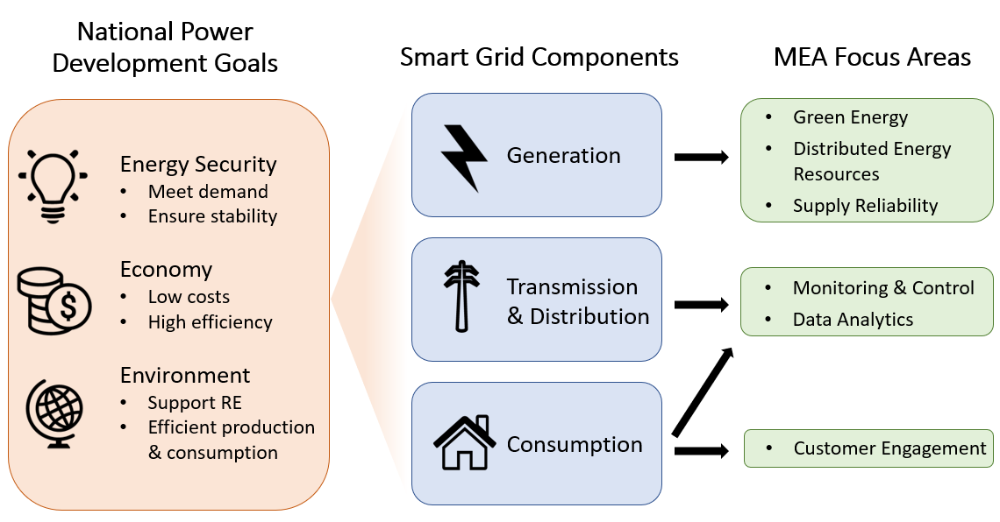
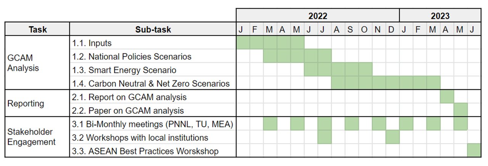

```{r setup, echo = FALSE}
source("thailand_data_functions.R")
source("thailand_aggregate_groups.R")
source("conversions.R")
knitr::opts_chunk$set(results = "hide", echo=FALSE, out.width = "75%", fig.align='center', message = F, warning = F, error = F, eval = T)
library(tidyverse)
```


<!-- Allow href to tabsets --> 

```{js}
window.onload = function() {
  document.querySelector('a[href="' + window.location.href.match("#.*$") + '"]').click();
}

function goToTab() {
  var hash = String(window.location.href.match("#.*$"));
  var target = document.querySelector("a[role = 'tab'][href='" + hash + "']");
  if (target !== null) {
    var greatgrandparent = target.parentElement.parentElement.parentElement;
    if (greatgrandparent.getAttribute("role") == "tabpanel") {
      document.querySelector("a[role = 'tab'][href='#" + greatgrandparent.getAttribute("id") + "']").click();
    }
    target.click();
    target.scrollIntoView();
  }
}
window.onload = function() {
  setTimeout(goToTab, 100);
}
window.onhashchange = goToTab;
```


<!-- Set table styles -->

<style>
table {
  font-family: arial, sans-serif;
  border-collapse: collapse;
  width: 100%;
}

td, th {
  border: 1px solid #dddddd;
  text-align: left;
  padding: 8px;
}
</style>


<div class="header_logo">


</div>


<!-------------------------->
<!-------------------------->
# Executive Summary
<!-------------------------->
<!-------------------------->
<p align="center"> </p>

* **Motivation:** Growth in power demand, renewables, and changes in policies and resource availability will require significant evolution in grid planning. Current planning tools usually focus on near-term horizon (i.e., 5- to 10-year), and are inadequate to support long-term decisions about grid capacity and distribution infrastructure upgrades. Tools for integrated energy planning with both near-term and long-term time horizons could help MEA plan future activities. 
* **Objectives:** Energy sector development and modernization is required to support continued urbanization and socioeconomic growth while reducing environmental impact. The Pacific Northwest National Laboratory (PNNL) and Thammasat University will support Smart Grid planning for Bangkok by providing analysis and assessment of policy pathways using quantitative modeling approaches.
* **Approach:** Policy and technology trajectories will be modeled using the Global Change Analysis Model (GCAM), an integrated assessment model. GCAM will be used to conduct the detailed assessment of energy and electricity system transition over time in different policy and technology scenarios, and provide high-resolution information on power demand from buildings, transportation, and industry as well as power generation technologies. We will also examine how digitalization and smart technologies could change electricity load and implications for electricity generation. 
* **Expected Outcomes:** Outputs of GCAM will be used to 	inform MEA’s effort on grid moderation, especially for long-term holistic, integrated energy planning. Results will inform policy recommendations.

<br>

<!-------------------------->
<!-------------------------->
# Introduction & Motivation
<!-------------------------->
<!-------------------------->
<p align="center"> </p>

Urbanization is driving rapid socioeconomic growth in Thailand, posing challenges for power grids as energy demand increases. Maintaining stability, reliability, and affordability of electricity will be especially challenging as Thailand works toward increasing their renewable energy (RE) shares and decreasing their environmental impact in line with international agreements. These goals and challenges were highlighted in Thailand’s 2018 Power Development Plan, which emphasized three priorities: energy security, economy, and environment. Energy security encompasses the need for stability of power generation, transmission, and distribution to support socioeconomic development and resilience to energy crises. Economic priorities are to promote low cost, high efficiency electricity generation, keeping prices low for consumers to further facilitate socioeconomic growth. Lastly, the plan emphasizes reducing environmental impact by supporting RE development and increasing efficiency in production and consumption.

```{r logos_diagram, results = "show", fig.cap="**Figure 2.1: Organizations involved in this analysis.**"}
knitr::include_graphics("images/logo_diagram.png")
```

The US-ASEAN Smart Cities Partnership (USASCP) uses innovative approaches across sectors to address the challenges and opportunities of energy development and urbanization in ASEAN Member States. The U.S. Department of Energy’s Pacific Northwest National Laboratory (PNNL) is partnering with Thammasat University and the Metropolitan Electricity Authority (MEA) of Thailand to supplement Bangkok’s existing Smart City roadmap plans by providing integrated modeling and assessment capabilities. PNNL’s Global Change Analysis Model (GCAM) is a global model integrating socioeconomics, energy, land use, water, and climate systems. PNNL, in collaboration with the Thammasat University modeling team, will use GCAM to assess the trajectories and outcomes of Smart City pathways for Bangkok and focus on the implications for the energy system in this analysis. The results of this analysis will aid MEA in their Smart City planning and implementation (Figure 2.1)


<br>

<!-------------------------->
<!-------------------------->
# Objectives
<!-------------------------->
<!-------------------------->
<p align="center"> </p>

```{r purpose_diagram, results = "show", fig.cap="**Figure 3.1: Role of MEA's Smart Grid initiatives in Thailand's national power development goals.**"}

```

MEA supports energy sector plans for Bangkok by implementing Smart Grid development. The Smart Grid framework uses technological innovation to promote efficiency and reliability in power generation, transmission, and distribution systems while ensuring that the grid can both keep up with growing demand and accommodate RE expansion. Smart Grid approaches vary based on stakeholder needs but may include decentralizing generation, facilitating bidirectional data communication across the grid, integrating automation and monitoring, and providing opportunities for demand side management.

Thailand’s 2015 national Smart Grid master plan lays out plans to modernize its power sector through 2036 in line with the Smart Grid framework. In accordance with this national roadmap, MEA is developing Bangkok’s Smart Grid system by building capacity in the following areas:

* Monitoring and Control
* Data Analytics
* Supply Reliability
* Distributed Energy Resources Integration
* Green Energy
* Customer Engagement

Examples of planned technologies and policies include load forecasting, smart meter infrastructure, microgrids, energy storage systems, electric vehicle charging, and improved customer management systems, among others.

The collaboration between PNNL, Thammasat University, and MEA will support the long-term assessment of these plans and the analysis of their contribution to Thailand’s national socioeconomic growth, power development, and and environmental impact reduction goals (Figure 3.1). Based on results of the modeling approach detailed below, PNNL and Thammasat University will provide an analysis of pathways for grid modernization in Bangkok and possible trajectories towards a Bangkok Smart City in 2050.

<br>

<!-------------------------->
<!-------------------------->
# Approach
<!-------------------------->
<!-------------------------->
<p align="center"> </p>

Integrated Assessment Models (IAMs) are computational models that use links and feedbacks between socioeconomic and environmental systems to assess the implications of technology and policy choices in the context of global climate change. IAMs can provide a holistic approach to energy sector planning by considering multi-sector dynamics and global processes. GCAM, an IAM developed at PNNL, incorporates socioeconomics, energy, land use, water, and climate system (Figure 4.1). The model is global but can also be used to assess specific regions and fine scale processes; PNNL has developed both Thailand and Bangkok regions within the model for national and city level analyses. GCAM utilizes the most up to date data on population, GDP, technology characteristics, policies, resource availabilities, and other inputs. It has the detailed representation of energy technologies in different sectors, including electricity, buildings, transportation, industry, hydrogen production, and other energy supply sectors. The model produces both historical and projected future outputs based on this information. These outputs include greenhouse gas emissions, electricity prices, energy supply and demand, and other indicators at five-year time steps from a historical baseline year to the desired end year. PNNL and Thammasat University's modeling team will use GCAM to assess the implications of MEA’s Smart Grid plans for Bangkok through the year 2100.

```{r GCAM_diagram, results = "show", fig.cap="**Figure 4.1: Conceptual diagram of GCAM.**"}
knitr::include_graphics("images/GCAM_diagram.png")
```


<br>


<!-------------------------->
<!-------------------------->
# Scenarios {.tabset}
<!-------------------------->
<!-------------------------->
<p align="center"> </p>

PNNL, in consultation with Thammasat University and MEA, will develop a set of scenarios for GCAM modeling based on Thailand’s national energy policies and plans as well as MEA’s Smart Grid plans for Bangkok. The impacts of policies and technologies will be assessed in GCAM through associated changes to markets, efficiency assumptions, energy generation shares, and other multi-sector factors. GCAM will predict future outcomes under each scenario; these outcomes may include greenhouse gas emissions, energy supply and demand, market penetration of different technologies, electricity prices, and other relevant indicators of policy impacts. The scenarios will include the following:

* **National Policies:** Scenario integrating existing national energy development plans and energy and emissions reduction policies.
* **Extended National Policies:** Scenario additionally including extended sustainable development measures implemented in other countries.
* **Bangkok Smart Energy:** Scenario integrating MEA's plans for Bangkok grid modernization and digitalization along with national policies. 
* **Carbon Neutral Thailand:** Scenario using most efficient pathway to national carbon neutrality by 2050.
* **Net-Zero Thailand:** Scenario using most efficient pathway to net-zero national CO2 emissions by 2065

<!-------------------------->
## National Policies
<!-------------------------->

**National Policies Scenario:** This scenario integrates all of Thailand's national power development plans, as well as standards, regulations, and measures to promote energy efficiency, renewable energy expansion, and reduction of greenhouse gas emissions. These include the future power plant capacity changes reported in the Power Development Plan 2018-2037 (PDP2018) and the Renewable and Alternative Energy Development Plan 2018-2037 (AEDP2018). The scenario also incorporates the country’s planned energy conservation measures included the Energy Efficiency Plan 2018-2037 (EEP2018), the Transportation System Development Plan 2018-2037, and other policy documents. Policies and measures in this scenario span the power, transportation, buildings, and industry sectors. The table below summarizes the policies incorporated in the Mandatory National Policies scenario.

```{r national policy table, results = 'show'}
library(pander)
myTable = data.frame(
    Sector     = c("Energy Supply",
                  "Transportation",
                  "Buildings",
                  "Industry"),
    Policies = c("* Power Development Plan 2018-2037\
                 \n * Renewable and Alternative Energy Development Plan 2018-2037",
                 "* Vehicle emissions standards\
                 \n * Emissions-based excise tax structure",
                 "* Building Energy Codes enforcement",
                 "* Energy Efficiency Resource Standards")
    ) 
pander::pander(myTable, keep.line.breaks = TRUE, style = "grid", justify = 'left', split.tables=Inf, caption = "Table 5.1.1. Policies included in the National Policies scenario.")
```


<!-------------------------->
## Extended National Policies
<!-------------------------->

**Extended National Policies Scenario:** This scenario includes additional sustainable development measures that have been implemented in other countries and regions along vwith the plans and policies in the National Policies scenario. These include more aggresive power transitions, enhanced energy and emissions regulations, and economic incentives. The table below summarizes the additional policies incorporated in the Extended National Policies scenario. Note that this scenario also incorporates the national policies included in the Mandatory National Policies scenario.

```{r extended national policy table, results = 'show'}
library(pander)
myTable = data.frame(
    Sector     = c("Energy Supply",
                  "Transportation",
                  "Buildings & Industry"),
    Policies = c("* Increased RE and CCS\
                 \n * Coal and gas development constraints",
                 "* Enhanced vehicle emissions standards\
                 \n * Electric vehicle subsidies\
                 \n * Fuel Economy Standards",
                 "* Enhanced Building Energy Codes\
                 \n * Enhanced Minimum Energy Performance Standards")
    ) 
pander::pander(myTable, keep.line.breaks = TRUE, style = "grid", justify = 'left', split.tables=Inf, caption = "Table 5.2.1. Policies included in the Extended National Policies scenario.")

```

<!-------------------------->
## Smart Energy
<!-------------------------->

**Bangkok Smart Energy Scenario:** This scenario incorporates the national-level policies included in the National Policies scenario as well as MEA’s grid modernization and digitalization plans for Bangkok. These plans include Smart Grid distribution system technologies, improved data management, and integration of microgrids and energy storage systems into the grid. Also included are transport sector plans, including EV charging system development, as well as measures for energy management and demand response in other sectors. The table below summarizes several components of MEA’s grid modernization and digitalization plans, along with the capabilities of GCAM integrated assessment modeling for each component.

```{r smart energy table, results = 'show'}
library(pander)
myTable = data.frame(
    'Sector'     = c("Monitoring & Control",
                  "Data Analytics",
                  "Supply Reliability",
                  "DER Integration",
                  "Green Energy",
                  "Customer Engagement"),
    'Policies & Technologies' = c("* Network analysis and load forecasting\
                 \n * Increased transmission control\
                 \n * Communication systems for identifying and addressing faults",
                 "* Advanced Metering Infrastructure\
                 \n * Outage management & data communication technology\
                 \n * Smart Energy Data Analytics Center",
                 "* Support increasing electricity demand & fully cover service area",
                 "* Microgrid system\
                 \n * Energy storage system\
                 \n * Building & Factory Energy Management Systems",
                 "* Electricity purchase from waste-to-energy plants\
                 \n * Household solar & community power plant project\
                 \n * EV promotion & smart charging",
                 "* Customer management systems & information access"),
    'GCAM Capabilities' = c("* Access long-term impacts of increased transmisison efficiency on the energy sector",
                "* Analyze how advanced metering can affect electricity demand & load management",
                "* Examine changes in future electricity demand in response to policy & technology changes",
                "* Project RE shares under microgrid & energy storage scenarios\
                \n * Assess how energy management systems will impact energy use by each sector",
                "* Assess how contributions from green energy sources impact generation mix in the long-term\
                \n * Reveal impacts of EV initiatives on transport sector and emissions",
                "* Integrate demand response impacts into energy conservation planning"), 
    check.names = FALSE
    ) 
pander::pander(myTable, keep.line.breaks = TRUE, style = "grid", justify = 'left', split.tables=Inf, caption = "Table 5.3.1. Policies and technologies included in the Bangkok Smart Energy scenario.")

```

<!-------------------------->
## Carbon Neutral and Net Zero
<!-------------------------->

**Net Zero and Carbon Neutral Thailand Scenarios:** At the 2021 United Nations climate change conference (COP26), Thailand’s prime minister announced the country’s goal to reach carbon neutrality by 2050 and net zero CO2 emissions by 2065. The carbon neutrality and net zero Thailand scenario represents the most economically efficient pathways for Thailand to reach carbon neutrality by 2050 and net zero CO2 emissions by 2065 given the energy policies included in the extended national policies scenario. This pathway will be found using GCAM’s solving capabilities. The outcomes of this scenario will provide insight into the role that the Bangkok metropolitan area will need play in Thailand’s decarbonization and highlight additional measures that may be needed.

<br>

<!-------------------------->
<!-------------------------->
# Scope {.tabset}
<!-------------------------->
<!-------------------------->
<p align="center"> </p>

<!-------------------------->
## Spatial
<!-------------------------->

```{r scope map, results = "show", out.extra='style="float:right; padding:10px"', out.width="50%"}
knitr::include_graphics("images/MEA_BMA_boundaries_map.png")
```

PNNL’s assessment will encompass outcomes both on the national level and the city level, with the city level analysis including the three provinces served by MEA within the Bangkok metropolitan area. The map to the right shows these provinces (Figure 6.1.1): the green region includes Bangkok as well as the two other provinces served by MEA (Nonthaburi and Samut Prakan), while the shaded region includes only Bangkok itself, which is the area governed under the Bangkok Metropolitan Administration (BMA). For the city level analysis, results will be reported for each province individually as well as for the aggregated MEA service area.

```{r, fig.cap="**Figure 6.1.1. Map of analysis regions**", fig.align="right", results="show"}

```

<br>

<!-------------------------->
## Temporal
<!-------------------------->

Scenarios will be assessed up from the year 2015 to the year 2100, with the GCAM analysis conducted at five-year intervals within this range.


<p align="center"> </p>

<br>

<!-------------------------->
<!-------------------------->
# Expected Outcomes {.tabset}
<!-------------------------->
<!-------------------------->

<p align="center"> </p>

As illustrated above, GCAM will offer capacity for planning and decision-making in addition to MEA’s current capabilities. Benefits of GCAM and the integrated modeling approach include the following:

* **Climate change context:** Since GCAM integrates water and climate systems, it will provide a more nuanced analysis of Smart Grid pathways in the context of ongoing climate change. GCAM considers the bi-directional relationship between climate and energy: climate change impacts electricity demand and power system stability and reliability, while power generation contributes to climate change.
* **Long-term assessment:** GCAM will offer long-term projections of the impacts of Smart Grid technologies and policies, beyond the time frame already proposed in Thailand’s Smart Grid plan.
* **Technology analysis:** Using GCAM’s technology scenario capabilities, PNNL will be able to assess the impacts of specific technology implementations on electricity demand, generation, emissions, and prices far into the future.
* **Holistic approach:** GCAM analyzes the multi-sector impacts of policies and technologies, supporting the integration of MEA's Smart Grid development into the Smart City initiative. GCAM's holistic approach will provide insight into how MEA's Smart Grid plans fit within Thailand's broader goals for socioeconomic development and reduction of environmental impact.

These capabilities will enrich MEA's current capacity for grid planning and analyzing Smart City pathways.

<!-------------------------->
## Key Indicators
<!-------------------------->

The GCAM output for each scenario will include the following indicators calculated at 5-year timesteps through the year 2100 in the study region, as specified in the Spatial and Temporal Scope section.

```{r outputs table, results = 'show'}
library(pander)
myTable = data.frame(
    Indicator = c("Electricity generation", 
                  "Installed power capacity",
                  "Energy demand",
                  "Final energy consumption",
                  "CO2 emissions",
                  "Electricity price",
                  "Transport service output"),
    Description = c("Amount of electricity generated (total & by generation technology",
                    "Power capacity of power plants (total & by generation technology",
                    "Amount of energy demanded (total & by sector",
                    "Amount of energy consumed (total & by sector",
                    "Amount of CO2 emitted (total & by sector",
                    "Price of electricity for consumer by sector",
                    "Output of each type of transportation"),
    Units = c("terawatt-hours (TWh)",
              "TWh",
              "Exajoules (EJ)",
              "EJ",
              "metric tons CO2 equivalent (MT CO2)",
              "US dollars ($USD)",
              "passenger-kilometers (pass-km)")
    ) 
pander::pander(myTable, keep.line.breaks = TRUE, style = "grid", justify = 'left', split.tables=Inf, caption = "Table 7.1.1. Key indicators reported for each scenario.")

```

<!-------------------------->
## Model Results
<!-------------------------->

PNNL and Thammasat University will present GCAM results showing relevant outcomes of the modeled scenarios up to the year 2100. These results could include greenhouse gas emissions, energy supply and demand, electricity price, and technology penetration, among other indicators. PNNL will work with MEA to determine which indicators are the most important to consider when assessing the impact of Smart Grid policies and technologies. 

<!-------------------------->
## Analysis and Recommendations
<!-------------------------->

PNNL, in collaboration with Thammasat University and MEA, will summarize and interpret the GCAM results for each policy pathway and impact indicator. This will include a discussion of how these results relate to MEA’s smart grid efforts and Bangkok’s current Smart City roadmaps and potential additional roadmaps. Based on the GCAM results, PNNL and Thammasat University will provide recommendations for policy pathways that best meet the goals of MEA’s Smart Grid development while making the desired contributions to Thailand’s holistic Smart City and power development objectives. The process of analysis and recommendations will involve engagement and feedback from MEA in order to provide information that best addresses MEA’s planning needs. Final results will be summarized in both a report and a peer-reviewed paper.


<br>


<!-------------------------->
<!-------------------------->
# Timeline
<!-------------------------->
<!-------------------------->
<p align="center"> </p>

Below is the proposed timeline for GCAM analysis, reports, and stakeholder engagement. 

```{r timeline, results = "show", out.width="100%", fig.cap="**Figure 8.1: Proposed timeline.**"}

```


<!-------------------------->
<!-------------------------->
# Inputs {.tabset}
<!-------------------------->
<!-------------------------->

<!-------------------------->
## Socioeconomics  {.tabset .tabset-pills}
<!-------------------------->

This section describes the socioeconomic (population and GDP) inputs used to define Thailand's subregions (Bangkok, Nonthaburi, Samut Prakan, and Rest of Thailand) in GCAM. Historical data were available from 1990 to 2020 for all regions, and  projections published by local agencies were available for some future periods. See the <a href = "thailand_appendix.html#122_Revised_Data"> Appendix </a> for a full list of data sources and assumptions used to infer socioeconomic trends for the remaining future periods.


### Population


#### Historical Trends {-}

Thailand's National Economic and Social Development Board (NESDB) and Department of Provincial Administration (DOPA) have reported annual population both nationally and by province from 1990 to 2020. The plot below shows national population, revealing a consistent upward trend.

```{r recent national trends pop, fig.dim=c(8,4), fig.cap="**Figure 9.1.1.1 Thailand National Population from 2011 to 2020. Source: [NESDB](https://view.officeapps.live.com/op/view.aspx?src=https%3A%2F%2Fwww.nesdc.go.th%2Fewt_dl_link.php%3Fnid%3D3507%26filename%3Dsocial&wdOrigin=BROWSELINK)**"}
pop_inputs <- read.csv("../data/Thailand/socioeconomic_inputs/thammasat_pop.csv")
pop_inputs$region <- factor(pop_inputs$region, levels = c("Thailand", "Bangkok", "Samut Prakan", "Nonthaburi", "Rest of Thailand"),
                            labels = c("Thailand", "Bangkok", "Samut Prakan", "Nonthaburi", "Rest of Thailand"))

pop_recent_chart_national <- rchart::chart(
  dplyr::mutate(
    dplyr::filter(pop_inputs, 
                  year >= 1990, year <= 2020,
                  region == "Thailand"),
      value = value/1000000),
  save = F, aspect_ratio = 0.5)

pop_recent_chart_national$chart_param +
    ggplot2::ylab("Population (millions)") +
    ggplot2::theme(legend.position = "none",
                   strip.text = ggplot2::element_blank(),
                   plot.margin = ggplot2::unit(c(0,0,0.5,0), "cm"))

```

<br>
<br>

```{r recent MEA province trends pop, fig.align="right", out.extra='style="float:right; padding:10px"'}
pop_recent_chart_mea <- rchart::chart(
  dplyr::mutate(
    dplyr::filter(pop_inputs, 
                  year >= 1990, year <= 2020,
                  !(region %in% c("Thailand", "Rest of Thailand"))), 
      value = value/1000000),
  save = F, aspect_ratio = 0.4)

pop_recent_chart_mea$chart_region_absolute +
    ggplot2::facet_wrap(~region, nrow = 3,
                        scales = "free_y", strip.position = "right") +
    ggplot2::ylab("Population (millions)") +
    ggplot2::theme(legend.position = "none",
                   plot.margin = ggplot2::unit(c(0,0,0.5,0), "cm"))
```

Of the three provinces in MEA's service area (Bangkok, Nonthaburi, and Samut Prakan), Bangkok has the highest population. Between 1990 and 2020, population increased steadily in Nonthaburi and Samut Prakan, reaching nearly 1.3 million in Nonthaburi and 1.35 million in Samut Prakan. Meanwhile, Bangkok's population showed much more variation, reaching its peak at almost 5.85 million in 2003 and declining to under 5.6 million in 2020.


```{r, fig.cap="**Figure 9.1.1.2. Population from 1990 to 2020 in the MEA service area. Source: [DOPA](https://stat.bora.dopa.go.th/new_stat/webPage/statByYear.php)**", fig.align="right", results="show"}

```

<br>
<br>

#### Future Projections {-}

NESDB publishes populations projections for the whole country as well as by province for the period from 2021 to 2040. At the national level, the United Nations (UN) provides population projections through 2100; provincial populations after 2040 were estimated by applying the provinces' shares of national population in 2040 to the UN projected national population through 2100. The charts below show estimated population in Thailand and the three MEA provinces from 1990 to 2100. The shaded regions represent future population projections reported by NESDB. 

```{r historical & future trends pop, fig.dim=c(8,4), fig.cap="**Figure 9.1.1.3. Historical and projected future population in Thailand and MEA area. Sources: [NESDB](https://view.officeapps.live.com/op/view.aspx?src=https%3A%2F%2Fwww.nesdc.go.th%2Fewt_dl_link.php%3Fnid%3D3507%26filename%3Dsocial&wdOrigin=BROWSELINK) and [DOPA](https://stat.bora.dopa.go.th/new_stat/webPage/statByYear.php) (1990-2020), [NESDB](https://view.officeapps.live.com/op/view.aspx?src=https%3A%2F%2Fwww.nesdc.go.th%2Fewt_dl_link.php%3Fnid%3D3507%26filename%3Dsocial&wdOrigin=BROWSELINK) (2021-2040) and [United Nations](https://population.un.org/wpp/Download/Standard/Population/) (Post-2040)**"}
pop_all <- rchart::chart(
  dplyr::mutate(
    dplyr::filter(pop_inputs, region != "Rest of Thailand",
                  year >= 1990),
    value = value/1000000),
  save = F, aspect_ratio = 0.4
)


pop_all$chart_region_absolute +
    ggplot2::annotate("rect", xmin=2021, xmax=2040, ymin=-Inf, ymax=Inf,
                       alpha = 0.2, color = NA) +
    ggplot2::facet_wrap(~region, nrow = 2, 
                        scales = "free_y") +
    ggplot2::ylab("Population (millions)") +
    ggplot2::theme(legend.position = "none",
                   plot.margin = ggplot2::unit(c(0,0,0.5,0), "cm"))
```

<br>
<br>


<!-------------------------->
<!-------------------------->
### GDP (THB)
<!-------------------------->
<!-------------------------->

The plots below show GDP and Gross Provincial Product (GPP; analagous to GDP at the provincial scale) in units of Thai Baht at current prices for each year. See <a href=thailand_appendix.html#11_GCAM_GDP_Units> appendix </a> for plots showing GDP and per capita GDP at constant prices (2005 $USD), which are the untis accepted by GCAM.

#### Historical Trends {-}

Thailand's National Economic and Social Development Board (NESDB) has reported both annual GDP from 1990 to 2020 and annual GPP from 1995 to 2020. The plots below show GDP and GPP at current market prices during these periods.

```{r historical national trends gdp, fig.dim=c(8,4), fig.cap="**Figure 9.1.2.1. Thailand national GDP from 1990 to 2020 at current market prices. Source: [NESDB](https://www.nesdc.go.th/main.php?filename=ni_page)**"}
gdp_baht <- read.csv("../data/Thailand/socioeconomic_inputs/baht_current_thammasat_gdp_v2.csv")
  
gdp_baht$region <- factor(gdp_baht$region, 
                            levels = c("Thailand", "Bangkok", "Samut Prakan",
                                       "Nonthaburi", "Rest of Thailand"))

# plot gdp
gdp_recent_chart_national_baht <- rchart::chart(
  dplyr::mutate(
    dplyr::filter(gdp_baht, 
                  year <= 2020,
                  region == "Thailand"),
      value = value/1000000),
  save = F, aspect_ratio = 0.5)

gdp_recent_chart_national_baht$chart_param +
    ggplot2::ylab("GDP (Trillions Baht)") +
    ggplot2::theme(legend.position = "none",
                   strip.text = ggplot2::element_blank(),
                   axis.title.y = ggplot2::element_text(size = 12),
                   plot.margin = ggplot2::unit(c(0,1,0,1), "cm"))

```

<br>
<br>

```{r recent MEA province trends gdp baht, out.width="70%", out.extra='style="float:right; padding:10px"'}

# plot gdp
gdp_recent_chart_mea_baht <- rchart::chart(
  dplyr::mutate(
    dplyr::filter(gdp_baht, 
                  year <= 2020,
                  !(region %in% c("Thailand", "Rest of Thailand"))), 
      value = value/1000000),
  save = F, aspect_ratio = 0.4)

gdp_recent_chart_mea_baht$chart_region_absolute +
    ggplot2::facet_wrap(~region, nrow = 3,
                        scales = "free_y", strip.position = "right") +
    ggplot2::ylab("GDP (Trillions Baht)") +
    ggplot2::theme(legend.position = "none",
                   plot.margin = ggplot2::unit(c(0,0,0.5,0), "cm"))
```

Of the three MEA provinces, Bangkok had the highest GDP in 2020, reaching over 5 trillion Baht. Samut Prakan had the next highest GDP of about 650 million Baht, while Nonthaburi's GDP was about 350 million Baht. All three provinces experienced relatively consistent GDP growth in the period from 2010 to 2019.

```{r, fig.cap="**Figure 9.1.2.2. GPP from 1995 to 2020 in the MEA service area at current market prices. Source: [NESDB](https://www.nesdc.go.th/main.php?filename=gross_regional)**", fig.align="right", results="show"}

```

<br>
<br>

#### Future Projections {-}

To project future GDP and GPP, we used a combination of NESDB projections and other assumptions. For GDP, NESDB has provided a projection through 2050 in Thailand's Long Term Plan (LTP). Beyond 2050, we made an assumption that per capita GDP would reach 52,000 USD (at the 2005 price) by 2100 based on historical trajectories of several developed countries. We assumed that GPP future trajectories would vary between provinces, with Bangkok's per capita GDP reaching around 70,000 USD (at the 2005 price) by 2100, consistent with income ranges of some high income cities at present. The plots below show estimated GDP and GPP in THB from 2021 to 2100 based on these assumptions, as well as GDP/GPP growth rates during this period.

```{r historical & future trends gdp baht, fig.dim=c(8,4), fig.cap="Figure 9.1.2.3. **Projected future GDP in Thailand and GPP in the MEA provinces.**"}
# plot gdp
gdp_all_baht <- rchart::chart(
  dplyr::mutate(
    dplyr::filter(gdp_baht, region != "Rest of Thailand",
                  year > 2020),
    value = value/1000000),
  save = F, aspect_ratio = 0.4
)

gdp_all_baht$chart_region_absolute +
    ggplot2::facet_wrap(~region, nrow = 2, 
                        scales = "free_y") +
    ggplot2::ylab("GDP (Trillions Baht)") +
    ggplot2::theme(legend.position = "none",
                   plot.margin = ggplot2::unit(c(0,0,0.5,0), "cm"))
```

<br>
<br>

```{r historical & future trends gdp growth rate baht, fig.dim=c(8,4), fig.cap="Figure 9.1.2.4. **Projected future growth rates of GDP in Thailand and GPP in the MEA provinces.**"}

# calculate growth rates
gdp_growth_baht <- dplyr::mutate(
  dplyr::arrange(dplyr::group_by(gdp_baht, region),
      year, .by_group = T), 
  value = (value-dplyr::lag(value))/lag(value)*100
)

# plot gdp growth rate
gdp_growth_charts <- rchart::chart(
  dplyr::mutate(
    dplyr::filter(gdp_growth_baht, region != "Rest of Thailand",
                  year > 2021)),
  save = F, aspect_ratio = 0.4
)

gdp_growth_charts$chart_region_absolute +
    ggplot2::facet_wrap(~region, nrow = 2, 
                        scales = "free_y") +
    ggplot2::ylab("GDP growth rate (%)") +
    ggplot2::theme(legend.position = "none",
                   plot.margin = ggplot2::unit(c(0,0,0.5,0), "cm"))
```

<!-------------------------->
<!-------------------------->
### Per Capita GDP (THB)
<!-------------------------->
<!-------------------------->

#### Historical Trends {-}

The plots below shows Thailand's historical per capita GDP from 1990 to 2020.

```{r historical national pcgdp baht, fig.dim=c(8,4), fig.cap="Figure 9.1.3.1. **Per capita GDP from 1990 to 2019 at current market prices.**"}
pcgdp_baht <- read.csv("../data/Thailand/socioeconomic_inputs/baht_current_thammasat_pcgdp_v2.csv")
pcgdp_baht$region <- factor(pcgdp_baht$region, 
                            levels = c("Thailand", "Bangkok", "Samut Prakan",
                                       "Nonthaburi", "Rest of Thailand"))

# plot gdp
pcgdp_historical_chart_national_baht <- rchart::chart(
  dplyr::mutate(
    dplyr::filter(pcgdp_baht, 
                  year <= 2020,
                  region == "Thailand"),
      value = value*1000),
  save = F, aspect_ratio = 0.5)

pcgdp_historical_chart_national_baht$chart_param +
    ggplot2::ylab("Per Capita GDP (Thousands Baht)") +
    ggplot2::theme(legend.position = "none",
                   strip.text = ggplot2::element_blank(),
                   plot.margin = ggplot2::unit(c(0,0,0.5,0), "cm"))


```

<br>
<br>

```{r historical MEA province trends pcgdp baht, out.width="70%", out.extra='style="float:right; padding:10px"'}

pcgdp_historical_chart_mea_baht <- rchart::chart(
  dplyr::mutate(
    dplyr::filter(pcgdp_baht, 
                  year <= 2020,
                  !(region %in% c("Thailand", "Rest of Thailand"))), 
      value = value*1000),
  save = F, aspect_ratio = 0.4)

pcgdp_historical_chart_mea_baht$chart_region_absolute +
    ggplot2::facet_wrap(~region, nrow = 3,
                        scales = "free_y", strip.position = "right") +
    ggplot2::ylab("Per Capita GDP (Thousands Baht)") +
    ggplot2::theme(legend.position = "none",
                   plot.margin = ggplot2::unit(c(0,0,0.5,0), "cm"))
```
These plots show per capita GDP in the three MEA provinces during the same period.

```{r, fig.cap="**Figure 9.1.3.2. GPP from 1995 to 2020 in the MEA service area provinces at current market prices.**", fig.align="right", results="show"}

```

<br>
<br>

#### Future Projections {-}

The plot below shows per capita GDP/GPP (THB) and growth rates from 1990 to 2100 for each region.

```{r future  pcgdp baht, fig.dim=c(8,4), fig.cap="**Figure 9.1.3.3. Per capita GDP/GPP through 2100 in each region**"}

# plot gdp
pcgdp_all_baht <- rchart::chart(
  dplyr::mutate(
    dplyr::filter(pcgdp_baht, region != "Rest of Thailand",
                  year > 2020),
    value = value),
  save = F, aspect_ratio = 0.4
)

pcgdp_all_baht$chart_region_absolute +
    ggplot2::facet_wrap(~region, nrow = 2, 
                        scales = "free_y") +
    ggplot2::ylab("Per Capita GDP (Millions Baht)") +
    ggplot2::theme(legend.position = "none",
                   plot.margin = ggplot2::unit(c(0,0,0.5,0), "cm"))
```

<br>
<br>

```{r future pcgdp growth rate baht, fig.dim=c(8,4), fig.cap="Figure 9.1.3.4. **Projected future growth rates of per capita GDP in Thailand and per capita GPP in the MEA provinces.**"}

# calculate growth rates
pcgdp_growth_baht <- dplyr::mutate(
  dplyr::arrange(dplyr::group_by(pcgdp_baht, region),
      year, .by_group = T), 
  value = (value-dplyr::lag(value))/lag(value)*100
)

# plot gdp growth rate
pcgdp_growth_charts <- rchart::chart(
  dplyr::mutate(
    dplyr::filter(pcgdp_growth_baht, region != "Rest of Thailand",
                  year > 2021)),
  save = F, aspect_ratio = 0.4
)

pcgdp_growth_charts$chart_region_absolute +
    ggplot2::facet_wrap(~region, nrow = 2, 
                        scales = "free_y") +
    ggplot2::ylab("Per capita GDP growth rate (%)") +
    ggplot2::theme(legend.position = "none",
                   plot.margin = ggplot2::unit(c(0,0,0.5,0), "cm"))
```


<!-------------------------->
<!-------------------------->
# GCAM Initial Diagnostics {.tabset}
<!-------------------------->
<!-------------------------->


<!-------------------------->
## Electricity {.tabset .tabset-pills}
<!-------------------------->


### National

```{r national electricity consumption data prep}
# read in local data
local_national_elec_consump <- read.csv(
  "../data/Thailand/scenario_outputs/initial_diagnostics/local_national_elec_consump.csv"
)

# read in and process gcam data
gcam_elec_consump_sector <- process_gcam_data(
  read.csv("../data/Thailand/scenario_outputs/initial_diagnostics/queryoutall_elec_consump_sector.csv", 
           skip = 1, check.names = F),
  processed = F, sector, input)

# aggregate gcam sectors
gcam_elec_consump_agg_sector <- dplyr::bind_rows(
  aggregate_rows(gcam_elec_consump_sector, class, "industry", industry_group),
  aggregate_rows(gcam_elec_consump_sector, class, "buildings", building_group),
  aggregate_rows(gcam_elec_consump_sector, class, "transport", transport_group)  
)

# aggregate local sectors
local_national_elec_consump_agg <- dplyr::bind_rows(
  aggregate_rows(local_national_elec_consump, class, "industry", industry_group_local),
  aggregate_rows(local_national_elec_consump, class, "buildings", building_group_local),
  aggregate_rows(local_national_elec_consump, class, "other", other_group_local)
)

# combine local and national data
all_elec_consump_sector_national <- dplyr::full_join(
  dplyr::ungroup(local_national_elec_consump_agg),
  dplyr::ungroup(gcam_elec_consump_agg_sector))

```

The figures below compare GCAM output with local data for national electricity consumption (total and by sector).

```{r national consumption total charts, fig.dim=c(8,4), fig.cap="**Figure 10.1.1.1. National electricity consumption from 2005 to 2100 (left) and 2011 to 2020 (right) from GCAM output (blue) and local utilities data (red). Local data source: [Energy Policy and Planning office](http://www.eppo.go.th/index.php/en/en-energystatistics/electricity-statistic)**"}

# 2010 to 2020 total elec consump
elec_consump_national_chart_local <- rchart::chart(
  dplyr::filter(all_elec_consump_sector_national, year <= 2020, year >= 2010),
  save = F)

p1 <- elec_consump_national_chart_local$chart_param_Thailand +
        ggplot2::theme(strip.text = ggplot2::element_blank(),
                       plot.margin = ggplot2::unit(c(0,0,1,0), "cm")) +
        ggplot2::ylab("") + ggplot2::ggtitle("") 


# 2000 to 2100 total elec consump
elec_consump_national_chart_gcam <- rchart::chart(
  dplyr::filter(all_elec_consump_sector_national, year >= 2000),
  save = F
)

p2 <- elec_consump_national_chart_gcam$chart_param_Thailand +
        ggplot2::ylab("Electricity Consumption (EJ)") +
        ggplot2::theme(strip.text = ggplot2::element_blank(),
                       plot.margin = ggplot2::unit(c(0,0,1,0), "cm"),
                       axis.title.y = ggplot2::element_text(size = 12)) +
        ggplot2::ggtitle("")


ggpubr::ggarrange(p2, p1, nrow = 1, common.legend = T, legend = "bottom") +
  ggplot2::theme(plot.margin = ggplot2::unit(c(0,0,0.5,0), "cm"))

```

<br> 
<br>


```{r national consumption by sector 1, fig.dim=c(9,4), fig.cap="**Figure 10.1.1.2. National electricity consumption by sector in 2015 and 2020 from local utilities data (left) and GCAM output (right). Local data source: [Energy Policy and Planning office](http://www.eppo.go.th/index.php/en/en-energystatistics/electricity-statistic)**"}
# 2015, 2020 chart elec consump by sector
elec_consump_sector_national_chart_local <- rchart::chart(
  dplyr::filter(all_elec_consump_sector_national, year %in% c(2015,2020)),
  save = F)

elec_consump_sector_national_chart_local$chart_class_Thailand +
  ggplot2::ylab("Electricity Consumption (EJ)") +
  ggplot2::ggtitle("") +
  ggplot2::theme(plot.margin = ggplot2::unit(c(0,0,0.5,0), "cm"),
                 axis.title.y = ggplot2::element_text(size = 12))
```

<br>
<br>

The figure below shows the long-term GCAM output for national electricity consumption.

```{r national consumption by sector 2, fig.dim=c(9,4), fig.cap="**Figure 10.1.1.3. GCAM output national electricity consumption by sector from 2010 to 2100**"}
#2000 to 2100 chart for elec consump by sector, just gcam
elec_consump_sector_national_chart_gcam <- rchart::chart(
  dplyr::filter(all_elec_consump_sector_national,
                year >= 2010, year <= 2100,
                scenario == "Ref"), save = F, aspect_ratio = 0.5)

elec_consump_sector_national_chart_gcam$chart_class_Thailand + 
  ggplot2::ylab("Electricity Consumption (EJ)") +
  ggplot2::ggtitle("") + 
  ggplot2::theme(strip.text = ggplot2::element_blank(),
                 plot.margin = ggplot2::unit(c(0,0,0.5,0), "cm"))

```

<br>
<br>

<p align="center"> </p>

### MEA service area

```{r total consumption MEA area data prep}
# read in local data
local_mea_elec_consump <- tidyr::drop_na(read.csv(
  "../data/Thailand/scenario_outputs/initial_diagnostics/local_mea_area_elec_consump.csv"
))

# aggregate local sectors
local_mea_elec_consump_agg <- dplyr::bind_rows(
  aggregate_rows(local_mea_elec_consump, class, "industry", industry_group_local),
  aggregate_rows(local_mea_elec_consump, class, "buildings", building_group_local),
  aggregate_rows(local_mea_elec_consump, class, "other", other_group_local)
)

# combine local and national data
all_elec_consump_sector_mea <- dplyr::full_join(
  local_mea_elec_consump_agg, gcam_elec_consump_agg_sector)

```

The figures below compare GCAM output with local data for electricity consumption in the MEA service area (total and by sector).

```{r consumption MEA area total charts, fig.dim=c(8,4), fig.cap="Figure 10.1.2.1. **Electricity consumption in the MEA service area from 2005 to 2100 (left) and 2011 to 2020 (right) from GCAM output (blue) and MEA data (red). Local data source: [Energy Policy and Planning office](http://www.eppo.go.th/index.php/en/en-energystatistics/electricity-statistic)**"}

# 2010 to 2020 total elec consump
elec_consump_mea_chart_local <- rchart::chart(
  dplyr::filter(all_elec_consump_sector_mea, year <= 2020, year >= 2010),
  save = F)

p1 <- elec_consump_mea_chart_local$`chart_param_MEA area` +
        ggplot2::theme(strip.text = ggplot2::element_blank(),
                       plot.margin = ggplot2::unit(c(0,0,1,0), "cm")) +
        ggplot2::ylab("") +
        ggplot2::ggtitle("") 


# 2000 to 2100 total elec consump
elec_consump_mea_chart_gcam <- rchart::chart(
  dplyr::filter(all_elec_consump_sector_mea, year >= 2000),
  save = F
)

p2 <- elec_consump_mea_chart_gcam$`chart_param_MEA area` +
        ggplot2::ylab("Electricity Consumption (EJ)") +
        ggplot2::theme(strip.text = ggplot2::element_blank(),
                       plot.margin = ggplot2::unit(c(0,0,1,0), "cm"),
                       axis.title.y = ggplot2::element_text(size = 12)) +
        ggplot2::ggtitle("")


ggpubr::ggarrange(p2, p1, nrow = 1, common.legend = T, legend = "bottom") +
  ggplot2::theme(plot.margin = ggplot2::unit(c(0,0,0.5,0), "cm"))

```

<br>
<br>


```{r consumption by sector MEA area chart 1, fig.dim=c(9,4), fig.cap="**Figure 10.1.2.2. Electricity consumption by sector in the MEA service area from MEA data (left) and GCAM output (right) in 2015 and 2020. Local data source: [Energy Policy and Planning office](http://www.eppo.go.th/index.php/en/en-energystatistics/electricity-statistic)**"}

# chart of electricity consumption by sector (2010 to 2020)
elec_consump_sector_mea_chart_local <- rchart::chart(
  dplyr::filter(all_elec_consump_sector_mea, year %in% c(2015, 2020)),
  save = F)

elec_consump_sector_mea_chart_local$`chart_class_MEA area` +
  ggplot2::ylab("Electricity Consumption (EJ)") +
  ggplot2::ggtitle("")

```

<br>
<br>

The figure below shows the long-term GCAM output for electricity consumption by sector in the MEA service area.

``` {r consumption by sector MEA area chart 2, fig.dim=c(9,4), fig.cap="**Figure 10.1.2.3. GCAM output electricity consumption by sector in the MEA service area from 2010 to 2100**"}
# chart of electricity consumption by sector (gcam, 2000 to 2100)
elec_consump_sector_gcam_chart <- rchart::chart(dplyr::filter(
  all_elec_consump_sector_mea, scenario == "Ref", year >= 2010),
  save = F, aspect_ratio = 0.5)

elec_consump_sector_gcam_chart$`chart_class_MEA area` +
  ggplot2::ylab("Electricity Consumption (EJ)") +
  ggplot2::theme(strip.text = ggplot2::element_blank(),
                 plot.margin = ggplot2::unit(c(0,0,0.5,0), "cm")) +
  ggplot2::ggtitle("")


```

<br>
<br>

<p align="center"> </p>

<!-------------------------->
## Energy {.tabset .tabset-pills}
<!-------------------------->


### National

```{r national final energy data prep}

######## by fuel ########

# read in and process gcam data
gcam_final_energy_fuel <- process_gcam_data(
  read.csv("../data/Thailand/scenario_outputs/initial_diagnostics/queryoutall_final_energy_consump_fuel_sector.csv", skip = 1, check.names = F),
  processed = F, input, sector
)


# read in local data
local_national_final_energy_fuel <- read.csv(
  "../data/Thailand/scenario_outputs/initial_diagnostics/local_national_final_energy_fuel.csv",
  check.names = F
)


# aggregate fuel types for local data
local_national_final_energy_fuel_agg <- dplyr::bind_rows(
  aggregate_rows(local_national_final_energy_fuel, class,
                 "electricity", electricity_group_local),
  aggregate_rows(local_national_final_energy_fuel, class,
                 "refined liquids", liquids_group_local),
  aggregate_rows(local_national_final_energy_fuel, class,
                 "gas", gas_group_local),
  aggregate_rows(local_national_final_energy_fuel, class,
                 "coal", coal_group_local)
)


# combine local and gcam data
all_national_final_energy_fuel <- dplyr::bind_rows(
  local_national_final_energy_fuel_agg, gcam_final_energy_fuel
)


######### by sector ##########
# read in and process gcam data
gcam_final_energy_sector <- process_gcam_data(
   read.csv("../data/Thailand/scenario_outputs/initial_diagnostics/queryoutall_final_energy_consump_fuel_sector.csv", skip = 1, check.names = F),
  processed = F, sector, input
)

# aggregate gcam sectors
gcam_final_energy_agg_sector <- dplyr::bind_rows(
  aggregate_rows(gcam_final_energy_sector, class, "industry", industry_group),
  aggregate_rows(gcam_final_energy_sector, class, "buildings", building_group),
  aggregate_rows(gcam_final_energy_sector, class, "transport", transport_group),
)

# read in local data
local_national_final_energy_sector <- dplyr::mutate(read.csv(
  "../data/Thailand/scenario_outputs/initial_diagnostics/local_national_final_energy_sector.csv",
  check.names = F
),value = value/23884.58966)

# aggregate fuel types for local data
local_national_final_energy_sector_agg <- dplyr::bind_rows(
  aggregate_rows(local_national_final_energy_sector, class,
                 "industry", industry_group_local),
  aggregate_rows(local_national_final_energy_sector, class,
                 "buildings", building_group_local),
  aggregate_rows(local_national_final_energy_sector, class,
                 "transport", transport_group_local)
)

# combine gcam and local data
all_national_final_energy_sector <- dplyr::bind_rows(
  local_national_final_energy_sector_agg, gcam_final_energy_agg_sector
)


```

The figures below compare GCAM output with local data for national final energy consumption (total, by fuel type, and by sector).

```{r national final energy total charts, fig.dim=c(8,4), fig.cap="Figure 10.2.1.1. **National total final energy from 1986 to 2100 (left) and 1986 to 2020 (right) from GCAM output (blue) and local data (red). Local data source: [Energy Policy and Planning Office](http://www.eppo.go.th/index.php/en/en-energystatistics/summary-statistic?orders[publishUp]=publishUp&issearch=1)**"}

# total final energy, 1986 to 2020
national_final_energy_chart_local <- rchart::chart(
  dplyr::filter(all_national_final_energy_fuel, year <= 2020),
  save = F
)

p1 <- national_final_energy_chart_local$chart_param_Thailand +
        ggplot2::ylab("") +
        ggplot2::theme(strip.text = ggplot2::element_blank(),
                       plot.margin = ggplot2::unit(c(0,0,0.5,0), "cm")) +
        ggplot2::ggtitle("") 


# total final energy, 1986 to 2100
national_final_energy_chart_gcam <- rchart::chart(
  all_national_final_energy_fuel,
  save = F
)

p2 <- national_final_energy_chart_gcam$chart_param_Thailand +
      ggplot2::ylab("Energy (EJ)") +
      ggplot2::theme(strip.text = ggplot2::element_blank()) +
      ggplot2::ggtitle("") +
      ggplot2::scale_y_continuous(breaks = scales::pretty_breaks())

ggpubr::ggarrange(p2, p1, nrow = 1, common.legend = T, legend = "bottom", 
                  widths = c(1,0.975)) +
  ggplot2::theme(plot.margin = ggplot2::unit(c(0,0,0.5,0), "cm"))

```

<br>
<br>

```{r national final energy consumption by fuel 1, fig.dim=c(9,4), fig.cap="**Figure 10.2.1.2. National total final energy by fuel from local data (left) and GCAM output (right) from 2005 to 2020. Local data source: [Energy Policy and Planning Office](http://www.eppo.go.th/index.php/en/en-energystatistics/summary-statistic?orders[publishUp]=publishUp&issearch=1)**"}

# 2005 to 2020 final energy by fuel (gcam and local)
final_energy_fuel_chart_local <- rchart::chart(dplyr::filter(
  all_national_final_energy_fuel, year >= 2005, year <= 2020, year %% 5 == 0),
  save = F)

final_energy_fuel_chart_local$chart_class_Thailand +
  ggplot2::ggtitle("") + ggplot2::ylab("Energy (EJ)")
```

<br>
<br>

```{r national final energy consumption by sector 1, fig.dim=c(9,4), fig.cap="**Figure 10.2.1.3. National total final energy by sector from local data (left) and GCAM output (right) in 2015. Local data source: [Energy Efficiency Plan 2018](https://www.dede.go.th/ewt_w3c/ewt_dl_link.php?filename=index&nid=54495)**"}

# 2005 to 2020 final energy by fuel (gcam and local)
final_energy_sector_chart_local <- rchart::chart(dplyr::filter(
  all_national_final_energy_sector, year == 2015),
  save = F)

final_energy_sector_chart_local$chart_class_Thailand +
  ggplot2::ggtitle("") + ggplot2::ylab("Energy (EJ)")
```

<br>
<br>

The figures below show the long-term GCAM output for national final energy consumption by fuel and by sector.

``` {r national final energy consumption by fuel 2, fig.dim=c(9,4), fig.cap="**Figure 10.2.1.4. GCAM output national total final energy consumption by fuel from 2010 to 2100**"}
# 2005 to 2100 final energy by fuel (just gcam)
final_energy_fuel_chart_gcam <- rchart::chart(dplyr::filter(
  all_national_final_energy_fuel, year >= 2010, scenario == "Ref"),
  save = F, break_interval = 3, aspect_ratio = 0.5)

final_energy_fuel_chart_gcam$chart_class_Thailand +
  ggplot2::ggtitle("") + ggplot2::ylab("Energy (EJ)") +
  ggplot2::theme(plot.margin = ggplot2::unit(c(0,0,0.5,0), "cm"))

```

<br>
<br>


```{r national final energy consumption by sector charts, fig.dim=c(9,4), fig.cap="**Figure 10.2.1.5. GCAM output national total final energy consumption by sector from 2010 to 2100**"}


# 2000 to 2100, gcam only (no local data available)
gcam_final_energy_agg_sector_chart <- rchart::chart(
  dplyr::filter(gcam_final_energy_agg_sector, year > 2010),
  save = F, aspect_ratio = 0.5
)

gcam_final_energy_agg_sector_chart$chart_class_Thailand +
  ggplot2::ggtitle("") + ggplot2::ylab("Energy (EJ)") +
  ggplot2::theme(plot.margin = ggplot2::unit(c(0,0,0.5,0), "cm"))

```

<br>
<br>

<p align="center"> </p>

### MEA service area

We have not identified any local data regarding energy consumption in the MEA service area. Below are some initial energy results from GCAM for the region.

```{r MEA energy consumption total, fig.dim = c(9,4), fig.cap="**Figure 10.2.2.1. GCAM output of total final energy consumption in the MEA service area**"}
gcam_final_energy_agg_sector_chart$`chart_param_MEA area` +
  ggplot2::ggtitle("") + ggplot2::ylab("Energy Consumption (EJ)")
  ggplot2::theme(legend.position = "none",
                 plot.margin = ggplot2::unit(c(0,0,0.5,0), "cm"))

```

<br>
<br>

```{r MEA energy consumption by sector, fig.dim = c(9,4), fig.cap="**Figure 10.2.2.2. GCAM output of total final energy consumption by sector in the MEA service area**"}
gcam_final_energy_agg_sector_chart$`chart_class_MEA area`+
  ggplot2::ggtitle("") + ggplot2::ylab("Energy Consumption (EJ)") +
  ggplot2::theme(plot.margin = ggplot2::unit(c(0,0,0.5,0), "cm"))
```

<br>
<br>

```{r MEA energy consumption by fuel, fig.dim = c(9,4), fig.cap="**Figure 10.2.2.3. GCAM output of total final energy consumption by fuel in the MEA service area**"}
final_energy_fuel_chart_gcam$`chart_class_MEA area`+
  ggplot2::ggtitle("") + ggplot2::ylab("Energy Consumption (EJ)") +
  ggplot2::theme(plot.margin = ggplot2::unit(c(0,0,0.5,0), "cm"))
```

<br>
<br>

<p align="center"> </p>

<!-------------------------->
## Emissions {.tabset .tabset-pills}
<!-------------------------->


### National

```{r national co2 emissions data prep}
C_to_CO2 <- 44/12

# read in and process gcam data
gcam_co2_emissions_sector <- dplyr::mutate(
  process_gcam_data(
  read.csv("../data/Thailand/scenario_outputs/initial_diagnostics/queryoutall_co2_emissions_sector.csv", skip = 1, check.names = F),
  processed = F, sector), value = value * C_to_CO2, Units = "MTCO2"
)

# aggregate gcam sectors
gcam_co2_emissions_agg_sector <- dplyr::bind_rows(
  aggregate_rows(gcam_co2_emissions_sector, class, "industry", industry_group),
  aggregate_rows(gcam_co2_emissions_sector, class, "buildings", building_group),
  aggregate_rows(gcam_co2_emissions_sector, class, "transportation", transport_group),
  aggregate_rows(gcam_co2_emissions_sector, class, "electricity", elec_group),
  aggregate_rows(gcam_co2_emissions_sector, class, "other", other_group)
)

# read in local data 
local_national_co2_emissions_sector <- dplyr::mutate(
  read.csv(
  "../data/Thailand/scenario_outputs/initial_diagnostics/local_national_co2_emissions_sector.csv",
  check.names = F)
)

# combine local and gcam data
all_national_co2_emissions_sector <- dplyr::bind_rows(
  gcam_co2_emissions_agg_sector, local_national_co2_emissions_sector
)
```

The figures below compare GCAM output with local data for national CO2 emissions (total and by sector).

```{r national co2 emissions total, fig.dim=c(8,4), fig.cap="**Figure 10.3.1.1. National total CO2 emissions from 1986 to 2100 (left) and 1986 to 2015 (right) from GCAM output (blue) and local data (red). Local data source: [Energy Policy and Planning Office](http://www.eppo.go.th/index.php/en/en-energystatistics/co2-statistic)**"}

# 1986 to 2015
national_co2_emissions_plot_local <- rchart::chart( dplyr::filter(
  all_national_co2_emissions_sector, year >= 1986, year <= 2015),
  save = F
)

p1 <- national_co2_emissions_plot_local$chart_param_Thailand +
  ggplot2::ylab("") + ggplot2::ggtitle("") +
  ggplot2::theme(strip.text = ggplot2::element_blank())


# 2000 to 2100
national_co2_emissions_plot_gcam <- rchart::chart(dplyr::filter(
  all_national_co2_emissions_sector, year >= 1986),
  save = F)

p2 <- national_co2_emissions_plot_gcam$chart_param_Thailand +
  ggplot2::ylab("CO2 emissions (MT)") + ggplot2::ggtitle("") +
  ggplot2::theme(strip.text = ggplot2::element_blank())

ggpubr::ggarrange(p2, p1, align = "h", common.legend = T, legend = "bottom") +
  ggplot2::theme(plot.margin = ggplot2::unit(c(0,0,0.5,0), "cm"))


```

<br>
<br>

```{r national co2 emissions by sector plots, fig.dim=c(9,4), fig.cap="**Figure 10.3.1.2. National total CO2 emissions by sector from local data (left) and GCAM output (right) from 2005 to 2015. Local data source: [Energy Policy and Planning Office](http://www.eppo.go.th/index.php/en/en-energystatistics/co2-statistic)**"}

# 2005 to 2015
national_co2_emissions_sector_plot_local <- rchart::chart( dplyr::filter(
  all_national_co2_emissions_sector, year >= 2005, year <= 2015, year %% 5 == 0),
  save = F
)

national_co2_emissions_sector_plot_local$chart_class_Thailand +
  ggplot2::ggtitle("") + ggplot2::ylab("CO2 Emissions (MT)") +
  ggplot2::theme(plot.margin = ggplot2::unit(c(0,0,0.5,0), "cm"))
```

<br>
<br>

The figure below shows the long-term GCAM output for national CO2 emissions by sector.

```{r national co2 emissions by sector gcam, fig.dim = c(9,4), fig.cap="**Figure 10.3.1.3. GCAM output of national total CO2 emissions by sector through 2100**"}
# 2000 to 2100 (just gcam)
national_co2_emissions_sector_plot_gcam <- rchart::chart(dplyr::filter(
  all_national_co2_emissions_sector, year >= 2000, scenario == "Ref"),
  save = F)

national_co2_emissions_sector_plot_gcam$chart_class_Thailand +
  ggplot2::ggtitle("") + ggplot2::ylab("CO2 Emissions (MT)") +
  ggplot2::theme(strip.background = ggplot2::element_blank(),
                 plot.margin = ggplot2::unit(c(0,0,0.5,0), "cm"))


```

<br>
<br>

<p align="center"> </p>

### MEA service area

We have not identified any local data concerning emissions in the MEA service area. Below are some initial emissions results from GCAM for the region.

```{r MEA co2 emissions total gcam, fig.dim = c(9,4), fig.cap="**Figure 10.3.2.1 GCAM output of total CO2 emissions in the MEA service area**"}
mea_co2_emissions_sector_plot_gcam <- rchart::chart(dplyr::filter(
  all_national_co2_emissions_sector, year >= 2000, scenario == "Ref"),
  save = F, aspect_ratio = 0.5)

mea_co2_emissions_sector_plot_gcam$`chart_param_MEA area` +
  ggplot2::ggtitle("") + ggplot2::ylab("CO2 Emissions (MT)") +
  ggplot2::theme(legend.position = "none",
                 plot.margin = ggplot2::unit(c(0,0,0.5,0), "cm"))
```

<br>
<br>

```{r MEA co2 emissions sector gcam, fig.dim = c(9,4), fig.cap="**Figure 10.3.2.2. GCAM output of total CO2 emissions in the MEA service area**"}

mea_co2_emissions_sector_plot_gcam$`chart_class_MEA area` +
  ggplot2::ggtitle("") + ggplot2::ylab("CO2 Emissions (MT)") +
  ggplot2::theme(plot.margin = ggplot2::unit(c(0,0,0.5,0), "cm"))
```


<br>
<br>

<p align="center"> </p>

<!-------------------------->
## Transportation {.tabset .tabset-pills}
<!-------------------------->

### National

```{r transportation data prep}
# read in local data
local_national_transport_output <- read.csv(
  "../data/Thailand/scenario_outputs/initial_diagnostics/local_national_transport_output.csv",
  check.names = F
)

local_national_transport_ghg <- read.csv(
  "../data/Thailand/scenario_outputs/initial_diagnostics/local_transport_ghg_emissions_mode.csv",
  check.names = F, skip = 1
)

# read in and process gcam data
gcam_transport_output_subsector <- process_gcam_data(
  read.csv("../data/Thailand/scenario_outputs/initial_diagnostics/queryoutall_transport_output_tech.csv", skip = 1, check.names = F),
  processed = F, subsector, sector, technology
)

gcam_ghg_subsector <- process_gcam_data(conv_ghg_co2e(process_gcam_data(
  read.csv("../data/Thailand/scenario_outputs/initial_diagnostics/queryoutall_non_co2_emissions_subsector.csv", skip = 1, check.names = F))),
  processed = T, subsector, sector, GHG)

# gcam_ghg_subsector_raw <- process_gcam_data(
#   read.csv("data/Thailand/outputs/initial_diagnostics/queryoutall_non_co2_emissions_subsector.csv", skip = 1, check.names = F),
#   processed = F, subsector, sector, GHG)

# aggregate GCAM data
gcam_transport_output_agg_subsector <- dplyr::bind_rows(
  aggregate_rows(gcam_transport_output_subsector, class, "road", road_group),
  aggregate_rows(gcam_transport_output_subsector, class, "rail", rail_group),
  aggregate_rows(gcam_transport_output_subsector, class, "ship", ship_group),
  aggregate_rows(gcam_transport_output_subsector, class, "air", air_group)
)

gcam_transport_ghg <- dplyr::bind_rows(
  aggregate_rows(gcam_ghg_subsector, class, "road", road_group),
  aggregate_rows(gcam_ghg_subsector, class, "rail", rail_group),
  aggregate_rows(gcam_ghg_subsector, class, "ship", ship_group),
  aggregate_rows(gcam_ghg_subsector, class, "air", air_group)
)

# gcam_transport_ghg_raw <- dplyr::bind_rows(
#   aggregate_rows(gcam_ghg_subsector_raw, class, "road", road_group),
#   aggregate_rows(gcam_ghg_subsector_raw, class, "rail", rail_group),
#   aggregate_rows(gcam_ghg_subsector_raw, class, "ship", ship_group),
#   aggregate_rows(gcam_ghg_subsector_raw, class, "air", air_group)
# )

# combine GCAM and local data
all_national_transport_sector <- dplyr::ungroup(    dplyr::bind_rows(gcam_transport_output_agg_subsector, local_national_transport_output))

all_transport_ghg <- dplyr::ungroup(dplyr::bind_rows(gcam_transport_ghg, local_national_transport_ghg))

```

The figures below compare GCAM output with local data for national greenhouse gas emissions in the transportation sector (total and by mode of transport).

```{r national transport ghg total, fig.dim = c(9,4), fig.cap="**Figure 10.4.1.1. National GHG emissions in transportation from GCAM output (blue) and local data (red). Local data source: [Ministry of Transport](https://datagov.mot.go.th/dataset/transport-ghg)**"}
transport_ghg_chart1 <- rchart::chart(dplyr::filter(
  all_transport_ghg, year >= 2000),
  save = F
  )

p1 <- transport_ghg_chart1$chart_param_Thailand +
  ggplot2::ylim(c(0, 350)) +
  ggplot2::ylab("GHG Emissions (MT CO2eq)") + ggplot2::ggtitle("") +
  ggplot2::theme(axis.title.y = ggplot2::element_text(size = 12))

transport_ghg_chart2 <- rchart::chart(dplyr::filter(
  all_transport_ghg, year >= 2000, year <= 2020),
  save = F
  )

p2 <- transport_ghg_chart2$chart_param_Thailand +
  ggplot2::ylim(c(0, 100)) +
  ggplot2::ylab("") + ggplot2::ggtitle("")

ggpubr::ggarrange(p1, p2, nrow = 1, common.legend = T, legend = "bottom") +
  ggplot2::theme(plot.margin = ggplot2::unit(c(0,0,0.5,0), "cm"))


```

<br>
<br>

```{r transport ghg by mode, fig.dim=c(9,4), fig.cap="**Figure 10.4.1.2. National GHG emissions by mode of transportation from local data (left) and GCAM output (right). Local data source: [Ministry of Transport](https://datagov.mot.go.th/dataset/)**"}
transport_ghg_sector_chart <- rchart::chart(dplyr::filter(
  all_transport_ghg, year %in% c(2005, 2010, 2015)),
  save = F)

transport_ghg_sector_chart$chart_class_Thailand +
  ggplot2::ggtitle("") + ggplot2::ylab("GHG Emissions (MT CO2eq)") +
  ggplot2::theme(axis.title.y = ggplot2::element_text(size = 12),
                 plot.margin = ggplot2::unit(c(0,0,0.5,0), "cm"))
```

<br>
<br>

The figure below shows the long-term GCAM output for national greenhouse gas emissions by mode of transport.

```{r transport ghg by mode gcam, fig.dim=c(9,4), fig.cap="**Figure 10.4.1.3. GCAM output of national GHG emissions by mode of transportation through 2100**"}
transport_ghg_sector_chart2 <- rchart::chart(dplyr::filter(
  all_transport_ghg, year >= 2010, scenario == "Ref"), 
  save = F, aspect_ratio = 0.5)

transport_ghg_sector_chart2$chart_class_Thailand +
  ggplot2::ggtitle("") + ggplot2::ylab("GHG Emissions (MT CO2eq)") +
  ggplot2::theme(axis.title.y = ggplot2::element_text(size = 12),
                 plot.margin = ggplot2::unit(c(0,0,0.5,0), "cm"))

```

<br>
<br>

<p align="center"> </p>

### MEA service area

We have not identified any local transportation data in the MEA service area. Below are some initial transportation results from GCAM for the region.

```{r total transportation ghg mea, fig.dim=c(9,4), fig.cap="**Figure 10.4.2.1. GCAM output of total GHG emissions from transportation in the MEA service area**"}
transport_ghg_sector_chart2$`chart_param_MEA area` +
  ggplot2::ggtitle("") + ggplot2::ylab("GHG Emissions (MT CO2eq)") +
  ggplot2::theme(plot.margin = ggplot2::unit(c(0,0,0.5,0),"cm")) +
  ggplot2::ylim(c(0,35))

```

<br>
<br>

```{r total transportation ghg mea mode, fig.dim=c(9,4), fig.cap="**Figure 10.4.2.2 GCAM output of GHG emissions by transportation mode in the MEA service area**"}
transport_ghg_sector_chart2$`chart_class_MEA area` +
  ggplot2::ggtitle("") + ggplot2::ylab("GHG Emissions (MT CO2eq)") +
  ggplot2::theme(plot.margin = ggplot2::unit(c(0,0,0.5,0),"cm")) 

```

<br>
<br>

<p align="center"> </p>

<!-------------------------->
## Buildings {.tabset .tabset-pills}
<!-------------------------->

We have not identified local data regarding buildings energy consumption. Below are some initial GCAM outputs for the national and MEA service area regions.

```{r national buildings energy data prep}

# read in and process gcam data
gcam_buildings_final_energy_fuel <- process_gcam_data(
  read.csv("../data/Thailand/scenario_outputs/initial_diagnostics/queryoutall_building_final_energy_service_fuel.csv", skip = 1, check.names = F),
  processed = F, input, sector
)

gcam_buildings_final_energy_sector <- process_gcam_data(
  read.csv("../data/Thailand/scenario_outputs/initial_diagnostics/queryoutall_building_final_energy_service_fuel.csv", skip = 1, check.names = F),
  processed = F, sector, input
)

# aggregate gcam classes
gcam_buildings_final_energy_agg_sector <- dplyr::bind_rows(
  aggregate_rows(gcam_buildings_final_energy_sector, class, "commercial", comm_group),
  aggregate_rows(gcam_buildings_final_energy_sector, class, "residential", resid_group)
)

gcam_buildings_final_energy_agg_fuel <- dplyr::bind_rows(
  aggregate_rows(gcam_buildings_final_energy_fuel, class, "biomass", biomass_group),
  aggregate_rows(gcam_buildings_final_energy_fuel, class, "electricity", electricity_group),
  aggregate_rows(gcam_buildings_final_energy_fuel, class, "refined liquids", liquids_group),
  aggregate_rows(gcam_buildings_final_energy_fuel, class, "gas", gas_group)
)


```

```{r GCAM buildings energy total all regions, fig.dim=c(9,4), fig.cap="**Figure 10.5.1. GCAM output for buildings final energy consumption in all regions from 2005 to 2100**"}
gcam_buildings_energy_sector_chart <- rchart::chart(dplyr::filter(
  gcam_buildings_final_energy_sector, 
    region %in% c("MEA area", "Rest of Thailand", "Thailand"),
    year > 2000),
  save = F, aspect_ratio = 0.5)

gcam_buildings_energy_sector_chart$chart_region_absolute +
  ggplot2::ylab("Buildings Energy Consumption (EJ)") +
  ggplot2::theme(axis.title.y = ggplot2::element_text(size = 12),
                 plot.margin = ggplot2::unit(c(0,0,0.5,0), "cm"))
```

<br>
<br>

```{r GCAM buildings energy consumption by sector, fig.dim=c(9,4), fig.cap="**Figure 10.5.2. GCAM output for buildings energy consumption by sector in the MEA service area (top) and the rest of Thailand (bottom)**"}


p1 <- gcam_buildings_energy_sector_chart$`chart_class_MEA area` +
  ggplot2::ylab("Buildings Energy Consumption (EJ)") +
  ggplot2::theme(axis.title.y = ggplot2::element_text(size = 12))

p2 <- gcam_buildings_energy_sector_chart$`chart_class_Rest of Thailand` +
  ggplot2::ylab("") 

ggpubr::ggarrange(p1, p2, common.legend = T, nrow = 1, legend = "bottom") +
  ggplot2::theme(plot.margin = ggplot2::unit(c(0,0,0.5,0), "cm"))
```


<br>
<br>

<p align="center"> </p>

<!-------------------------->
<!-------------------------->
# Summary Figures {.tabset}
<!-------------------------->
<!-------------------------->


<!-------------------------->
## Overall Indicators {.tabset}
<!-------------------------->

```{r summary 1 data}
# ghg emissions by sector
ghg_sector <- filter(
  process_gcam_data(
    read.csv("../data/Thailand/scenario_outputs/summary/queryoutall_non_co2_emissions_sector.csv",
            skip = 1, check.names = F),
    processed = F, class_name = sector, GHG), 
  region %in% c("Thailand", "MEA area"),
  year >= 2015, year <= 2070) 

# ghg emissions by aggregate sector
ghg_agg_sector <-  dplyr::bind_rows(
  aggregate_rows(ghg_sector, class, "buildings", building_group),
  aggregate_rows(ghg_sector, class, "industry", industry_group),
  aggregate_rows(ghg_sector, class, "transport", transport_group)) %>% 
  mutate(param = "GHG emissions by sector")

# ghg emissions by gas
ghg_gas <- filter(process_gcam_data(
  read.csv("../data/Thailand/scenario_outputs/summary/queryoutall_non_co2_emissions_sector.csv",
           skip = 1, check.names = F),
  processed = F, class_name = GHG, sector) %>% 
  mutate(param = "GHG emissions by gas"),
  region %in% c("Thailand", "MEA area"),
  year >= 2015, year <= 2070)

# energy consumption by sector
energy_agg_sector <- filter(
  process_gcam_data(
    read.csv("../data/Thailand/scenario_outputs/summary/queryoutall_tf_energy_agg_sector.csv",
             skip = 1, check.names = F),
    processed = F, class_name = sector),
  region %in% c("Thailand", "MEA area"),
  year >= 2015, year <= 2070) %>% 
  mutate(param = "Energy consumption by sector")

# electricity generation by fuel
elec_gen_fuel <- filter(
  process_gcam_data(
    read.csv("../data/Thailand/scenario_outputs/summary/queryoutall_elec_gen_subsector.csv",
             skip = 1, check.names = F),
    processed = F, class_name = subsector, output),
  region %in% c("Thailand", "MEA area"),
  year >= 2015, year <= 2070) %>% 
  mutate(param = "Electricity generation by fuel")

# electricity consumption by sector
elec_sector <- filter(
  process_gcam_data(
    read.csv("../data/Thailand/scenario_outputs/summary/queryoutall_elec_consumption_sector.csv",
            skip = 1, check.names = F),
    processed = F, class_name = sector, input), 
  region %in% c("Thailand", "MEA area"),
  year >= 2015, year <= 2070)

# electricity consumption by aggregate sector
elec_agg_sector <-  dplyr::bind_rows(
  aggregate_rows(elec_sector, class, "buildings", building_group),
  aggregate_rows(elec_sector, class, "industry", industry_group),
  aggregate_rows(elec_sector, class, "transport", transport_group)) %>% 
  mutate(param = "Electricity consumption by sector")

# combine all params
set1_data <- ghg_agg_sector %>% 
  full_join(ghg_gas) %>% 
  full_join(energy_agg_sector) %>%
  full_join(elec_gen_fuel) %>% 
  full_join(elec_agg_sector)

```

### National

```{r summary national 1  plots, fig.dim = c(3,12)}
# ghg_sector_charts <- rchart::chart(filter(set1_data, region == "Thailand"),
#                                    save = F, chart_type = "class_absolute", aspect_ratio = 0.5)
# ghg_sector_charts$chart_class +
#   guides(fill = guide_legend(ncol = 2, bycol = TRUE))
```

### MEA area

```{r summary MEA 1  plots}
# ghg_sector_charts <- rchart::chart(filter(set1_data, region == "MEA area"),
#                                    save = F, chart_type = "class_absolute")
```

<!-------------------------->
## Sectoral Indicators {.tabset}
<!-------------------------->

### National

### MEA area

<!-------------------------->
<!-------------------------->
# References {.tabset}
<!-------------------------->
<!-------------------------->

<!-------------------------->
## Local Data
<!-------------------------->

### Socioeconomics {-}
* Historical national population (1990-2020): [National Economic and Social Development Board (NESDB)](https://view.officeapps.live.com/op/view.aspx?src=https%3A%2F%2Fwww.nesdc.go.th%2Fewt_dl_link.php%3Fnid%3D3507%26filename%3Dsocial&wdOrigin=BROWSELINK)
* Historical provincial population (1990-2020): [Department of Provincial Administration](https://stat.bora.dopa.go.th/new_stat/webPage/statByYear.php)
* National and provincial population projection (2021-2040) [NESDB](https://view.officeapps.live.com/op/view.aspx?src=https%3A%2F%2Fwww.nesdc.go.th%2Fewt_dl_link.php%3Fnid%3D3507%26filename%3Dsocial&wdOrigin=BROWSELINK)
* National population Projection (2041-2100): [United Nations](https://population.un.org/wpp/Download/Standard/Population/)
* Historical GDP and GPP (1990-2019): [NESDB](https://www.nesdc.go.th/main.php?filename=gross_regional)

### Electricity {-}
* Electricity consumption: [Energy Policy and Planning Office](http://www.eppo.go.th/index.php/en/en-energystatistics/electricity-statistic)

### Energy {-}
* Energy consumption: [Energy Policy and Planning Office](http://www.eppo.go.th/index.php/en/en-energystatistics/summary-statistic?orders[publishUp]=publishUp&issearch=1)

### Emissions {-}
* CO2 emissions: [Energy Policy and Planning Office](http://www.eppo.go.th/index.php/en/en-energystatistics/co2-statistic)

### Transportation {-}
* GHG emissions: [Ministry of Transport](https://datagov.mot.go.th/dataset/transport-ghg)

<br>

<p align="center"> </p>

<!-------------------------->
<!-------------------------->
# Appendix
<!-------------------------->
<!-------------------------->

See <a href = "thailand_appendix.html"> Appendix </a> for supplementary information.

