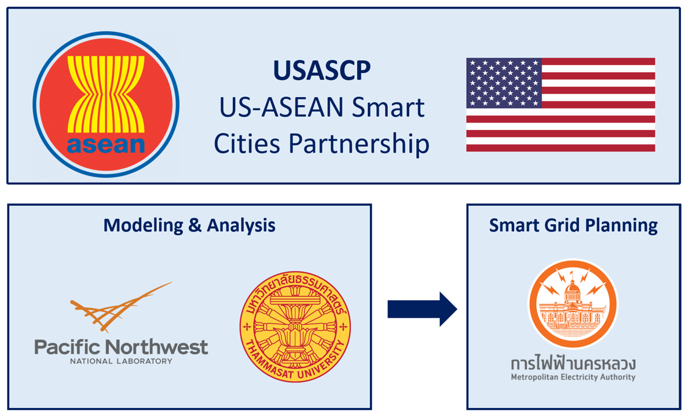

```{r setup, echo = FALSE, message=FALSE}
source("thailand_data_functions.R")
source("thailand_aggregate_groups.R")
source("conversions.R")
knitr::opts_chunk$set(
  results = "hide", 
  echo=FALSE, out.width = "75%", 
  fig.align='center', message = F, warning = F, error = F, eval = T)
library(tidyverse)
```

```{r child = 'header.rmd'}
```

<!-------------------------->
<!-------------------------->
# Executive Summary - Thailand
<!-------------------------->
<!-------------------------->
<p align="center"> </p>

```{r, results = "show", out.width = "90%", fig.align = 'left', }
knitr::include_graphics("images/exec_summary_thailand_01_insights.jpg")
```

<br>

```{r, results = "show", out.width = "100%", fig.align = 'center', fig.topcaption=TRUE, fig.cap = "Pathways to Carbon-Neutrality in 2050"}
knitr::include_graphics("images/exec_summary_thailand_02_waterfall.jpg")
```

<br>

<!-------------------------->
<!-------------------------->
# Background
<!-------------------------->
<!-------------------------->
<p align="center"> </p>

Urbanization is driving rapid socioeconomic growth in Thailand, posing challenges for power grids as energy demand increases. Maintaining stability, reliability, and affordability of electricity will be especially challenging as Thailand works toward increasing their renewable energy (RE) shares and decreasing their environmental impact in line with international agreements. These goals and challenges were highlighted in Thailand’s 2018 Power Development Plan, which emphasized three priorities: energy security, economy, and environment. Energy security encompasses the need for stability of power generation, transmission, and distribution to support socioeconomic development and resilience to energy crises. Economic priorities are to promote low cost, high efficiency electricity generation, keeping prices low for consumers to further facilitate socioeconomic growth. Lastly, the plan emphasizes reducing environmental impact by supporting RE development and increasing efficiency in production and consumption.

```{r logos_diagram, results = "show", fig.topcaption=TRUE, fig.cap="Project Partners"}

```

The U.S. Department of Energy’s Pacific Northwest National Laboratory (PNNL) is partnering with Thammasat University and the Metropolitan Electricity Authority (MEA) of Thailand to supplement Bangkok’s existing Smart City roadmap plans by providing integrated modeling and assessment capabilities. PNNL’s Global Change Analysis Model (GCAM) is a global model integrating socioeconomics, energy, land use, water, and climate systems. PNNL, in collaboration with the Thammasat University modeling team, will use GCAM to assess the trajectories and outcomes of Smart City pathways for Bangkok and focus on the implications for the energy system in this analysis. 

The collaboration between PNNL, Thammasat University, EPPO, EGAT, and MEA will support the long-term assessment of these plans and the analysis of their contribution to Thailand’s national socioeconomic growth, power development, and net-zero goals.

<br>

<!-------------------------->
<!-------------------------->
# Methodology
<!-------------------------->
<!-------------------------->
<p align="center"> </p>

Integrated Assessment Models (IAMs) are computational models that use links and feedbacks between socioeconomic and environmental systems to assess the implications of technology and policy choices in the context of global climate change. IAMs can provide a holistic approach to energy sector planning by considering multi-sector dynamics and global processes. GCAM, an IAM developed at PNNL, incorporates socioeconomics, energy, land use, water, and climate system. The model is global but can also be used to assess specific regions and fine scale processes; PNNL has developed both Thailand and Bangkok regions within the model for national and city level analyses. GCAM utilizes the most up to date data on population, GDP, technology characteristics, policies, resource availabilities, and other inputs. It has the detailed representation of energy technologies in different sectors, including electricity, buildings, transportation, industry, hydrogen production, and other energy supply sectors. The model produces both historical and projected future outputs based on this information. These outputs include greenhouse gas emissions, electricity prices, energy supply and demand, and other indicators at five-year time steps from a historical baseline year to the desired end year. PNNL and Thammasat University's modeling team will use GCAM to assess the implications of MEA’s Smart Grid plans for Bangkok through the year 2100.

```{r GCAM_diagram, results = "show", fig.topcaption=TRUE, fig.cap="Conceptual diagram of GCAM"}
knitr::include_graphics("images/GCAM_diagram.png")
```


<br>

PNNL’s assessment will encompass outcomes both on the national level and the city level, with the city level analysis including the three provinces served by MEA within the Bangkok metropolitan area. The map to the right shows these provinces: the green region includes Bangkok as well as the two other provinces served by MEA (Nonthaburi and Samut Prakan), while the shaded region includes only Bangkok itself, which is the area governed under the Bangkok Metropolitan Administration (BMA). For the city level analysis, results will be reported for each province individually as well as for the aggregated MEA service area.

<br>

```{r scope map, results = "show",  fig.topcaption=TRUE, fig.cap="Map of analysis regions in Thailand"}
knitr::include_graphics("images/MEA_BMA_boundaries_map.png")
```

<br>

Scenarios will be assessed up from the year 2015 to the year 2100, with the GCAM analysis conducted at five-year intervals within this range.

<br>

<!-------------------------->
<!-------------------------->
# Scenarios
<!-------------------------->
<!-------------------------->
<p align="center"> </p>

Three unique scenarios are developed to provide a comprehensive set of future pathways. The Business as Usual scenario uses historical energy and emissions, combined with expected future socioeconomic trajectories and baseline technology assumptions, to project future conditions in the absence of additional policies or constraints. The Policies scenario assumes that Thailand implements a set of policies in the power, buildings, industry, and transportation sectors consistent with current plans, priorities, and targets. The Carbon Neutral scenario combines these policies with an emissions constraint to determine the additional measures needed to reach carbon neutrality by 2050. The policies considered include Thailand's national power development plans, as well as standards, regulations, and measures to promote energy efficiency, renewable energy expansion, and reduction of greenhouse gas emissions.

* **Business as Usual:** This scenario uses a reference projection without imposing any policies or constraints.
* **Policies:** Policies representing existing city and national targets 
* **Carbon Neutral:** Scenario using most efficient pathway to national carbon neutrality by 2050.

<br>

<!-------------------------->
# Results
<!-------------------------->
<p align="center"> </p>

The following figures show results from the analysis to support each of the key insights. Further details and additional results can be found on [Modeling-Thailand page](modeling_thailand.html).


<br>

```{r, results = "show", out.width = "100%", fig.align = 'center'}
knitr::include_graphics("images/exec_summary_thailand_03_result1.jpg")
```

<br>

```{r, results = "show", out.width = "100%", fig.align = 'center'}
knitr::include_graphics("images/exec_summary_thailand_03_result2.jpg")
```

<br>

```{r, results = "show", out.width = "100%", fig.align = 'center'}
knitr::include_graphics("images/exec_summary_thailand_03_result3.jpg")
```

<br>

```{r, results = "show", out.width = "100%", fig.align = 'center'}
knitr::include_graphics("images/exec_summary_thailand_03_result4.jpg")
```

<br>

```{r, results = "show", out.width = "100%", fig.align = 'center'}
knitr::include_graphics("images/exec_summary_thailand_03_result5.jpg")
```

# {.unlisted .unnumbered}
```{r child = 'footer.rmd'}
```

