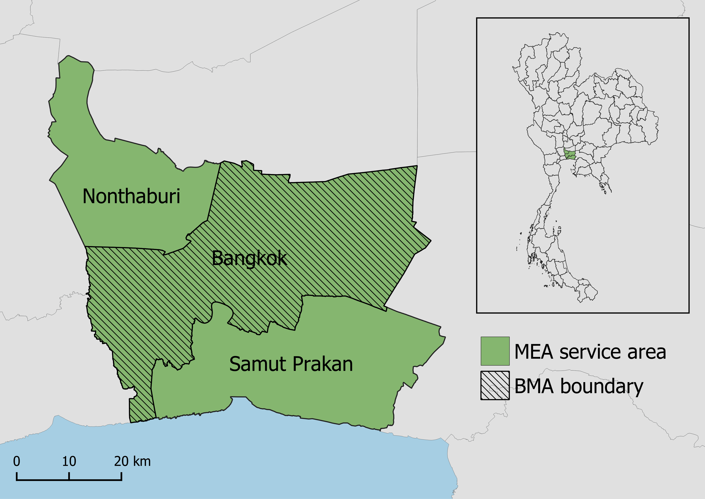
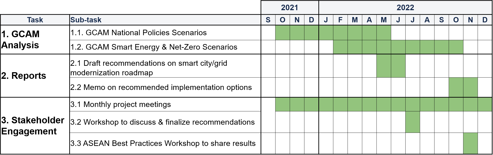

<div class="header_logo">

</div>

<!-------------------------->
<!-------------------------->
# Executive Summary
<!-------------------------->
<!-------------------------->
<p align="center"> </p>

* **Motivation:** Growth in power demand, renewables, and changes in policies and resource availability will require significant evolution in grid planning. Current planning tools usually focus on near-term horizon (i.e., 5- to 10-year), and are inadequate to support long-term decisions about grid capacity and distribution infrastructure upgrades. Tools for integrated energy planning with both near-term and long-term time horizons could help MEA plan future activities. 
* **Objectives:** Energy sector development and modernization is required to support continued urbanization and socioeconomic growth while reducing environmental impact. The Pacific Northwest National Laboratory (PNNL) will support Smart Grid planning for Bangkok by providing analysis and assessment of policy pathways using quantitative modeling approaches.
* **Approach:** Policy and technology trajectories will be modeled using the Global Change Analysis Model (GCAM), an integrated assessment model. GCAM will be used to conduct the detailed assessment of energy and electricity system transition over time in different policy and technology scenarios, and provide high-resolution information on power demand from buildings, transportation, and industry as well as power generation technologies. We will also examine how digitalization and smart technologies could change electricity load and implications for electricity generation. 
* **Expected Outcomes:** Outputs of GCAM will be used to 	inform MEA’s effort on grid moderation, especially for long-term holistic, integrated energy planning. Results will inform policy recommendations.

<br>

<!-------------------------->
<!-------------------------->
# Introduction & Motivation
<!-------------------------->
<!-------------------------->
<p align="center"> </p>

Urbanization is driving rapid socioeconomic growth in Thailand, posing challenges for power grids as energy demand increases. Maintaining stability, reliability, and affordability of electricity will be especially challenging as Thailand works toward increasing their renewable energy (RE) shares and decreasing their environmental impact in line with international agreements. These goals and challenges were highlighted in Thailand’s 2018 Power Development Plan, which emphasized three priorities: energy security, economy, and environment. Energy security encompasses the need for stability of power generation, transmission, and distribution to support socioeconomic development and resilience to energy crises. Economic priorities are to promote low cost, high efficiency electricity generation, keeping prices low for consumers to further facilitate socioeconomic growth. Lastly, the plan emphasizes reducing environmental impact by supporting RE development and increasing efficiency in production and consumption.

The US-ASEAN Smart Cities Partnership (USASCP) uses innovative approaches across sectors to address the challenges and opportunities of energy development and urbanization in ASEAN Member States. The U.S. Department of Energy’s Pacific Northwest National Laboratory (PNNL) is partnering with the Metropolitan Electricity Authority (MEA) of Thailand to supplement Bangkok’s existing Smart City roadmap plans by providing integrated modeling and assessment capabilities. PNNL’s Global Change Analysis Model (GCAM) is a global model integrating socioeconomics, energy, land use, water, and climate systems. PNNL will use GCAM to assess the trajectories and outcomes of Smart City pathways for Bangkok and focus on the implications for the energy system in this analysis.

<br>

<!-------------------------->
<!-------------------------->
# Objectives
<!-------------------------->
<!-------------------------->
<p align="center"> </p>

MEA supports energy sector plans for Bangkok by implementing Smart Grid development. The Smart Grid framework uses technological innovation to promote efficiency and reliability in power generation, transmission, and distribution systems while ensuring that the grid can both keep up with growing demand and accommodate RE expansion. Smart Grid approaches vary based on stakeholder needs but may include decentralizing generation, facilitating bidirectional data communication across the grid, integrating automation and monitoring, and providing opportunities for demand side management.

Thailand’s 2015 national Smart Grid master plan lays out plans to modernize its power sector through 2036 in line with the Smart Grid framework. In accordance with this national roadmap, MEA is developing Bangkok’s Smart Grid system by building capacity in the following areas:

* Monitoring and Control
* Data Analytics
* Supply Reliability
* Distributed Energy Resources Integration
* Green Energy
* Customer Engagement

Examples of planned technologies and policies include load forecasting, smart meter infrastructure, microgrids, energy storage systems, electric vehicle charging, and improved customer management systems, among others.

The collaboration between PNNL and MEA will support the long-term assessment of these plans and the analysis of their contribution to Thailand’s socioeconomic growth and environmental impact reduction goals. Based on results of the modeling approach detailed below, PNNL will provide an analysis of pathways for grid modernization in Bangkok and possible trajectories towards a Bangkok Smart City in 2050.

<br>

<!-------------------------->
<!-------------------------->
# Approach
<!-------------------------->
<!-------------------------->
<p align="center"> </p>

Integrated Assessment Models (IAMs) are computational models that use links and feedbacks between socioeconomic and environmental systems to assess the implications of technology and policy choices in the context of global climate change. IAMs can provide a holistic approach to energy sector planning by considering multi-sector dynamics and global processes. GCAM, an IAM developed at PNNL, incorporates socioeconomics, energy, land use, water, and climate system (Figure 1). The model is global but can also be used to assess specific regions and fine scale processes; PNNL has developed both Thailand and Bangkok regions within the model for national and city level analyses. GCAM utilizes the most up to date data on population, GDP, technology characteristics, policies, resource availabilities, and other inputs. It has the detailed representation of energy technologies in different sectors, including electricity, buildings, transportation, industry, hydrogen production, and other energy supply sectors. The model produces both historical and projected future outputs based on this information. These outputs include greenhouse gas emissions, electricity prices, energy supply and demand, and other indicators at five-year time steps from a historical baseline year to the desired end year. PNNL will use GCAM to assess the implications of MEA’s Smart Grid plans for Bangkok through the year 2100.

```{r, echo=FALSE, out.width="70%", fig.align='center', fig.cap="**Figure 1: Conceptual diagram of GCAM.**"}
knitr::include_graphics("images/GCAM_diagram.png")
```


<br>


<!-------------------------->
<!-------------------------->
# Scenarios {.tabset}
<!-------------------------->
<!-------------------------->
<p align="center"> </p>

PNNL, in consultation with MEA, will develop a set of scenarios for GCAM modeling based on Thailand’s national energy policies and plans as well as MEA’s Smart Grid plans for Bangkok. The impacts of policies and technologies will be assessed in GCAM through associated changes to markets, efficiency assumptions, energy generation shares, and other multi-sector factors. GCAM will predict future outcomes under each scenario; these outcomes may include greenhouse gas emissions, energy supply and demand, market penetration of different technologies, electricity prices, and other relevant indicators of policy impacts. The scenarios will include the following:

* **Mandatory National Policies:** Scenario integrating existing national energy development plans & enforced mandatory energy regulation measures.
* **Extended National Policies:** Scenario including additional planned power development and energy efficiency and decarbonization policies along with the plans and regulations in the Mandatory National Policies scenario.
* **Bangkok Smart Energy:** Scenario integrating MEA's plans for Bangkok grid modernization and digitalization along with all national energy policies. 
* **Net Zero Thailand:** Scenario using most efficient pathway to net zero national CO2 emissions by 2060.

<!-------------------------->
## Mandatory
<!-------------------------->

**Mandatory National Policies Scenario:** The Mandatory National Policies scenario incorporates Thailand’s existing national energy development plans. These include the power plant capacity that is either already installed or bound under government contracts within the Power Development Plan 2018-2037 (PDP2018) and the Renewable and Alternative Energy Development Plan 2018-2037 (AEDP2018). The scenario also incorporates the country’s mandatory energy regulation measures that will be enforced as specified by the “mandatory strategy” of the Energy Efficiency Plan 2018-2037 (EEP2018). These include energy consumption and efficiency regulations within the transportation, buildings, and industry sectors. The table below summarizes the policies incorporated in the Mandatory National Policies scenario.

```{r, results = 'show', eval=TRUE, echo=FALSE, warning=FALSE, error = FALSE, message = FALSE}
library(pander)
myTable = data.frame(
    Sector     = c("Energy Supply",
                  "Transportation",
                  "Buildings",
                  "Industry"),
    Policies = c("* Power Development Plan 2018-2037 (bound capacity)\
                 \n * Renewable and Alternative Energy Development Plan 2018-2037 (bound capacity)",
                 "* Vehicle emissions standards\
                 \n * Emissions-based excise tax structure",
                 "* Building Energy Codes enforcement",
                 "* Energy Efficiency Resource Standards")
    ) 
pander::pander(myTable, keep.line.breaks = TRUE, style = "grid", justify = 'left', split.tables=Inf, caption = "Table 1. Policies included in the Mandatory National Policies scenario.")
```


<!-------------------------->
<!-------------------------->
## Extended
<!-------------------------->
<!-------------------------->

**Extended National Policies Scenario:** The extended national policies scenario includes additional planned power development and national energy efficiency and decarbonization policies along with the plans and regulations in the Mandatory National Policies scenario. Additional power development plans include the target power plant capacity identified by PDP2018 and AEDP2018 beyond the existing and bound capacity. Extended efficiency and decarbonization policies include the measures for supporting and incentivizing energy efficiency in the “promotion strategy” of EEP2018, as well as additional transportation sector targets. The table below summarizes the additional policies incorporated in the extended national policies scenario. Note that this scenario also incorporates the national policies included in the Mandatory National Policies scenario.

```{r, results = 'show', eval=TRUE, echo=FALSE, warning=FALSE, error = FALSE, message = FALSE}
library(pander)
myTable = data.frame(
    Sector     = c("Energy Supply",
                  "Transportation",
                  "Buildings & Industry"),
    Policies = c("* Power Development Plan 2018-2037 (bound capacity + target capacity)\
                 \n * Renewable and Alternative Energy Development Plan 2018-2037 (bound capacity + target capacity)",
                 "* Measures to promote EV use\
                 \n * Eco-driving promotion\
                 \n * Public transit expansion\
                 \n Electric Vehicle Roadmap to increase electric proportion of vehicles in manufacturing",
                 "* Voluntary energy efficiency labeling\
                 \n * Subsidies for equipment upgrades")
    ) 
pander::pander(myTable, keep.line.breaks = TRUE, style = "grid", justify = 'left', split.tables=Inf, caption = "Table 2. Policies included in the Extended National Policies scenario.")

```

<!-------------------------->
<!-------------------------->
## Smart Energy
<!-------------------------->
<!-------------------------->

**Bangkok Smart Energy Scenario:** The Bangkok Smart Energy scenario incorporates the national-level policies included in the extended national policies scenario and MEA’s grid modernization and digitalization plans for Bangkok. These plans include Smart Grid distribution system technologies, as well as improved data management and integration of microgrids and energy storage systems into the grid. There are also transport sector plans, including EV charging system development, as well as measures for energy management and demand response in other sectors. The table below summarizes several components of MEA’s grid modernization and digitalization plans, as well as the capabilities of GCAM integrated assessment modeling for each component.

```{r, results = 'show', eval=TRUE, echo=FALSE, warning=FALSE, error = FALSE, message = FALSE}
library(pander)
myTable = data.frame(
    'Sector'     = c("Monitoring & Control",
                  "Data Analytics",
                  "Supply Reliability",
                  "DER Integration",
                  "Green Energy",
                  "Customer Engagement"),
    'Policies & Technologies' = c("* Network analysis and load forecasting\
                 \n * Increased transmission control\
                 \n * Communication systems for identifying and addressing faults",
                 "* Advanced Metering Infrastructure\
                 \n * Outage management & data communication technology\
                 \n * Smart Energy Data Analytics Center",
                 "* Support increasing electricity demand & fully cover service area",
                 "* Microgrid system\
                 \n * Energy storage system\
                 \n * Building & Factory Energy Management Systems",
                 "* Electricity purchase from waste-to-energy plants\
                 \n * Household solar & community power plant project\
                 \n * EV promotion & smart charging",
                 "* Customer management systems & information access"),
    'GCAM Capabilities' = c("* Access long-term impacts of increased transmisison efficiency on the energy sector",
                "* Analyze how advanced metering can affect electricity demand & load management",
                "* Examine changes in future electricity demand in response to policy & technology changes",
                "* Project RE shares under microgrid & energy storage scenarios\
                \n * Assess how energy management systems will impact energy use by each sector",
                "* Assess how contributions from green energy sources impact generation mix in the long-term\
                \n * Reveal impacts of EV initiatives on transport sector and emissions",
                "* Integrate demand response impacts into energy conservation planning"), 
    check.names = FALSE
    ) 
pander::pander(myTable, keep.line.breaks = TRUE, style = "grid", justify = 'left', split.tables=Inf, caption = "Table 3. Policies and technologies included in the Bangkok Smart Energy scenario.")

```

<!-------------------------->
<!-------------------------->
## Net Zero
<!-------------------------->
<!-------------------------->

**Net Zero Thailand Scenario:** At the 2021 United Nations climate change conference (COP26), Thailand’s prime minister announced the country’s goal to reach carbon neutrality by 2050 and net zero CO2 emissions by 2065. The net zero Thailand scenario represents the most economically efficient pathway for Thailand to reach net zero CO2 emissions by 2065 given the energy policies included in the extended national policies scenario. This pathway will be found using GCAM’s solving capabilities. The outcomes of this scenario will provide insight into the role that Bangkok will need play in Thailand’s decarbonization and highlight additional measures that may be needed in order for Bangkok to play this role.

<br>

<!-------------------------->
<!-------------------------->
# Scope {.tabset}
<!-------------------------->
<!-------------------------->
<p align="center"> </p>

<!-------------------------->
<!-------------------------->
## Spatial
<!-------------------------->
<!-------------------------->

```{r, echo=FALSE, out.width="70%", out.extra='style="float:right; padding:10px"'}

```

PNNL’s assessment will encompass outcomes both on the national level and the city level, with the city level analysis including the three provinces served by MEA within the Bangkok metropolitan area. The map to the right shows these provinces (Figure 2): the green region includes Bangkok as well as the two other provinces served by MEA (Nonthaburi and Samut Prakan), while the shaded region includes only Bangkok itself, which is the area governed under the Bangkok Metropolitan Administration (BMA). For the city level analysis, results will be reported for each province individually as well as for the aggregated MEA service area.

<p align="center"> </p>

<!-------------------------->
<!-------------------------->
## Temporal
<!-------------------------->
<!-------------------------->

Scenarios will be assessed up from the year 2015 to the year 2100, with the GCAM analysis conducted at five-year intervals within this range.


<p align="center"> </p>

<!-------------------------->
<!-------------------------->
# Expected Outcomes {.tabset}
<!-------------------------->
<!-------------------------->
<p align="center"> </p>

As illustrated above, GCAM will offer capacity for planning and decision-making in addition to MEA’s current capabilities. Benefits of GCAM and the integrated modeling approach include the following:

* **Climate change context:** Since GCAM integrates water and climate systems, it will provide a more nuanced analysis of Smart Grid pathways in the context of ongoing climate change. GCAM considers the bi-directional relationship between climate and energy: climate change impacts electricity demand and power system stability and reliability, while power generation contributes to climate change.
* **Long-term assessment:** GCAM will offer long-term projections of the impacts of Smart Grid technologies and policies, beyond the time frame already proposed in Thailand’s Smart Grid plan.
* **Technology analysis:** Using GCAM’s technology scenario capabilities, PNNL will be able to assess the impacts of specific technology implementations on electricity demand, generation, emissions, and prices far into the future.
* **Holistic approach:** GCAM analyzes the multi-sector impacts of policies and technologies, supporting the integration of MEA's Smart Grid development into the Smart City initiative. GCAM's holistic approach will provide insight into how MEA's Smart Grid plans fit within Thailand's broader goals for socioeconomic development and reduction of environmental impact.

These capabilities will enrich MEA's current capacity for grid planning and analyzing Smart City pathways.

<!-------------------------->
<!-------------------------->
## Key Indicators
<!-------------------------->
<!-------------------------->

The GCAM output for each scenario will include the following indicators calculated at 5-year timesteps through the year 2100 in the study region, as specified in the Spatial and Temporal Scope section.

```{r, results = 'show', eval=TRUE, echo=FALSE, warning=FALSE, error = FALSE, message = FALSE}
library(pander)
myTable = data.frame(
    Indicator = c("Electricity generation", 
                  "Installed power capacity",
                  "Energy demand",
                  "Final energy consumption",
                  "CO2 emissions",
                  "Electricity price",
                  "Transport service output"),
    Description = c("Amount of electricity generated (total & by generation technology",
                    "Power capacity of power plants (total & by generation technology",
                    "Amount of energy demanded (total & by sector",
                    "Amount of energy consumed (total & by sector",
                    "Amount of CO2 emitted (total & by sector",
                    "Price of electricity for consumer by sector",
                    "Output of each type of transportation"),
    Units = c("terawatt-hours (TWh)",
              "TWh",
              "Exajoules (EJ)",
              "EJ",
              "metric tons CO2 equivalent (MT CO2)",
              "US dollars ($USD)",
              "passenger-kilometers (pass-km)")
    ) 
pander::pander(myTable, keep.line.breaks = TRUE, style = "grid", justify = 'left', split.tables=Inf, caption = "Table 4. Key indicators reported for each scenario.")

```

<!-------------------------->
<!-------------------------->
## Model Results
<!-------------------------->
<!-------------------------->

PNNL will present GCAM results showing relevant outcomes of the modeled scenarios up to the year 2100. These results could include greenhouse gas emissions, energy supply and demand, electricity price, and technology penetration, among other indicators. PNNL will work with MEA to determine which indicators are the most important to consider when assessing the impact of Smart Grid policies and technologies. 

<!-------------------------->
<!-------------------------->
## Analysis and Recommendations
<!-------------------------->
<!-------------------------->

PNNL, in collaboration with MEA, will summarize and interpret the GCAM results for each policy pathway and impact indicator. This will include a discussion of how these results relate to MEA’s smart grid efforts and Bangkok’s current Smart City roadmaps and potential additional roadmaps. Based on the GCAM results, PNNL will provide recommendations for policy pathways that best meet the goals of MEA’s Smart Grid development while making the desired contributions to Thailand’s holistic Smart City and power development objectives. The process of analysis and recommendations will involve engagement and feedback from MEA as PNNL works to provide information that best addresses MEA’s planning needs.


<br>


<!-------------------------->
<!-------------------------->
# Timeline
<!-------------------------->
<!-------------------------->
<p align="center"> </p>

Below is the proposed timeline for GCAM analysis, reports, and stakeholder engagement. 

```{r, echo=FALSE, out.width="100%", fig.align='center', fig.cap="**Figure 3: Proposed timeline.**"}

```


<!-- example alternative table style -->
```{r, eval=FALSE, echo=FALSE, warning=FALSE, error = FALSE, message = FALSE}
library(kableExtra)
data.frame(
    Model     = c("WRF",
                  "GCAM",
                  "Xanthos",
                  "Helios",
                  "GGCMI",
                  "rpackageutils",
                  "im3components",
                  "gcamextractor"),
    Version = c("-",
                "gcam v5.3 (branch gcam-usa-im3)",
                "xanthos v2.4.1",
                "helios v1.0.0",
                "ggcmi v1.0.0",
                "rpackageutils v1.0.0",
                "im3components v1.0.0",
                "gcamextractor"),
    Description = c("Climate simulation model",
                    "Global Change Analysis Model. Human-earth systems dynamic model.",
                    "Water runoff emulator at 0.5 degree grids and monthly timesteps.",
                    "Gridded Heating and cooling degree day calculator at multiple spatial and temporal resolution.",
                    "Emulators to model agricultural yield impacts in response to climate",
                    "Utility functions to process, aggregate and reformat data.",
                    "Functions to process data between different IM3 models.",
                    "Model to extract and process data from GCAM output databases."),
    Language = c("-",
                  "C++/R",
                  "Python",
                  "R",
                  "?",
                  "R",
                  "R/Python",
                  "R"),
    Link = c("https://www.mmm.ucar.edu/weather-research-and-forecasting-model",
             "https://stash.pnnl.gov/projects/JGCRI/repos/gcam-core/browse?at=refs%2Fheads%2Fzk%2Ffeature%2Fgcam-usa-im3",
            "https://github.com/JGCRI/xanthos",
            "Helios",
            "GGCMI",
            "https://github.com/JGCRI/rpackageutils",
            "https://github.com/IMMM-SFA/im3components",
            "https://github.com/JGCRI/gcamextractor")
    ) %>% 
  kbl() %>%
  kable_styling(bootstrap_options = c("striped", "hover", "condensed", "responsive"))

```


<!-------------------------->
<!-------------------------->
# Inputs {.tabset}
<!-------------------------->
<!-------------------------->


<!-------------------------->
## Socioeconomics  {.tabset .tabset-pills}
<!-------------------------->

### Population


#### Recent Trends
Thailand's National Statistical Office (NSO) has reported annual population both nationally and by province for the period from 2011 to 2020. The plot below shows national population, revealing a consistent increasing trend from 2011 to 2019, followed by a slight population decline from 2019 to 2020.
```{r recent national trends pop, results = "hide", echo=FALSE, out.width="70%", fig.align='center'}
pop_inputs <- read.csv("data/inputs/socioeconomics/thailand_bangkok_nonthaburi_samutprakan_pop.csv")
pop_inputs$region <- factor(pop_inputs$region, levels = c("Thailand", "Bangkok", "Samut Prakan", "Nonthaburi", "Rest of Thailand"),
                            labels = c("Thailand", "Bangkok", "Samut Prakan", "Nonthaburi", "Rest of Thailand"))

pop_recent_chart_national <- rchart::chart(
  dplyr::mutate(
    dplyr::filter(pop_inputs, 
                  year >= 2011, year <= 2020,
                  region == "Thailand"),
      value = value/1000000),
  save = F, break_interval = 2, aspect_ratio = 0.5)

pop_recent_chart_national$chart_param +
    ggplot2::ylab("Population (millions)") +
    ggplot2::theme(legend.position = "none",
                   strip.text = ggplot2::element_blank())

```

```{r recent MEA province trends pop, results = "hide", echo=FALSE, out.width="70%", out.extra='style="float:right; padding:10px"'}
pop_recent_chart_mea <- rchart::chart(
  dplyr::mutate(
    dplyr::filter(pop_inputs, 
                  year >= 2011, year <= 2020,
                  !(region %in% c("Thailand", "Rest of Thailand"))), 
      value = value/1000000),
  save = F, break_interval = 2,
  aspect_ratio = 0.4)

pop_recent_chart_mea$chart_region_absolute +
    ggplot2::facet_wrap(~region, nrow = 3,
                        scales = "free_y", strip.position = "right") +
    ggplot2::ylab("Population (millions)") +
    ggplot2::theme(legend.position = "none")
```

Of the three provinces in MEA's service area (Bangkok, Nonthaburi, and Samut Prakan), Bangkok has the highest population, followed by Samut Prakan and Nonthaburi. The population of Bangkok stayed relatively consistent between 2011 and 2019 but decreased in 2020. In the other two provinces, population increased consistently from 2011 to 2020, reaching approximately 1.35 million and 1.28 million in 2020 in Samut Prakan and Nonthaburi, respectively.

<p align="center"> </p>

#### Historical Trends and Future Projections

To estimate pre-2011 historical population and projected future population for Thailand and the three MEA provinces, we applied population growth rates derived from the UN Thailand Demographic Profile to the NSO data. We made the simplifying assumption that historical and future population growth rates for each MEA province would be consistent with the national growth rates. The following plots show the estimated population from 1970 to 2100 for each region. Values within the shaded regions were reported by NSO, while all other values were estimated using the method described above.

```{r historical & future trends pop, results = "hide", echo=FALSE, fig.align='center'}
pop_all <- rchart::chart(
  dplyr::mutate(
    dplyr::filter(pop_inputs, region != "Rest of Thailand"),
    value = value/1000000),
  save = F, break_interval = 20, aspect_ratio = 0.4
)

pop_all$chart_region_absolute +
    ggplot2::annotate("rect", xmin=42, xmax=52, ymin=-Inf, ymax=Inf,
                       alpha = 0.2, color = NA) +
    ggplot2::facet_wrap(~region, nrow = 2, 
                        scales = "free_y") +
    ggplot2::ylab("Population (millions)") +
    ggplot2::theme(legend.position = "none")
```

<!-------------------------->
<!-------------------------->
### GDP (USD2005)
<!-------------------------->
<!-------------------------->

#### Recent Trends

Thailand's National Statistical Office (NSO) has reported annual GDP both nationally and by province for the period from 2010 to 2019. The plots below shows national GDP and GDP growth rate during this period.

```{r recent national trends gdp usd2005, results = "hide", echo=FALSE, out.width="70%", fig.align='center'}
gdp_inputs_usd2005 <- read.csv("data/inputs/socioeconomics/thailand_bangkok_nonthaburi_samutprakan_gdp.csv")
gdp_growth_usd2005 <- read.csv("data/inputs/socioeconomics/gdp_growth.csv")
gdp_inputs$region <- factor(gdp_inputs$region, 
                            levels = c("Thailand", "Bangkok", "Samut Prakan",
                                       "Nonthaburi", "Rest of Thailand"))

# plot gdp
gdp_recent_chart_national_usd2005 <- rchart::chart(
  dplyr::mutate(
    dplyr::filter(gdp_inputs_usd2005, 
                  year >= 2010, year <= 2019,
                  region == "Thailand"),
      value = value/1000000000),
  save = F, break_interval = 2, aspect_ratio = 0.5)

gdp_recent_chart_national_usd2005$chart_param +
    ggplot2::ylab("GDP (billions $USD)") +
    ggplot2::theme(legend.position = "none",
                   strip.text = ggplot2::element_blank())

# plot gdp growth
gdp_growth_recent_chart_national_usd2005 <- rchart::chart(
  dplyr::mutate(
    dplyr::filter(gdp_growth_usd2005, 
                  year >= 2010, year <= 2019,
                  region == "Thailand")),
  save = F, break_interval = 2, aspect_ratio = 0.5)

gdp_growth_recent_chart_national_usd2005$chart_param +
  ggplot2::ylab("GDP Growth Rate (%)") +
  ggplot2::theme(legend.position = "none",
                 strip.text = ggplot2::element_blank())

```


```{r recent MEA province trends gdp usd2005, results = "hide", echo=FALSE, out.width="70%", out.extra='style="float:right; padding:10px"'}

# plot gdp
gdp_recent_chart_mea <- rchart::chart(
  dplyr::mutate(
    dplyr::filter(gdp_inputs_usd2005, 
                  year >= 2010, year <= 2019,
                  !(region %in% c("Thailand", "Rest of Thailand"))), 
      value = value/1000000000),
  save = F, break_interval = 2,
  aspect_ratio = 0.4)

gdp_recent_chart_mea$chart_region_absolute +
    ggplot2::facet_wrap(~region, nrow = 3,
                        scales = "free_y", strip.position = "right") +
    ggplot2::ylab("GDP (billions $USD)") +
    ggplot2::theme(legend.position = "none")
```

Of the three MEA provinces, Bangkok had the highest GDP in 2019, reaching just over \$140 billion USD. Samut Prakan had the next highest GDP of nearly \$19.5 billion, while Nonthaburi's GDP was approximately \$8.5 billion. Bangkok and Nonthaburi experienced relatively consistent GDP growth in the period from 2010 to 2019, while Samut Prakan's GDP fluctuated, reaching its highest level in 2012 and lowest in 2016.

<p align="center"> </p>

The plot below shows the GDP growth rates of all three provinces during the same period.

```{r recent MEA province growth gdp usd2005, results = "hide", echo=FALSE, out.width="70%", fig.align = "center"}
# plot gdp growth
gdp_growth_recent_chart_mea_usd2005 <- rchart::chart(
  dplyr::mutate(
    dplyr::filter(gdp_growth_usd2005, 
                  year >= 2010, year <= 2020,
                  region %in% c("Bangkok", "Nonthaburi", "Samut Prakan"))),
  save = F, break_interval = 2, aspect_ratio = 0.5)

gdp_growth_recent_chart_mea_usd2005$chart_region_absolute +
  ggplot2::ylab("GDP Growth Rate (%)") +
  ggplot2::theme(strip.text = ggplot2::element_blank())
```


#### Historical Trends and Future Projections

To estimate pre-2011 historical GDP Thailand and the three MEA provinces, we applied GDP growth rates derived from historical World Bank Thailand national data to the NSO data. To project future GDP, we used the annual projected GDP growth rates from 2020 to 2037 reported in Thailand's 2018 Power Development Plan, and kept the growth rate constant at the 2037 rate (3.6) from 2037 to 2100. As with population, we assumed that historical and future GDP growth rates for each MEA province would be consistent with the national growth rates. The plot below shows the GDP growth rates for the entire period, 1970 to 2100.

```{r historical & future growth gdp usd2005, results = "hide", echo=FALSE}
# plot gdp growth
gdp_growth_chart_all_usd2005 <- rchart::chart(
  dplyr::mutate(
    dplyr::filter(gdp_growth_usd2005, 
                  region != "Rest of Thailand")),
  save = F, break_interval = 20, aspect_ratio = 0.5)

gdp_growth_chart_all_usd2005$chart_region_absolute +
  ggplot2::ylab("GDP Growth Rate (%)") +
  ggplot2::theme(strip.text = ggplot2::element_blank())
```

The following plots show the estimated GDP from 1970 to 2100 for each region. Values within the shaded regions were reported by NSO, while all other values were estimated using the growth rates shown above.

```{r historical & future trends gdp usd2005, results = "hide", echo=FALSE}

# plot gdp
gdp_all <- rchart::chart(
  dplyr::mutate(
    dplyr::filter(gdp_inputs_usd2005, region != "Rest of Thailand"),
    value = value/1000000000),
  save = F, break_interval = 20, aspect_ratio = 0.4
)

gdp_all$chart_region_absolute +
    ggplot2::annotate("rect", xmin=41, xmax=51, ymin=-Inf, ymax=Inf,
                       alpha = 0.2, color = NA) +
    ggplot2::facet_wrap(~region, nrow = 2, 
                        scales = "free_y") +
    ggplot2::ylab("GDP (billions $USD)") +
    ggplot2::theme(legend.position = "none")
```


<!-------------------------->
<!-------------------------->
### Per Capita GDP (USD2005)
<!-------------------------->
<!-------------------------->

#### Recent Trends

The plots below shows national per capita GDP growth rate during the recent period from 2011 to 2019.

```{r recent national trends pcgdp usd2005, results = "hide", echo=FALSE, out.width="70%", fig.align='center'}
pcgdp_inputs_usd2005 <- read.csv("data/inputs/socioeconomics/thailand_bangkok_nonthaburi_samutprakan_pcgdp.csv")
pcgdp_inputs_usd2005$region <- factor(gdp_inputs$region, 
                            levels = c("Thailand", "Bangkok", "Samut Prakan",
                                       "Nonthaburi", "Rest of Thailand"))

# plot gdp
pcgdp_recent_chart_national_usd2005 <- rchart::chart(
  dplyr::mutate(
    dplyr::filter(pcgdp_inputs_usd2005, 
                  year >= 2011, year <= 2019,
                  region == "Thailand"),
      value = value/1000),
  save = F, break_interval = 2, aspect_ratio = 0.5)

pcgdp_recent_chart_national_usd2005$chart_param +
    ggplot2::ylab("Per Capita GDP (Thousands $USD)") +
    ggplot2::theme(legend.position = "none",
                   strip.text = ggplot2::element_blank())


```

```{r recent MEA province trends pcgdp usd2005, results = "hide", echo=FALSE, out.width="70%", out.extra='style="float:right; padding:10px"'}

# plot gdp
pcgdp_recent_chart_mea_usd2005 <- rchart::chart(
  dplyr::mutate(
    dplyr::filter(pcgdp_inputs_usd2005, 
                  year >= 2011, year <= 2019,
                  !(region %in% c("Thailand", "Rest of Thailand"))), 
      value = value/1000),
  save = F, break_interval = 2,
  aspect_ratio = 0.4)

pcgdp_recent_chart_mea_usd2005$chart_region_absolute +
    ggplot2::facet_wrap(~region, nrow = 3,
                        scales = "free_y", strip.position = "right") +
    ggplot2::ylab("Per Capita GDP (thousands $USD)") +
    ggplot2::theme(legend.position = "none")
```
These plots show per capita GDP in the three MEA provinces during the same period.

<p align="center"> </p>


#### Historical Trends and Future Projections

The plot below shows per capita GDP from 1970 to 2100 for each region.

```{r historical & future trends pcgdp usd2005, results = "hide", echo=FALSE}

# plot gdp
pcgdp_all_usd2005 <- rchart::chart(
  dplyr::mutate(
    dplyr::filter(pcgdp_inputs_usd2005, region != "Rest of Thailand"),
    value = value/1000),
  save = F, break_interval = 20, aspect_ratio = 0.4
)

pcgdp_all_usd2005$chart_region_absolute +
    ggplot2::annotate("rect", xmin=41, xmax=51, ymin=-Inf, ymax=Inf,
                       alpha = 0.2, color = NA) +
    ggplot2::facet_wrap(~region, nrow = 2, 
                        scales = "free_y") +
    ggplot2::ylab("Per Capita GDP (Thousands $USD)") +
    ggplot2::theme(legend.position = "none")
```


<!-------------------------->
<!-------------------------->
### GDP (THB)
<!-------------------------->
<!-------------------------->

#### Recent Trends

Thailand's National Statistical Office (NSO) has reported annual GDP both nationally and by province for the period from 2010 to 2019. The plots below shows national GDP and GDP growth rate during this period.

```{r recent national trends gdp, results = "hide", echo=FALSE, out.width="70%", fig.align='center'}
gdp_inputs_baht <- read.csv("data/inputs/socioeconomics/baht_thailand_bangkok_nonthaburi_samutprakan_gdp.csv")
gdp_growth_baht <- read.csv("data/inputs/socioeconomics/baht_gdp_growth.csv")
gdp_inputs$region <- factor(gdp_inputs$region, 
                            levels = c("Thailand", "Bangkok", "Samut Prakan",
                                       "Nonthaburi", "Rest of Thailand"))

# plot gdp
gdp_recent_chart_national_baht <- rchart::chart(
  dplyr::mutate(
    dplyr::filter(gdp_inputs_baht, 
                  year >= 2010, year <= 2019,
                  region == "Thailand"),
      value = value/1000000),
  save = F, break_interval = 2, aspect_ratio = 0.5)

gdp_recent_chart_national_baht$chart_param +
    ggplot2::ylab("GDP (Trillions Baht)") +
    ggplot2::theme(legend.position = "none",
                   strip.text = ggplot2::element_blank())

# plot gdp growth
gdp_growth_recent_chart_national_baht <- rchart::chart(
  dplyr::mutate(
    dplyr::filter(gdp_growth_baht, 
                  year >= 2010, year <= 2019,
                  region == "Thailand")),
  save = F, break_interval = 2, aspect_ratio = 0.5)

gdp_growth_recent_chart_national_baht$chart_param +
  ggplot2::ylab("GDP Growth Rate (%)") +
  ggplot2::theme(legend.position = "none",
                 strip.text = ggplot2::element_blank())

```

```{r recent MEA province trends gdp baht, results = "hide", echo=FALSE, out.width="70%", out.extra='style="float:right; padding:10px"'}

# plot gdp
gdp_recent_chart_mea_baht <- rchart::chart(
  dplyr::mutate(
    dplyr::filter(gdp_inputs_baht, 
                  year >= 2010, year <= 2019,
                  !(region %in% c("Thailand", "Rest of Thailand"))), 
      value = value/1000000),
  save = F, break_interval = 2,
  aspect_ratio = 0.4)

gdp_recent_chart_mea_baht$chart_region_absolute +
    ggplot2::facet_wrap(~region, nrow = 3,
                        scales = "free_y", strip.position = "right") +
    ggplot2::ylab("GDP (Trillions Baht)") +
    ggplot2::theme(legend.position = "none")
```

Of the three MEA provinces, Bangkok had the highest GDP in 2019, reaching over 6 billion Baht. Samut Prakan had the next highest GDP of just over 770 million Baht, while Nonthaburi's GDP was nearly 350 million Baht. All three provinces experienced relatively consistent GDP growth in the period from 2010 to 2019.

<p align="center"> </p>

The plot below shows the GDP growth rates of all three provinces during the same period.

```{r recent MEA province growth gdp baht, results = "hide", echo=FALSE, out.width="70%", fig.align = "center"}
# plot gdp growth
gdp_growth_recent_chart_mea_baht <- rchart::chart(
  dplyr::mutate(
    dplyr::filter(gdp_growth_baht, 
                  year >= 2010, year <= 2019,
                  region %in% c("Bangkok", "Nonthaburi", "Samut Prakan"))),
  save = F, break_interval = 2, aspect_ratio = 0.5)

gdp_growth_recent_chart_mea_baht$chart_region_absolute +
  ggplot2::ylab("GDP Growth Rate (%)") +
  ggplot2::theme(strip.text = ggplot2::element_blank())
```


#### Historical Trends and Future Projections

To estimate pre-2011 historical GDP Thailand and the three MEA provinces, we applied GDP growth rates derived from historical World Bank Thailand national data to the NSO data. To project future GDP, we used the annual projected GDP growth rates from 2020 to 2037 reported in Thailand's 2018 Power Development Plan, and kept the growth rate constant at the 2037 rate (3.6) from 2037 to 2100. As with population, we assumed that historical and future GDP growth rates for each MEA province would be consistent with the national growth rates. The plot below shows the GDP growth rates for the entire period, 1970 to 2100.

```{r historical & future growth gdp baht, results = "hide", echo=FALSE}
# plot gdp growth
gdp_growth_chart_all_baht <- rchart::chart(
  dplyr::mutate(
    dplyr::filter(gdp_growth_baht, 
                  region != "Rest of Thailand")),
  save = F, break_interval = 20, aspect_ratio = 0.5)

gdp_growth_chart_all_baht$chart_region_absolute +
  ggplot2::ylab("GDP Growth Rate (%)") +
  ggplot2::theme(strip.text = ggplot2::element_blank())
```

The following plots show the estimated GDP from 1970 to 2100 for each region. Values within the shaded regions were reported by NSO, while all other values were estimated using the growth rates shown above.

```{r historical & future trends gdp baht, results = "hide", echo=FALSE}
# plot gdp
gdp_all_baht <- rchart::chart(
  dplyr::mutate(
    dplyr::filter(gdp_inputs_baht, region != "Rest of Thailand"),
    value = value/1000000),
  save = F, break_interval = 20, aspect_ratio = 0.4
)

gdp_all_baht$chart_region_absolute +
    ggplot2::annotate("rect", xmin=41, xmax=51, ymin=-Inf, ymax=Inf,
                       alpha = 0.2, color = NA) +
    ggplot2::facet_wrap(~region, nrow = 2, 
                        scales = "free_y") +
    ggplot2::ylab("GDP (Trillions Baht)") +
    ggplot2::theme(legend.position = "none")
```


<!-------------------------->
<!-------------------------->
### Per Capita GDP (THB)
<!-------------------------->
<!-------------------------->

#### Recent Trends

The plots below shows national per capita GDP growth rate during the recent period of 2011 to 2019.

```{r recent national trends pcgdp baht, results = "hide", echo=FALSE, out.width="70%", fig.align='center'}
pcgdp_inputs_baht <- read.csv("data/inputs/socioeconomics/baht_thailand_bangkok_nonthaburi_samutprakan_pcgdp.csv")
pcgdp_inputs_baht$region <- factor(gdp_inputs$region, 
                            levels = c("Thailand", "Bangkok", "Samut Prakan",
                                       "Nonthaburi", "Rest of Thailand"))

# plot gdp
pcgdp_recent_chart_national_baht <- rchart::chart(
  dplyr::mutate(
    dplyr::filter(pcgdp_inputs_baht, 
                  year >= 2011, year <= 2019,
                  region == "Thailand"),
      value = value*1000),
  save = F, break_interval = 2, aspect_ratio = 0.5)

pcgdp_recent_chart_national_baht$chart_param +
    ggplot2::ylab("Per Capita GDP (Thousands Baht)") +
    ggplot2::theme(legend.position = "none",
                   strip.text = ggplot2::element_blank())


```

```{r recent MEA province trends pcgdp baht, results = "hide", echo=FALSE, out.width="70%", out.extra='style="float:right; padding:10px"'}

# plot gdp
pcgdp_recent_chart_mea_baht <- rchart::chart(
  dplyr::mutate(
    dplyr::filter(pcgdp_inputs_baht, 
                  year >= 2011, year <= 2019,
                  !(region %in% c("Thailand", "Rest of Thailand"))), 
      value = value*1000),
  save = F, break_interval = 2,
  aspect_ratio = 0.4)

pcgdp_recent_chart_mea_baht$chart_region_absolute +
    ggplot2::facet_wrap(~region, nrow = 3,
                        scales = "free_y", strip.position = "right") +
    ggplot2::ylab("Per Capita GDP (thousands Baht)") +
    ggplot2::theme(legend.position = "none")
```
These plots show per capita GDP in the three MEA provinces during the same period.

<p align="center"> </p>


#### Historical Trends and Future Projections

The plot below shows per capita GDP from 1970 to 2100 for each region.

```{r historical & future trends pcgdp baht, results = "hide", echo=FALSE}

# plot gdp
pcgdp_all_baht <- rchart::chart(
  dplyr::mutate(
    dplyr::filter(pcgdp_inputs_baht, region != "Rest of Thailand"),
    value = value),
  save = F, break_interval = 20, aspect_ratio = 0.4
)

pcgdp_all_baht$chart_region_absolute +
    ggplot2::annotate("rect", xmin=41, xmax=51, ymin=-Inf, ymax=Inf,
                       alpha = 0.2, color = NA) +
    ggplot2::facet_wrap(~region, nrow = 2, 
                        scales = "free_y") +
    ggplot2::ylab("Per Capita GDP (Millions Baht)") +
    ggplot2::theme(legend.position = "none")
```

<!-------------------------->
<!-------------------------->
# GCAM Initial Diagnostics {.tabset}
<!-------------------------->
<!-------------------------->


<!-------------------------->
<!-------------------------->
## Energy {.tabset .tabset-pills}
<!-------------------------->
<!-------------------------->

```{r data prep, echo = FALSE}
gcam_final_energy_consump <- tidyr::pivot_longer(
  dplyr::select(
    read.csv("data/outputs/initial_diagnostics/queryoutall_final_energy_consump_fuel_sector.csv", skip = 1, check.names = F),
    !c(scenario, Units)),
                    !c(region, sector, input),
                    names_to = "year", values_to = "value")


```


<!-------------------------->
<!-------------------------->
### National
<!-------------------------->
<!-------------------------->

```{r national energy consumption}

```


<!-------------------------->
<!-------------------------->
### By Province
<!-------------------------->
<!-------------------------->


