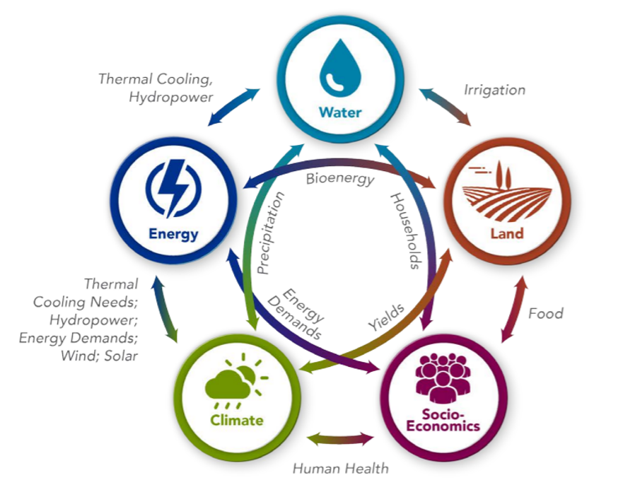

```{r setup, echo = FALSE, message=FALSE, warning = FALSE}
source("thailand_data_functions.R")
source("thailand_aggregate_groups.R")
source("conversions.R")
knitr::opts_chunk$set(
  results = "hide", 
  echo=FALSE, out.width = "75%", 
  fig.align='center', message = F, warning = F, error = F, eval = T)
library(tidyverse)
```

```{r child = 'header.rmd'}
```

# **Pathways to Carbon Neutrality for Thailand and Bangkok** {.unlisted .unnumbered}

<br>

<!-------------------------->
<!-------------------------->
## Executive Summary 
<!-------------------------->
<!-------------------------->
<p align="center"> </p>


```{r, results = "show", out.width = "90%", fig.align = 'left', }

```

<br>

```{r, results = "show", out.width = "100%", fig.align = 'center', fig.topcaption=TRUE, fig.cap = "Pathways to Carbon-Neutrality in 2050"}

```

<br>

<!-------------------------->
<!-------------------------->
## Background
<!-------------------------->
<!-------------------------->
<p align="center"> </p>

Urbanization is driving rapid socioeconomic growth in Thailand, posing challenges for managing increasing energy demand while working towards climate change mitigation goals. Thailand's Long-term Low Greenhouse Gas Emission Development Strategy establishes goals of carbon neutrality by 2050 and net zero greenhouse gas emissions by 2065. This and other key documents, including the Energy Efficiency Plan and the Power Development Plan, highlight measures needed to reach these goals including renewable energy expansion, transport electrification, and energy efficiency. Given the central role of cities in energy demand growth and Bangkok's existing Smart City initiatives, it is important to understand how multi-level governance, integrating city-scale and national-scale actions, will shape Thailand's pathway to its climate goals. 

<br>

```{r logos_diagram, results = "show", fig.topcaption=TRUE, fig.cap="Project Partners"}

```

<br>

The U.S. Department of Energy’s Pacific Northwest National Laboratory (PNNL) is partnering with Thammasat University and multiple city- and national-level stakeholders to supplement Bangkok and Thailand's existing plans by providing integrated, multiscale modeling and assessment capabilities. PNNL’s Global Change Analysis Model (GCAM) is a global model integrating socioeconomics, energy, land use, water, and climate systems. PNNL, in collaboration with the Thammasat University modeling team, are using GCAM to support the long-term assessment of existing energy and emissions mitigation plans and to identify additional measures needed at the city and national levels to reach Thailand's carbon neutrality goal. 

Stakeholders engaged include the Metropolitan Electricity Authority (MEA), Bangkok Metropolitan Authority (BMA), the Energy Policy and Planning Office (EPPO), the Electricity Generating Authority of Thailand (EGAT), and the Office of Natural Resources and Environmental Policy and Planning (ONEP). 

<br>

<!-------------------------->
<!-------------------------->
## Methodology
<!-------------------------->
<!-------------------------->
<p align="center"> </p>

The Global Change Analysis Model (GCAM) is a computational model that integrates socioeconomic and environmental systems to assess technology and policy choices in the context of global climate change. GCAM provides a holistic approach to energy sector planning by considering multi-sector dynamics and global processes, incorporating socioeconomic, energy, land use, water, and climate systems. We are using GCAM to conduct multi-scale analysis of carbon neutral pathways for Thailand and Bangkok. This includes assessing impacts of existing policies on greenhouse gas emissions, electricity prices, energy supply and demand, and other indicators as well as investigating additional measures needed to reach Thailand's target of carbon neutrality by 2050. Our analysis is an iterative process involving continuous feedback from the stakeholders listed above.

<br>

```{r GCAM_diagram, results = "show", fig.topcaption=TRUE, fig.cap="Conceptual diagram of GCAM"}

```


<br>

Given the importance of multi-level governance and contributions of cities to national climate targets, we are conducting both national and city scale analysis. Our city level analysis encompasses the three provinces served by MEA within the Bangkok metropolitan area. The map below shows these provinces: the green region includes Bangkok as well as the two other provinces served by MEA (Nonthaburi and Samut Prakan), while the shaded region includes only Bangkok itself, which is the area governed under the Bangkok Metropolitan Administration (BMA). 

<br>

```{r scope map, results = "show",  fig.topcaption=TRUE, fig.cap="Map of analysis regions in Thailand"}
knitr::include_graphics("images/MEA_BMA_boundaries_map.png")
```

<br>

Scenarios are assessed up from the year 2015 to the year 2050, with the GCAM analysis conducted at five-year intervals within this range.

<br>

<!-------------------------->
<!-------------------------->
## Scenarios
<!-------------------------->
<!-------------------------->
<p align="center"> </p>

Three unique scenarios are developed to provide a comprehensive set of future pathways. The Business as Usual scenario uses historical energy and emissions, combined with expected future socioeconomic trajectories and baseline technology assumptions, to project future conditions in the absence of additional policies or constraints. The Policies scenario assumes that Thailand implements a set of policies in the power, buildings, industry, and transportation sectors consistent with current plans, priorities, and targets. The Carbon Neutral scenario combines these policies with an emissions constraint to determine the additional measures needed to reach carbon neutrality by 2050. Finally, the Carbon Neutral + LUC scenario is a modified version of the Carbon Neutral scenario that assumes that Thailand reaches a target of 120 MtCO2 sequestration in the LUC sector by 2050. The policies considered include Thailand's national power development plans, as well as standards, regulations, and measures to promote energy efficiency, renewable energy expansion, and reduction of greenhouse gas emissions.

* **Business as Usual:** GCAM's baseline scenario, using a reference projection without imposing any policies or constraints.
* **Policies:** Includes policies consistent with Thailand's current plans, priorities, and targets (see table below for more details). 
* **Carbon Neutral:** Includes the policies in the Policies scenario and a constraint limiting CO2 emissions to reach net zero by 2050.
* **Carbon Neutral + LUC:** Includes the policies in the Policies scenario and a modified net zero CO2 emissions constraint that assumes Thailand will reach a target of 120 MtCO2 sequestration from the land use sector by 2050.

<br>

The following table describes the policies included in all scenarios except Business as Usual.

<table>

<tr>
<th>Sector</th>
<th>Policies</th>
</tr>

<tr>
<td rowspan="2">Electricity</td>
<td>Phase-out of coal power plants by 2050</td>
</tr>

<tr>
<td> 74% of electricity generation from renewable energy by 2050</td>
</tr>

<tr>
<td rowspan="3">Buildings</td>
<td>Gradual improvement of building envelope efficiencies</td>
</tr>

<tr>
<td>Phase-out of non-LED lighting technologies</td>
</tr>

<tr>
<td>Increasing use of high-efficiency air conditioners</td>
</tr>

<tr>
<td rowspan="2">Industry</td>
<td>Gradual increase in efficiency of industrial processes</td>
</tr>

<tr>
<td>Increasing use of hydrogen fuels</td>
</tr>

<tr>
<td rowspan="2">Transportation</td>
<td>Decreasing costs of electric vehicles</td>
</tr>

<tr>
<td>Phase-out of internal combustion engine cars</td>
</tr>

</table>

<br>

<!-------------------------->
## Results
<!-------------------------->
<p align="center"> </p>

The following figures show results from the analysis to support each of the key insights. Further details and additional results can be found on [Modeling-Thailand page](modeling_thailand.html).


<br>

```{r, results = "show", out.width = "100%", fig.align = 'center'}

```

<br>

```{r, results = "show", out.width = "100%", fig.align = 'center'}

```

<br>

```{r, results = "show", out.width = "100%", fig.align = 'center'}

```

<br>

```{r, results = "show", out.width = "100%", fig.align = 'center'}

```

<br>

```{r, results = "show", out.width = "100%", fig.align = 'center'}

```

# {.unlisted .unnumbered}
```{r child = 'footer.rmd'}
```

